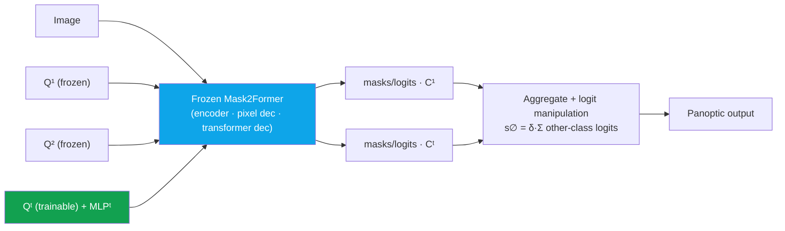

# Deep-Dive: ECLIPSE — Continual Panoptic Segmentation with Visual Prompt Tuning

CVPR 2024continual learningpanopticvisual prompt tuningdistillation-freefirst author

> [!TIP] 30초 pitch
> ECLIPSE는 distillation이나 replay 없이 **continual (class-incremental) panoptic segmentation**을 합니다. step 1 이후에는 **Mask2Former 전체를 freeze**하고, 새로운 class group마다 작은 **visual prompt 세트 + MLP head**(파라미터의 ~1.3%)만 학습합니다. Freezing이 catastrophic forgetting을 구조적으로 제거하고, **logit-manipulation** 규칙이 순수 freezing이 유발할 no-object semantic drift와 error propagation을 바로잡습니다. Distillation-free이면서 ADE20K continual panoptic에서 SOTA에 도달합니다.

**Public references:** [paper (arXiv 2403.20126)](https://arxiv.org/abs/2403.20126) · [code](https://github.com/clovaai/ECLIPSE). 근거 챕터: [Continual Learning](#/cv/continual-learning).

## 문제 & 동기

실제 배포는 계속 카테고리를 추가하지만, 옛 데이터 전체로 retrain할 기회는 드뭅니다(저장, 프라이버시, 비용). **Continual panoptic**은 이 문제의 가장 어려운 형태입니다:

- **Panoptic > semantic 난이도:** *things*(instance matching), *stuff*, 그리고 매 step마다 의미가 바뀌는 *no-object/background* label을 모두 다뤄야 합니다. PQ = SQ × RQ는 recognition 실패에 민감하고, ADE20K는 이미지당 instance가 많습니다.
- **선행 연구(MiB, PLOP, CoMFormer):** **knowledge distillation + pseudo-labeling**에 의존합니다. 이는 forward pass가 두 배가 되고, distillation weight / threshold에 민감하며, step이 늘수록 scaling이 나빠짐을 뜻합니다.
- continual **panoptic**은 특히 semantic 대비 덜 연구되었습니다.

## Method

<dl class="kv">
<dt>Step 1 (t=1)</dt><dd>base class $\mathcal{C}^1$에 대해 전체 Mask2Former를 학습.</dd>
<dt>Step t &gt; 1</dt><dd>backbone, pixel decoder, transformer decoder를 <b>freeze</b>. 새로운 object query $\mathbf{Q}^t$(visual prompt) 세트와 새 classifier MLP$^t$<b>만</b> 학습. Prompt는 기본적으로 <b>deep</b>(모든 transformer layer에 주입). Query 수 $N^t \approx |\mathcal{C}^t|$ (최소 10).</dd>
<dt>Inference</dt><dd>모든 prompt group $\mathbf{Q}^{1:t}$를 frozen model에 통과시켜 출력을 aggregate.</dd>
<dt>No-object handling</dt><dd>신뢰할 수 없는 no-object MLP를 버립니다. 대신 <b>logit manipulation</b>: 각 step의 token을 <i>모든</i> MLP에 통과시키고, no-object score를 (scaled) <i>other-class</i> logit 합으로 설정.</dd>
</dl>

step-$t$ token의 no-object score, 그리고 왜 softmax가 아니라 sigmoid인가:

$$s^{\varnothing}_t=\delta\sum_{k\neq t} s^{\mathcal{C}^k}_t \qquad (\delta=0.5,\ \text{post-hoc})$$

직관: *"이 token이 다른 step에 속한 class들에서 높은 점수를 낸다면, 아마 내 step의 객체가 아니다."* Classification은 **sigmoid**(class별 독립 점수)를 씁니다 — class 집합이 step마다 계속 바뀔 때 상대적 **softmax**는 정의가 애매하기 때문입니다.

## 결과 framing (검증 가능, 논문 기준)

- **ADE20K, R50, overlap, 100-10:** all-PQ **33.9** vs CoMFormer 29.7 vs PLOP 26.1; base-PQ ≈ 41.4 (거의 zero forgetting). 더 긴 100-5(11 task) 설정에서 격차가 벌어집니다.
- **Parameters:** step당 ~**0.60M trainable**(44.9M의 ≈1.3%); training GPU memory 대폭 감소(~5.6×).
- **semantic** ADE20K에서도 경쟁력 있음; 더 강한 frozen init(Swin-L, COCO-pretrained)이 상한을 끌어올립니다.
- **Overlap** 프로토콜(미래 class가 현재 이미지에 unlabeled로 나타날 수 있음)이 현실적인 설정입니다; disjoint 결과는 appendix에 있습니다.

## SSUL — 전편 (NeurIPS 2021, co-first author)

> [!NOTE] Storyboard: SSUL → ECLIPSE
> **SSUL**(*Semantic Segmentation with Unknown Label for Exemplar-based Class-Incremental Learning*, [arXiv 2106.11562](https://arxiv.org/abs/2106.11562), [code](https://github.com/clovaai/SSUL))은 **continual semantic** segmentation을 다뤘습니다. 아이디어: 명시적 **"unknown" class**를 모델링하고(미래/배경 픽셀을 known class로 억지로 끼워 넣지 않도록) 작은 exemplar memory를 더하며, saliency로 plasticity를 bootstrap. ECLIPSE는 그것의 panoptic, distillation-free, replay-free 진화형입니다: prompt **isolation**이 unknown-label + exemplar 장치를 대체하고, saliency 없이도 semantic에서 경쟁력을 유지합니다. 하나의 연구 라인으로 말하세요: *"나는 continual-seg 문제는 유지하되 그 목발들을 제거했다 — 먼저 label ambiguity를, 그다음 distillation과 replay를."*

## 예상 deep-dive Q&A

왜 continual panoptic이 continual semantic보다 어렵나요?

**Short:** instance matching(things), stuff, 그리고 매 step마다 의미가 drift하는 no-object label을 동시에 다뤄야 하고; PQ가 recognition error를 강하게 벌합니다.

**Deep:** semantic seg에서 background는 (바뀌더라도) 단일 class입니다. Panoptic에서 "no-object"는 background **+ 과거 class + 미래 class**를 뜻하고, 그 집합이 매 step 바뀌므로, 어떤 *고정된* no-object classifier도 miscalibrate됩니다. 게다가 PQ = SQ × RQ는 recognition(RQ)이 실패하면 무너지고, ADE20K의 이미지당 다수 instance가 이를 증폭합니다.

freezing이 어떻게 forgetting을 막고, 그 비용은 무엇인가요?

**Short:** 옛 weight가 절대 움직이지 않으니 옛 지식이 정확히 보존됩니다; 비용은 **error propagation**과 plasticity 감소입니다.

**Deep:** step 1이 버스를 자동차로 자신 있게 오분류하면 freezing이 그걸 고정시킵니다. Logit manipulation이 후속 step의 class 증거로 잘못된 no-object 결정을 억제해 이를 완화합니다. Plasticity 감소는 실제입니다: 새 class PQ는 joint-training oracle에 못 미칩니다. 저는 **deep** prompt(100-10에서 new-PQ 18.8 vs shallow 14.0, ~+100K params)와 더 강한 frozen init(Swin-L / COCO)으로 plasticity를 회복합니다. 포지션: *"stability 우선, plasticity는 저렴한 레버로."*

logit manipulation은 test-time hack 아닌가요?

**Short:** 아닙니다 — no-object가 *전체*(변하는) class 집합에 대해 정의된다는 데서 나온 원리적 결과입니다.

**Deep:** "내 step에 객체 없음"은 논리적으로 다른 모든 step의 class에 의존하므로, inference에서 cross-MLP 증거를 aggregate하는 것이 자연스러운 scoring rule이고, $\delta$는 단일 post-hoc scalar(저렴)입니다. 이걸 ablate하면 순수 freezing은 drift와 error propagation으로 붕괴합니다 — 즉 장식이 아니라 load-bearing입니다.

왜 softmax 대신 sigmoid인가요?

Softmax는 고정된 class 집합에 대해 normalize하지만 — 집합이 매 step 커지므로 상대 분포는 ill-posed이고 옛 logit이 새 class에 의해 rescale됩니다. 독립적인 **sigmoid** 점수는 step 간 안정적이고 cross-MLP no-object aggregation과 깔끔하게 결합됩니다.

distillation/replay가 더 강할 수 있습니다. 왜 피하나요?

**Short:** 낮은 학습 복잡도와 memory, 깨지기 쉬운 hyperparameter 감소, 원본 옛 데이터를 저장할 필요 없음(프라이버시).

**Deep:** KD/replay 방법은 forward pass를 두 배로 만들고 distillation weight와 pseudo-label threshold에 민감하며 scaling이 껄끄럽습니다. ECLIPSE는 그것을 prompt **isolation**으로 바꿉니다 — ~1.3% params, ~5.6× 적은 학습 memory. 정직하게 명시할 trade-off: inference가 여러 prompt group을 돌리므로 비용이 step에 따라 늘고, 매우 큰 class 수는 prompt-set 크기에 부담을 줍니다. 그건 future work지만, frozen trunk가 공유되므로 총 FLOP 증가는 완만합니다.

### 어려운 follow-up

1000 class / 100 step에서 무엇이 깨지나요?

Prompt-set 크기와 inference에서 aggregate되는 group 수가 step에 따라 늘어서 latency와 cross-MLP aggregation 비용이 오르고; 잔여 plasticity–stability gap도 매우 긴 sequence에서 누적됩니다. 논의할 만한 완화책: 유사 class 간 prompt sharing/merging, stale prompt pruning, hierarchical grouping. 저는 이걸 풀렸다고 주장하기보다 미해결 scaling 질문으로 명시하겠습니다.

이것을 continual object detection으로 옮길 수 있나요?

**query/prompt isolation + frozen trunk** 아이디어는 DETR 계열 detector로 자연스럽게 이식됩니다(query가 공유 추상화입니다). 공짜로 옮겨지지 않는 것은 panoptic 특유의 stuff/no-object drift 처리입니다 — 그건 segmentation의 특성이라 detection의 box+class 정식화에는 재설계가 필요합니다.

제품 스토리는?

배포된 segmentation API에 전체 retrain이나 옛 데이터 보관 없이 새 카테고리를 추가하기: 작은 **adapter(prompt + MLP)**를 배포합니다. 이는 프라이버시 친화적, 점진적 on-device 또는 API 업데이트에 매핑됩니다 — Apple/Meta 스타일 팀이 신경 쓰는 서사입니다.

## 솔직한 한계

- 새 class에서 joint-training oracle 대비 잔여 **plasticity gap**.
- Inference 비용이 step 수에 따라 증가(여러 prompt group).
- 매우 큰 class vocabulary는 prompt-set 크기에 부담 — 미해결 scaling 우려.

## 어떤 JD와 연결되는가

| Company | Connection |
| --- | --- |
| Apple | 효율적 adaptation; 프라이버시 친화적, replay-free model update |
| Meta | 점진적으로 특화되는 장수 foundation model |
| NVIDIA | robotics를 위한 continual perception(시간에 따라 class 등장) |
| Microsoft | 확장 가능하고 저비용인 model-update pipeline |

## Cheat-sheet

| Item | Value |
| --- | --- |
| Venue | CVPR 2024, 1저자 (arXiv 2403.20126) |
| One-liner | Frozen Mask2Former + **visual prompt** + logit manipulation을 통한 distillation-free continual **panoptic** seg |
| Trainable | ~0.60M (44.9M의 ~**1.3%**); ~5.6× 적은 학습 memory |
| Key result | ADE20K 100-10 all-PQ **33.9** (R50) vs CoMFormer 29.7 |
| Knobs | $\delta=0.5$ (post-hoc), **deep** prompt, $N^t\ge10$ query/step, **sigmoid** classification |
| No-object | $s^{\varnothing}_t=\delta\sum_{k\neq t}s^{\mathcal{C}^k}_t$ |
| Prequel | **SSUL** (NeurIPS 2021, co-first): 명시적 unknown label을 쓴 continual *semantic* seg |

## Cross-links
- 주제별: [Continual Learning](#/cv/continual-learning) · [Segmentation](#/cv/segmentation) · [Vision Foundation Models](#/cv/foundation-models)
- Deep-dive: [PointWSSIS & BESTIE](#/resume/pointwssis-bestie) · [ZIM](#/resume/zim) · [CV → Interview Map](#/resume/overview)으로 돌아가기
