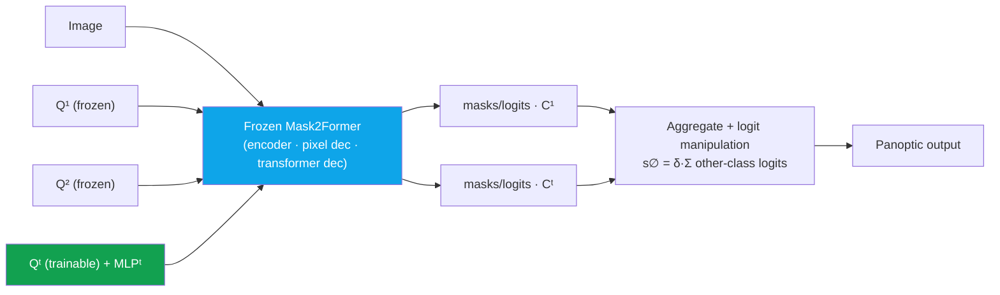

# Deep-Dive: ECLIPSE — Continual Panoptic Segmentation with Visual Prompt Tuning

CVPR 2024continual learningpanopticvisual prompt tuningdistillation-freefirst author

> [!TIP] 30-second pitch
> ECLIPSE does **continual (class-incremental) panoptic segmentation** without distillation or replay. After step 1, it **freezes the entire Mask2Former** and, for each new class group, learns only a small set of **visual prompts + an MLP head** (~1.3% of parameters). Freezing structurally eliminates catastrophic forgetting; a **logit-manipulation** rule fixes the no-object semantic drift and error propagation that pure freezing would cause. Distillation-free, it reaches SOTA on ADE20K continual panoptic.

**Public references:** [paper (arXiv 2403.20126)](https://arxiv.org/abs/2403.20126) · [code](https://github.com/clovaai/ECLIPSE). Backing chapter: [Continual Learning](#/cv/continual-learning).

## Problem & motivation

Real deployments keep adding categories, but you rarely get to retrain on all old data (storage, privacy, cost). **Continual panoptic** is the hardest flavor of this:

- **Panoptic > semantic in difficulty:** you must handle *things* (instance matching), *stuff*, and a *no-object/background* label whose meaning shifts every step. PQ = SQ × RQ is sensitive to recognition failures, and ADE20K has many instances per image.
- **Prior art (MiB, PLOP, CoMFormer):** lean on **knowledge distillation + pseudo-labeling**. That means a doubled forward pass, sensitivity to distillation weights / thresholds, and poor scaling as steps grow.
- Continual **panoptic** specifically was under-studied vs semantic.

## Method

<dl class="kv">
<dt>Step 1 (t=1)</dt><dd>Train the full Mask2Former on the base classes $\mathcal{C}^1$.</dd>
<dt>Step t &gt; 1</dt><dd><b>Freeze</b> the backbone, pixel decoder, and transformer decoder. Learn <b>only</b> a new set of object queries $\mathbf{Q}^t$ (visual prompts) and a new classifier MLP$^t$. Prompts are <b>deep</b> (injected at every transformer layer) by default. Query count $N^t \approx |\mathcal{C}^t|$ (min 10).</dd>
<dt>Inference</dt><dd>Run all prompt groups $\mathbf{Q}^{1:t}$ through the frozen model and aggregate their outputs.</dd>
<dt>No-object handling</dt><dd>Drop the unreliable no-object MLP. Instead, <b>logit manipulation</b>: push each step's tokens through <i>all</i> MLPs, and set the no-object score from the (scaled) sum of <i>other-class</i> logits.</dd>
</dl>

The no-object score for a step-$t$ token, and why sigmoid (not softmax):

$$s^{\varnothing}_t=\delta\sum_{k\neq t} s^{\mathcal{C}^k}_t \qquad (\delta=0.5,\ \text{post-hoc})$$

Intuition: *"if this token scores high on classes that belong to other steps, it's probably not one of my step's objects."* Classification uses **sigmoid** (independent per-class scores) because a relative **softmax** is ill-defined when the class set keeps changing across steps.

## Results framing (verifiable, from the paper)

- **ADE20K, R50, overlap, 100-10:** all-PQ **33.9** vs CoMFormer 29.7 vs PLOP 26.1; base-PQ ≈ 41.4 (near-zero forgetting). Gap widens on the longer 100-5 (11 tasks) setting.
- **Parameters:** ~**0.60M trainable** (≈1.3% of 44.9M) per step; large drop in training GPU memory (~5.6×).
- Competitive on **semantic** ADE20K too; a stronger frozen init (Swin-L, COCO-pretrained) raises the ceiling.
- **Overlap** protocol (future classes may appear unlabeled in current images) is the realistic setting; disjoint results are in the appendix.

## SSUL — the prequel (NeurIPS 2021, co-first author)

> [!NOTE] Storyboard: SSUL → ECLIPSE
> **SSUL** (*Semantic Segmentation with Unknown Label for Exemplar-based Class-Incremental Learning*, [arXiv 2106.11562](https://arxiv.org/abs/2106.11562), [code](https://github.com/clovaai/SSUL)) tackled **continual semantic** segmentation. Its idea: model an explicit **"unknown" class** (so future/background pixels aren't force-fit into known classes) plus tiny exemplar memory, using saliency to bootstrap plasticity. ECLIPSE is the panoptic, distillation-free, replay-free evolution: prompt **isolation** replaces the unknown-label + exemplar machinery, and it stays competitive on semantic *without* saliency. Say it as one research line: *"I kept the continual-seg problem but removed its crutches — first the label ambiguity, then the distillation and the replay."*

## Predicted deep-dive Q&A

Why is continual panoptic harder than continual semantic?

**Short:** You simultaneously do instance matching (things), stuff, and a no-object label whose meaning drifts each step; PQ punishes recognition errors hard.

**Deep:** In semantic seg, background is a single (if shifting) class. In panoptic, "no-object" means background **+ past classes + future classes**, and that set changes every step, so any *fixed* no-object classifier becomes miscalibrated. Plus PQ = SQ × RQ collapses when recognition (RQ) fails, and ADE20K's many-instances-per-image amplifies this.

How does freezing prevent forgetting, and what does it cost?

**Short:** Old weights never move, so old knowledge is exactly preserved; the cost is **error propagation** and reduced plasticity.

**Deep:** If step 1 confidently mislabels a bus as a car, freezing locks that in. Logit manipulation mitigates it by letting later steps' class evidence suppress the wrong no-object decision. Reduced plasticity is real: new-class PQ trails a joint-training oracle. I recover plasticity with **deep** prompts (new-PQ 18.8 vs shallow 14.0 on 100-10, ~+100K params) and a stronger frozen init (Swin-L / COCO). Position: *"stability-first, with cheap levers for plasticity."*

Isn't logit manipulation a test-time hack?

**Short:** No — it's the principled consequence of no-object being defined over the *whole* (changing) class set.

**Deep:** Since "no object of my step" logically depends on all other steps' classes, aggregating cross-MLP evidence at inference is the natural scoring rule, and $\delta$ is a single post-hoc scalar (cheap). Ablate it away and pure freezing collapses via drift and error propagation — so it's load-bearing, not cosmetic.

Why sigmoid instead of softmax?

Softmax normalizes over a fixed class set — but the set grows every step, so a relative distribution is ill-posed and old logits get rescaled by new classes. Independent **sigmoid** scores are stable across steps and compose cleanly with the cross-MLP no-object aggregation.

Distillation/replay can be stronger. Why avoid them?

**Short:** Lower training complexity and memory, fewer fragile hyperparameters, and no need to store raw old data (privacy).

**Deep:** KD/replay methods double the forward pass and are sensitive to distillation weight and pseudo-label thresholds; they scale awkwardly. ECLIPSE trades that for prompt **isolation** — ~1.3% params, ~5.6× less train memory. The trade-off I'll name honestly: inference runs multiple prompt groups, so cost grows with steps, and very large class counts stress the prompt-set size. That's future work, but total FLOP growth is mild because the frozen trunk is shared.

### Hard follow-ups

What breaks at 1000 classes / 100 steps?

Prompt-set size and the number of groups aggregated at inference grow with steps, so latency and the cross-MLP aggregation cost rise; the residual plasticity–stability gap also compounds over very long sequences. Mitigations worth discussing: prompt sharing/merging across similar classes, pruning stale prompts, or hierarchical grouping. I'd flag it as an open scaling question rather than claim it's solved.

Could this transfer to continual object detection?

The **query/prompt isolation + frozen trunk** idea ports naturally to DETR-family detectors (queries are the shared abstraction). What doesn't transfer for free is the panoptic-specific stuff/no-object drift handling — that's a segmentation quirk and would need redesign for detection's box+class formulation.

Product story?

Adding a new category to a deployed segmentation API without full retraining or keeping old data: ship a small **adapter (prompts + MLP)**. That maps to privacy-friendly, incremental on-device or API updates — the narrative Apple/Meta-style teams care about.

## Honest limitations

- Residual **plasticity gap** to a joint-training oracle on new classes.
- Inference cost scales with the number of steps (multiple prompt groups).
- Very large class vocabularies stress prompt-set size — an open scaling concern.

## Which JD this connects to

| Company | Connection |
| --- | --- |
| Apple | Efficient adaptation; privacy-friendly, replay-free model updates |
| Meta | Long-lived foundation models specialized incrementally |
| NVIDIA | Continual perception for robotics (classes appear over time) |
| Microsoft | Scalable, low-cost model-update pipelines |

## Cheat-sheet

| Item | Value |
| --- | --- |
| Venue | CVPR 2024, first author (arXiv 2403.20126) |
| One-liner | Distillation-free continual **panoptic** seg via frozen Mask2Former + **visual prompts** + logit manipulation |
| Trainable | ~0.60M (~**1.3%** of 44.9M); ~5.6× less train memory |
| Key result | ADE20K 100-10 all-PQ **33.9** (R50) vs CoMFormer 29.7 |
| Knobs | $\delta=0.5$ (post-hoc), **deep** prompts, $N^t\ge10$ queries/step, **sigmoid** classification |
| No-object | $s^{\varnothing}_t=\delta\sum_{k\neq t}s^{\mathcal{C}^k}_t$ |
| Prequel | **SSUL** (NeurIPS 2021, co-first): continual *semantic* seg with an explicit unknown label |

## Cross-links
- Topical: [Continual Learning](#/cv/continual-learning) · [Segmentation](#/cv/segmentation) · [Vision Foundation Models](#/cv/foundation-models)
- Deep-dives: [PointWSSIS & BESTIE](#/resume/pointwssis-bestie) · [ZIM](#/resume/zim) · back to the [CV → Interview Map](#/resume/overview)
