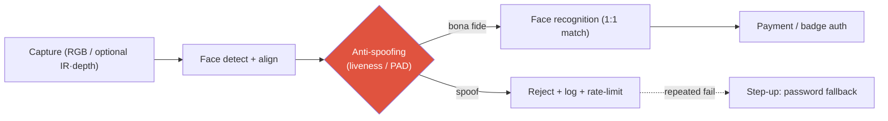

# Deep-Dive: FaceSign — Face Anti-Spoofing in Production

productiongovernment-certifiedpresentation-attack detectionbiometricsconfidential internals

> [!DANGER] 기밀이 최우선
> FaceSign의 모델 아키텍처, 학습 데이터, 내부 attack set, 그리고 모든 정확도/robustness 수치는 **기밀**이다 (보안 제품, 정부 인증). 아래의 모든 내용은 (a) **공개 이력서 문구**이거나 (b) 답변을 프레이밍하기 위한 **일반적인 face-anti-spoofing (FAS) 지식**이다. **내부 수치나 방어율을 지어내지 말 것.** 압박받으면 맨 끝의 decline-and-redirect 스크립트를 사용하라.

> [!TIP] 30초 피치
> NAVER **FaceSign**은 결제 태깅과 직원 배지 tap-in을 대체하는 정부 인증 얼굴 인증 서비스다. 나는 그 **face anti-spoofing (liveness / presentation-attack detection)** 모델을 만들었다 — recognition이 돌기 전에 살아있는 진짜 얼굴을 print, replay, mask, 또는 주입된 fake로부터 구분하는 안전 게이트. 아키텍처는 공개할 수 없지만, attack 유형, sensing 트레이드오프, 평가 (APCER/BPCER), 그리고 compliance 제약 하의 운영에 대해서는 엄밀하게 논할 수 있다.

**Public reference:** [FaceSign service guide](https://member.pay.naver.com/settings/face-sign/guide). Related public work: EResFD lightweight face detection ([WACV 2024](https://arxiv.org/abs/2204.01209), co-author). Backing chapter: [Object Detection](#/cv/detection).

## 파이프라인에서 anti-spoofing의 위치

recognition은 *누구인지*에 답하고; anti-spoofing은 *이것이 살아있는 진짜 presentation인지*에 답한다. 둘은 직렬로 돌고, anti-spoofing이 **먼저** 돌아서 spoof가 matcher에 절대 도달하지 못하게 한다 (백엔드 부하와 리스크를 줄임). spoofing이 통과하면, recognition 정확도가 아무리 높아도 시스템을 구하지 못한다.

## 일반 FAS 지식 브리핑 (interview-safe)

### Attack 유형 (Presentation Attack Instruments)

| Type | Example | Typical difficulty | Main cues |
| --- | --- | --- | --- |
| Print | 종이 위 사진 | Medium | Texture, no motion, moiré |
| Replay | 태블릿/폰의 동영상 | Medium-high | Screen moiré, refresh, no depth |
| Cut-photo / paper mask | 눈 구멍 | Medium | Boundary, missing depth |
| 3D mask | 실리콘 / 레진 | High | Material, depth, thermal (센서 있을 때) |
| Makeup / partial | 부분 impersonation | High | Local inconsistency |
| Deepfake / digital injection | 센서 앞단에 feed 주입 | High | *물리적* presentation이 *아님* — 별도 방어 계층 |

### 접근법

- **RGB-only:** texture CNN, rPPG (remote pulse), challenge-response (blink / head-turn), reflection cue.
- **Depth / IR / structured light:** 화면과 mask에 대해 하드웨어 이점 (Apple Face ID 식).
- **Multi-frame / temporal:** consistency, optical flow — print보다 replay에서 더 중요.
- **Hybrid:** sensor fusion + model + risk engine (rate limit, step-up auth).
- **Domain generalization:** unseen attack, device, lighting — FAS의 *진짜* 연구 프론티어.

### 평가

- **APCER** (attack presentation이 bona fide로 분류됨 — 보안 miss), **BPCER** (bona fide가 거부됨 — UX 비용), **ACER** = 둘의 평균; **ISO/IEC 30107**에서 나온 개념.
- 인증 맥락에서는 요구되는 보안 수준에 맞춰 FAR/FRR을 트레이드하는 operating point를 고르고; recognition FRR과 함께 읽는다.

## 예상 deep-dive Q&A

FaceSign에서 정확히 무엇을 만들었나?

**Short:** 정부 인증 얼굴 인증 파이프라인의 anti-spoofing 모델 — passwordless 결제/출입 맥락에서 recognition 전에 spoof를 걸러내는 liveness/PAD 게이트. 알고리즘 세부는 기밀이다.

**Deep:** 역할, 내가 설계 대상으로 삼은 threat model, sensing 트레이드오프, operating-point 철학은 논할 수 있다; 아키텍처, 데이터 소스/규모, 방어율은 공개할 수 없다. 이는 인증 및 계약상 제약이지 회피가 아니다.

printed-photo attack은 어떻게 잡나? (일반)

**Short:** print texture, motion/micro-motion 부재, boundary/reflection cue, 그리고 challenge-response.

**Deep:** print의 상당 부분은 RGB texture만으로 잡힌다; 고품질 replay와 3D mask에서 sensor cue (depth/IR)와 temporal 신호가 제 값을 한다. 우리의 구체적 기법은 기밀이다 — 나는 이를 "cue set을 attack 클래스에 맞추고, 잔여 리스크는 risk engine으로 커버한다"로 프레이밍하겠다.

deepfake는 FAS 범위 안인가?

**Short:** 고전적 PAD는 카메라로의 *물리적* presentation을 가정한다; 디지털 **injection**은 센서를 우회하며 별개의 방어 계층이다.

**Deep:** 나는 **presentation attack** (liveness cue로 방어)과 **injection attack** (camera-pipeline integrity / attestation으로 방어)을 분리하겠다. 이 둘을 뭉치면 잘못된 통제로 이어진다. FaceSign의 정확한 범위는 공개된 수준까지만 확인해주겠다.

RGB-only vs depth/IR — 트레이드오프?

| | RGB | Depth/IR |
| --- | --- | --- |
| Deployment | 아무 폰 카메라 | 특수 센서 |
| Cost | low | high |
| Screens/masks | 상대적으로 약함 | 상대적으로 강함 |
| Generalization | 큰 domain shift | 센서 의존적 |

Apple Face ID가 하드웨어 co-design의 정석 사례다; 내 작업은 서비스/모델/운영 쪽이다. FaceSign의 정확한 센서 구성은 추측하지 않겠다.

정부 인증은 연구에 무엇을 바꾸나?

publication과 재현성 제한, 엄격한 보안/프라이버시, 공식 change management, 그리고 감사 가능한 평가. 학술 논문처럼 수치를 낼 수 없으므로 — 나는 그 가치를 **제약 인식 엔지니어링**으로 프레이밍한다: threat modeling, operating-point governance, compliance 하의 모니터링된 배포.

### Hard / confidential-pressure follow-ups

그냥 정확도 숫자만 알려줘.

할 수 없다 — 계약 하의 인증된 보안 제품이다. 대신 줄 수 있는 것: 평가 프레임워크 (APCER/BPCER/ACER, ISO/IEC 30107), 요구 보안 수준에 따라 operating point가 어떻게 움직이는지, 그리고 그것을 recognition FRR과 함께 어떻게 읽는지. 원한다면 threat model을 대신 짚어주겠다.

가장 어려운 attack은 무엇이고, unseen한 것으로 어떻게 일반화하나?

**일반 답변:** high-fidelity 3D mask와 digital injection이 가장 어렵다; unseen한 device/lighting/demographic 일반화도 비슷하게 어렵다. 접근법: domain generalization/adaptation, 지속적 모니터링, hard-case mining, 새 device 출시마다 red-teaming. 우리의 구체적 취약점 순위는 기밀이다.

false-reject는 비즈니스에 어떻게 해가 되고, 어떻게 관리하나?

false reject는 결제 포기와 화난 사용자를 뜻한다; 보안↑는 편의성↓와 트레이드된다. 리스크 수준별로 operating point를 governance하고, 한 번의 hard reject가 사용자를 막다른 길로 몰지 않도록 **step-up fallback** (password)을 설계한다.

윤리적 고려사항?

Biometric 데이터 최소화, 암호화, 목적 제한; skin tone / age에 걸친 성능 격차 감사; 그리고 감시 오용 리스크. 책임 있는 배포 태도는 사후 고려가 아니라 업무의 일부다.

## Threat model (공개 지식 연습)

1. **Assets:** biometric template, 결제/출입 authorization.
2. **Adversaries:** casual print → pro replay → 3D mask → digital injection.
3. **Controls:** FAS model, challenge-response, rate limiting, step-up auth, pipeline attestation.
4. **Residual risk:** 신종 PAI, demographic 성능 격차, device 출시 domain shift.

## 말할 수 있는 것 / 없는 것

| OK to say | Off-limits |
| --- | --- |
| 역할: anti-spoofing 모델 | 정확도 / APCER / BPCER 수치 |
| 일반 threat-model 논증 | 내부 attack-set 구성 |
| auth 파이프라인에서의 위치 | 모델 아키텍처 / 센서 세부 |
| compliance 제약 경험 | 데이터 소스 / 규모 / 로그 샘플 |

## Decline-and-redirect script

> *"그건 보안 및 계약상 기밀이라 공유할 수 없습니다. 대신 일반적인 FAS threat model — print / replay / mask / injection — 평가 프레임 (APCER/BPCER, ISO/IEC 30107), 그리고 인증 시스템에서 spoof-detection 단계가 하는 역할을 짚어드리겠습니다."*

## 솔직한 한계 (논할 수 있는 범위의)

- public 논문 없음 → impact는 benchmark 수치가 아니라 **배포**로 (인증된, 수백만 사용자 서비스) 논증된다.
- 무관한 이력서 줄과 억지로 엮지 않겠다 (이건 VLM/agent 스토리가 *아니다*); 정직한 다리는 on-device 지연시간 규율과 safety/verifiability 마인드셋이다.

## 어떤 JD와 연결되나

| Company | Connection |
| --- | --- |
| Apple | Face ID; sensing + on-device trust |
| Meta / NVIDIA | biometric / embodied 시스템의 safety |
| General | compliance & audit 하의 production ML |

## Cheat-sheet

| Item | Value |
| --- | --- |
| Role | 정부 인증 얼굴 인증 서비스용 anti-spoofing (liveness/PAD) 모델 |
| Order | detect/align → **anti-spoof** → recognize → auth (spoof 게이트 먼저) |
| Attacks | print · replay · cut-photo · 3D mask · makeup · deepfake **injection** (별도 계층) |
| Metrics | **APCER** (miss) / **BPCER** (false reject) / ACER; ISO/IEC 30107 |
| Sensing | RGB 싸고 범용 vs depth/IR 강하지만 하드웨어 |
| Golden rule | public 역할 + 일반 FAS만; **모든 내부 수치는 기밀** |

## Cross-links
- Topical: [Object Detection](#/cv/detection) (EResFD lightweight face detection)
- Deep-dives: [On-Device Seg](#/resume/on-device-segmentation) · back to the [CV → Interview Map](#/resume/overview)
- Behavioral: pair with [STAR & The Story Bank](#/behavioral/star) for the "collaboration under security constraints" story
