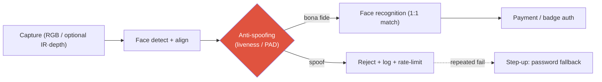

# Deep-Dive: FaceSign — Face Anti-Spoofing in Production

productiongovernment-certifiedpresentation-attack detectionbiometricsconfidential internals

> [!DANGER] 기밀이 최우선
> FaceSign의 architecture·training data·attack set·metric은 공개 승인을 확인하기 전까지 **비공개로 취급**합니다. 아래 내용은 (a) 승인된 이력서 문구 또는 (b) 일반 FAS 지식입니다. 내부 수치나 방어율을 지어내지 말고, 압박받으면 맨 끝의 decline-and-redirect script를 사용하세요.

> [!IMPORTANT] 이력서에 확인된 ownership과 그 경계를 함께 말하세요
> 이력서는 **“FaceSign 뒤의 face anti-spoofing model을 구축했다”**고 명시합니다. 따라서 model 구축은 이력서 확인 사실로 말해도 됩니다. 다만 이 문장이 FaceSign 전체 system·data·evaluation·deployment의 단독 ownership까지 뜻하지는 않습니다. model 안에서 본인이 맡은 architecture·training·evaluation 범위와 협업 interface는 실제 기록으로 보강하세요.

> [!TIP] 30초 피치
> 공개 이력서상 본인은 정부 인증 얼굴 인증 서비스 NAVER **FaceSign** 뒤의 **face anti-spoofing model (liveness / presentation-attack detection)**을 구축했습니다. 이 확인된 한 문장으로 시작한 뒤, recognition 앞단에서 presentation attack을 걸러내는 model의 역할과 일반적인 sensing·APCER/BPCER trade-off를 설명하세요. 내부 architecture·sensor·attack coverage와 end-to-end system ownership은 추정하지 않습니다.

**References:** [FaceSign service guide](https://member.pay.naver.com/settings/face-sign/guide)는 로그인이나 지역별 접근이 필요할 수 있으므로 독립적인 공개 기술 문서처럼 취급하지 않습니다. 역할·인증 문구는 승인된 이력서 원문으로 재확인하세요. 공개 논문으로는 EResFD lightweight face detection ([WACV 2024](https://arxiv.org/abs/2204.01209), co-author)이 있습니다.

## 파이프라인에서 anti-spoofing의 위치

recognition은 *누구인지*에, anti-spoofing은 *허용된 bona-fide presentation인지*에 답합니다. 위 그림은 대표적인 reference architecture이며 FaceSign 내부 순서를 공개한 것이 아닙니다. 실제 시스템은 병렬 scoring이나 risk engine을 사용할 수도 있지만, PAD가 뚫리면 recognition accuracy만으로 보안 실패를 막을 수 없다는 구분은 유지됩니다.

## 일반 FAS 지식 브리핑 (interview-safe)

### Attack 유형 (Presentation Attack Instruments)

| Type | Example | 일반적 난점 예시 | Main cues |
| --- | --- | --- | --- |
| Print | 종이 위 사진 | Medium | Texture, no motion, moiré |
| Replay | 태블릿/폰의 동영상 | Medium-high | Screen moiré, refresh, no depth |
| Cut-photo / paper mask | 눈 구멍 | Medium | Boundary, missing depth |
| 3D mask | 실리콘 / 레진 | High | Material, depth, thermal (센서 있을 때) |
| Makeup / partial | 부분 impersonation | High | Local inconsistency |
| Deepfake / digital injection | 센서 앞단에 feed 주입 | High | *물리적* presentation이 *아님* — 별도 방어 계층 |

난도 표시는 설명용이며 sensor, attacker capability, capture pipeline, 데이터에 따라 순서가 달라집니다. FaceSign의 실제 취약점 순위가 아닙니다.

### 접근법

- **RGB-only:** texture CNN, rPPG (remote pulse), challenge-response (blink / head-turn), reflection cue.
- **Depth / IR / structured light:** 화면과 mask에 대해 하드웨어 이점 (Apple Face ID 식).
- **Multi-frame / temporal:** consistency, optical flow — print보다 replay에서 더 중요.
- **Hybrid:** sensor fusion + model + risk engine (rate limit, step-up auth).
- **Domain generalization:** unseen attack, device, lighting에 대한 일반화는 FAS의 중요한 연구 과제.

### 평가

- 일반 PAD 평가에는 **APCER**(attack presentation이 bona fide로 분류), **BPCER**(bona fide presentation이 거부), **ACER**가 쓰이며 ISO/IEC 30107 계열 정의와 평가 protocol을 확인합니다.
- 인증 system에서는 PAD metric과 recognition의 FAR/FRR을 구분해 보고, system-level risk와 UX에 맞는 operating point를 정합니다. FaceSign이 실제로 사용한 내부 metric이라고 단정하지 않습니다.

## 예상 deep-dive Q&A

FaceSign에서 정확히 무엇을 만들었나?

**Short:** "이력서에 명시된 범위에서는 정부 인증 얼굴 인증 서비스 FaceSign의 anti-spoofing model을 구축했습니다. model 안에서 제가 맡은 범위는 `[확인된 architecture·training·evaluation 범위]`이며, 공개 승인되지 않은 algorithm·data·수치는 말하지 않겠습니다."

**Deep:** 먼저 model 구축이라는 이력서 사실과 FaceSign 전체 system ownership을 분리합니다. 이어 실제 기록으로 확인된 `[내 결정 1–2개]`를 설명하고, 일반 FAS threat model·sensing·operating-point trade-off로 확장합니다. architecture·data source/scale·방어율은 공개 승인을 확인한 범위에서만 답합니다.

printed-photo attack은 어떻게 잡나? (일반)

**Short:** print texture, motion/micro-motion 부재, boundary/reflection cue, 그리고 challenge-response.

**Deep:** print의 상당 부분은 RGB texture로 탐지할 수 있고, 고품질 replay와 3D mask에서는 sensor cue(depth/IR)와 temporal 신호가 중요해질 수 있습니다. 다만 이는 일반론입니다. FaceSign에서 실제 사용한 cue와 residual-risk control은 공개 승인을 받은 경우에만 1인칭으로 설명합니다.

deepfake는 FAS 범위 안인가?

**Short:** 고전적 PAD는 카메라로의 *물리적* presentation을 가정한다; 디지털 **injection**은 센서를 우회하며 별개의 방어 계층이다.

**Deep:** 나는 **presentation attack** (liveness cue로 방어)과 **injection attack** (camera-pipeline integrity / attestation으로 방어)을 분리하겠다. 이 둘을 뭉치면 잘못된 통제로 이어진다. FaceSign의 정확한 범위는 공개된 수준까지만 확인해주겠다.

RGB-only vs depth/IR — 트레이드오프?

| | RGB | Depth/IR |
| --- | --- | --- |
| Deployment | 아무 폰 카메라 | 특수 센서 |
| Cost | low | high |
| Screens/masks | 상대적으로 약함 | 상대적으로 강함 |
| Generalization | 큰 domain shift | 센서 의존적 |

공개된 consumer biometric system은 hardware co-design의 예시가 될 수 있습니다. 여기서는 일반 trade-off만 설명하고 FaceSign의 sensor 구성이나 본인의 system-level 역할을 추측하지 않습니다.

정부 인증은 연구에 무엇을 바꾸나?

정부 인증 보안 서비스에서는 일반적으로 보안·프라이버시, 변경 관리, 추적 가능한 평가가 중요합니다. 다만 FaceSign의 실제 인증 절차와 공개 제한은 승인된 자료로 확인해야 합니다. 답변은 **제약 인식 엔지니어링**이라는 일반 원칙과 본인이 실제로 경험한 절차를 분리해 말합니다.

### Hard / confidential-pressure follow-ups

그냥 정확도 숫자만 알려줘.

"공개 승인을 확인하지 못한 내부 정확도는 답하지 않겠습니다. 대신 일반 평가 프레임워크(APCER/BPCER/ACER, ISO/IEC 30107), security–UX operating point, recognition FRR과의 구분을 설명하겠습니다." 실제 NDA·계약 근거가 있다면 그 범위까지만 덧붙입니다.

가장 어려운 attack은 무엇이고, unseen한 것으로 어떻게 일반화하나?

**일반 답변:** high-fidelity 3D mask와 digital injection은 서로 다른 방어 계층의 어려운 사례이며, unseen device·lighting·demographic shift도 중요합니다. 일반 대응은 domain generalization/adaptation, 지속적 모니터링, hard-case mining, red-teaming입니다. FaceSign의 실제 취약점 순위는 승인된 평가 자료 없이 단정하지 않습니다.

false-reject는 비즈니스에 어떻게 해가 되고, 어떻게 관리하나?

일반적으로 false reject는 결제·인증 이탈을 늘릴 수 있어 보안과 편의성의 trade-off를 만듭니다. operating point와 **step-up fallback**은 이를 다루는 대표적 system-design 수단이지만, FaceSign의 실제 정책이었다고 말하려면 내부 기록과 공개 범위를 확인합니다.

윤리적 고려사항?

Biometric 데이터 최소화, 암호화, 목적 제한; skin tone / age에 걸친 성능 격차 감사; 그리고 감시 오용 리스크. 책임 있는 배포 태도는 사후 고려가 아니라 업무의 일부다.

## Threat model (공개 지식 연습)

1. **Assets:** biometric template, 결제/출입 authorization.
2. **Adversaries:** casual print → pro replay → 3D mask → digital injection.
3. **Controls:** FAS model, challenge-response, rate limiting, step-up auth, pipeline attestation.
4. **Residual risk:** 신종 PAI, demographic 성능 격차, device 출시 domain shift.

## 말할 수 있는 것 / 없는 것

| OK to say | Off-limits |
| --- | --- |
| 이력서에 명시된 FaceSign anti-spoofing model 구축 | 정확도 / APCER / BPCER 수치 |
| 일반 threat-model 논증 | 내부 attack-set 구성 |
| auth 파이프라인에서의 위치 | 모델 아키텍처 / 센서 세부 |
| compliance 제약 경험 | 데이터 소스 / 규모 / 로그 샘플 |

## Decline-and-redirect script

> *"그 세부 내용은 공개 승인을 확인할 수 없어 공유하지 않겠습니다. 대신 일반적인 FAS threat model — print / replay / mask / injection — 평가 프레임(APCER/BPCER, ISO/IEC 30107), 그리고 인증 시스템에서 spoof-detection 단계가 하는 역할을 짚어드리겠습니다."*

## 솔직한 한계 (논할 수 있는 범위의)

- public 논문 없음 → impact는 공개 가능한 **정부 인증·배포 사실**로 설명합니다. 이력서의 “millions”는 여러 NAVER Cloud 제품을 합친 summary이므로 FaceSign 단독 사용자 수로 귀속하지 않습니다.
- 무관한 이력서 줄과 억지로 엮지 않겠다 (이건 VLM/agent 스토리가 *아니다*); 정직한 다리는 on-device 지연시간 규율과 safety/verifiability 마인드셋이다.

## 어떤 JD signal과 연결되는가

| JD signal | 연결할 근거 |
| --- | --- |
| Biometric / presentation-attack security | PAD와 recognition의 역할 구분, threat-model 사고 |
| Safety / abuse prevention | presentation attack과 digital injection의 방어 계층 분리 |
| Regulated production ML | compliance·audit·change-management 제약과 기밀 경계 |

## Cheat-sheet

| Item | Value |
| --- | --- |
| Role | 이력서 확인: FaceSign 뒤의 anti-spoofing model 구축; system·data·deployment ownership은 별도 확인 |
| Reference pipeline | detect/align → **anti-spoof** → recognize → auth; 실제 내부 순서는 공개 자료로 확인 |
| Attacks | print · replay · cut-photo · 3D mask · makeup · deepfake **injection** (별도 계층) |
| Metrics | **APCER** (miss) / **BPCER** (false reject) / ACER; ISO/IEC 30107 |
| Sensing | RGB 싸고 범용 vs depth/IR 강하지만 하드웨어 |
| Golden rule | 승인된 역할 문구 + 일반 FAS만; 내부 수치·설계는 공개 범위 확인 |

## Cross-links
- Topical: [Object Detection](#/cv/detection) (EResFD lightweight face detection)
- Deep-dives: [On-Device Seg](#/resume/on-device-segmentation) · back to the [CV → Interview Map](#/resume/overview)
- Behavioral: pair with [STAR & The Story Bank](#/behavioral/star) for the "collaboration under security constraints" story
