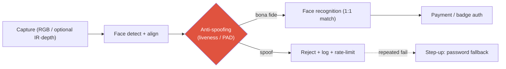

# Deep-Dive: FaceSign — Face Anti-Spoofing in Production

productiongovernment-certifiedpresentation-attack detectionbiometricsconfidential internals

> [!DANGER] Confidentiality first
> Treat FaceSign's architecture, training data, attack set, and metrics as **non-public until approved for disclosure**. Everything below is either (a) approved resume wording or (b) general FAS knowledge. Do not invent internal figures or defense rates; when pushed, use the decline-and-redirect script at the end.

> [!IMPORTANT] State both the resume-verified ownership and its boundary
> The resume explicitly says that you **built the face anti-spoofing model behind FaceSign**. You may therefore state model development as a resume-verified fact. That sentence does not, however, establish sole ownership of the whole FaceSign system, data, evaluation, or deployment. Support your architecture, training, and evaluation scope inside the model—and each collaborator interface—with your actual records.

> [!TIP] 30-second pitch
> The public resume says that you built the **face anti-spoofing model (liveness / presentation-attack detection)** behind NAVER **FaceSign**, a government-certified face-authentication service. Open with that verified sentence, then explain the model's role in filtering presentation attacks before recognition and the general sensing and APCER/BPCER trade-offs. Do not infer the internal architecture, sensors, attack coverage, or end-to-end system ownership.

**References:** The [FaceSign service guide](https://member.pay.naver.com/settings/face-sign/guide) may require login or vary by region, so do not treat it as independent public technical documentation. Reconfirm role and certification wording against the approved resume. The public EResFD lightweight-face-detection paper ([WACV 2024](https://arxiv.org/abs/2204.01209), co-author) is also available.

## Where anti-spoofing sits in the pipeline

Recognition answers *who*; anti-spoofing answers *whether this is an allowed bona-fide presentation*. The diagram is a representative reference architecture, not a disclosure of FaceSign's internal ordering. A real system may use parallel scoring or a risk engine, but the distinction remains: recognition accuracy alone cannot prevent a security failure when PAD is bypassed.

## General FAS knowledge brief (interview-safe)

### Attack types (Presentation Attack Instruments)

| Type | Example | Example general difficulty | Main cues |
| --- | --- | --- | --- |
| Print | Photo on paper | Medium | Texture, no motion, moiré |
| Replay | Video on tablet/phone | Medium-high | Screen moiré, refresh, no depth |
| Cut-photo / paper mask | Eye holes | Medium | Boundary, missing depth |
| 3D mask | Silicone / resin | High | Material, depth, thermal (with sensors) |
| Makeup / partial | Partial impersonation | High | Local inconsistency |
| Deepfake / digital injection | Feed injected before sensor | High | *Not* a physical presentation — different defense layer |

Difficulty labels are illustrative; their order changes with sensors, attacker capability, the capture pipeline, and data. They are not a ranking of FaceSign's actual vulnerabilities.

### Approaches

- **RGB-only:** texture CNNs, rPPG (remote pulse), challenge-response (blink / head-turn), reflection cues.
- **Depth / IR / structured light:** hardware advantage (à la Apple Face ID) against screens and masks.
- **Multi-frame / temporal:** consistency, optical flow — matters more for replay than print.
- **Hybrid:** sensor fusion + model + a risk engine (rate limits, step-up auth).
- **Domain generalization:** generalization to unseen attacks, devices, and lighting is an important FAS research problem.

### Evaluation

- General PAD evaluation uses **APCER** (an attack presentation classified as bona fide), **BPCER** (a bona-fide presentation rejected), and **ACER**; verify definitions and protocols in the ISO/IEC 30107 family.
- In an authentication system, distinguish PAD metrics from recognition FAR/FRR and choose an operating point for system-level risk and UX. Do not assert that these were FaceSign's actual internal metrics.

## Predicted deep-dive Q&A

What exactly did you build on FaceSign?

**Short:** “Within the scope stated on my resume, I built the anti-spoofing model behind FaceSign, a government-certified face-authentication service. My scope inside the model was `[confirmed architecture, training, and evaluation scope]`, and I will not disclose algorithms, data, or figures that are not approved for release.”

**Deep:** First separate the resume-verified model development from ownership of the whole FaceSign system. Then explain `[one or two decisions supported by your records]` and expand into the general FAS threat model, sensing, and operating-point trade-offs. Discuss architecture, data sources or scale, and defense rates only to the extent approved for disclosure.

How do you catch a printed-photo attack? (general)

**Short:** Print texture, absence of motion/micro-motion, boundary/reflection cues, and challenge-response.

**Deep:** Much of print can be detected from RGB texture, while sensor cues such as depth or IR and temporal signals can become more important for high-quality replay and 3D masks. That is general knowledge. Describe FaceSign-specific cues and residual-risk controls in the first person only when they are approved for disclosure.

Is deepfake within FAS scope?

**Short:** Classical PAD assumes a *physical* presentation to a camera; digital **injection** bypasses the sensor and is a distinct defense layer.

**Deep:** I'd separate **presentation attacks** (defended by liveness cues) from **injection attacks** (defended by camera-pipeline integrity / attestation). Conflating them leads to the wrong controls. FaceSign's exact scope is something I'd only confirm to the level that's public.

RGB-only vs depth/IR — trade-offs?

| | RGB | Depth/IR |
| --- | --- | --- |
| Deployment | any phone camera | special sensor |
| Cost | low | high |
| Screens/masks | relatively weak | relatively strong |
| Generalization | large domain shift | sensor-dependent |

Public consumer-biometric systems can illustrate hardware co-design. Here, discuss only the general trade-off and do not infer FaceSign's sensor configuration or your own system-level role.

What does government certification change about the research?

Government-certified security services generally make security, privacy, change control, and traceable evaluation important. Verify FaceSign's actual certification process and disclosure limits from approved material. In an answer, separate this general principle of **constraint-aware engineering** from the procedures you personally experienced.

### Hard / confidential-pressure follow-ups

Just give me the accuracy number.

“I will not give an internal accuracy figure whose disclosure approval I cannot verify. I can instead explain the general evaluation framework—APCER, BPCER, ACER, and ISO/IEC 30107—the security–UX operating point, and how PAD differs from recognition FRR.” Add an NDA or contractual basis only if it actually applies.

What's the hardest attack, and how would you generalize to unseen ones?

**General answer:** high-fidelity 3D masks and digital injection are difficult examples at different defense layers, while unseen-device, lighting, and demographic shifts also matter. General approaches include domain generalization or adaptation, continuous monitoring, hard-case mining, and red-teaming. Do not rank FaceSign's actual vulnerabilities without an approved evaluation record.

How does false-reject hurt the business, and how do you manage it?

In general, false rejects can increase payment or authentication abandonment, creating a security–convenience trade-off. Operating-point governance and a **step-up fallback** are representative system-design controls; say they were used by FaceSign only if records and disclosure policy support that claim.

Ethical considerations?

Biometric-data minimization, encryption, purpose limitation; performance-gap auditing across skin tone / age; and surveillance-misuse risk. Responsible-deployment posture is part of the job, not an afterthought.

## Threat model (public-knowledge exercise)

1. **Assets:** biometric template, payment/access authorization.
2. **Adversaries:** casual print → pro replay → 3D mask → digital injection.
3. **Controls:** FAS model, challenge-response, rate limiting, step-up auth, pipeline attestation.
4. **Residual risk:** novel PAI, demographic performance gaps, device-launch domain shift.

## What I can / can't say

| OK to say | Off-limits |
| --- | --- |
| Resume-stated development of the FaceSign anti-spoofing model | Accuracy / APCER / BPCER figures |
| General threat-model reasoning | Internal attack-set composition |
| Position in the auth pipeline | Model architecture / sensor detail |
| Compliance-constraint experience | Data sources / scale / log samples |

## Decline-and-redirect script

> *"I cannot verify that this detail is approved for disclosure, so I will not share it. Instead, let me cover the general FAS threat model—print, replay, mask, and injection—the evaluation frame (APCER/BPCER and ISO/IEC 30107), and the role of spoof detection in an authentication system."*

## Honest limitations (of what I can discuss)

- No public paper → explain impact through the publicly shareable facts of **government certification and deployment**. The resume's “millions” summary aggregates multiple NAVER Cloud products, so do not attribute that user count to FaceSign alone.
- I won't over-connect this to unrelated résumé lines (it's *not* a VLM/agent story); the honest bridges are on-device latency discipline and a safety/verifiability mindset.

## Which JD signals this connects to

| JD signal | Evidence to connect |
| --- | --- |
| Biometric / presentation-attack security | Distinguishing PAD from recognition and reasoning from a threat model |
| Safety / abuse prevention | Separating defense layers for presentation attacks and digital injection |
| Regulated production ML | Compliance, audit, change-management constraints, and confidentiality boundaries |

## Cheat-sheet

| Item | Value |
| --- | --- |
| Role | Resume-verified: built the anti-spoofing model behind FaceSign; verify system, data, and deployment ownership separately |
| Reference pipeline | detect/align → **anti-spoof** → recognize → auth; verify the actual internal order from approved sources |
| Attacks | print · replay · cut-photo · 3D mask · makeup · deepfake **injection** (separate layer) |
| Metrics | **APCER** (miss) / **BPCER** (false reject) / ACER; ISO/IEC 30107 |
| Sensing | RGB cheap+general vs depth/IR strong-but-hardware |
| Golden rule | Approved role wording + general FAS only; verify disclosure scope for internal figures and designs |

## Cross-links
- Topical: [Object Detection](#/cv/detection) (EResFD lightweight face detection)
- Deep-dives: [On-Device Seg](#/resume/on-device-segmentation) · back to the [CV → Interview Map](#/resume/overview)
- Behavioral: pair with [STAR & The Story Bank](#/behavioral/star) for the "collaboration under security constraints" story
