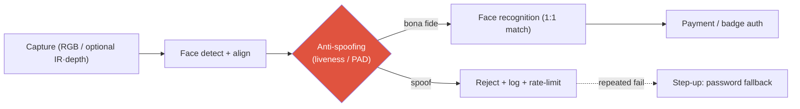

# Deep-Dive: FaceSign — Face Anti-Spoofing in Production

productiongovernment-certifiedpresentation-attack detectionbiometricsconfidential internals

> [!DANGER] Confidentiality first
> The model architecture, training data, internal attack sets, and all accuracy/robustness numbers for FaceSign are **confidential** (security product, government certification). Everything below is either (a) **public résumé wording**, or (b) **general face-anti-spoofing (FAS) knowledge** used to frame answers. **Do not invent internal figures or defense rates.** When pushed, use the decline-and-redirect script at the end.

> [!TIP] 30-second pitch
> NAVER **FaceSign** is a government-certified face-authentication service that replaces payment tagging and employee-badge tap-in. I built its **face anti-spoofing (liveness / presentation-attack detection)** model — the safety gate that distinguishes a live, bona-fide face from a print, replay, mask, or injected fake before recognition runs. I can't disclose the architecture, but I can reason rigorously about attack types, sensing trade-offs, evaluation (APCER/BPCER), and operating under compliance constraints.

**Public reference:** [FaceSign service guide](https://member.pay.naver.com/settings/face-sign/guide). Related public work: EResFD lightweight face detection ([WACV 2024](https://arxiv.org/abs/2204.01209), co-author). Backing chapter: [Object Detection](#/cv/detection).

## Where anti-spoofing sits in the pipeline

Recognition answers *who*; anti-spoofing answers *whether this is a live, genuine presentation*. They run in series, and anti-spoofing runs **first** so a spoof never reaches the matcher (reduces backend load and risk). If spoofing passes, no amount of recognition accuracy saves the system.

## General FAS knowledge brief (interview-safe)

### Attack types (Presentation Attack Instruments)

| Type | Example | Typical difficulty | Main cues |
| --- | --- | --- | --- |
| Print | Photo on paper | Medium | Texture, no motion, moiré |
| Replay | Video on tablet/phone | Medium-high | Screen moiré, refresh, no depth |
| Cut-photo / paper mask | Eye holes | Medium | Boundary, missing depth |
| 3D mask | Silicone / resin | High | Material, depth, thermal (with sensors) |
| Makeup / partial | Partial impersonation | High | Local inconsistency |
| Deepfake / digital injection | Feed injected before sensor | High | *Not* a physical presentation — different defense layer |

### Approaches

- **RGB-only:** texture CNNs, rPPG (remote pulse), challenge-response (blink / head-turn), reflection cues.
- **Depth / IR / structured light:** hardware advantage (à la Apple Face ID) against screens and masks.
- **Multi-frame / temporal:** consistency, optical flow — matters more for replay than print.
- **Hybrid:** sensor fusion + model + a risk engine (rate limits, step-up auth).
- **Domain generalization:** unseen attacks, devices, lighting — the *real* research frontier of FAS.

### Evaluation

- **APCER** (attack presentation classified as bona fide — the security miss), **BPCER** (bona fide rejected — the UX cost), **ACER** = their mean; concepts from **ISO/IEC 30107**.
- In an auth context you choose an operating point trading FAR/FRR against a required security level; you read it jointly with recognition FRR.

## Predicted deep-dive Q&A

What exactly did you build on FaceSign?

**Short:** The anti-spoofing model in the government-certified face-auth pipeline — the liveness/PAD gate that filters spoofs before recognition, in a passwordless payment/access context. Algorithmic details are confidential.

**Deep:** I can discuss the role, the threat model I designed against, sensing trade-offs, and the operating-point philosophy; I can't disclose architecture, data sources/scale, or defense rates. That's a certification and contractual constraint, not evasion.

How do you catch a printed-photo attack? (general)

**Short:** Print texture, absence of motion/micro-motion, boundary/reflection cues, and challenge-response.

**Deep:** Much of print is catchable from RGB texture alone; high-quality replay and 3D masks are where sensor cues (depth/IR) and temporal signals earn their keep. Our specific techniques are confidential — I'd frame it as "match the cue set to the attack class, and cover residual risk with a risk engine."

Is deepfake within FAS scope?

**Short:** Classical PAD assumes a *physical* presentation to a camera; digital **injection** bypasses the sensor and is a distinct defense layer.

**Deep:** I'd separate **presentation attacks** (defended by liveness cues) from **injection attacks** (defended by camera-pipeline integrity / attestation). Conflating them leads to the wrong controls. FaceSign's exact scope is something I'd only confirm to the level that's public.

RGB-only vs depth/IR — trade-offs?

| | RGB | Depth/IR |
| --- | --- | --- |
| Deployment | any phone camera | special sensor |
| Cost | low | high |
| Screens/masks | relatively weak | relatively strong |
| Generalization | large domain shift | sensor-dependent |

Apple's Face ID is the canonical hardware-co-design story; my work is on the service/model/operations side. I won't speculate on FaceSign's exact sensor configuration.

What does government certification change about the research?

Restricted publication and reproducibility, strict security/privacy, formal change management, and auditable evaluation. You can't publish numbers like an academic paper — so I frame the value as **constraint-aware engineering**: threat modeling, operating-point governance, and monitored deployment under compliance.

### Hard / confidential-pressure follow-ups

Just give me the accuracy number.

I can't — it's a certified security product under contract. What I *can* give you is the evaluation framework (APCER/BPCER/ACER, ISO/IEC 30107), how the operating point moves with the required security level, and how it's read jointly with recognition FRR. If you want, I'll walk a threat model instead.

What's the hardest attack, and how would you generalize to unseen ones?

**General answer:** high-fidelity 3D masks and digital injection are hardest; unseen-device/lighting/demographic generalization is comparably hard. Approaches: domain generalization/adaptation, continuous monitoring, hard-case mining, red-teaming per new device launch. Our specific vulnerability ranking is confidential.

How does false-reject hurt the business, and how do you manage it?

A false reject means an abandoned payment and an angry user; security↑ trades against convenience↓. You govern the operating point per risk level and design a **step-up fallback** (password) so a single hard reject doesn't dead-end the user.

Ethical considerations?

Biometric-data minimization, encryption, purpose limitation; performance-gap auditing across skin tone / age; and surveillance-misuse risk. Responsible-deployment posture is part of the job, not an afterthought.

## Threat model (public-knowledge exercise)

1. **Assets:** biometric template, payment/access authorization.
2. **Adversaries:** casual print → pro replay → 3D mask → digital injection.
3. **Controls:** FAS model, challenge-response, rate limiting, step-up auth, pipeline attestation.
4. **Residual risk:** novel PAI, demographic performance gaps, device-launch domain shift.

## What I can / can't say

| OK to say | Off-limits |
| --- | --- |
| Role: anti-spoofing model | Accuracy / APCER / BPCER figures |
| General threat-model reasoning | Internal attack-set composition |
| Position in the auth pipeline | Model architecture / sensor detail |
| Compliance-constraint experience | Data sources / scale / log samples |

## Decline-and-redirect script

> *"That's under security and contractual confidentiality, so I can't share it. Instead, let me cover the general FAS threat model — print / replay / mask / injection — the evaluation frame (APCER/BPCER, ISO/IEC 30107), and the role the spoof-detection stage plays in an authentication system."*

## Honest limitations (of what I can discuss)

- No public paper → impact is argued via **deployment** (a certified, millions-of-users service), not benchmark numbers.
- I won't over-connect this to unrelated résumé lines (it's *not* a VLM/agent story); the honest bridges are on-device latency discipline and a safety/verifiability mindset.

## Which JD this connects to

| Company | Connection |
| --- | --- |
| Apple | Face ID; sensing + on-device trust |
| Meta / NVIDIA | Safety of biometric / embodied systems |
| General | Production ML under compliance & audit |

## Cheat-sheet

| Item | Value |
| --- | --- |
| Role | Anti-spoofing (liveness/PAD) model for a government-certified face-auth service |
| Order | detect/align → **anti-spoof** → recognize → auth (spoof gate first) |
| Attacks | print · replay · cut-photo · 3D mask · makeup · deepfake **injection** (separate layer) |
| Metrics | **APCER** (miss) / **BPCER** (false reject) / ACER; ISO/IEC 30107 |
| Sensing | RGB cheap+general vs depth/IR strong-but-hardware |
| Golden rule | Public role + general FAS only; **all internal numbers confidential** |

## Cross-links
- Topical: [Object Detection](#/cv/detection) (EResFD lightweight face detection)
- Deep-dives: [On-Device Seg](#/resume/on-device-segmentation) · back to the [CV → Interview Map](#/resume/overview)
- Behavioral: pair with [STAR & The Story Bank](#/behavioral/star) for the "collaboration under security constraints" story
