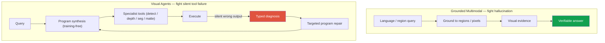

# Deep-Dive: Grounded VLM & Visual Reasoning Agents (Ongoing)

ongoingNeurIPS 2026 (under review)grounded VLMvisual agentstraining-freeframing over specifics

> [!DANGER] 이 챕터의 기본 규칙
> 이 작업은 **미발표 / 심사 중**이다. 방법, 수치, 데이터셋 이름, 또는 채택 결정을 절대 지어내지 말 것. **동기, 문제 정의, 공개 트렌드 사이의 위치, 그리고 내 공개 작업 (ZIM, ECLIPSE)에서 이어지는 다리**로 팔 것. 방법 세부는 "pre-release"다. 압박받으면 맨 끝의 decline-and-redirect 스크립트를 쓸 것.

> [!TIP] 30초 피치
> 두 갈래. **(1) Grounded Multimodal AI:** 언어 추론을 **pixel/region-level 증거**에 묶어서, 모델이 region 기반 쿼리를 해결하고 근거 없는 텍스트를 내는 대신 *검증 가능하게* 추론하게 한다. **(2) Visual Reasoning Agents:** **training-free** agentic program synthesis로 specialist vision model들을 쿼리별 실행 가능 workflow로 동적으로 조합해서, end-to-end VLM이 여전히 헛짚는 다단계 **spatial/temporal** 추론을 수행한다. 내 NeurIPS'26 submission은 갈래 2에 있다: *silent perception failure*를 **typed diagnosis**로 바꿔 targeted **program repair**를 이끄는 **3D spatial reasoning용 diagnostic framework** — task-specific 학습 *없이* frontier VLM에 필적하는 것을 목표로 한다.

**이력서 앵커 (이 이상으로 과잉 특정하지 말 것):** 언어 추론을 pixel/region 증거와 연결하는 grounded VLM, region 쿼리 해결, 검증 가능한 추론; specialist model로 쿼리별 workflow를 짓는 training-free program synthesis; 3D-spatial diagnostic framework: silent failure → typed diagnosis → targeted repair. Backing chapters: [Grounding & Region Reasoning](#/vlm/grounding), [Visual Reasoning Agents](#/vlm/visual-agents), [Agentic AI & Tool Use](#/llm/agents), [VLM Pretraining](#/vlm/pretraining).

> [!NOTE] 갈래 2의 구체적 논문
> NeurIPS'26 submission은 자체 챕터를 갖는다: 전체 메커니즘, 아키텍처 다이어그램, 결과 프레이밍, co-requisite ablation, hard-follow-up Q&A: **[Deep-Dive: Spatial-Reasoning Agent](#/resume/neurips26-spatial-reasoning)**. 그 챕터가 *기술적* 깊이를 연습하는 곳이다; *이* 챕터는 상위 레벨 서사와 "미발표 작업을 어떻게 이야기할지" 프레이밍용으로 남겨둔다. (공개 버전은 redacted 상태다 — codename과 정확한 수치는 double-blind review 동안 오프라인에 보관.)

## 핵심 연구 질문

> *언어 모델이 시각적으로 그럴듯한 문장을 낼 때, 우리는 어떻게 (a) 그것을 pixel/region 증거와 실행 가능한 perception tool에 묶고, (b) tool이 silently 틀렸을 때 silently 실패하는 대신 **진단하고 수리**하는가?*

두 실패 모드가 두 갈래를 동기화한다:

## 공개 트렌드 지도 (2025–2026) — 내가 나를 놓는 위치

| Direction | Public exemplars | One line |
| --- | --- | --- |
| Program synthesis | VisProg, ViperGPT | LLM → code/DSL + vision tool |
| Dynamic API agents | VADAR (CVPR 2025) | agent가 즉석에서 3D-spatial API 생성 |
| Verifier training | VALOR | 레이블 없이 logic/grounding 개선 |
| Grounded RL | ViGoRL, MGPO | RL로 coordinate/crop loop |
| Pixel-grounded CoT | TerraScope, Pixelis | mask/pixel op로 추론 |
| Concept segmentation | SAM 3 | text concept → mask/track |
| Diagnostic benches | Spatial457, Omni3D-Bench, SpatialAct | spatial / repair gap 측정 |

**내 명시된 위치:** specialist perception 품질 (ZIM/seg)과 label-efficient/continual 배경 위에서, 나는 **verifiable grounding**과 **failure-diagnosable agent**를 탐구한다 — VADAR의 dynamic-API/3D 프레이밍과 *인접*하지만, 미발표 작업에 대해 비교 수치를 제시하진 않겠다.

## 예상 deep-dive Q&A (프레이밍 답변)

왜 grounded VLM인가 — end-to-end의 무엇이 문제인가?

**Short:** End-to-end VLM은 hallucinate하고 **근거 없는 description**을 낸다; 정답조차 틀린 증거에 기댈 수 있다 (*spurious success*).

**Deep:** 제품 (editing, robotics, UI agent)에서는 *region을 해결*하고 답을 산문이 아니라 시각적 증거로 정당화해야 한다. Grounding은 추론을 감사 가능하게 만들고, 모델이 잘못된 이유로 맞았을 때를 탐지하게 해준다 — end-to-end 정확도만으로는 숨겨지는 것이다.

왜 큰 VLM 하나를 fine-tuning하는 대신 training-free agent인가?

**Short:** 재학습 없이 specialist tool (우리 자신의 matte/seg 포함)을 조합하고 교체한다; task별 fine-tuning은 foundation/제품 모델을 저하시킬 수 있다.

**Deep:** ZIM 교훈을 그대로 반영한다 — task-specific fine-tuning이 일반 능력을 갉아먹을 수 있다. Training-free composition은 각 specialist를 full strength로 유지하고, 나머지를 건드리지 않고 한 모듈을 업그레이드하게 해준다. 비용은 **tool error**인데, 바로 그래서 diagnosis/repair가 사후 고려가 아니라 연구 기여다.

"silent perception failure"란 무엇이고, "typed diagnosis"란 무엇인가?

**Short:** tool이 틀린 box/mask/depth를 반환하지만 예외를 던지지 않아서, program이 끝까지 돌아 *조용히* 틀린 답을 낸다. typed diagnosis는 *어떻게* 실패했는지 분류해서 repair를 타겟팅할 수 있게 한다.

**Deep:** synthesize된 program에서 LLM은 각 tool의 출력이 옳다고 가정한다. depth가 어긋나거나 detection이 빠지면, 오차가 confident한 틀린 답으로 전파된다. 그것을 (이력서 문구 수준에서) **typed** failure 신호로 바꾸면, 시스템이 blind re-planning 대신 failure 클래스별로 다른 repair 정책을 적용할 수 있다. 세부는 pre-release다.

왜 3D spatial reasoning이 end-to-end VLM에게 어려운가?

Metric distance, occlusion, object-centric orientation, multi-hop spatial composition. SpatialVLM 계열 모델이 여기서 실제 한계를 보인다. depth/detection tool을 가진 program이 도움이 되지만, **tool-error accumulation**이 핵심이다 — 그래서 diagnostic angle이 나온다.

ZIM은 어떻게 들어맞나?

Specialist mask/matte 품질은 그것에 의존하는 어떤 editing/agent 체인에서든 **하한**이고, **Grounded-ZIM** (text → box → matte)은 grounded UX의 작동하는 prototype이다. 하지만 진행 중인 작업은 *그냥 "ZIM 다시"가 아니다* — ZIM은 내가 꽂아넣고 진단할 수 있는 **asset**이지 같은 논문이 아니다.

### Hard-pressure follow-ups

End-to-end frontier model이 계속 좋아진다 — modular agent를 잡아먹지 않을까?

강력하긴 하지만, 네 가지가 modularity를 가치 있게 유지한다: (1) **정밀 측정** (metric 3D), (2) **검증 가능한 증거**, (3) **재학습 없는 모듈 업그레이드**, (4) 실패의 **diagnostic repair**. 실무에서는 **hybrid**가 기본이다 — frontier reasoner가 diagnosable specialist를 orchestrate하는 것 — 그리고 거기에 내가 베팅하고 있다.

이건 결과 없는 아이디어일 뿐 아닌가?

내 실행력은 공개된, peer-reviewed 작업 (ZIM ICCV Highlight, ECLIPSE, PointWSSIS, BESTIE, SSUL)으로 입증된다. 진행 중인 작업은 심사 중이라, 수치를 인용하거나 채택을 주장하지 않겠다 — 하지만 문제 정의를 정확히 진술하고 공개 문헌 안에 정확히 위치시킬 수 있다. 그 구분 자체가 정직한 답이다.

어떻게 평가하겠나? (일반)

answer accuracy **더하기** grounding IoU / pointing accuracy, program executability, failure-type recall, 그리고 공개 3D-spatial benchmark (Omni3D-Bench, Spatial457, SpatialAct). 미발표라면 내부 benchmark 이름은 비공개로 둔다. eval의 요점은 *spurious success* — 정답, 틀린 증거 — 를 잡는 것이다.

리스크 / 예상되는 negative result는?

LLM이 tool API를 hallucinate, 무한 re-planning loop, tool-version breakage, 3D scale 모호성, 그리고 evaluation overfitting. 공개 survey들도 agent의 약한 *tool-awareness*를 지적한다. 이것들을 묻기 전에 먼저 짚는 것이 신뢰 가는 피치의 일부다.

## 공개 작업에서 이어지는 다리 (이렇게 말할 것)

- **Perception 품질** (ZIM, on-device seg) → agent가 의존하는 specialist tool 계층.
- **Label-efficiency / continual** (PointWSSIS, ECLIPSE) → task-specific 재학습을 피하고 모듈을 점진적으로 업그레이드하려는 본능.
- **Safety/verifiability 마인드셋** (FaceSign) → 산문이 아니라 증거로 뒷받침되는 답을 원함.

## Company-specific one-liners

| Company | One line |
| --- | --- |
| Meta | 제품 VLM용 grounded, verifiable reasoning + tool-use agent |
| Apple | Region 증거 + 효율적 on-device specialist + alignment |
| Adobe | Region-grounded editing/generation program |
| ByteDance | Generative FM + controllable perception |
| NVIDIA | 로보틱스용 spatial agent; 효율적 specialist 스택 |

## Guardrails — allowed vs forbidden phrasing

Allowed

이력서 문구 재진술; silent-failure → typed-diagnosis → repair 문제 프레이밍; 공개 계보 명명 (VisProg, ViperGPT, VADAR, ViGoRL, SAM 3); 동기를 ZIM/ECLIPSE와 연결.

Forbidden

미발표 정확도/% 이득; "VADAR를 능가한다" 식 주장; NeurIPS'26 논문이 채택되었다는 진술; 내부 데이터셋 이름이나 규모.

## Decline-and-redirect script

> *"방법과 수치는 아직 공개되지 않아서 공유할 수 없습니다. 제가 할 수 있는 건 정확한 문제 프레이밍 — silent perception failure, typed diagnosis, targeted repair — 그것이 VADAR나 ViperGPT 같은 공개 작업 대비 어디에 놓이는지, 그리고 제 ZIM/continual 연구가 여기로 이끈 교훈을 드리는 것입니다."*

## 솔직한 한계

- 심사 중 → 인용할 검증 가능한 결과 없음; 결과가 아니라 프레이밍을 판다.
- 두 갈래는 겹치지만 **다른 실패 모드**를 갖는다 (hallucination vs silent tool error) — 방 안에서 구분해 둘 것.
- Training-free composition은 **tool error**를 물려받는다; 전체 베팅은 diagnosis/repair가 그것을 관리할 수 있다는 것이다.

## Cheat-sheet

| Item | Value |
| --- | --- |
| Thread 1 | Grounded Multimodal — 언어를 pixel/region 증거에 묶음; 검증 가능한 region 쿼리 |
| Thread 2 | Visual Reasoning Agents — specialist tool로 training-free program synthesis |
| NeurIPS'26 (under review) | 3D-spatial diagnostic framework: silent failure → **typed diagnosis** → **program repair** |
| Public lineage | VisProg, ViperGPT, VADAR, ViGoRL/MGPO, TerraScope, SAM 3 |
| Bridge | ZIM/seg (tools) · ECLIPSE/PointWSSIS (재학습 없는 본능) · FaceSign (verifiability) |
| Golden rule | 세부보다 프레이밍; 수치 없음; 아직 채택 아님 |

## Cross-links
- Topical: [Grounding & Region Reasoning](#/vlm/grounding) · [Visual Reasoning Agents](#/vlm/visual-agents) · [Agentic AI & Tool Use](#/llm/agents) · [Vision-Language Pretraining](#/vlm/pretraining) · [Video-Language Models](#/vlm/video)
- Deep-dives: [ZIM](#/resume/zim) · [ECLIPSE](#/resume/eclipse) · [On-Device Seg](#/resume/on-device-segmentation) · back to the [CV → Interview Map](#/resume/overview)
