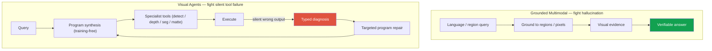

# Deep-Dive: Grounded VLM & Visual Reasoning Agents (Ongoing)

ongoingNeurIPS 2026 (under review)grounded VLMvisual agentstraining-freeframing over specifics

> [!DANGER] Ground rules for this chapter
> This work is <strong>unpublished / under review</strong>. Do not fabricate methods, figures, datasets, or an acceptance decision. Explain only the approved motivation and problem definition plus connections from public work such as ZIM and ECLIPSE, and distinguish details as pre-release. Use the decline-and-redirect script at the end when pushed.

> [!TIP] 30-second pitch
> Two threads. **(1) Grounded Multimodal AI:** connect language reasoning to <strong>pixel/region-level artifacts</strong> so claims become inspectable. Grounding does not automatically guarantee correctness; boxes and masks can hallucinate too. **(2) Visual Reasoning Agents:** use **training-free** agentic program synthesis to compose specialist vision models into query-specific workflows for multi-step **spatial/temporal** reasoning. A submission under review at NeurIPS 2026 sits in thread 2: a 3D spatial-reasoning framework that turns *silent perception failures* into <strong>typed diagnoses</strong> that drive targeted <strong>program repair</strong>. State comparative performance only within the task, models, and protocol of the submission.

**Résumé anchors (do not over-specify beyond these):** grounded VLMs connecting language reasoning with pixel/region evidence, resolving region queries, reasoning verifiably; training-free program synthesis building query-specific workflows from specialist models; a 3D-spatial diagnostic framework: silent failures → typed diagnoses → targeted repair. Backing chapters: [Grounding & Region Reasoning](#/vlm/grounding), [Visual Reasoning Agents](#/vlm/visual-agents), [Agentic AI & Tool Use](#/llm/agents), [VLM Pretraining](#/vlm/pretraining).

> [!NOTE] The concrete paper behind thread 2
> The submission under review has its own chapter covering the mechanism, architecture diagram, results framing, co-requisite ablation, and hard-follow-up Q&A: **[Deep-Dive: Spatial-Reasoning Agent](#/resume/neurips26-spatial-reasoning)**. The public version is redacted; non-public figures and identifying information are not automatically approved as interview material, so follow conference and company policy first.

## The core research question

> *When a language model produces a visually plausible sentence, how do we (a) bind it to pixel/region evidence and executable perception tools, and (b) when a tool is silently wrong, <strong>diagnose and repair</strong> rather than fail silently?*

Two failure modes motivate the two threads:

## Public trend map (2025–2026) — where I place myself

| Direction | Public exemplars | One line |
| --- | --- | --- |
| Program synthesis | VisProg, ViperGPT | LLM → code/DSL + vision tools |
| Dynamic API agents | VADAR (CVPR 2025) | agent generates 3D-spatial APIs on the fly |
| Verifier training | VALOR | improve logic/grounding without labels |
| Grounded RL | ViGoRL, MGPO | coordinate/crop loops via RL |
| Pixel-grounded CoT | TerraScope, Pixelis | reasoning with masks/pixel ops |
| Concept segmentation | SAM 3 | text concept → mask/track |
| Diagnostic benches | Spatial457, Omni3D-Bench, SpatialAct | measure spatial / repair gaps |

**My stated position:** on top of specialist perception quality (ZIM/seg) and a label-efficient/continual background, I explore <strong>verifiable grounding</strong> and <strong>failure-diagnosable agents</strong> — *adjacent* to VADAR's dynamic-API/3D framing, but I won't present comparison numbers on unpublished work.

## Predicted deep-dive Q&A (framing answers)

Why grounded VLMs — what's wrong with end-to-end?

**Short:** End-to-end VLMs hallucinate and give <strong>unsupported descriptions</strong>; even a correct answer can rest on wrong evidence (*spurious success*).

**Deep:** For products (editing, robotics, UI agents) you must *resolve a region* and justify the answer with visual evidence, not prose. Grounding makes the reasoning auditable and lets you detect when the model is right for the wrong reason — which end-to-end accuracy alone hides.

Why training-free agents rather than fine-tuning one big VLM?

**Short:** It can compose and replace specialist tools without retraining. Because task-specific fine-tuning can reduce general capability or maintainability in some settings, compare composition with adaptation rather than assuming either is always best.

**Deep:** It mirrors the ZIM lesson — task-specific fine-tuning can erode general capability. Training-free composition keeps each specialist at full strength and lets you upgrade a module without touching the rest. The cost is <strong>tool error</strong>, which is exactly why diagnosis/repair is the research contribution rather than an afterthought.

What is a "silent perception failure," and what's a "typed diagnosis"?

**Short:** A tool returns a wrong box/mask/depth but raises no exception, so the program finishes and emits a wrong answer *quietly*. A typed diagnosis categorizes *how* it failed so repair can be targeted.

**Deep:** In a synthesized program, the LLM assumes each tool's output is correct. If depth is off or a detection is missing, errors propagate to a confident wrong answer. Turning that into a **typed** failure signal (at the résumé-wording level) lets the system apply a different repair policy per failure class instead of blind re-planning. Specifics are pre-release.

Why is 3D spatial reasoning hard for end-to-end VLMs?

Metric distances, occlusion, object-centric orientation, and multi-hop spatial composition. SpatialVLM-style models show real limits here. Programs with depth/detection tools help, but <strong>tool-error accumulation</strong> is the crux — hence the diagnostic angle.

How does ZIM fit in?

Specialist mask/matte quality is a <strong>lower bound</strong> on any editing/agent chain that relies on it, and **Grounded-ZIM** (text → box → matte) is a working prototype of grounded UX. But the ongoing work is *not* just "ZIM again" — ZIM is an <strong>asset</strong> I can plug in and diagnose, not the same paper.

### Hard-pressure follow-ups

End-to-end frontier models keep getting better — won't they eat modular agents?

They are strong, but modularity can offer (1) **precise measurement**, (2) **inspectable intermediate evidence**, (3) **module-level upgrades**, and (4) <strong>diagnostic repair</strong> of failures. It also introduces orchestration cost and tool-error accumulation. A frontier reasoner composing diagnosable specialists is therefore one practical <strong>hybrid</strong> design, not a default for every product.

Isn't this just ideas without results?

Public, peer-reviewed work—ZIM ICCV Highlight, ECLIPSE, PointWSSIS, BESTIE, and SSUL—is evidence of past execution. This work is under review, so do not present figures or acceptance as independently public and verified. Separate the problem definition and position in public literature that you are permitted to discuss.

How would you evaluate it? (general)

Answer accuracy **plus** grounding IoU / pointing accuracy, program executability, failure-type recall, and public 3D-spatial benchmarks (Omni3D-Bench, Spatial457, SpatialAct). Internal benchmark names stay private if unpublished. The point of the eval is to catch *spurious success* — right answer, wrong evidence.

What are the risks / likely negative results?

LLMs hallucinating tool APIs, infinite re-planning loops, tool-version breakage, 3D scale ambiguity, and evaluation overfitting. Public surveys also flag agents' weak *tool-awareness*. Naming these unprompted is part of a credible pitch.

## The bridge from public work (say this)

- **Perception quality** (ZIM, on-device seg) → the specialist tool layer agents depend on.
- **Label-efficiency / continual** (PointWSSIS, ECLIPSE) → a research axis that reduces supervision cost and full-model update cost.
- **Safety/verifiability mindset** (FaceSign) → wanting answers backed by evidence, not prose.

## Connections by JD signal

| JD signal | Evidence to connect |
| --- | --- |
| Grounding / tool-use agent | Region/pixel evidence, execution trace, typed failure |
| Embodied / spatial reasoning | Composition of detection, depth, and segmentation tools plus error accumulation |
| Controllable editing | Region-grounded artifacts and inspectable intermediate steps |
| Efficient adaptation | Benefits of training-free composition and orchestration cost |

## Guardrails — allowed vs forbidden phrasing

Allowed

Restating résumé wording; the silent-failure → typed-diagnosis → repair problem framing; naming public lineage (VisProg, ViperGPT, VADAR, ViGoRL, SAM 3); connecting motivation to ZIM/ECLIPSE.

Forbidden

Any unpublished accuracy/% gain; "we outperform VADAR"-style claims; stating the NeurIPS'26 paper is accepted; internal dataset names or scale.

## Decline-and-redirect script

> *"The method and numbers aren't public yet, so I can't share those. What I can do is give you the precise problem framing — silent perception failure, typed diagnosis, targeted repair — how it sits relative to public work like VADAR and ViperGPT, and what my ZIM/continual research taught me that led here."*

## Honest limitations

- Under review → no independently public results to cite; explain only the approved problem and mechanism scope.
- Two threads overlap but have <strong>different failure modes</strong> (hallucination vs. silent tool error) — keep them distinct in the room.
- Training-free composition inherits <strong>tool error</strong>; the whole bet is that diagnosis/repair can manage it.

## Cheat-sheet

| Item | Value |
| --- | --- |
| Thread 1 | Grounded Multimodal — bind language to pixel/region evidence; verifiable region queries |
| Thread 2 | Visual Reasoning Agents — training-free program synthesis from specialist tools |
| NeurIPS'26 (under review) | 3D-spatial diagnostic framework: silent failure → **typed diagnosis** → **program repair** |
| Public lineage | VisProg, ViperGPT, VADAR, ViGoRL/MGPO, TerraScope, SAM 3 |
| Bridge | ZIM/seg (tools) · ECLIPSE/PointWSSIS (label/update efficiency) · FaceSign (verifiability) |
| Golden rule | Framing over specifics; no numbers; not accepted-yet |

## Cross-links
- Topical: [Grounding & Region Reasoning](#/vlm/grounding) · [Visual Reasoning Agents](#/vlm/visual-agents) · [Agentic AI & Tool Use](#/llm/agents) · [Vision-Language Pretraining](#/vlm/pretraining) · [Video-Language Models](#/vlm/video)
- Deep-dives: [ZIM](#/resume/zim) · [ECLIPSE](#/resume/eclipse) · [On-Device Seg](#/resume/on-device-segmentation) · back to the [CV → Interview Map](#/resume/overview)
