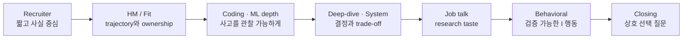

# 이력서 기반 단계별 예시 답변

resume-groundedstage-by-stageclick-to-revealfact-safepractice

> [!TIP] 이 챕터의 목적
> 현재 이력서 스냅샷을 recruiter screen부터 HM, coding·ML depth, system design, research talk, behavioral까지 <strong>라운드별 말하기 답안</strong>으로 바꿉니다. 각 답변은 클릭해서 펼치고, 그대로 외우기보다 `핵심 주장 → 증거 → 판단 → 다음 질문`의 뼈대를 자기 말로 재구성하세요.

> [!IMPORTANT] 사실 경계
> 이력서에서 확인되는 사실과 공개 프로젝트만 사용했습니다. ZIM을 만들었다는 사실, FaceSign anti-spoofing model 구축, on-device model의 독자적 개발처럼 이력서에 명시된 ownership은 그대로 활용합니다. 다만 그 문장보다 세부적인 architecture·data·evaluation·deployment 경계, 내부 제품 지표, 비자·입사 가능일, 보상, 갈등·멘토링 사례는 이력서만으로 확정할 수 없습니다. `본인 확인 필요`가 붙은 문장은 실제 기록으로 채우지 못하면 삭제하세요. 심사 중 연구는 반드시 <strong>under review</strong>라고 밝히고 승인된 공개 범위만 설명합니다.

## 답변 상태 표시

| 표시 | 의미 | 사용법 |
| --- | --- | --- |
| `이력서 확인` | 현재 이력서에 직접 적힌 사실 | 제출 직전 날짜·수치만 재확인 |
| `공개 근거` | 논문·공개 코드·프로젝트에서 방어 가능 | 공개된 방법·평가 범위를 넘지 않기 |
| `회사별 치환` | JD와 공개 자료가 있어야 완성 | `{팀 문제}`·`{공개 근거}`를 실제 지원 건으로 교체 |
| `본인 확인 필요` | 이력서만으로 알 수 없는 동기·행동·결과 | 실제 사례가 없으면 사용하지 않기 |

## 1 · Recruiter screen — 30초 안에 방향을 잡기

“Tell me about yourself.” — 30초 버전

**의도:** 이력서 낭독이 아니라 현재 정체성, 검증 가능한 대표 증거, 다음 역할의 방향을 짧게 설명하는지 봅니다.

**예시 답변 · 이력서 확인**

“저는 NAVER Cloud에서 5년 이상 일한 computer-vision Applied Scientist이자 KAIST 박사과정 연구자입니다. 연구의 중심은 실제 제약 아래서 신뢰할 수 있는 visual perception을 만드는 것이었고, label-efficient·continual segmentation에서 ZIM 같은 promptable image-matting foundation model까지 확장했습니다. 최근에는 이 perception 경험을 grounded VLM과 visual reasoning agent로 연결하고 있습니다. 다음 역할에서는 새로운 연구를 만드는 일과 제품 제약에서 검증하는 일을 하나의 agenda로 소유하고 싶습니다.”

**20초로 줄일 때:** 현재 역할 → 연구 arc → 다음 scope만 남깁니다. 논문 수와 프로젝트 목록은 follow-up으로 미룹니다.

**예상 follow-up:** “그중 한 프로젝트만 고른다면?” → [ZIM 답변](#/resume/zim)으로 연결합니다.

“What are you looking for in your next role?”

**예시 답변 · 회사별 치환 / 본인 확인 필요**

“세 가지를 찾고 있습니다. 첫째, perception과 multimodal reasoning을 분리된 데모가 아니라 실제 사용자 문제에서 함께 평가할 수 있는 scope. 둘째, 논문 아이디어를 data·evaluation·serving까지 책임질 수 있는 end-to-end ownership. 셋째, 강한 연구 동료와 반례를 빠르게 검증할 수 있는 환경입니다. `{공개된 팀 문제}`가 제 ZIM·segmentation 제품화 경험과 grounded visual reasoning 방향이 만나는 지점이라 판단했습니다. 실제 첫 6–12개월의 우선순위가 제가 이해한 것과 맞는지 확인하고 싶습니다.”

**주의:** “유명한 회사”, “더 큰 모델”, “더 높은 보상”을 주된 이유로 두지 않습니다. 실제 동기가 다르면 문장을 고쳐야 합니다.

“Why are you considering a move now?”

**예시 답변 · 본인 확인 필요**

“현재 역할에서 label-efficient vision 연구를 논문과 제품 양쪽으로 가져가는 경험을 쌓았습니다. 지금은 그 기반 위에서 grounded multimodal model과 visual agent를 더 일관된 연구 프로그램으로 확장하고, 문제 선택부터 evaluation과 배포까지 더 넓은 scope를 소유하고 싶습니다. 현재 조직을 떠나야 해서라기보다, 다음 몇 년의 연구 질문과 책임 범위를 의도적으로 선택하려는 전환입니다.”

**확인할 것:** 실제 이직 동기, 박사과정 일정, 현 조직과의 이해상충을 본인 상황에 맞게 수정합니다.

“Are you open to relocation? What is your work-authorization status?”

**예시 답변 · 일부 이력서 확인**

“현재 서울에 있고 relocation에는 열려 있습니다. 다만 `{대상 국가}`의 work authorization은 `{현재의 정확한 상태}`이며, 필요한 visa sponsorship과 가능한 근무 시작 시점을 이번 role 기준으로 확인하고 싶습니다.”

이력서가 확인해 주는 것은 `Seoul, Korea`와 `open to relocation`까지입니다. 비자 상태·가족 일정·입사 가능일은 반드시 실제 사실로 채우세요.

초반 compensation 질문에 어떻게 답할까?

**예시 답변 · 회사별 치환**

“우선 이 역할의 level, location, 그리고 기대 ownership을 정확히 맞추고 싶습니다. 해당 조건에서 회사가 책정한 base와 total-compensation band를 공유해 주실 수 있을까요? 구성을 확인한 뒤 전체 패키지 기준으로 구체적으로 논의하겠습니다.”

숫자를 말해야 한다면 통화·지역·level 가정·base/total 구분을 붙입니다. 이력서에는 현재 보상 정보가 없으므로 임의의 숫자를 만들지 않습니다.

## 2 · Hiring manager / research fit — 목록을 trajectory로 바꾸기

“Walk me through your research trajectory.” — 90초 버전

**예시 답변 · 이력서 확인 / 공개 근거**

“제 연구를 잇는 질문은 ‘비싼 완전 감독이나 이상적인 환경 없이도 어떻게 신뢰할 수 있는 visual output을 만들 것인가’입니다. 초기에는 image-level·point supervision으로 segmentation label cost를 줄이는 BESTIE와 PointWSSIS를 연구했고, SSUL과 ECLIPSE에서는 배포 후 새 class를 배울 때 forgetting을 줄이는 문제로 확장했습니다. 이후 ZIM에서는 promptable segmentation foundation model의 scale을 활용하되, matting에 필요한 boundary fidelity와 alpha representation을 data·architecture 관점에서 다시 설계했습니다. NAVER Cloud에서는 foreground segmentation, face anti-spoofing, on-device segmentation처럼 latency와 품질 제약도 다뤘습니다. 최근에는 같은 신뢰성 질문을 grounded VLM과 training-free visual reasoning agent에 적용해, 언어 답변을 pixel·region evidence와 연결하고 perception tool의 silent failure를 진단하는 방향을 탐구하고 있습니다.”

**면접관이 끊으면:** weak supervision → ZIM → grounded reasoning 세 점만 남깁니다.

“Why move from perception to VLMs and agents? Is this trend-following?”

**예시 답변 · 공개 근거 / 심사 중 경계**

“저에게는 perception을 떠나는 이동이 아니라, perception을 reasoning의 검증 가능한 evidence layer로 올리는 연속입니다. End-to-end VLM은 강하지만 답과 시각 근거가 분리될 수 있고, specialist vision tool도 틀렸을 때 그럴듯한 mask나 depth를 반환할 수 있습니다. 제 segmentation·matting 배경은 pixel/region 수준의 fidelity와 failure mode를 다뤄 왔기 때문에 grounding과 tool reliability에 직접 연결됩니다. 현재 심사 중 작업에서는 이 문제를 진단과 program repair 관점에서 연구하고 있지만, 인터뷰에서는 under-review 상태와 공개 가능한 방법 범위를 명확히 구분하겠습니다.”

**강한 follow-up:** “frontier VLM이 좋아지면 modular agent가 필요 없지 않나?” → end-to-end의 단순성과 modular trace의 검증 가능성 사이를 task별 실험 문제로 답합니다.

“What is your strongest project, and why?”

**예시 답변 · 이력서 확인**

“현재는 ZIM을 고르겠습니다. 단지 ICCV Highlight이기 때문이 아니라, 문제 재정의와 research-to-product 양쪽을 가장 잘 보여주기 때문입니다. SAM을 matting data로 fine-tune하는 것만으로는 coarse hard-mask supervision과 fine alpha boundary 사이의 data contract가 해결되지 않았습니다. 그래서 scalable label conversion, prompt-aware decoding, high-resolution detail 복원을 함께 설계했습니다. 공개 코드·데모로 끝나지 않고 image-editing service까지 연결되었다는 점도 중요합니다. 다만 제품 사용량이나 내부 비교 수치는 승인된 범위에서만 답하겠습니다.”

**대안:** 역할이 continual learning이면 ECLIPSE, label efficiency면 PointWSSIS, edge deployment면 on-device segmentation을 고릅니다.

“What did you personally own?”

**예시 답변 · 본인 확인 필요**

“이력서에 적힌 팀 결과와 제 기여를 분리해서 말씀드리겠습니다. `{프로젝트}`에서 제가 직접 소유한 것은 `{problem framing / architecture / data pipeline / loss / implementation / experiment / writing 중 실제 항목}`입니다. 핵심 결정은 `{대안 A 대신 B를 택한 이유}`였고, `{ablation 또는 failure analysis}`로 검증했습니다. 공동저자는 `{실제 역할}`을 맡았고, interface는 `{어떻게 협업했는지}`였습니다.”

ZIM 이력서 문구는 architecture·loss·data-pipeline 설계를 언급하지만, 세부 역할과 공동저자 경계는 본인이 확인해야 합니다. “제가 다 했습니다”도 “팀이 했습니다”도 ownership 답이 아닙니다.

## 3 · Coding / ML coding — 정답보다 판단을 들리게 하기

coding 문제를 받았을 때의 첫 60초

**예시 말하기 스크립트**

“먼저 input contract를 확인하겠습니다: 크기 범위, 중복과 빈 입력, ordering 보장, 메모리 제약입니다. 가장 단순한 baseline은 `{방법}`이고 시간·공간 복잡도는 `{복잡도}`입니다. 병목은 `{중복 탐색/정렬/상태}`이므로 `{자료구조 또는 패턴}`로 줄일 수 있습니다. 작은 예제로 invariant를 확인한 뒤 구현하고, 빈 입력·단일 원소·중복·최대 범위를 테스트하겠습니다.”

**개인화 포인트:** production vision 경험을 장황하게 끌어오지 말고, API contract·edge case·검증 습관으로만 보여줍니다.

“빠른 구현과 읽기 쉬운 구현 중 무엇을 택하나요?”

**예시 답변**

“면접에서는 먼저 correctness가 보이는 구현을 택하고, 입력 크기가 요구할 때만 최적화하겠습니다. 실제 모델 serving에서도 latency 수치 하나만 보는 것이 아니라 preprocessing, memory transfer, fallback과 관측 가능성을 함께 봐야 했습니다. 같은 원칙으로 여기서도 baseline을 명확히 만든 뒤 profiler나 complexity 근거가 있는 병목만 최적화하겠습니다.”

이 답변은 일반 원칙입니다. 실제 serving에서 본인이 측정한 구체 사례를 덧붙일 때는 공개 가능한 사실인지 확인하세요.

## 4 · ML fundamentals — 내 연구를 교과서 개념에 연결하기

“weakly supervised와 semi-supervised learning의 차이를 본인 연구로 설명해 보세요.”

**예시 답변 · 공개 근거**

“Weak supervision은 모든 샘플에 label이 있더라도 label 자체가 target보다 약한 경우입니다. 예를 들어 BESTIE에서는 image-level semantic signal로 instance mask를 학습합니다. Semi-supervision은 일부 샘플만 강한 label을 갖고 나머지는 unlabeled이거나 약한 경우입니다. PointWSSIS의 weakly-semi setting에서는 소량의 full mask와 더 싼 point annotation을 함께 사용합니다. 핵심 차이는 ‘label이 있느냐’보다 supervision의 정보량과 데이터 분할 계약입니다. 그래서 비교할 때 annotation budget과 strong/weak split을 함께 보고해야 합니다.”

“segmentation과 matting은 무엇이 근본적으로 다른가요?”

**예시 답변 · 공개 근거**

“Segmentation은 보통 pixel의 class 또는 foreground membership을 이산적으로 예측하지만, matting은 경계와 반투명 영역에서 연속 alpha를 추정해 관측 이미지의 합성 과정을 설명합니다. 그래서 IoU가 좋아도 hair·motion blur·transparent object의 alpha fidelity는 나쁠 수 있습니다. ZIM에서 coarse hard mask를 그대로 fine-tune하는 접근이 부족했던 이유도 이 target contract의 차이입니다. 평가도 segmentation metric만이 아니라 SAD·MSE와 boundary/detail 성격을 함께 봐야 합니다.”

“continual learning에서 freeze하면 forgetting이 사라지나요?”

**예시 답변 · 공개 근거**

“Parameter drift는 크게 줄지만 출력 수준의 forgetting이 자동으로 0이 되지는 않습니다. 새 prompt나 classifier aggregation, no-object 의미 변화가 기존 class prediction에 영향을 줄 수 있고, 반대로 너무 많이 freeze하면 plasticity가 제한됩니다. ECLIPSE는 frozen base와 작은 trainable visual prompt를 사용해 stability를 얻고, logit 처리와 initialization으로 plasticity를 보완합니다. 그래서 old/new class 성능과 trainable parameter를 함께 보고 trade-off를 설명해야 합니다.”

## 5 · Technical deep-dive — 설계 선택과 반례를 방어하기

ZIM — “왜 SAM을 matting dataset에 fine-tune하는 것으로 충분하지 않았나요?”

**예시 답변 · 공개 근거**

“병목이 optimization만이 아니라 supervision contract와 scale이었기 때문입니다. SAM 계열의 coarse binary mask와 공개 matting dataset의 제한된 category·granularity만으로는 promptable zero-shot behavior와 fine alpha detail을 동시에 얻기 어렵습니다. ZIM은 SA-1B 계열 mask를 fine-grained matte label로 바꾸는 data pipeline과, prompt 영역에 집중하는 attention, high-resolution detail을 복원하는 decoder를 함께 설계합니다. 중요한 실험은 data만, architecture만, 둘 다 바꾼 matched ablation으로 어느 요소가 어떤 failure를 줄이는지 분리하는 것입니다.”

더 깊은 수치와 구조는 [ZIM 딥다이브](#/resume/zim)를 사용합니다.

PointWSSIS/BESTIE — “싼 label이 만든 bias는 어떻게 막았나요?”

**예시 답변 · 공개 근거**

“약한 label을 ground truth처럼 확대하면 confirmation bias가 생깁니다. BESTIE에서는 semantic knowledge를 instance representation으로 옮기되, 누락된 instance를 background로 강제하지 않도록 supervision 영역을 제한하고 self-refinement를 사용합니다. PointWSSIS에서는 point cue와 소량 full mask의 역할을 분리하고, teacher pseudo-label의 품질을 point-guided refinement로 높입니다. 답의 핵심은 pseudo-label을 더 많이 만드는 것이 아니라 ‘어디를 신뢰하고 어디는 loss에서 제외할지’라는 신뢰 계약입니다.”

ECLIPSE — “1%대 trainable parameter가 정말 중요한가요?”

**예시 답변 · 공개 근거**

“작은 trainable fraction 자체가 목적은 아닙니다. old data를 저장하거나 전체 model을 반복 학습하기 어려운 continual setting에서 update cost와 forgetting을 함께 줄이는 수단입니다. 따라서 parameter 비율만 자랑하면 부족하고, 같은 protocol에서 old/new class PQ, memory/replay 가정, initialization 의존성, plasticity 한계를 함께 비교해야 합니다. 실제 제품 적용 가능성은 논문 protocol과 별도의 검증 문제라고 선을 긋겠습니다.”

심사 중 visual-reasoning agent — “구체 결과를 말해 달라.”

**예시 답변 · under review**

“이 작업은 현재 under review이므로 공개 가능한 problem framing과 evaluation design까지만 설명하겠습니다. 핵심 질문은 visual program이 실패할 때 최종 정답만 틀리는 것이 아니라, perception tool의 silent error가 downstream reasoning에 어떻게 전파되는지 진단할 수 있느냐입니다. 우리는 failure를 typed diagnosis로 표현하고 targeted repair와 연결하는 방향을 연구했습니다. 비공개 benchmark 수치나 frontier model과의 세부 비교는 공개 또는 승인 전에는 공유하지 않겠습니다.”

“말할 수 없다”에서 끝내지 말고, 공개 가능한 가설·설계·한계는 깊이 있게 설명합니다.

## 6 · ML system design — 연구 모델을 운영 계약으로 바꾸기

“대규모 promptable matting API를 설계해 보세요.”

**예시 답변 · ZIM 경험에 맞춘 구조**

“먼저 제품 계약을 분리하겠습니다: 입력 해상도와 prompt type, interactive latency인지 batch인지, alpha matte의 품질 기준, 개인정보·보존 정책입니다. 시스템은 validation과 normalization → image embedding cache → prompt-conditioned decoder → alpha postprocess → quality/fallback으로 나눕니다. 평가는 SAD/MSE 같은 matte 품질과 boundary slice, prompt robustness, p50/p95 latency, GPU memory, failure/abstention rate를 함께 봅니다. 반복 prompt가 많다면 encoder embedding을 cache하고 decoder만 재실행하지만, cache key·TTL·privacy와 model-version invalidation을 설계해야 합니다. low-confidence나 extreme resolution은 tiled high-quality path 또는 human/manual fallback으로 보냅니다.”

**개인화 포인트:** ZIM과 image-editing 연계를 언급할 수 있지만 내부 traffic·비용·경쟁사 비교는 승인된 범위만 사용합니다.

“약 10 ms mobile segmentation을 만들 때 무엇을 희생했나요?”

**예시 답변 · 일부 이력서 확인 / 본인 확인 필요**

“목표를 ‘가장 높은 benchmark score’가 아니라 target mobile CPU에서 안정적인 end-to-end latency와 허용 가능한 human-boundary quality로 정의했습니다. 후보 architecture를 accuracy–latency Pareto로 비교하고, ONNX export 가능 operator, input resolution, preprocessing 비용, memory peak를 함께 측정해야 합니다. 이력서에는 약 10 ms와 ONNX 기반 배포가 확인되지만, 실제로 어떤 architecture·quantization·distillation을 사용했고 무엇을 포기했는지는 제 실험 기록으로 확인해 답하겠습니다.”

**좋은 follow-up 답변:** 측정 device, warm-up, thread 수, batch=1, preprocessing 포함 여부를 명시합니다.

“Face anti-spoofing 시스템의 실패를 어떻게 다루나요?”

**예시 답변 · high-stakes framing**

“인증 시스템에서는 평균 accuracy보다 공격 유형별 false accept와 정상 사용자 false reject, domain shift, latency, fallback이 중요합니다. 먼저 threat model을 print/replay/mask·camera/domain 조건으로 나누고, user·device leakage가 없는 split을 설계합니다. 모델 score는 보안 정책과 분리해 threshold를 versioning하고, 불확실하거나 distribution 밖인 입력은 재시도·다른 factor·manual flow로 보냅니다. drift와 공격 패턴은 지속 모니터링하되 민감한 biometric data의 수집·보존·접근 정책을 먼저 정의합니다.”

이력서는 본인이 FaceSign의 anti-spoofing model을 구축했다는 사실까지 확인합니다. FaceSign 전체 system ownership, 인증 방식·내부 지표·규정 준수 세부사항은 추측하지 않습니다.

## 7 · Research presentation / job talk — 한 문장으로 약속하고 증거로 갚기

job talk 첫 90초 예시

**예시 오프닝**

“오늘의 질문은 간단합니다. 완전한 label, 고정된 class set, 넉넉한 compute가 없을 때도 visual system을 신뢰할 수 있게 만들 수 있는가? 저는 이 질문을 세 층에서 다뤘습니다. 첫째, weak·point supervision으로 label cost를 줄였습니다. 둘째, continual prompt와 foundation-model adaptation으로 scale과 update cost를 다뤘습니다. 셋째, 최근에는 visual output을 language reasoning의 검증 가능한 evidence로 연결하고 있습니다. 각 프로젝트에서 공통적으로 보여드릴 것은 benchmark 숫자보다, 어떤 failure를 발견했고 data·architecture·evaluation contract를 어떻게 다시 설계했는가입니다.”

이후 talk의 중심을 2개 프로젝트로 제한합니다. ZIM을 flagship으로 두고 ECLIPSE 또는 grounded reasoning을 역할에 맞춰 선택하는 구성이 자연스럽습니다.

“당신 연구의 가장 큰 한계와 다음 실험은?”

**예시 답변**

“공통 한계는 module의 output quality와 system-level trustworthiness가 같지 않다는 점입니다. ZIM이 boundary fidelity를 높여도 out-of-distribution prompt에서 실패할 수 있고, visual agent가 정답을 맞혀도 잘못된 evidence를 사용할 수 있습니다. 다음 단계는 component metric과 final accuracy 사이에 evidence correctness, calibration, intervention test를 넣는 것입니다. 어떤 tool output을 교란했을 때 reasoning이 올바르게 abstain·repair하는지를 측정해 spurious success를 분리하고 싶습니다.”

실제 지원 팀의 데이터·제품 scope에 따라 다음 실험을 더 구체화합니다.

## 8 · Behavioral — 이력서에 없는 이야기를 만들지 않기

“연구를 제품으로 옮긴 사례를 말해 주세요.”

**예시 답변 · 이력서 확인 / 본인 확인 필요**

“대표 사례는 ZIM과 image-editing service의 연결입니다. 연구 단계의 목표는 promptable zero-shot matting과 fine boundary quality였지만, 제품에서는 입력 다양성, latency, failure fallback, model versioning 같은 계약이 추가됩니다. 제가 직접 소유한 production 단계는 `{실제 항목}`이었고, 연구 metric과 사용자 품질 사이의 gap을 `{실제 평가/협업}`으로 확인했습니다. 결과적으로 `{공개 가능한 제품 영향}`까지 이어졌습니다. 내부 사용량·경쟁 비교는 공개 승인 범위만 말하겠습니다.”

이력서는 서비스 통합을 확인하지만 production 단계의 개인 역할은 자동으로 증명하지 않습니다. STAR의 `Action`을 실제 기록으로 채우세요.

“모호한 문제를 독립적으로 끝낸 경험은?”

**예시 후보 · 독자적 개발은 이력서 확인 / 세부 결정은 본인 확인 필요**

“on-device human segmentation을 고르겠습니다. 이력서상 이 model을 독자적으로 개발했고, mobile CPU에서 약 10 ms를 달성했으며, ONNX 기반 사내 serving으로 배포했습니다. 실제 답변에서는 `[제품 제약]`을 요구사항으로 두고 `[비교한 architecture·resolution·operator 대안]`을 좁힌 과정과 `[quality guardrail]`을 설명하겠습니다. 독자적 개발은 이력서 확인 사실이지만, 측정 protocol·구체적 결정·팀 interface는 실험 로그와 프로젝트 기록에 맞추겠습니다.”

**준비할 증거:** 초기 요구사항, 버린 대안 2개, 본인이 작성한 artifact, 품질 guardrail, 배포 후 배운 점.

“실패하거나 기대와 달랐던 실험에서 무엇을 배웠나요?”

**공개 연구 기반 예시 · 실제 경험 여부 확인**

“ZIM의 문제 설정에서 유용한 실패는 SAM을 제한된 public matting data에 적응시키는 것만으로 fine-grained zero-shot matting이 해결되지 않았다는 점입니다. 처음에는 model adaptation이 주된 병목이라고 보기 쉽지만, failure slice를 보면 coarse supervision과 data granularity가 더 근본적이었습니다. 그래서 더 복잡한 loss를 계속 얹기보다 label-conversion pipeline과 high-resolution decoding을 함께 검증하는 방향으로 바꿨습니다. 제 교훈은 aggregate score가 아니라 failure를 target contract별로 잘라야 다음 실험이 바뀐다는 것입니다.”

본인이 실제로 이 baseline과 방향 전환을 주도했는지 확인한 뒤 사용하세요. 아니면 자신의 실제 negative result로 교체합니다.

“동료와 강하게 의견이 달랐던 경험은?”

**이력서만으로 답할 수 없음 — 작성 scaffold**

“`{상황: 실제 프로젝트와 결정}`에서 저는 `{내 가설}`을, 동료는 `{상대 가설}`을 지지했습니다. 사람의 seniority나 확신으로 정하지 않고 `{공동 metric / 최소 실험 / decision deadline}`에 합의했습니다. 저는 `{내가 한 구체 행동}`을 했고, 결과는 `{관찰}`이었습니다. 최종 결정은 `{결정}`이었으며, 이후 `{관계·프로세스에서 바꾼 점}`을 적용했습니다.”

갈등을 만든 적이 없다거나 항상 설득했다는 식으로 꾸미지 마세요. 실제 사례가 없다면 “의견 차이” 수준의 작은 기술 결정도 좋지만, 상대를 무능하게 만드는 이야기는 피합니다.

“풀타임 업무와 PhD를 어떻게 병행했나요?”

**예시 답변 · 이력서 확인 / 본인 확인 필요**

“두 역할을 단순히 더 많은 시간으로 버틴 것으로 설명하고 싶지는 않습니다. 제품에서 드러난 label cost·continual update·latency 같은 제약을 일반화 가능한 연구 질문으로 바꾸고, 연구의 ablation과 failure analysis를 다시 제품 판단에 사용하는 식으로 문제를 정렬했습니다. 다만 회사 업무와 학업의 시간·IP·승인 경계는 분리해 관리했습니다. 실제 일정 관리 방식과 충돌을 해결한 사례는 `{본인의 구체적 시스템}`으로 설명하겠습니다.”

“항상 완벽히 해냈다”보다 우선순위를 버리거나 재협상한 실제 사례를 준비하는 편이 신뢰를 줍니다.

## 9 · Closing / mutual fit — 마지막 답도 증거 기반으로

“Why should we hire you?”

**예시 답변 · 회사별 치환**

“제 차별점은 세 층을 한 사람의 decision chain으로 연결해 본 경험입니다. pixel-level segmentation·matting의 깊이, label-efficient·continual learning의 research rigor, 그리고 mobile/API/product 제약입니다. 최근에는 그 기반을 grounded VLM과 visual agent로 확장하고 있습니다. `{팀의 공개 문제}`가 high-fidelity perception과 verifiable reasoning을 함께 요구한다면, 저는 benchmark 아이디어에서 끝내지 않고 data contract·failure analysis·serving trade-off까지 연결할 수 있습니다. 물론 팀의 실제 우선순위가 다를 수 있으니, 가장 검증하고 싶은 gap을 듣고 싶습니다.”

내 배경에 맞는 HM 질문 5개

1. “이 팀에서 perception specialist와 foundation-model/agent 연구자의 ownership은 어디서 만나고 어디서 나뉘나요?”
2. “첫 6–12개월에 이 역할이 독립적으로 정의할 수 있는 research question과 이미 정해진 product constraint는 무엇인가요?”
3. “모델의 final-task accuracy와 grounding/evidence correctness가 충돌할 때 어떤 metric과 출시 기준을 사용하나요?”
4. “논문·open source·제품화 사이의 우선순위와 승인 과정은 실제 프로젝트에서 어떻게 결정되나요?”
5. “제 배경에서 팀이 가장 활용하고 싶은 부분과, 반대로 입사 전 더 검증하고 싶은 gap은 무엇인가요?”

이미 대화에서 답을 들은 질문은 반복하지 말고, 답에 따라 지원 판단이 달라지는 2–3개만 고릅니다.

## 라운드별 10분 rehearsal 루프

1. 질문을 보지 않고 30초 답합니다.
2. 녹음에서 첫 주장, `I` 행동, 근거, 한계를 각각 표시합니다.
3. 이력서·논문·제품 공개 자료와 어긋나는 문장을 삭제합니다.
4. 같은 답을 30초 / 90초 / 3분 버전으로 다시 말합니다.
5. follow-up 두 개를 무작위로 골라 mechanism 또는 trade-off까지 내려갑니다.
6. 심사 중·대외비·본인 확인 필요 문장에는 실제 red line을 적습니다.

**함께 볼 문서:** [Recruiter & HM Screens](#/process/recruiter-hm) · [폰 스크린 허브](#/process/phone-screens) · [예상 질문 & 답변](#/resume/predicted-questions) · [개인 이력서 → 인터뷰 맵](#/resume/overview) · [ML System Design](#/system-design/framework) · [Research Job Talk](#/research/job-talk) · [STAR & Story Bank](#/behavioral/star)
