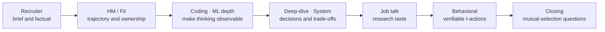

# Stage-by-Stage Resume Answers

resume-groundedstage-by-stageclick-to-revealfact-safepractice

> [!TIP] What this chapter is for
> This chapter turns the current resume snapshot into <strong>spoken answers for each round</strong>, from recruiter and HM screens through coding/ML depth, system design, the research talk, and behavioral interviews. Reveal one answer at a time. Do not memorize it verbatim; rebuild the spine—`claim → evidence → judgment → next question`—in your own voice.

> [!IMPORTANT] Factual boundary
> These drafts use only facts visible in the resume and public projects. Use ownership that the resume states explicitly—such as creating ZIM, building the FaceSign anti-spoofing model, and independently developing the on-device model. The resume cannot establish architecture, data, evaluation, or deployment boundaries beyond those lines, nor internal product metrics, work authorization or start date, compensation, conflict, or mentoring stories. Delete any line marked `verify personally` unless you can replace it with your real record. Always identify work still in review as <strong>under review</strong> and discuss only the approved public scope.

## Answer-status labels

| Label | Meaning | How to use it |
| --- | --- | --- |
| `resume-verified` | stated directly in the current resume | reconfirm dates and numbers before submission |
| `public evidence` | defensible from a paper, public code, or project | do not exceed the published method or evaluation scope |
| `company-specific substitution` | incomplete without the JD and public company material | replace `{team problem}` and `{public evidence}` for the actual application |
| `verify personally` | motivation, action, or result not knowable from the resume | do not use without a real example |

## 1 · Recruiter screen — establish direction in 30 seconds

“Tell me about yourself.” — 30-second version

**Intent:** They want a concise account of your present identity, one verifiable anchor, and the direction of your next role—not a reading of the resume.

**Sample answer · resume-verified**

“I am a computer-vision Applied Scientist with more than five years at NAVER Cloud and a PhD candidate at KAIST. My research has focused on reliable visual perception under practical constraints, moving from label-efficient and continual segmentation to a promptable image-matting foundation model such as ZIM. More recently, I have been connecting that perception background to grounded VLMs and visual-reasoning agents. In my next role, I want to own an agenda that joins new research with validation under real product constraints.”

**To cut it to 20 seconds:** retain only current role → research arc → desired scope. Save publication counts and the project list for follow-up.

**Likely follow-up:** “If you could choose one project?” → move to the [ZIM answer](#/resume/zim).

“What are you looking for in your next role?”

**Sample answer · company-specific substitution / verify personally**

“I am looking for three things. First, scope where perception and multimodal reasoning are evaluated together on a real user problem rather than as separate demos. Second, end-to-end ownership that extends a paper idea through data, evaluation, and serving. Third, an environment with strong research peers where we can test counterexamples quickly. I see `{publicly documented team problem}` as the intersection of my ZIM and segmentation delivery experience with my direction in grounded visual reasoning. I would like to confirm whether the team's actual priorities for the first six to twelve months match that understanding.”

**Caution:** Do not make “famous company,” “larger model,” or “higher compensation” the primary reason. Rewrite this if it does not match your real motivation.

“Why are you considering a move now?”

**Sample answer · verify personally**

“In my current role I have learned to carry label-efficient vision research into both papers and products. I now want to build on that foundation with a more coherent research program in grounded multimodal models and visual agents, and to own broader scope from problem selection through evaluation and deployment. This is not a claim that I need to leave my current organization; it is an intentional choice about the research questions and responsibility I want for the next several years.”

**Verify:** adapt the real reason for moving, the PhD timeline, and any conflict with the current organization to your actual situation.

“Are you open to relocation? What is your work-authorization status?”

**Sample answer · partially resume-verified**

“I am currently based in Seoul and open to relocation. For `{target country}`, my current work-authorization status is `{exact current status}`. I would like to confirm the sponsorship needed for this role and a feasible start date.”

The resume supports only `Seoul, Korea` and `open to relocation`. Fill in work authorization, family constraints, and start date with the actual facts.

How should I answer an early compensation question?

**Sample answer · company-specific substitution**

“I would first like to align on the role's level, location, and expected ownership. Could you share the base and total-compensation band the company has set for that combination? Once I understand the structure, I will be happy to discuss the package concretely as a whole.”

If you must give a number, attach the currency, region, level assumption, and base-versus-total distinction. The resume contains no current-compensation data, so do not invent one.

## 2 · Hiring manager / research fit — turn a list into a trajectory

“Walk me through your research trajectory.” — 90-second version

**Sample answer · resume-verified / public evidence**

“The question connecting my work is: how can we produce reliable visual outputs without expensive full supervision or an idealized environment? I began with BESTIE and PointWSSIS, reducing segmentation-label cost through image-level and point supervision. With SSUL and ECLIPSE, I extended the question to limiting forgetting when a deployed model learns new classes. In ZIM, I used the scale of a promptable segmentation foundation model but redesigned the data and architecture around the boundary fidelity and alpha representation that matting requires. At NAVER Cloud, I also worked with latency and quality constraints in foreground segmentation, face anti-spoofing, and on-device segmentation. More recently, I have applied the same reliability question to grounded VLMs and training-free visual-reasoning agents, connecting language answers to pixel or region evidence and diagnosing silent failures in perception tools.”

**If interrupted:** keep three points only—weak supervision → ZIM → grounded reasoning.

“Why move from perception to VLMs and agents? Is this trend-following?”

**Sample answer · public evidence / under-review boundary**

“For me this is not leaving perception; it is elevating perception into a verifiable evidence layer for reasoning. End-to-end VLMs are powerful, but an answer can become detached from its visual evidence. A specialist vision tool can likewise return a plausible mask or depth map when it is wrong. My segmentation and matting background has dealt directly with pixel- and region-level fidelity and failure modes, so it connects naturally to grounding and tool reliability. I am studying this through diagnosis and program repair in current under-review work, while keeping the review status and public method boundary explicit in interviews.”

**Hard follow-up:** “If frontier VLMs keep improving, why retain a modular agent?” Treat the simplicity of end-to-end models versus the inspectability of modular traces as a task-dependent experimental question.

“What is your strongest project, and why?”

**Sample answer · resume-verified**

“At present I would choose ZIM. Not only because it was an ICCV Highlight, but because it best shows both problem reframing and research-to-product work. Fine-tuning SAM on matting data alone did not resolve the data contract between coarse hard-mask supervision and fine alpha boundaries. We therefore designed scalable label conversion, prompt-aware decoding, and restoration of high-resolution detail together. It also mattered that the work moved beyond public code and a demo into an image-editing service. I would discuss product usage or internal competitive comparisons only within the approved disclosure scope.”

**Alternatives:** choose ECLIPSE for a continual-learning role, PointWSSIS for label efficiency, or on-device segmentation for edge deployment.

“What did you personally own?”

**Sample answer · verify personally**

“Let me separate the team's result from my contribution. In `{project}`, I personally owned `{the actual items among problem framing / architecture / data pipeline / loss / implementation / experiments / writing}`. The pivotal decision was `{why option B was chosen over option A}`, and I tested it with `{ablation or failure analysis}`. My coauthors owned `{their actual roles}`, and we collaborated through `{the real interface}`.”

The ZIM resume line mentions architecture, loss, and data-pipeline design, but only you can verify the detailed role and coauthor boundary. Neither “I did everything” nor “the team did it” answers an ownership question.

## 3 · Coding / ML coding — make judgment audible, not only the answer

The first 60 seconds after receiving a coding problem

**Spoken script**

“I will first confirm the input contract: size limits, duplicates and empty input, ordering guarantees, and memory constraints. The simplest baseline is `{method}`, with `{complexity}` time and space. Its bottleneck is `{repeated search / sorting / state}`, so `{data structure or pattern}` can reduce it. I will validate the invariant on a small example, implement it, and then test empty input, one element, duplicates, and the largest range.”

**Personalization:** Do not pull in production-vision history at length. Let it show only through API contracts, edge cases, and verification habits.

“Do you choose a fast implementation or a readable one?”

**Sample answer**

“In an interview I first choose the implementation whose correctness is visible, and optimize only when the input scale requires it. In model serving, a latency number alone is also insufficient; preprocessing, memory transfer, fallback, and observability matter. I apply the same rule here: establish a clear baseline, then optimize only a bottleneck supported by a profiler or complexity argument.”

This is a general principle. Before adding a concrete serving example of your own, confirm that it is both true and disclosable.

## 4 · ML fundamentals — connect textbook concepts to your work

“Explain weakly supervised versus semi-supervised learning through your research.”

**Sample answer · public evidence**

“In weak supervision, every sample can have a label while the label itself contains less information than the target. BESTIE, for example, learns instance masks from image-level semantic signals. In semi-supervision, only some samples have a strong label while the remainder are unlabeled or weakly labeled. PointWSSIS's weakly semi-supervised setting combines a small number of full masks with cheaper point annotations. The central distinction is not simply whether a label exists, but the information content of the supervision and the data-split contract. That is why a comparison must report both annotation budget and the strong/weak split.”

“What is the fundamental difference between segmentation and matting?”

**Sample answer · public evidence**

“Segmentation usually predicts a discrete class or foreground membership for each pixel. Matting estimates a continuous alpha value in boundaries and translucent regions so that it explains the image-compositing process. High IoU can therefore coexist with poor alpha fidelity on hair, motion blur, or transparent objects. This difference in the target contract is why simply fine-tuning on coarse hard masks was insufficient in ZIM. Evaluation should include SAD, MSE, and boundary/detail behavior rather than only segmentation metrics.”

“Does freezing eliminate forgetting in continual learning?”

**Sample answer · public evidence**

“Freezing sharply reduces parameter drift, but it does not automatically make output-level forgetting zero. New prompts, classifier aggregation, or a changed meaning of no-object can affect old-class predictions, while freezing too much can limit plasticity. ECLIPSE gains stability from a frozen base and small trainable visual prompts, then supports plasticity through logit handling and initialization. The trade-off should therefore be reported with old- and new-class performance alongside the trainable parameter count.”

## 5 · Technical deep-dive — defend design choices and counterexamples

ZIM — “Why wasn't fine-tuning SAM on a matting dataset enough?”

**Sample answer · public evidence**

“The bottleneck was not optimization alone; it was the supervision contract and scale. Coarse binary masks from the SAM lineage and the limited categories and granularity of public matting data make it difficult to preserve promptable zero-shot behavior while recovering fine alpha detail. ZIM jointly designs a data pipeline that converts SA-1B-style masks into fine-grained matte labels, attention focused on the prompt region, and a decoder that restores high-resolution detail. The key test is a matched ablation of data only, architecture only, and both together, separating which component reduces which failure.”

Use the [ZIM deep-dive](#/resume/zim) for exact numbers and architecture.

PointWSSIS/BESTIE — “How did you prevent bias from cheap labels?”

**Sample answer · public evidence**

“Expanding a weak label as if it were ground truth creates confirmation bias. BESTIE transfers semantic knowledge into an instance representation, but limits the supervised region so that a missed instance is not forced into background, and then uses self-refinement. PointWSSIS separates the roles of point cues and a small set of full masks, improving teacher pseudo-labels through point-guided refinement. The central idea is not generating more pseudo-labels; it is a trust contract that specifies what to trust and what to exclude from the loss.”

ECLIPSE — “Does a roughly 1% trainable fraction really matter?”

**Sample answer · public evidence**

“A small trainable fraction is not the goal by itself. It is a way to reduce update cost and forgetting together in a continual setting where storing old data or repeatedly training the full model is difficult. The parameter percentage alone is therefore insufficient; under the same protocol, I would compare old/new-class PQ, memory and replay assumptions, dependence on initialization, and the limits on plasticity. Whether the method is suitable for a real product is a separate validation question from the paper protocol.”

Under-review visual-reasoning agent — “Tell me the concrete results.”

**Sample answer · under review**

“This work is currently under review, so I will describe only the approved problem framing and evaluation design. The core question is whether, when a visual program fails, we can diagnose how a silent error from a perception tool propagates into downstream reasoning rather than observing only a wrong final answer. We study representing failures as typed diagnoses and connecting them to targeted repair. I will not disclose nonpublic benchmark numbers or detailed frontier-model comparisons before they are public or approved.”

Do not stop at “I cannot discuss it.” Explain the shareable hypothesis, design, and limitation in depth.

## 6 · ML system design — turn a research model into an operational contract

“Design a large-scale promptable matting API.”

**Sample answer · structured around ZIM experience**

“I would first separate the product contracts: input resolution and prompt type, interactive versus batch latency, the alpha-matte quality bar, and privacy and retention policy. I would split the system into validation and normalization → image-embedding cache → prompt-conditioned decoder → alpha postprocessing → quality and fallback. Evaluation should combine matte quality such as SAD/MSE, boundary slices, prompt robustness, p50/p95 latency, GPU memory, and failure or abstention rate. With repeated prompts, cache the encoder embedding and rerun only the decoder, while designing the cache key, TTL, privacy, and model-version invalidation. Route low-confidence or extreme-resolution inputs to a tiled high-quality path or a human/manual fallback.”

**Personalization:** You may mention the connection between ZIM and image editing, but use internal traffic, cost, or competitive comparisons only if approved for disclosure.

“What did you sacrifice to build roughly 10 ms mobile segmentation?”

**Sample answer · partially resume-verified / verify personally**

“I would define the target not as the highest benchmark score, but as stable end-to-end latency on the target mobile CPU with acceptable human-boundary quality. Candidate architectures should be compared on an accuracy–latency Pareto frontier while measuring ONNX-exportable operators, input resolution, preprocessing cost, and peak memory. The resume establishes roughly 10 ms and ONNX-based deployment, but I would check my experiment record before claiming which architecture, quantization, or distillation method we used and exactly what we gave up.”

**Strong follow-up:** specify device, warm-up, thread count, batch size of one, and whether preprocessing is included.

“How do you handle failure in a face anti-spoofing system?”

**Sample answer · high-stakes framing**

“In authentication, per-attack false accepts and false rejects for legitimate users matter more than average accuracy, alongside domain shift, latency, and fallback. I would first partition the threat model by print, replay, mask, camera, and domain conditions, then design a split without user or device leakage. Keep the model score separate from the security policy, version the threshold, and route uncertain or out-of-distribution inputs to retry, another factor, or a manual flow. Monitor drift and emerging attacks continuously, but define collection, retention, and access policy for sensitive biometric data first.”

The resume supports that you built the FaceSign anti-spoofing model. It does not establish ownership of the whole FaceSign system, its authentication method, internal metrics, or compliance details; do not guess those.

## 7 · Research presentation / job talk — make one promise, then repay it with evidence

Sample first 90 seconds of a job talk

**Sample opening**

“Today's question is simple: can we make a visual system reliable without complete labels, a fixed class set, or abundant compute? I have studied this question at three levels. First, I reduced label cost with weak and point supervision. Second, I addressed scale and update cost through continual prompts and foundation-model adaptation. Third, more recently I have connected visual outputs to verifiable evidence for language reasoning. Across the projects, I will focus less on an aggregate benchmark number and more on the failure we found and how we redesigned the data, architecture, and evaluation contract around it.”

Limit the body of the talk to two projects. A natural structure uses ZIM as the flagship and chooses either ECLIPSE or grounded reasoning based on the role.

“What is the largest limitation of your research, and what would you test next?”

**Sample answer**

“A shared limitation is that component output quality is not the same as system-level trustworthiness. ZIM can improve boundary fidelity yet fail on an out-of-distribution prompt, and a visual agent can reach the right answer using the wrong evidence. My next step would insert evidence correctness, calibration, and intervention tests between the component metric and final accuracy. By perturbing selected tool outputs and measuring whether reasoning abstains or repairs appropriately, I want to separate real robustness from spurious success.”

Make the next experiment more concrete for the target team's data and product scope.

## 8 · Behavioral — do not manufacture a story missing from the resume

“Tell me about taking research into a product.”

**Sample answer · resume-verified / verify personally**

“A representative candidate is the connection between ZIM and an image-editing service. The research goal was promptable zero-shot matting with fine boundary quality, while the product adds contracts for input diversity, latency, failure fallback, and model versioning. In the production phase I personally owned `{actual items}`, and used `{actual evaluation or collaboration}` to understand the gap between the research metric and user-perceived quality. The work ultimately led to `{publicly shareable product impact}`. I would discuss internal usage or competitive comparisons only within the approved public scope.”

The resume verifies the service integration, not your individual role in every production stage. Fill the STAR `Action` from the real record.

“Tell me about independently finishing an ambiguous problem.”

**Candidate example · independent development is resume-verified / verify detailed decisions personally**

“I would choose on-device human segmentation. According to my resume, I independently developed the model, achieved about 10 ms on a mobile CPU, and deployed it through ONNX-based in-house serving. In the full answer I would explain how `[product constraint]` became the requirement, how I narrowed `[architecture, resolution, or operator alternatives actually compared]`, and which `[quality guardrail]` I protected. Independent development is resume-verified; the measurement protocol, concrete decisions, and team interfaces must match my experiment log and project record.”

**Evidence to prepare:** initial requirement, two discarded alternatives, an artifact you created, the quality guardrail, and what you learned after deployment.

“What did you learn from a failed or surprising experiment?”

**Public-research candidate · verify that this was your experience**

“A useful failure in the ZIM problem was that adapting SAM to limited public matting data alone did not solve fine-grained zero-shot matting. It is easy to assume that model adaptation is the primary bottleneck, but the failure slices pointed to coarse supervision and data granularity as more fundamental. We shifted from repeatedly adding more complex losses toward jointly testing a label-conversion pipeline and high-resolution decoding. My lesson was that slicing failure by the target contract, rather than watching only an aggregate score, is what changes the next experiment.”

Use this only after confirming that you personally ran this baseline and helped drive the change. Otherwise replace it with your real negative result.

“Tell me about a strong disagreement with a colleague.”

**The resume cannot answer this — writing scaffold**

“In `{situation: real project and decision}`, I supported `{my hypothesis}` while my colleague supported `{their hypothesis}`. Rather than decide by seniority or confidence, we agreed on `{shared metric / minimum experiment / decision deadline}`. I took `{specific action}`, and we observed `{result}`. The final decision was `{decision}`, and afterward I changed `{relationship or process improvement}`.”

Do not claim that you never have conflict or always persuade everyone. A small technical difference of opinion is enough if it is real; do not make the other person look incompetent.

“How did you balance full-time work and a PhD?”

**Sample answer · resume-verified / verify personally**

“I would not describe the two roles as simply surviving more hours. I aligned them by turning product constraints such as label cost, continual updates, and latency into generalizable research questions, then using research ablations and failure analysis to inform product decisions. I still kept clear boundaries around company time, intellectual property, and approval. I would explain my actual scheduling system and a real trade-off through `{your concrete system}`.”

A real example of dropping or renegotiating a priority is more credible than claiming you always handled everything perfectly.

## 9 · Closing / mutual fit — keep the last answer evidence-based

“Why should we hire you?”

**Sample answer · company-specific substitution**

“My differentiator is experience connecting three levels in one decision chain: depth in pixel-level segmentation and matting, research rigor in label-efficient and continual learning, and constraints from mobile, APIs, and products. More recently, I have extended that foundation into grounded VLMs and visual agents. If `{the team's public problem}` requires high-fidelity perception and verifiable reasoning together, I can connect a benchmark idea through the data contract, failure analysis, and serving trade-offs. The team's actual priorities may differ, so I would like to hear which gap you would most want to test.”

Five HM questions tailored to this background

1. “Where does ownership meet—and where does it separate—between perception specialists and foundation-model or agent researchers on this team?”
2. “In the first six to twelve months, which research questions can this role define independently, and which product constraints are already fixed?”
3. “When final-task accuracy conflicts with grounding or evidence correctness, which metric and release criterion does the team use?”
4. “How are priorities and approvals among publication, open source, and product delivery decided on a real project?”
5. “Which part of my background would the team most want to use, and which gap would you want to validate before I join?”

Do not repeat a question already answered in the conversation. Choose only two or three whose answers could change your decision.

## Ten-minute rehearsal loop for each round

1. Answer for 30 seconds without looking at the prompt.
2. Mark the opening claim, each `I` action, evidence, and limitation in the recording.
3. Delete any sentence that conflicts with the resume, paper, or public product material.
4. Deliver the same answer in 30-second, 90-second, and three-minute versions.
5. Pick two follow-ups at random and descend to mechanism or trade-off depth.
6. Write the real red line beside every under-review, confidential, or verify-personally sentence.

**Read together:** [Recruiter & HM Screens](#/process/recruiter-hm) · [Phone-Screen Hub](#/process/phone-screens) · [Predicted Q&A](#/resume/predicted-questions) · [Resume → Interview Map](#/resume/overview) · [ML System Design](#/system-design/framework) · [Research Job Talk](#/research/job-talk) · [STAR & Story Bank](#/behavioral/star)
