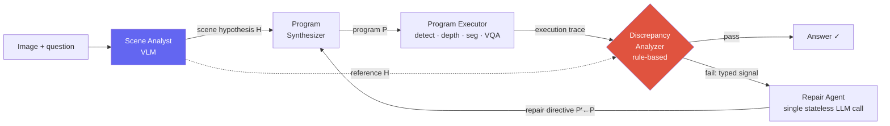

# Deep-Dive: Spatial-Reasoning Agent (심사 중)

NeurIPS 2026 (under review)visual program synthesis3D spatial reasoningagentic repairflagship / ongoing

> [!DANGER] 공개용 redacted 버전 — 작업은 double-blind review 중
> 이 챕터는 NeurIPS 2026 **심사 중 submission**을 위한 공개용 **redacted** 버전입니다. CV에 이미 공개한 범위의 메커니즘과 architecture만 남기고 codename, 정확한 benchmark 수치, 식별 가능한 model/benchmark 이름을 제거했습니다. 인터뷰에서도 먼저 "심사 중"이라고 밝히고, 공개본과 회사·학회 정책이 허용하는 범위만 설명하세요. Embargoed detail은 구두 면접이라고 자동으로 공유 가능한 것이 아닙니다.

> [!TIP] 30초 피치
> Visual program synthesis는 detection·depth·segmentation·VQA tool을 호출하는 program으로 3D spatial 질문을 풉니다. 문제는 tool이 예외 없이 틀린 값을 반환해 **silently 실패**할 수 있다는 점입니다. 이 submission은 synthesis 전 **structured scene hypothesis**, 호출별 **execution trace**, trace와 hypothesis를 비교하는 **rule-based typed diagnosis**, 그리고 **targeted repair**를 결합해 silent failure를 repairable event로 바꾸는 architecture를 연구합니다. 비교 결과·model 이름·정확한 protocol은 공개 또는 정책상 허용되기 전에는 말하지 않습니다.

## 문제: open-loop program synthesis는 silently 실패한다

[ViperGPT/VisProg](#/vlm/visual-agents) 계보의 시스템은 질문을 perception operator에 대한 program으로 분해한 뒤, **open-loop**로 실행한다 — program은 이미지를 절대 보지 않고, 그 perception 호출은 검증 없이 받아들여진다. 3D spatial 질문에서 perception 오차는 흡수되기보다 **증폭**된다: 단 하나의 놓친 detection이 downstream geometric 계산을 무너뜨리고; 부정확한 depth 추정이 spatial ordering을 뒤집는다.

따라서 두 실패 모드가 **silently** 발생한다 — 둘 다 어떤 plausibility check도 통과시킬 confident한, in-distribution 답을 낸다:

<dl class="kv">
<dt>False-negative perception</dt><dd>존재하는 객체에 대한 호출이 sentinel (<code>None</code>, 빈 집합)을 반환하고; program은 in-distribution default ("no", 0.0)로 fallback해서 전파한다. sentinel <i>이야말로</i> 신호다 — 찾아본다면.</dd>
<dt>Hypothesis violation</dt><dd>호출이 confidently-typed되었지만 <b>scene-inconsistent</b>한 값을 반환한다 — 없는 객체에 대한 box, 또는 사람이 보는 것과 모순되는 count. scene이 무엇을 담아야 하는지에 대한 <b>외부 reference 없이는</b> 성공과 구별 불가능하다.</dd>
</dl>

Open-loop baseline은 Python 예외에서만 재시도할 수 있으므로, 어느 silent 모드도 탐지조차 불가능하다. **두 연구 질문:** (i) visual program이 blind retry가 아니라 *structured diagnosis*로 perception failure에서 회복할 수 있는가? (ii) *synthesis 전에 structured scene hypothesis를 생성*하는 것이 program 생성과 repair 둘 다를 개선하는가?

## 아키텍처

통찰: **질문별 scene hypothesis**와 **structured execution trace**를 교차하면, silent failure를 *특정 operator*로 국소화하고 repair directive로 라우팅 가능한 *typed diagnosis*를 낼 수 있다.

**1 · Scene Analyst** — 코드 synthesis *전에* 삽입되는 단일 VLM pass로, 네 블록을 가진 structured hypothesis $H$를 생성한다: **object inventory** (각 entity에 visibility, expected count, description, recommended detection query 태깅), **counting prior**, **depth ordering** (foreground→background), 그리고 증거를 동반한 **draft answer**. 결정적으로 $H$는 image-global이 아니라 *question-conditional*이고, scene graph로 렌더링되지 않고 (analyzer용 reference로) **프로그래매틱하게 소비**된다. draft answer는 *fallback*이며 절대 short-circuit되지 않는다 — program은 여전히 자기 답을 계산하고 $H$와 대조된다.

**2 · Execution trace** — 모든 perception 호출은 `(operator, return_value, cache_status)`를 기록하도록 wrapping되고; 그 sequence는 JSON으로 analyzer에 넘겨진다.

**3 · Discrepancy analyzer** — **순수 Python, LLM 없음.** plausibility gate가 먼저 sentinel (missing string, 빈 collection, type별 zero)을 거부한다. gate를 통과하면, rule-based comparator가 trace를 $H$와 교차해서 네 **typed signal** 중 하나를 낸다:

| Typed signal | Fires when… | Maps to failure class |
| --- | --- | --- |
| `visibility-miss` | analyst는 객체가 보인다고 하는데 localizer가 아무것도 반환 안 함 | false-negative perception |
| `visibility-FP` | analyst는 객체가 없다고 하는데 localizer가 box 반환 | hypothesis violation |
| `count-mismatch` | analyst의 count prior ≠ localizer의 detection count | hypothesis violation |
| `strategy-ignored` | program이 analyst가 권한 verification 경로를 우회 | hypothesis violation |

analyzer는 같은 code·trace·$H$에 대해 deterministic하고 **추가 model/API 호출은 요구하지 않지만**, Python 실행 비용과 rule 설계 오류는 남습니다. 모든 실행에서 검사하므로 LLM judge보다 추가 model latency·비용을 줄일 수 있다는 것이 설계 동기입니다. deterministic하다는 말은 정확하거나 hallucination-free하다는 뜻이 아닙니다.

**4 · Repair Agent** — 단일, **새로 프롬프트된 stateless** LLM 호출 (대화 이어가기가 아니라 — 그러면 실패를 야기한 가정을 물려받는다). 질문, 실패 program, trace, typed report, 그리고 $H$가 주어지면, 세 **typed directive** 중 하나로 태깅된 수정 program을 반환한다:

<dl class="kv">
<dt>Query rewrite</dt><dd>synonym query로 치환 (localizer의 실효 vocabulary가 synthesis 시점에 노출되지 않음): <code>loc('locomotive')</code>→<code>loc('train')</code>. 가장 흔한 directive.</dd>
<dt>Query decomposition</dt><dd>localizer가 파싱 못 하는 compound attribute query를 coarse localization + detection별 VQA로 분해: <code>loc('blue chair')</code> → <code>loc('chair')</code> + <code>vqa(box,'Is this blue?')</code>.</dd>
<dt>Logic-level edit</dt><dd>failure가 구조적일 때 program 구조 (loop bound, branching, aggregation)를 재작성 — 예: analyst가 spatial order 검증을 권했는데 program이 그것을 단일 distance 비교로 뭉갠 경우. 드물지만 시도당 recovery rate가 가장 높다.</dd>
</dl>

loop는 작은 repair budget까지 반복하고; `(operator, image, query)`를 키로 하는 trace-aware cache 덕에 최신 directive가 건드린 perception 호출만 재발화한다. budget이 소진되면, **holistic fallback**이 직접 VLM 호출을 한다.

**5 · Mask-aware Spatial Perception API** — 두 operator를 mask-grounded variant로 교체한다 (파이프라인이 이미 생성하는 segmentation mask를 사용):
- axis-aligned image-plane box 대신 **per-pixel 3D backprojection**: mask pixel을 camera intrinsic으로 backproject하고, $x_{3D}(u,v) = \frac{(u-c_x)\,d(u,v)}{f_x}$ 뒤 robust span을 취합니다. 제출본은 이를 해당 camera/world-coordinate convention에서 **view-rotation에 더 강한 metric extent**로 설명합니다. 임의의 3D object orientation에 완전히 invariant하다는 보편 주장으로 확대하지 마세요.
- center-pixel read 대신 **mask-aggregated depth** (in-mask 샘플에 대한 quartile-trimmed median) (center-pixel은 non-convex/occluded 객체에서 occluder나 background에 떨어진다).

## Evaluation framing (결과 redacted)

공개 가능한 평가 축 — 비교 결론도 review 동안 보류

- Open-loop program synthesis와 end-to-end VLM을 task·backbone·sampling budget이 드러나는 protocol에서 비교합니다.
- 실제 3D-spatial task와 synthetic diagnostic set을 분리해 perception noise와 diagnosis/repair behavior를 봅니다.
- Matched-backbone control로 model substitution과 architecture 효과를 분리합니다.
- Scene Analyst·Repair Agent·Spatial API의 component ablation과 counting 등 failure slice를 보고합니다.
- 공개 전에는 `더 낫다`, `parity`, `가장 강하다` 같은 방향성도 결과 정보로 취급해 보류합니다.

Backbone은 off-the-shelf다: program/repair agent용 mid-size code-synthesis LLM, Scene Analyst용 small open-source VLM, 그리고 perception용 표준 detection / depth / segmentation / VQA model. (정확한 model과 benchmark 이름은 review 동안 보류.)

## 주장을 검증할 ablation

backbone을 고정한 {Scene Analyst, Repair Agent, Spatial API} $2^3$ factorial은 각 component와 interaction을 확인하는 핵심 설계입니다. 여기서 물을 것은 (1) diagnosis와 action이 함께 있을 때만 이득이 생기는지, (2) Spatial API의 marginal effect가 다른 component에 의존하는지, (3) repair budget을 늘릴 때 비용 대비 회복률이 언제 포화하는지입니다. 실제 관찰된 방향과 수치는 제출본 공개 또는 정책상 허용된 자리에서만 말하고, factorial ablation만으로 메커니즘의 보편적 인과를 증명했다고 주장하지 않습니다.

## Limitations — 먼저 말할 것

이 framework는 **confident-but-wrong** perception을 탐지하지 **못한다**: scene-level 불일치 *없이* 그럴듯하지만 부정확한 값을 반환하는 호출. 외부 ground-truth reference 없이는 이것들이 성공과 **설계상** 구별 불가능하며, 이는 달성 가능한 closure를 제한한다. 두 구조적 이유:

1. **Scene Analyst 자체가 VLM**이고 downstream perception과 같은 bias 일부를 물려받는다. analyst와 localizer가 *concordant하게* 실패하면 cross-check rule이 발화할 수 없다 — 두 오차원이 *독립*이라는 loop의 load-bearing 가정을 위반한다. 이를 닫으려면 *독립적인* reference (예: 이질적 VLM들의 multi-source scene prior)가 필요하다.
2. **일부 3D 답은 단일 2D view에서 회복 불가능하다** (cuboid의 앞면 ≠ 실제 extent) — 병목은 diagnostic architecture가 아니라 *perception substrate*다.

오류 분석에서는 vocabulary mismatch·compound query·program-logic error처럼 현재 repair action으로 다룰 수 있는 경우와, perception-capability bound·concordant error처럼 새로운 독립 신호가 필요한 경우를 분리합니다. 실제 빈도와 어떤 범주를 `recoverable`로 판정했는지는 공개 전까지 결과 정보로 보류합니다.

## 예상 deep-dive Q&A

"왜 그냥 더 큰 end-to-end VLM을 prompt하지 않나? 더 간단하잖아."

**Short:** 이 접근의 가설은 trace와 typed repair log가 특정 failure를 국소화·디버깅하는 데 도움이 된다는 것입니다. end-to-end model과의 상대 성능 결론은 심사 중이라 공개하지 않습니다.

**Deep:** 검증할 가설은 단순한 catastrophic error가 아니라 plausibility gate를 통과하는 silent error에서 explicit reference와 trace가 도움이 되는지입니다. Miscount·depth-order reversal·missed object 같은 slice를 사전에 정의하고, end-to-end와 program baseline을 같은 budget에서 비교해야 합니다. 실제 어느 slice에서 이득이 났는지는 심사 중 결과이므로 보류합니다.

**Follow-up:** "그럼 우연히 값을 하는 interpretability tax인가?" → 반대다: 그 구조가 self-correction을 *가능하게 하는 것*이다. deterministic diagnostic component를 제거하면 시스템은 open-loop baseline으로 붕괴한다.

"왜 discrepancy analyzer가 LLM judge가 아니라 rule-based Python인가?"

**Short:** 모든 program을 검사하므로 추가 model 호출 없이 재현 가능하게 실행되는 comparator를 택했습니다. 규칙도 틀릴 수 있지만, LLM judge의 추가 latency·비용과 비결정성을 피합니다.

**Deep:** verifier는 structured visual hypothesis $H$와 호출별 execution trace를 비교하는 deterministic comparator입니다. Reflexion/Self-Refine의 textual reflection, CRITIC/CodeT의 tool/test feedback, scalar reward 기반 repair와 **feedback source·granularity·repair locus**를 비교하세요. 선행 연구 전체가 scalar/free-form뿐이라고 단정하지 말고, 제출본의 검색 시점과 포함 기준 안에서 호출별 typed visual diagnosis 조합의 차이를 설명합니다.

**Follow-up:** "rule set이 brittle / hand-tuned 아닌가?" → 소수의 rule로, 각각이 구체적 perception 하위 클래스에 묶여 있다; pilot taxonomy가 그들이 커버하는 recoverable envelope를 보여주고 밖에 있는 것 (confident-but-wrong)이 정확히 무엇인지 명명한다. 이것은 learned judge가 아니라 의도적으로 structural contract다.

"Scene Analyst가 VLM이다 — 그냥 hallucination 문제를 옮기는 것 아닌가?"

**Short:** 부분적으로 그렇고, limitations에서 그렇게 말한다. loop의 load-bearing 가정은 analyst와 perception operator가 *독립적으로* 실패한다는 것이다; *concordant하게* 실패하면 cross-check가 발화할 수 없다. 그것이 지배적 잔여 failure mode다.

**Deep:** 필요한 검증은 Scene-Analyst 용량을 바꾼 control과, free-form draft를 차단한 채 typed reference만 소비하는 ablation입니다. 이 결과로 가치가 stronger oracle인지 structured interface인지 분리합니다. 실제 accuracy 변화는 심사 중 결과이므로 공개하지 않습니다. concordant error를 줄이려면 이질적인 multi-source prior처럼 더 독립적인 reference가 필요할 수 있습니다.

**Follow-up:** "이득이 그냥 analyst의 draft answer가 새는 게 아니라는 걸 어떻게 아나?" → draft는 *fallback*이고 절대 short-circuit되지 않는다; program이 자기 답을 계산해서 $H$와 대조되고, program-prompt rule이 draft를 결과로 hardcode하는 것을 명시적으로 금지한다.

"이게 open-loop program synthesis, ReAct, Reflexion, CRITIC와 어떻게 다른가?"

**Short:** submission은 **program–perception interface**에서 structured visual hypothesis와 호출별 trace를 비교하고, typed signal을 repair directive로 라우팅하는 조합에 초점을 둡니다. "어떤 선행 연구도 없다"고 단정하지 말고 제출본 related-work 범위와 검색 시점을 명시합니다.

**Deep (design-space 축):** verifier source (외부 visual hypothesis vs text-judge/scalar/tool-test), diagnosis granularity (호출별 typed vs scalar pass/fail), repair locus (perception interface 위의 typed directive vs full free-form rewrite 또는 tool re-selection), 그리고 op-chain localization (yes vs none). open-loop program-synthesis 선행자가 직접 baseline이지만 operator별 failure typing이 없다.

"가장 설득력 있는 단일 결과는 무엇이고, 무엇이 네 주장을 반증하나?"

**Short:** 가장 중요한 검증은 matched-backbone $2^3$ ablation입니다. Scene-only, Repair-only, 결합 구성의 차이와 confidence interval이 closed-loop 해석을 지지하는지 봅니다. 관찰된 gain의 방향과 크기는 공개 전에는 말하지 않습니다.

**Follow-up:** "synthetic benchmark에서의 결과가 real task로 전이되나?" → synthetic set은 failure를 통제해 diagnosis를 분리하는 보조 평가이고, real-world benchmark를 별도로 보고해야 합니다. 실제 전이 결론과 어느 set에서 설계를 고른지는 공개 가능한 protocol에 따라 답합니다.

## 어떤 JD signal과 연결되는가

| JD signal | 연결할 근거 |
| --- | --- |
| Multimodal agent / tool use | program synthesis, execution trace, targeted repair |
| Spatial / embodied reasoning | detection·depth·segmentation error의 누적과 3D ambiguity |
| Reliable perception | typed diagnosis, deterministic comparator의 장단점 |
| Efficient adaptation | task-specific training을 쓰지 않는 설계와 추가 inference cost |

## Cross-links

- Topic background: [Visual Reasoning Agents](#/vlm/visual-agents) · [Agentic AI & Tool Use](#/llm/agents) · [Grounding & Region Reasoning](#/vlm/grounding)
- The umbrella narrative: [Grounded VLM / Agents (ongoing)](#/resume/grounded-vlm-agents)
- Interview framing: [Your CV → Interview Map](#/resume/overview) · [Predicted Questions](#/resume/predicted-questions)

> [!NOTE] 무엇을, 누구에게 말해도 안전한가
> under-review 작업의 메커니즘을 인터뷰에서 말할 수 있는지는 학회 double-blind 규정, 공동저자 합의, 고용주·NDA와 면접 회사 정책에 따라 달라집니다. 먼저 심사 중임을 밝히고 승인된 공개 범위만 설명하세요. codename·수치·식별 조합을 공개 게시물에 올리거나 reviewer PDF를 공유하지 않습니다. 허용 범위가 불명확하면 공개된 문제 정의와 선행 연구로 redirect합니다.
