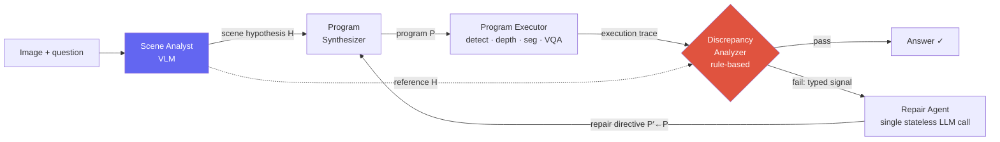

# Deep-Dive: Spatial-Reasoning Agent (NeurIPS'26)

NeurIPS 2026 (under review)visual program synthesis3D spatial reasoningagentic repairflagship / ongoing

> [!DANGER] 공개용 redacted 버전 — 작업은 double-blind review 중
> 이 챕터는 내 NeurIPS'26 submission을 *공개* 사이트용으로 작성한 **redacted** 버전이다: **메커니즘과 아키텍처**를 대략 내 CV가 이미 진술하는 수준으로 담되, 논문이 double-blind review 중인 동안 **codename, 정확한 benchmark 수치, 구체적인 model/benchmark 이름은 제거**했다. (수치가 담긴) 전체 비공개 버전은 내 prep note에 오프라인으로 있다. 인터뷰에서는 이를 기술적 수준으로 논한다 — "심사 중, 방법은 기꺼이 깊게 파겠습니다" — 그리고 embargo된 세부는 게시하지 않고 말로만 한다.

> [!TIP] 30초 피치
> Visual program synthesis는 vision tool (detect, depth, segment, VQA)을 호출해서 3D spatial 질문에 답하는 작은 program을 쓴다. 문제: 그 tool들이 **silently 실패한다** — 논리적으로 옳은 program이 틀린 detection을 받아들이고, 그럴듯한 답을 반환하며, 아무도 알아채지 못한다. 내 작업은 *diagnostic architecture*로, 코드를 쓰기 전에 **structured scene hypothesis**를 세우고, 모든 perception 호출을 **semantic execution trace**에 기록하며, **typed diagnoses**를 내는 **rule-based analyzer**로 trace를 hypothesis와 교차 검증하고, 그것을 **Repair Agent**에 넘겨 결함 있는 program 로직만 고친다. silent failure를 *typed, repairable event*로 바꾼다 — 가장 강력한 program-synthesis baseline을 상당히 능가하고, task-specific 학습 없이 **frontier end-to-end VLM과 parity에 도달**한다.

## 문제: open-loop program synthesis는 silently 실패한다

[ViperGPT/VisProg](#/vlm/visual-agents) 계보의 시스템은 질문을 perception operator에 대한 program으로 분해한 뒤, **open-loop**로 실행한다 — program은 이미지를 절대 보지 않고, 그 perception 호출은 검증 없이 받아들여진다. 3D spatial 질문에서 perception 오차는 흡수되기보다 **증폭**된다: 단 하나의 놓친 detection이 downstream geometric 계산을 무너뜨리고; 부정확한 depth 추정이 spatial ordering을 뒤집는다.

따라서 두 실패 모드가 **silently** 발생한다 — 둘 다 어떤 plausibility check도 통과시킬 confident한, in-distribution 답을 낸다:

<dl class="kv">
<dt>False-negative perception</dt><dd>존재하는 객체에 대한 호출이 sentinel (<code>None</code>, 빈 집합)을 반환하고; program은 in-distribution default ("no", 0.0)로 fallback해서 전파한다. sentinel <i>이야말로</i> 신호다 — 찾아본다면.</dd>
<dt>Hypothesis violation</dt><dd>호출이 confidently-typed되었지만 <b>scene-inconsistent</b>한 값을 반환한다 — 없는 객체에 대한 box, 또는 사람이 보는 것과 모순되는 count. scene이 무엇을 담아야 하는지에 대한 <b>외부 reference 없이는</b> 성공과 구별 불가능하다.</dd>
</dl>

Open-loop baseline은 Python 예외에서만 재시도할 수 있으므로, 어느 silent 모드도 탐지조차 불가능하다. **두 연구 질문:** (i) visual program이 blind retry가 아니라 *structured diagnosis*로 perception failure에서 회복할 수 있는가? (ii) *synthesis 전에 structured scene hypothesis를 생성*하는 것이 program 생성과 repair 둘 다를 개선하는가?

## 아키텍처

통찰: **질문별 scene hypothesis**와 **structured execution trace**를 교차하면, silent failure를 *특정 operator*로 국소화하고 repair directive로 라우팅 가능한 *typed diagnosis*를 낼 수 있다.

**1 · Scene Analyst** — 코드 synthesis *전에* 삽입되는 단일 VLM pass로, 네 블록을 가진 structured hypothesis $H$를 생성한다: **object inventory** (각 entity에 visibility, expected count, description, recommended detection query 태깅), **counting prior**, **depth ordering** (foreground→background), 그리고 증거를 동반한 **draft answer**. 결정적으로 $H$는 image-global이 아니라 *question-conditional*이고, scene graph로 렌더링되지 않고 (analyzer용 reference로) **프로그래매틱하게 소비**된다. draft answer는 *fallback*이며 절대 short-circuit되지 않는다 — program은 여전히 자기 답을 계산하고 $H$와 대조된다.

**2 · Execution trace** — 모든 perception 호출은 `(operator, return_value, cache_status)`를 기록하도록 wrapping되고; 그 sequence는 JSON으로 analyzer에 넘겨진다.

**3 · Discrepancy analyzer** — **순수 Python, LLM 없음.** plausibility gate가 먼저 sentinel (missing string, 빈 collection, type별 zero)을 거부한다. gate를 통과하면, rule-based comparator가 trace를 $H$와 교차해서 네 **typed signal** 중 하나를 낸다:

| Typed signal | Fires when… | Maps to failure class |
| --- | --- | --- |
| `visibility-miss` | analyst는 객체가 보인다고 하는데 localizer가 아무것도 반환 안 함 | false-negative perception |
| `visibility-FP` | analyst는 객체가 없다고 하는데 localizer가 box 반환 | hypothesis violation |
| `count-mismatch` | analyst의 count prior ≠ localizer의 detection count | hypothesis violation |
| `strategy-ignored` | program이 analyst가 권한 verification 경로를 우회 | hypothesis violation |

analyzer는 같은 (trace, $H$)에 대해 deterministic하고, **API 비용이나 지연시간을 더하지 않으며**, 실행된 *모든* program에서 발화한다. 이것이 load-bearing 설계 선택이다 — 여기에 LLM judge를 두면 그 자체로 free인 단계에 hallucination, 지연시간, 질문별 비용을 더하게 된다.

**4 · Repair Agent** — 단일, **새로 프롬프트된 stateless** LLM 호출 (대화 이어가기가 아니라 — 그러면 실패를 야기한 가정을 물려받는다). 질문, 실패 program, trace, typed report, 그리고 $H$가 주어지면, 세 **typed directive** 중 하나로 태깅된 수정 program을 반환한다:

<dl class="kv">
<dt>Query rewrite</dt><dd>synonym query로 치환 (localizer의 실효 vocabulary가 synthesis 시점에 노출되지 않음): <code>loc('locomotive')</code>→<code>loc('train')</code>. 가장 흔한 directive.</dd>
<dt>Query decomposition</dt><dd>localizer가 파싱 못 하는 compound attribute query를 coarse localization + detection별 VQA로 분해: <code>loc('blue chair')</code> → <code>loc('chair')</code> + <code>vqa(box,'Is this blue?')</code>.</dd>
<dt>Logic-level edit</dt><dd>failure가 구조적일 때 program 구조 (loop bound, branching, aggregation)를 재작성 — 예: analyst가 spatial order 검증을 권했는데 program이 그것을 단일 distance 비교로 뭉갠 경우. 드물지만 시도당 recovery rate가 가장 높다.</dd>
</dl>

loop는 작은 repair budget까지 반복하고; `(operator, image, query)`를 키로 하는 trace-aware cache 덕에 최신 directive가 건드린 perception 호출만 재발화한다. budget이 소진되면, **holistic fallback**이 직접 VLM 호출을 한다.

**5 · Mask-aware Spatial Perception API** — 두 operator를 mask-grounded variant로 교체한다 (파이프라인이 이미 생성하는 segmentation mask를 사용):
- axis-aligned image-plane box 대신 **per-pixel 3D backprojection**: 모든 mask 픽셀을 camera intrinsic을 통해 backproject하고, $x_{3D}(u,v) = \frac{(u-c_x)\,d(u,v)}{f_x}$, world-coordinate span을 취함 → **rotation-invariant**한 metric width/height (비스듬히 본 box는 두 차원 모두 overshoot한다).
- center-pixel read 대신 **mask-aggregated depth** (in-mask 샘플에 대한 quartile-trimmed median) (center-pixel은 non-convex/occluded 객체에서 occluder나 background에 떨어진다).

## Results (redacted)

정성 요약 — 정확한 수치는 review 동안 비공개

- 실제 3D spatial-reasoning benchmark에서 **가장 강력한 open-loop program-synthesis baseline 대비 큰 이득**, 그리고 synthetic diagnostic benchmark에서는 더 큰 이득 (아키텍처가 clean-perception regime으로도 전이됨을 확인).
- 실제 이득의 대부분은 model-substitution artifact가 아니라 **matched backbone에서의 architectural** 이득이다.
- **small open-source** Scene Analyst를 쓰고 **task-specific 학습 없이 frontier end-to-end VLM과 parity에 도달**한다.
- **counting에서 가장 강한데**, 정확히 count-mismatch 신호 + repair가 end-to-end VLM과 open-loop program이 silently 받아들이는 localizer miscount를 고치기 때문이다.

Backbone은 off-the-shelf다: program/repair agent용 mid-size code-synthesis LLM, Scene Analyst용 small open-source VLM, 그리고 perception용 표준 detection / depth / segmentation / VQA model. (정확한 model과 benchmark 이름은 review 동안 보류.)

## 스토리를 말해주는 ablation

backbone 고정, {Scene Analyst, Repair Agent, Spatial API}에 대한 $2^3$ factorial이 가장 방어 가능한 결과다. 요점은 **additive가 아니라 structural**이다: diagnosis (Scene Analyst)와 action (Repair Agent)은 **co-requisite**다 — 각각 단독으로는 baseline을 겨우 이기지만, *함께* 있으면 급격히 뛴다. 왜냐하면 *repair는 진단할 reference가 필요하고, diagnosis는 repair action 없이는 쓸모없기* 때문이다. mask-aware Spatial API는 그 위에서 **super-additive**하다. repair budget은 첫 시도 후 saturate되고; 약간 큰 budget이 보수적 default다.

## Limitations — 먼저 말할 것

이 framework는 **confident-but-wrong** perception을 탐지하지 **못한다**: scene-level 불일치 *없이* 그럴듯하지만 부정확한 값을 반환하는 호출. 외부 ground-truth reference 없이는 이것들이 성공과 **설계상** 구별 불가능하며, 이는 달성 가능한 closure를 제한한다. 두 구조적 이유:

1. **Scene Analyst 자체가 VLM**이고 downstream perception과 같은 bias 일부를 물려받는다. analyst와 localizer가 *concordant하게* 실패하면 cross-check rule이 발화할 수 없다 — 두 오차원이 *독립*이라는 loop의 load-bearing 가정을 위반한다. 이를 닫으려면 *독립적인* reference (예: 이질적 VLM들의 multi-source scene prior)가 필요하다.
2. **일부 3D 답은 단일 2D view에서 회복 불가능하다** (cuboid의 앞면 ≠ 실제 extent) — 병목은 diagnostic architecture가 아니라 *perception substrate*다.

틀린 케이스의 hand-labeled pilot은 *recoverable* 절반 (vocabulary mismatch, compound query, analyst hallucination, program-logic error — 기존 아키텍처 확장으로 해결 가능)과 *irrecoverable* 절반 (perception-capability-bound, 또는 cross-modal이나 self-verification 같은 *새로운* 신호원이 필요한 confident-but-wrong)으로 분해된다. 정확한 비율이 아니라 구조적 taxonomy로 읽을 것.

## 예상 deep-dive Q&A

"왜 그냥 더 큰 end-to-end VLM을 prompt하지 않나? 더 간단하잖아."

**Short:** interpretability + 특정 failure class. 이 시스템은 small open backbone과 학습 없이 frontier VLM과 parity에 도달하고, 모든 답이 검사 가능한 trace와 typed repair log를 동반한다 — 배포된 spatial-reasoning 파이프라인을 디버깅할 때 중요하다.

**Deep:** 더 흥미로운 답은 이득이 *어디서* 오는가다. baseline이 catastrophically 실패하는 질문에 집중된 게 **아니다** — 그들이 **silently** 실패하는 케이스, 즉 어떤 plausibility gate도 받아들이는 confidently-typed in-distribution 답 (miscount, 뒤집힌 depth ordering, 놓친 객체)을 반환하는 경우다. monolithic VLM은 자기 silent perception 오류를 잡을 *발 디딜 곳*이 없다; program-plus-hypothesis 구조는 rule이 발화할 명시적 reference를 만든다. 이것은 scale 논증이 아니라 structural 논증이다.

**Follow-up:** "그럼 우연히 값을 하는 interpretability tax인가?" → 반대다: 그 구조가 self-correction을 *가능하게 하는 것*이다. deterministic diagnostic component를 제거하면 시스템은 open-loop baseline으로 붕괴한다.

"왜 discrepancy analyzer가 LLM judge가 아니라 rule-based Python인가?"

**Short:** 실행된 *모든* program에서 발화하므로 free, deterministic, hallucination-free여야 한다. LLM judge는 그 일 자체가 신뢰 가능한 reference가 되는 단계에 질문별 비용, 지연시간, 두 번째 hallucination 원천을 더한다.

**Deep:** verifier는 *외부에서 생성된 structured visual hypothesis* $H$와 *호출별 execution trace* 사이의 deterministic comparator다 — 출력에 대한 text judge가 아니고, scalar reward도 아니다. 이것이 self-repair 계열과의 핵심 차이다: Reflexion/Self-Refine은 textual self-reflection으로, CRITIC/CodeT는 tool/test verdict으로, RL agent는 scalar reward로 repair한다 — 모두 **scalar 또는 free-form**이고, **호출별 typed**인 것은 없으며, 외부 visual reference에 grounded된 것도 없다. scalar verdict는 *program이 실패했다*를 말해줄 수 있지만; 호출별 typed 신호만이 *어느 operator*가 실패했는지 국소화하고 맞는 directive를 고를 수 있다.

**Follow-up:** "rule set이 brittle / hand-tuned 아닌가?" → 소수의 rule로, 각각이 구체적 perception 하위 클래스에 묶여 있다; pilot taxonomy가 그들이 커버하는 recoverable envelope를 보여주고 밖에 있는 것 (confident-but-wrong)이 정확히 무엇인지 명명한다. 이것은 learned judge가 아니라 의도적으로 structural contract다.

"Scene Analyst가 VLM이다 — 그냥 hallucination 문제를 옮기는 것 아닌가?"

**Short:** 부분적으로 그렇고, limitations에서 그렇게 말한다. loop의 load-bearing 가정은 analyst와 perception operator가 *독립적으로* 실패한다는 것이다; *concordant하게* 실패하면 cross-check가 발화할 수 없다. 그것이 지배적 잔여 failure mode다.

**Deep:** ablation이 두 방식으로 방어한다. (i) Scene-Analyst 용량은 거의 중요하지 않다 — model 크기를 바꿔 swap해도 total accuracy가 미미하게 움직인다 — 그래서 가치는 더 강한 oracle이 아니라 *structured reference*다. (ii) analyst는 free-form 답이 아니라 typed reference data (counting prior, visibility flag)로 *프로그래매틱하게* 소비되므로, 거칠지만 structured한 hypothesis면 failure를 국소화하기에 충분하다. concordant error의 정직한 해법은 *독립적인* reference — 이질적 multi-source prior — 이며, 이는 future work다.

**Follow-up:** "이득이 그냥 analyst의 draft answer가 새는 게 아니라는 걸 어떻게 아나?" → draft는 *fallback*이고 절대 short-circuit되지 않는다; program이 자기 답을 계산해서 $H$와 대조되고, program-prompt rule이 draft를 결과로 hardcode하는 것을 명시적으로 금지한다.

"이게 open-loop program synthesis, ReAct, Reflexion, CRITIC와 어떻게 다른가?"

**Short:** **program–perception interface**에서 **외부 structured visual reference**로 loop를 닫고, **호출별 typed signal**을 내서 **typed directive**로 라우팅한다. 어떤 선행 시스템도 그 셀을 점유하지 않는다 — 그들은 tool-selection이나 output 레벨에서 scalar/free-form feedback으로 loop를 닫는다.

**Deep (design-space 축):** verifier source (외부 visual hypothesis vs text-judge/scalar/tool-test), diagnosis granularity (호출별 typed vs scalar pass/fail), repair locus (perception interface 위의 typed directive vs full free-form rewrite 또는 tool re-selection), 그리고 op-chain localization (yes vs none). open-loop program-synthesis 선행자가 직접 baseline이지만 operator별 failure typing이 없다.

"가장 설득력 있는 단일 결과는 무엇이고, 무엇이 네 주장을 반증하나?"

**Short:** $2^3$ ablation. Scene-only와 Repair-only는 각각 baseline을 겨우 이기지만, *함께* 있으면 급격히 뛴다 — 메커니즘이 어느 한 component가 아니라 *closed diagnostic loop*임을 증명한다. Falsifier: matched-backbone control이 이득이 그냥 더 강한 code-synthesis LLM 때문임을 보인다면 architecture 주장이 죽는다 — 그래서 나는 matched-backbone control을 보고하는데, 거기서 이득의 대부분이 살아남는다.

**Follow-up:** "synthetic benchmark는 쉽다 — 그 이득이 real한가?" → architectural 이득이 clean-perception regime으로 전이됨을 보여서, real-world perception noise로부터 reasoning/repair 기여를 분리한다; real-world benchmark가 primary이자 더 어려운 것이고 모든 설계 선택은 거기서 이뤄졌다.

## 어떤 JD와 연결되나

| Company / team | Connection |
| --- | --- |
| Meta (VLM / agents) | agentic multimodal reasoning, tool-use, 언어를 시각 증거에 grounding |
| Microsoft (AI Frontiers) | reasoning + inference-time compute, tool use, computer-use / action model |
| NVIDIA | spatial/embodied reasoning, agent tool로서의 perception module, robotics |
| Apple | 효율적 (small open backbone, 학습 없음), 신뢰 가능한 perception |
| ByteDance / Adobe | editing/understanding 파이프라인용 visual program synthesis |

## Cross-links

- Topic background: [Visual Reasoning Agents](#/vlm/visual-agents) · [Agentic AI & Tool Use](#/llm/agents) · [Grounding & Region Reasoning](#/vlm/grounding)
- The umbrella narrative: [Grounded VLM / Agents (ongoing)](#/resume/grounded-vlm-agents)
- Interview framing: [Your CV → Interview Map](#/resume/overview) · [Predicted Questions](#/resume/predicted-questions)

> [!NOTE] 무엇을, 누구에게 말해도 안전한가
> **기술 인터뷰 / 리서치 deep-dive에서:** 자신의 under-review 작업을 메커니즘 수준으로 논하는 것은 정상이고 기대되는 일이다 — "심사 중, 기꺼이 깊게 파겠습니다"로 프레이밍하라. double-blind review 동안 codename + 정확한 수치를 검색 엔진이 당신 이름과 엮을 수 있는 곳에 게시하는 것은 **피하고**, reviewer PDF는 공유하지 마라. *메커니즘* (structured scene hypothesis 위의 typed diagnosis)은 어쨌든 durable한 인터뷰 자산이다 — 그리고 위에 다 담겨 있다. 그림이 담긴 전체 비공개 write-up은 오프라인 prep note에 있다.
