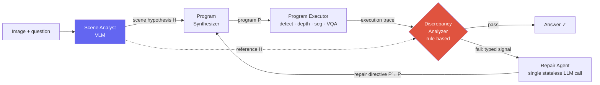

# Deep-Dive: Spatial-Reasoning Agent (Under Review)

NeurIPS 2026 (under review)visual program synthesis3D spatial reasoningagentic repairflagship / ongoing

> [!DANGER] Public, redacted version — work is under double-blind review
> This chapter is a public, **redacted** version of a submission **under review at NeurIPS 2026**. It retains only mechanisms and architecture already within the scope disclosed by the CV and removes the codename, exact benchmark figures, and identifiable model or benchmark names. In an interview, first state that it is under review and explain only what the public version and company or conference policy permit. An embargoed detail is not automatically safe to share merely because the interview is verbal.

> [!TIP] The 30-second pitch
> Visual program synthesis answers 3D spatial questions with programs that call detection, depth, segmentation, and VQA tools. The problem is that a tool can return an incorrect value without raising an exception and therefore **fail silently**. This submission studies an architecture that combines a pre-synthesis **structured scene hypothesis**, a per-call **execution trace**, **rule-based typed diagnosis** comparing the trace with the hypothesis, and **targeted repair** to turn silent failures into repairable events. Do not disclose comparison results, model names, or the exact protocol before they are public or policy permits it.

## The problem: open-loop program synthesis fails silently

Systems in the [ViperGPT/VisProg](#/vlm/visual-agents) lineage decompose a question into a program over perception operators, then execute it **open-loop** — the program never sees the image, and its perception calls are accepted with no verification. In 3D spatial questions, perception errors **amplify** rather than absorb: a single missed detection collapses a downstream geometric computation; an imprecise depth estimate inverts a spatial ordering.

Two failure modes therefore arise **silently** — both produce a confident, in-distribution answer that any plausibility check would wave through:

<dl class="kv">
<dt>False-negative perception</dt><dd>A call for a present object returns a sentinel (<code>None</code>, empty set); the program falls back to an in-distribution default ("no", 0.0) and propagates it. The sentinel <i>is</i> the signal — if you look for it.</dd>
<dt>Hypothesis violation</dt><dd>A call returns a confidently-typed but <b>scene-inconsistent</b> value — a box for an absent object, or a count that contradicts what a human sees. Indistinguishable from success <b>without an external reference</b> for what the scene should contain.</dd>
</dl>

Open-loop baselines can only retry on a Python exception, so neither silent mode is even detectable. **The two research questions:** (i) can visual programs recover from perception failures via *structured diagnosis* rather than blind retry? (ii) does producing a *structured scene hypothesis before synthesis* improve both program generation and repair?

## The architecture

The insight: a **per-question scene hypothesis** plus a **structured execution trace**, when crossed, localize a silent failure to a *specific operator* and emit a *typed diagnosis* routable to a repair directive.

**1 · Scene Analyst** — a single VLM pass inserted *before* code synthesis, producing a structured hypothesis $H$ with four blocks: an **object inventory** (each entity tagged with visibility, an expected count, a description, and a recommended detection query), a **counting prior**, a **depth ordering** (foreground→background), and a **draft answer** with evidence. Crucially $H$ is *question-conditional*, not image-global, and is **consumed programmatically** (as a reference for the analyzer), not rendered as a scene graph. The draft answer is a *fallback*, never short-circuited to — the program still computes its own answer and is checked against $H$.

**2 · Execution trace** — every perception call is wrapped to record `(operator, return_value, cache_status)`; the sequence is handed to the analyzer as JSON.

**3 · Discrepancy analyzer** — **pure Python, no LLM.** A plausibility gate first rejects sentinels (missing strings, empty collections, type-specific zeros). When the gate passes, a rule-based comparator crosses the trace against $H$ and emits one of four **typed signals**:

| Typed signal | Fires when… | Maps to failure class |
| --- | --- | --- |
| `visibility-miss` | analyst says object visible, localizer returns nothing | false-negative perception |
| `visibility-FP` | analyst says object absent, localizer returns boxes | hypothesis violation |
| `count-mismatch` | analyst's count prior ≠ localizer's detection count | hypothesis violation |
| `strategy-ignored` | program bypassed the analyst's recommended verification path | hypothesis violation |

The analyzer is deterministic for the same code, trace, and $H$ and requires **no additional model or API call**, but Python execution cost and rule-design errors remain. Because every execution is checked, the design aims to reduce additional model latency and cost relative to an LLM judge. Deterministic does not mean correct or hallucination-free.

**4 · Repair Agent** — a single, **freshly-prompted stateless** LLM call (not a conversation continuation — that would inherit the assumptions that caused the failure). Given the question, failing program, trace, typed report, and $H$, it returns a revised program tagged with one of three **typed directives**:

<dl class="kv">
<dt>Query rewrite</dt><dd>Substitute a synonym query (the localizer's effective vocabulary isn't exposed at synthesis time): <code>loc('locomotive')</code>→<code>loc('train')</code>. The most common directive.</dd>
<dt>Query decomposition</dt><dd>Split a compound attribute query the localizer can't parse into coarse localization + per-detection VQA: <code>loc('blue chair')</code> → <code>loc('chair')</code> + <code>vqa(box,'Is this blue?')</code>.</dd>
<dt>Logic-level edit</dt><dd>Rewrite program structure (loop bounds, branching, aggregation) when the failure is structural — e.g. the analyst recommended verifying spatial order but the program collapsed it into a single distance comparison. Rare, but the highest per-attempt recovery rate.</dd>
</dl>

The loop iterates to a small repair budget; a trace-aware cache keyed by `(operator, image, query)` means only the perception calls touched by the latest directive re-fire. If the budget exhausts, a **holistic fallback** makes a direct VLM call.

**5 · Mask-aware Spatial Perception API** — replaces two operators with mask-grounded variants (using segmentation masks the pipeline already produces):
- **Per-pixel 3D backprojection** instead of an axis-aligned image-plane box: backproject mask pixels through the camera intrinsics, compute $x_{3D}(u,v) = \frac{(u-c_x)\,d(u,v)}{f_x}$, and take a robust span. The submission describes this as a metric extent **more robust to view rotation** under the specified camera/world-coordinate convention; do not expand it into a universal claim of invariance to arbitrary 3D object orientation.
- **Mask-aggregated depth** (quartile-trimmed median over in-mask samples) instead of a center-pixel read (which lands on an occluder or background for non-convex/occluded objects).

## Evaluation framing (results redacted)

Evaluation axes safe to disclose — withhold comparative conclusions during review

- Compare open-loop program synthesis and end-to-end VLMs under a protocol that exposes the task, backbone, and sampling budget.
- Separate real 3D-spatial tasks from a synthetic diagnostic set to examine perception noise and diagnosis/repair behavior.
- Use a matched-backbone control to separate model substitution from architectural effects.
- Report component ablations for the Scene Analyst, Repair Agent, and Spatial API, plus failure slices such as counting.
- Before publication, treat even directional statements such as `better`, `parity`, or `strongest` as result information and withhold them.

Backbones are off-the-shelf: a mid-size code-synthesis LLM for the program/repair agents, a small open-source VLM as the Scene Analyst, and standard detection / depth / segmentation / VQA models for perception. (Exact model and benchmark names withheld while under review.)

## Ablations that test the claim

With the backbone fixed, a $2^3$ factorial over {Scene Analyst, Repair Agent, Spatial API} is the core design for testing each component and its interactions. It asks (1) whether diagnosis and action help only together, (2) whether the Spatial API's marginal effect depends on other components, and (3) where recovery per unit cost saturates as the repair budget grows. Discuss the observed direction and figures only after the submission is public or in settings where policy permits it, and do not claim that a factorial ablation proves a universal causal mechanism.

## Limitations — be the first to say them

The framework does **not** detect **confident-but-wrong** perception: a call that returns a plausible but incorrect value *with no scene-level inconsistency*. Without an external ground-truth reference these are indistinguishable from successes **by design**, which caps the achievable closure. Two structural reasons:

1. **The Scene Analyst is itself a VLM** and inherits some of the same biases as downstream perception. When analyst and localizer fail *concordantly*, the cross-check rule can't fire — violating the loop's load-bearing assumption that the two error sources are *independent*. Closing this needs an *independent* reference (e.g. multi-source scene priors from heterogeneous VLMs).
2. **Some 3D answers are unrecoverable from a single 2D view** (a cuboid's front face ≠ its true extent) — the *perception substrate*, not the diagnostic architecture, is the bottleneck.

Error analysis separates cases addressable by current repair actions, such as vocabulary mismatch, compound queries, and program-logic errors, from cases requiring a new independent signal, such as perception-capability bounds and concordant errors. Withhold the actual frequencies and which categories were judged `recoverable` until those results are public.

## Likely deep-dive Q&A

"Why not just prompt a bigger end-to-end VLM? It's simpler."

**Short:** The hypothesis is that traces and typed repair logs help localize and debug particular failures. Relative-performance conclusions against end-to-end models are withheld while the work is under review.

**Deep:** The hypothesis to test is whether an explicit reference and trace help on silent errors that pass a plausibility gate, rather than only on catastrophic errors. Predefine slices such as miscounts, inverted depth orderings, and missed objects, then compare end-to-end and program baselines at the same budget. Withhold which slices actually benefited while the results remain under review.

**Follow-up:** "So it's an interpretability tax that happens to pay off?" → the opposite: the structure is *what enables* the self-correction. Remove the deterministic diagnostic components and the system collapses back to the open-loop baseline.

"Why is the discrepancy analyzer rule-based Python instead of an LLM judge?"

**Short:** Because every program is checked, the design uses a reproducible comparator that needs no additional model call. Rules can still be wrong, but this avoids the extra latency, cost, and nondeterminism of an LLM judge.

**Deep:** The verifier deterministically compares a structured visual hypothesis $H$ with a per-call execution trace. Compare it with Reflexion/Self-Refine textual reflection, CRITIC/CodeT tool or test feedback, and scalar-reward repair along the axes of **feedback source, granularity, and repair locus**. Do not claim all prior work is exclusively scalar or free-form; describe the distinction of per-call typed visual diagnosis within the submission's search date and inclusion criteria.

**Follow-up:** "Isn't the rule set brittle / hand-tuned?" → a handful of rules, each tied to a concrete perception sub-class; the pilot taxonomy shows the recoverable envelope they cover and names exactly what falls outside (confident-but-wrong). It's a structural contract, deliberately not a learned judge.

"Your Scene Analyst is a VLM — doesn't that just move the hallucination problem?"

**Short:** partly, and I say so in the limitations. The loop's load-bearing assumption is that the analyst and the perception operators fail *independently*; when they fail *concordantly* the cross-check can't fire. That's the dominant residual failure mode.

**Deep:** The necessary controls vary Scene-Analyst capacity and consume only typed references while blocking the free-form draft. This separates value from a stronger oracle versus value from the structured interface. Do not disclose the actual accuracy changes while the results are under review. More independent references, such as heterogeneous multi-source priors, may help reduce concordant errors.

**Follow-up:** "How do you know the gain isn't just the analyst's draft answer leaking?" → the draft is a *fallback*, never short-circuited; the program computes its own answer and is checked against $H$, and the program-prompt rules explicitly forbid hardcoding the draft as the result.

"How is this different from open-loop program synthesis, ReAct, Reflexion, or CRITIC?"

**Short:** The submission focuses on comparing a structured visual hypothesis with a per-call trace at the **program–perception interface**, then routing typed signals to repair directives. Do not claim that no prior system uses any such element; state the search date and related-work scope of the submission.

**Deep (the design-space axes):** verifier source (external visual hypothesis vs text-judge/scalar/tool-tests), diagnosis granularity (per-call typed vs scalar pass/fail), repair locus (typed directive over the perception interface vs full free-form rewrite or tool re-selection), and op-chain localization (yes vs none). The open-loop program-synthesis predecessor is the direct baseline but has no per-operator failure typing.

"What's the single most convincing result, and what would falsify your claim?"

**Short:** The key test is the matched-backbone $2^3$ ablation. Examine whether differences among Scene-only, Repair-only, and the combined system—and their confidence intervals—support the closed-loop interpretation. Do not disclose the observed direction or magnitude before publication.

**Follow-up:** "Do results on a synthetic benchmark transfer to the real task?" → the synthetic set is a supporting evaluation that controls failures and isolates diagnosis; a real-world benchmark must be reported separately. Answer claims about actual transfer and where design decisions were made only within the disclosure rules for the protocol.

## Which JD signals this connects to

| JD signal | Evidence to connect |
| --- | --- |
| Multimodal agent / tool use | Program synthesis, execution traces, and targeted repair |
| Spatial / embodied reasoning | Accumulation of detection, depth, and segmentation errors plus 3D ambiguity |
| Reliable perception | Benefits and limitations of typed diagnosis and a deterministic comparator |
| Efficient adaptation | A design without task-specific training and its additional inference cost |

## Cross-links

- Topic background: [Visual Reasoning Agents](#/vlm/visual-agents) · [Agentic AI & Tool Use](#/llm/agents) · [Grounding & Region Reasoning](#/vlm/grounding)
- The umbrella narrative: [Grounded VLM / Agents (ongoing)](#/resume/grounded-vlm-agents)
- Interview framing: [Your CV → Interview Map](#/resume/overview) · [Predicted Questions](#/resume/predicted-questions)

> [!NOTE] What's safe to say, to whom
> Whether you may discuss the mechanism of under-review work in an interview depends on the conference's double-blind rules, coauthor agreement, employer or NDA obligations, and the interviewing company's policy. State first that it is under review, and explain only the approved public scope. Do not put the codename, figures, or an identifying combination in a public post or share the reviewer PDF. If the boundary is unclear, redirect to the public problem formulation and prior work.
