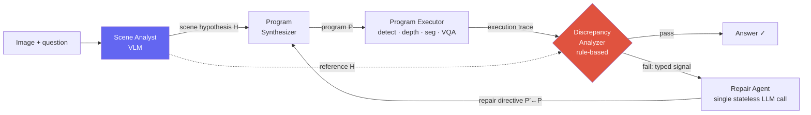

# Deep-Dive: Spatial-Reasoning Agent (NeurIPS'26)

NeurIPS 2026 (under review)visual program synthesis3D spatial reasoningagentic repairflagship / ongoing

> [!DANGER] Public, redacted version — work is under double-blind review
> This chapter is a **redacted** write-up of my NeurIPS'26 submission for the *public* site: the **mechanism and architecture** at roughly the level my CV already states, with the **codename, exact benchmark numbers, and specific model/benchmark names removed** while the paper is under double-blind review. The full private version (with numbers) lives offline in my prep notes. In interviews I discuss this at a technical level — "under review, happy to go deep on the method" — and keep embargoed specifics verbal, not posted.

> [!TIP] The 30-second pitch
> Visual program synthesis writes a small program that calls vision tools (detect, depth, segment, VQA) to answer a 3D spatial question. The problem: those tools **fail silently** — a logically correct program accepts a wrong detection, returns a plausible answer, and nobody can tell. My work is a *diagnostic architecture* that builds a **structured scene hypothesis** before writing code, records every perception call into a **semantic execution trace**, cross-checks the trace against the hypothesis with a **rule-based analyzer** that emits **typed diagnoses**, and hands those to a **Repair Agent** that fixes only the faulty program logic. It turns silent failures into *typed, repairable events* — substantially outperforming the strongest program-synthesis baseline and reaching **parity with frontier end-to-end VLMs without any task-specific training.**

## The problem: open-loop program synthesis fails silently

Systems in the [ViperGPT/VisProg](#/vlm/visual-agents) lineage decompose a question into a program over perception operators, then execute it **open-loop** — the program never sees the image, and its perception calls are accepted with no verification. In 3D spatial questions, perception errors **amplify** rather than absorb: a single missed detection collapses a downstream geometric computation; an imprecise depth estimate inverts a spatial ordering.

Two failure modes therefore arise **silently** — both produce a confident, in-distribution answer that any plausibility check would wave through:

<dl class="kv">
<dt>False-negative perception</dt><dd>A call for a present object returns a sentinel (<code>None</code>, empty set); the program falls back to an in-distribution default ("no", 0.0) and propagates it. The sentinel <i>is</i> the signal — if you look for it.</dd>
<dt>Hypothesis violation</dt><dd>A call returns a confidently-typed but <b>scene-inconsistent</b> value — a box for an absent object, or a count that contradicts what a human sees. Indistinguishable from success <b>without an external reference</b> for what the scene should contain.</dd>
</dl>

Open-loop baselines can only retry on a Python exception, so neither silent mode is even detectable. **The two research questions:** (i) can visual programs recover from perception failures via *structured diagnosis* rather than blind retry? (ii) does producing a *structured scene hypothesis before synthesis* improve both program generation and repair?

## The architecture

The insight: a **per-question scene hypothesis** plus a **structured execution trace**, when crossed, localize a silent failure to a *specific operator* and emit a *typed diagnosis* routable to a repair directive.

**1 · Scene Analyst** — a single VLM pass inserted *before* code synthesis, producing a structured hypothesis $H$ with four blocks: an **object inventory** (each entity tagged with visibility, an expected count, a description, and a recommended detection query), a **counting prior**, a **depth ordering** (foreground→background), and a **draft answer** with evidence. Crucially $H$ is *question-conditional*, not image-global, and is **consumed programmatically** (as a reference for the analyzer), not rendered as a scene graph. The draft answer is a *fallback*, never short-circuited to — the program still computes its own answer and is checked against $H$.

**2 · Execution trace** — every perception call is wrapped to record `(operator, return_value, cache_status)`; the sequence is handed to the analyzer as JSON.

**3 · Discrepancy analyzer** — **pure Python, no LLM.** A plausibility gate first rejects sentinels (missing strings, empty collections, type-specific zeros). When the gate passes, a rule-based comparator crosses the trace against $H$ and emits one of four **typed signals**:

| Typed signal | Fires when… | Maps to failure class |
| --- | --- | --- |
| `visibility-miss` | analyst says object visible, localizer returns nothing | false-negative perception |
| `visibility-FP` | analyst says object absent, localizer returns boxes | hypothesis violation |
| `count-mismatch` | analyst's count prior ≠ localizer's detection count | hypothesis violation |
| `strategy-ignored` | program bypassed the analyst's recommended verification path | hypothesis violation |

The analyzer is deterministic on the same (trace, $H$), adds **no API cost or latency**, and fires on *every* executed program. This is the load-bearing design choice — an LLM judge here would add hallucinations, latency, and per-question cost to a step that is otherwise free.

**4 · Repair Agent** — a single, **freshly-prompted stateless** LLM call (not a conversation continuation — that would inherit the assumptions that caused the failure). Given the question, failing program, trace, typed report, and $H$, it returns a revised program tagged with one of three **typed directives**:

<dl class="kv">
<dt>Query rewrite</dt><dd>Substitute a synonym query (the localizer's effective vocabulary isn't exposed at synthesis time): <code>loc('locomotive')</code>→<code>loc('train')</code>. The most common directive.</dd>
<dt>Query decomposition</dt><dd>Split a compound attribute query the localizer can't parse into coarse localization + per-detection VQA: <code>loc('blue chair')</code> → <code>loc('chair')</code> + <code>vqa(box,'Is this blue?')</code>.</dd>
<dt>Logic-level edit</dt><dd>Rewrite program structure (loop bounds, branching, aggregation) when the failure is structural — e.g. the analyst recommended verifying spatial order but the program collapsed it into a single distance comparison. Rare, but the highest per-attempt recovery rate.</dd>
</dl>

The loop iterates to a small repair budget; a trace-aware cache keyed by `(operator, image, query)` means only the perception calls touched by the latest directive re-fire. If the budget exhausts, a **holistic fallback** makes a direct VLM call.

**5 · Mask-aware Spatial Perception API** — replaces two operators with mask-grounded variants (using segmentation masks the pipeline already produces):
- **Per-pixel 3D backprojection** instead of an axis-aligned image-plane box: backproject every mask pixel through the camera intrinsics, $x_{3D}(u,v) = \frac{(u-c_x)\,d(u,v)}{f_x}$, and take the world-coordinate span → metric width/height that is **rotation-invariant** (an obliquely-viewed box overshoots both dimensions).
- **Mask-aggregated depth** (quartile-trimmed median over in-mask samples) instead of a center-pixel read (which lands on an occluder or background for non-convex/occluded objects).

## Results (redacted)

Qualitative summary — exact figures held private during review

- **Large gain over the strongest open-loop program-synthesis baseline** on a real-world 3D spatial-reasoning benchmark, and an even larger gain on a synthetic diagnostic benchmark (confirming the architecture transfers to a clean-perception regime).
- Most of the real-world gain is **architectural at a matched backbone**, not a model-substitution artifact.
- **Reaches parity with frontier end-to-end VLMs** while using a **small open-source** Scene Analyst and **no task-specific training**.
- **Strongest on counting**, precisely because the count-mismatch signal + repair fixes localizer miscounts that end-to-end VLMs and open-loop programs accept silently.

Backbones are off-the-shelf: a mid-size code-synthesis LLM for the program/repair agents, a small open-source VLM as the Scene Analyst, and standard detection / depth / segmentation / VQA models for perception. (Exact model and benchmark names withheld while under review.)

## The ablation that tells the story

A $2^3$ factorial over {Scene Analyst, Repair Agent, Spatial API}, backbones fixed, is the most defensible result. The point is **structural, not additive**: diagnosis (Scene Analyst) and action (Repair Agent) are **co-requisites** — each alone barely beats the baseline, but *together* they jump sharply, because *repair needs a reference to diagnose against, and a diagnosis is useless without a repair action.* The mask-aware Spatial API is then **super-additive** on top. The repair budget saturates after the first attempt; a slightly larger budget is a conservative default.

## Limitations — be the first to say them

The framework does **not** detect **confident-but-wrong** perception: a call that returns a plausible but incorrect value *with no scene-level inconsistency*. Without an external ground-truth reference these are indistinguishable from successes **by design**, which caps the achievable closure. Two structural reasons:

1. **The Scene Analyst is itself a VLM** and inherits some of the same biases as downstream perception. When analyst and localizer fail *concordantly*, the cross-check rule can't fire — violating the loop's load-bearing assumption that the two error sources are *independent*. Closing this needs an *independent* reference (e.g. multi-source scene priors from heterogeneous VLMs).
2. **Some 3D answers are unrecoverable from a single 2D view** (a cuboid's front face ≠ its true extent) — the *perception substrate*, not the diagnostic architecture, is the bottleneck.

A hand-labeled pilot of wrong cases decomposes into a *recoverable* half (vocabulary mismatch, compound query, analyst hallucination, program-logic error — addressable by extending the existing architecture) and an *irrecoverable* half (perception-capability-bound, or confident-but-wrong needing a *new* signal source like cross-modal or self-verification). Read it as a structural taxonomy, not precise shares.

## Likely deep-dive Q&A

"Why not just prompt a bigger end-to-end VLM? It's simpler."

**Short:** interpretability + a specific failure class. The system reaches parity with frontier VLMs using a small open backbone and no training, and every answer comes with an inspectable trace and a typed repair log — which matters for debugging deployed spatial-reasoning pipelines.

**Deep:** the more interesting answer is *where* the gain comes from. It is **not** concentrated on questions the baselines fail catastrophically — it's on cases where they fail **silently**, returning a confidently-typed in-distribution answer that any plausibility gate accepts (miscounts, inverted depth orderings, missed objects). A monolithic VLM has no place to *stand* to catch its own silent perception error; the program-plus-hypothesis structure creates an explicit reference against which a rule can fire. That's a structural argument, not a scale argument.

**Follow-up:** "So it's an interpretability tax that happens to pay off?" → the opposite: the structure is *what enables* the self-correction. Remove the deterministic diagnostic components and the system collapses back to the open-loop baseline.

"Why is the discrepancy analyzer rule-based Python instead of an LLM judge?"

**Short:** it fires on *every* executed program, so it must be free, deterministic, and hallucination-free. An LLM judge would add per-question cost, latency, and a second hallucination source to a step whose whole job is to be a trustworthy reference.

**Deep:** the verifier is a deterministic comparator between an *externally-produced structured visual hypothesis* $H$ and a *per-call execution trace* — not a text judge over the output, and not a scalar reward. That's the core distinction from the self-repair family: Reflexion/Self-Refine repair on textual self-reflection, CRITIC/CodeT on tool/test verdicts, RL agents on a scalar reward — all **scalar or free-form**, none **per-call typed**, and none grounded in an external visual reference. A scalar verdict can tell you *a program failed*; only a typed per-call signal can localize *which operator* failed and pick the matching directive.

**Follow-up:** "Isn't the rule set brittle / hand-tuned?" → a handful of rules, each tied to a concrete perception sub-class; the pilot taxonomy shows the recoverable envelope they cover and names exactly what falls outside (confident-but-wrong). It's a structural contract, deliberately not a learned judge.

"Your Scene Analyst is a VLM — doesn't that just move the hallucination problem?"

**Short:** partly, and I say so in the limitations. The loop's load-bearing assumption is that the analyst and the perception operators fail *independently*; when they fail *concordantly* the cross-check can't fire. That's the dominant residual failure mode.

**Deep:** the ablation defends it two ways. (i) Scene-Analyst capacity barely matters — swapping it across model sizes moves total accuracy negligibly — so the value is the *structured reference*, not a stronger oracle. (ii) The analyst is consumed *programmatically* as typed reference data (counting prior, visibility flags), not as a free-form answer, so a rough-but-structured hypothesis is enough to localize failures. The honest fix for concordant errors is an *independent* reference — heterogeneous multi-source priors — which is future work.

**Follow-up:** "How do you know the gain isn't just the analyst's draft answer leaking?" → the draft is a *fallback*, never short-circuited; the program computes its own answer and is checked against $H$, and the program-prompt rules explicitly forbid hardcoding the draft as the result.

"How is this different from open-loop program synthesis, ReAct, Reflexion, or CRITIC?"

**Short:** it closes the loop at the **program–perception interface** with an **external structured visual reference** emitting **per-call typed signals** routed to **typed directives**. No prior system occupies that cell — they close the loop at the tool-selection or output level with scalar/free-form feedback.

**Deep (the design-space axes):** verifier source (external visual hypothesis vs text-judge/scalar/tool-tests), diagnosis granularity (per-call typed vs scalar pass/fail), repair locus (typed directive over the perception interface vs full free-form rewrite or tool re-selection), and op-chain localization (yes vs none). The open-loop program-synthesis predecessor is the direct baseline but has no per-operator failure typing.

"What's the single most convincing result, and what would falsify your claim?"

**Short:** the $2^3$ ablation. Scene-only and Repair-only each barely beat the baseline, but *together* they jump sharply — proving the mechanism is the *closed diagnostic loop*, not either component. Falsifier: if a matched-backbone control showed the gain was just a stronger code-synthesis LLM, the architecture claim dies — so I report the matched-backbone control, where most of the gain survives.

**Follow-up:** "The synthetic benchmark is easy — is that gain real?" → it shows the architectural gain transfers to a clean-perception regime, isolating the reasoning/repair contribution from real-world perception noise; the real-world benchmark is the primary, harder one and all design choices were made there.

## Which JDs this connects to

| Company / team | Connection |
| --- | --- |
| Meta (VLM / agents) | agentic multimodal reasoning, tool-use, grounding language to visual evidence |
| Microsoft (AI Frontiers) | reasoning + inference-time compute, tool use, computer-use / action models |
| NVIDIA | spatial/embodied reasoning, perception modules as agent tools, robotics |
| Apple | efficient (small open backbone, no training), reliable perception |
| ByteDance / Adobe | visual program synthesis for editing/understanding pipelines |

## Cross-links

- Topic background: [Visual Reasoning Agents](#/vlm/visual-agents) · [Agentic AI & Tool Use](#/llm/agents) · [Grounding & Region Reasoning](#/vlm/grounding)
- The umbrella narrative: [Grounded VLM / Agents (ongoing)](#/resume/grounded-vlm-agents)
- Interview framing: [Your CV → Interview Map](#/resume/overview) · [Predicted Questions](#/resume/predicted-questions)

> [!NOTE] What's safe to say, to whom
> **In a technical interview / research deep-dive:** discussing your own under-review work at a mechanism level is normal and expected — frame it as "under review, happy to go deep." **Avoid** posting the codename + exact numbers anywhere a search engine ties them to your name during double-blind review, and don't share the reviewer PDF. The *mechanism* (typed diagnosis over a structured scene hypothesis) is the durable interview asset regardless — and it's all captured above. The full private write-up with figures lives in your offline prep notes.
