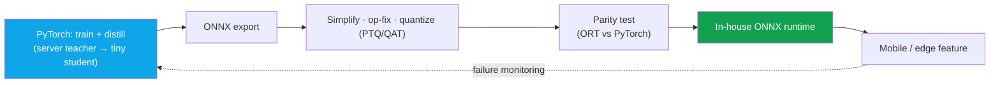

# Deep-Dive: On-Device Human Segmentation (~10ms, Mobile CPU)

on-devicemobile CPU~10msONNX servingdistillation · quantizationsolo project

> [!TIP] 30초 피치
> 나는 **mobile CPU**에서 **~10ms**로 도는 **human/portrait segmentation** 모델을 독자적으로 만들었고, 사내 **ONNX** serving 스택을 통해 배포했다. 10ms는 허영 숫자가 아니다 — camera I/O, pre/post-processing, 그리고 다른 on-device 모델을 빼고 나서도 실시간 (~30 fps) 경험을 매끄럽게 유지하는 frame-budget 임계값이다. 이 프로젝트는 ZIM의 반대편이다: **품질을 위한 클라우드 foundation model, 지연시간과 프라이버시를 위한 작은 on-device specialist.**

> [!NOTE] 기밀 내부사항
> 정확한 아키텍처, FLOPs, 데이터셋 규모, A/B 수치는 **기밀**이다. 아래 모든 내용은 엔지니어링 방법 + 일반 효율 지식이지 내부 수치가 아니다. Backing chapters: [Mixed Precision & Efficiency](#/foundations/mixed-precision-efficiency), [Segmentation](#/cv/segmentation).

## 배포 경로

## 10ms는 마법 숫자가 아니라 frame-budget 엔지니어링이다

<figure>
<svg viewBox="0 0 640 120" role="img" aria-label="33ms frame budget breakdown at 30fps" style="max-width:100%;height:auto;font-family:inherit">
  <text x="0" y="16" font-size="12" fill="currentColor" opacity="0.8">One 30 fps frame = 33 ms</text>
  <rect x="0" y="30" width="90"  height="34" fill="#0ea5e9" opacity="0.85"/><text x="45"  y="52" font-size="11" fill="#fff" text-anchor="middle">preproc 3–5</text>
  <rect x="92" y="30" width="150" height="34" fill="#e0533f"/><text x="167" y="52" font-size="11" fill="#fff" text-anchor="middle" font-weight="700">seg ~10ms</text>
  <rect x="244" y="30" width="70"  height="34" fill="#12a150" opacity="0.85"/><text x="279" y="52" font-size="11" fill="#fff" text-anchor="middle">post 2–3</text>
  <rect x="316" y="30" width="324" height="34" fill="currentColor" opacity="0.15"/><text x="478" y="52" font-size="11" fill="currentColor" text-anchor="middle">other models · UI · headroom</text>
  <line x1="0" y1="72" x2="640" y2="72" stroke="currentColor" opacity="0.3"/>
</svg>
<figcaption>예시용 budget일 뿐 (실제 숫자는 device/해상도 의존적). 15–20ms에서는 segmenter 혼자 나머지 frame을 굶기고 frame을 떨군다.</figcaption>
</figure>

60 fps를 노리면 budget이 반으로 줄기 때문에, 특정 숫자보다 그 규율이 더 중요하다. 재사용 가능한 문장: *"나는 모델을 leaderboard가 아니라 frame budget에 맞춰 사이징했다."*

## 압축 레버 (내가 당길 순서대로)

| Lever | What it buys | Watch out for |
| --- | --- | --- |
| **Input resolution** | 단일 최대 이득 | boundary가 먼저 뭉개짐 |
| **Width / channel prune** | 선형에 가까운 speedup | 어려운 pose에서 capacity 바닥 |
| **Decoder simplification** | 싼 upsampling, skip 감소 | 미세 디테일 (머리카락/손가락) |
| **Depthwise-separable conv** | MobileNet 식 FLOP 절감 | 타겟 runtime의 op 지원 |
| **Knowledge distillation** | 축소로 잃은 품질 회복 | 강한 soft teacher 필요 |
| **Quantization (PTQ → QAT)** | INT8 지연시간/메모리 | 먼저 하면 boundary collapse |
| **Operator fusion** | Conv-BN-ReLU 병합 | runtime 특화 |

내가 소리 내어 말할 rule of thumb: **resolution → width → decoder → distill → *quantize last*.** distill하기 전에 quantize하면 boundary가 먼저 죽는 경향이 있다.

## 예상 deep-dive Q&A

왜 GPU/NPU가 아니라 mobile CPU인가?

**Short:** CPU는 worst-case 공통분모다 — 최대 device 도달, op-support 파편화 없음.

**Deep:** NPU는 빠르지만 파편화되어 있다 (op 커버리지, quantization 제약이 칩마다 다름); GPU는 항상 가용하거나 자유롭게 쓸 수 있지도 않다. CPU를 노린다는 것은 feature가 모든 곳에 배포된다는 뜻이다. 또한 accelerator에 기대는 대신 진짜로 효율적인 설계를 강제한다. 이력서는 의도적으로 mobile CPU라고 적었다.

distillation을 어떻게 썼나?

**Short:** server-grade human-seg/matte **teacher**가 boundary-weighted 및 feature-level loss로 soft mask를 써서 작은 **student**를 supervise한다.

**Deep:** *matting* teacher가 특히 유용한 이유는 soft label이 hard mask가 버리는 boundary 정보를 담기 때문이다 — student가 binary GT만으로 배울 수 있는 것보다 더 선명한 머리카락/edge를 배운다. 이는 조직적으로 ZIM/FG-API 품질 작업과 인접하지만, 같은 weight라고 주장하진 않겠다 — 별개의, distill된 모델이다.

작고 boundary에 민감한 모델의 quantization 함정?

**Short:** PTQ는 빠르지만 작은 모델의 boundary를 collapse시킬 수 있다; QAT는 비싸지만 안정적이다; calibration set은 제품 도메인을 대표해야 한다.

**Deep:** activation-distribution outlier, skip connection, op 호환성 (ONNX 하의 sigmoid/Hardswish)을 주시하라. calibration set이 제품 대표성이 없으면 INT8 오차가 정확히 어려운 머리카락/edge 픽셀에 몰린다 — 사용자가 알아채는 바로 그것. 그래서 QAT + 도메인 매칭 calibration set, 그리고 distillation 후에 quantize.

어떤 ONNX export 이슈에 물렸나? (일반)

| Problem | Fix |
| --- | --- |
| Unsupported op | 재작성, opset 올리기, 또는 custom plugin |
| Dynamic shape | 입력 해상도 고정 또는 명시화 |
| Numeric mismatch | mask에 대한 ORT-vs-PyTorch **parity test** |
| Perf regression | Graph optimize, IO binding, thread tuning |
| Preprocess drift | mean/std normalization을 runtime과 공유 |

출시 근처에서 가장 자주 무는 것은 unsupported/edge 동작 op가 막판 graph 재작성을 강제하는 경우다.

왜 SAM/ZIM을 on-device로 안 돌리나?

ViT-B foundation model은 10ms mobile-CPU budget에서 몇 자릿수 어긋나 있다 (ZIM은 V100에서 ~180ms급). Foundation은 **서버 / 툴링**에 속하고; on-device는 **특화된 작은 closed-set** 모델을 원한다. 어느 쪽의 한계가 아니라 의도적인 역할 분담이다.

### Hard follow-ups

품질 손실 없이 지연시간을 절반으로. 구체적으로 어떻게?

순서대로: 입력 해상도를 낮추고 teacher의 soft boundary가 살아남도록 re-distill; width를 줄이고 decoder를 단순화; *그다음* INT8로 QAT. 각 단계 후 **hard set** (교차된 팔다리, 시스루 의류, 극단 조명, 다인)에서 품질을 re-ablate하고, device에서 측정하기 전에 ONNX graph를 parity-test. 피해야 할 실패 모드는 먼저 quantize하는 것 — distillation으로 보호하기 전에 boundary가 죽는다.

"tight budget 하에서 robust" — 여기서 robust가 실제로 무슨 뜻인가?

순진하게 압축하면 쉬운 샘플에서만 좋은 모델이 된다. 나는 hard-example mining, distillation, 제품 도메인 데이터, failure monitoring으로 **품질 바닥**을 유지한다 — 그래서 FLOPs↓를 품질↓와 동의어로 취급하지 않는다. Robustness = 평균이 아니라 p95 hard case가 acceptable하게 유지되는 것.

Mobile CPU vs "ONNX serving" — 어느 쪽인가?

둘 다, 깔끔히 분리해서: **모델**은 mobile-CPU budget에 맞춰 설계되고 측정되며; **serving 인프라**는 사내 ONNX runtime이다. 나는 warmup, 고정 해상도 입력, p50/p95, 그리고 (device에서는) 고정 CPU affinity로 지연시간을 측정한다 — training-GPU ms를 배포 지연시간과 절대 혼동하지 않는다. 정직한 숫자는 cold single-shot이 아니라 지속 (thermal-throttled) 지연시간이다.

## 솔직한 한계

- **Closed-set (human/portrait):** open-vocabulary는 budget을 날려버린다; 제품 KPI가 이 좁힘을 정당화한다.
- **Single-pass 고정 해상도:** multi-scale/refine은 어려운 boundary에 도움이 되지만 10ms를 깬다.
- **무거운 post-processing (CRF)은 mobile에서 너무 비싸다;** 가벼운 morphology / guided-filter만 맞는다.
- **Temporal smoothing (video)**은 비용을 더하며 공짜가 아니다.

## 어떤 JD와 연결되나

| Company | Connection |
| --- | --- |
| Apple | On-device intelligence, distillation, 프라이버시 |
| Meta | 효율적 multimodal 배포 |
| NVIDIA | 효율적 inference (TensorRT/ONNX) 마인드셋 |
| Adobe | Mobile creative tool |

## Cheat-sheet

| Item | Value |
| --- | --- |
| Task | On-device human/portrait segmentation, mobile CPU |
| Latency | **~10ms** (~30 fps용 frame-budget 임계값) |
| Stack | PyTorch → **ONNX** → 사내 runtime |
| Lever order | resolution → width → decoder → **distill** → quantize (last) |
| Measure | warmup, 고정 res, p50/p95, 지속 (thermal) 지연시간 |
| Narrative | 클라우드 foundation (품질) + on-device specialist (지연시간/프라이버시) |
| Confidential | 아키텍처, FLOPs, 데이터 규모, A/B 수치 |

## Cross-links
- Topical: [Mixed Precision & Efficiency](#/foundations/mixed-precision-efficiency) · [Segmentation](#/cv/segmentation) · [Image Matting](#/cv/matting)
- Deep-dives: [ZIM](#/resume/zim) · [FaceSign](#/resume/facesign) · back to the [CV → Interview Map](#/resume/overview)
