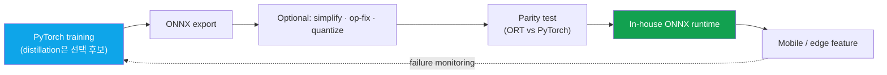

# Deep-Dive: On-Device Human Segmentation (~10ms, Mobile CPU)

on-devicemobile CPU~10msONNX servingefficiency toolboxindependent development: resume-verified

> [!TIP] 30초 피치
> 이력서는 본인이 human-segmentation model을 **독자적으로 개발**했고, mobile CPU에서 약 **10 ms**를 달성했으며, 사내 **ONNX 기반 serving**으로 배포했다고 명시합니다. 이 세 사실은 답변의 강한 첫 문장으로 사용하세요. 이어 측정 device·입력 크기·runtime·thread·warm-up·latency statistic과 협업 interface를 실제 기록으로 보강해 숫자와 ownership의 정확한 범위를 보여줍니다.

> [!NOTE] 기밀 내부사항
> 정확한 architecture·FLOPs·dataset scale·A/B 수치는 이력서에 없습니다. 공개 승인을 확인하기 전에는 비공개로 취급하세요. 아래 내용은 엔지니어링 방법과 일반 효율 지식이지, 실제 내부 수치나 사용 기법을 복원한 것이 아닙니다. Backing chapters: [Mixed Precision & Efficiency](#/foundations/mixed-precision-efficiency), [Segmentation](#/cv/segmentation).

> [!IMPORTANT] 이력서 사실과 준비용 가설을 분리하세요
> 확인 가능한 핵심은 `독자적 model 개발 · human segmentation · mobile CPU · 약 10 ms · ONNX-based in-house serving`입니다. 아래 distillation·quantization·hard-example mining·CPU affinity·p99/p95·pipeline 순서는 <strong>일반적인 설계 후보</strong>이며 실제 사용 사실이 아닙니다. 구체적인 설계 선택은 본인의 실험·배포 기록으로 확인된 항목만 1인칭 답변에 넣으세요.

## 배포 경로

위 그림은 실제 내부 pipeline의 재현이 아니라 인터뷰에서 검토할 <strong>deployment checklist</strong>입니다.

## 10ms는 마법 숫자가 아니라 frame-budget 엔지니어링이다

<figure>
<svg viewBox="0 0 640 120" role="img" aria-label="33ms frame budget breakdown at 30fps" style="max-width:100%;height:auto;font-family:inherit">
  <text x="0" y="16" font-size="12" fill="currentColor" opacity="0.8">One 30 fps frame = 33 ms</text>
  <rect x="0" y="30" width="90"  height="34" fill="#0ea5e9" opacity="0.85"/><text x="45"  y="52" font-size="11" fill="#fff" text-anchor="middle">preproc 3–5</text>
  <rect x="92" y="30" width="150" height="34" fill="#e0533f"/><text x="167" y="52" font-size="11" fill="#fff" text-anchor="middle" font-weight="700">seg ~10ms</text>
  <rect x="244" y="30" width="70"  height="34" fill="#12a150" opacity="0.85"/><text x="279" y="52" font-size="11" fill="#fff" text-anchor="middle">post 2–3</text>
  <rect x="316" y="30" width="324" height="34" fill="currentColor" opacity="0.15"/><text x="478" y="52" font-size="11" fill="currentColor" text-anchor="middle">other models · UI · headroom</text>
  <line x1="0" y1="72" x2="640" y2="72" stroke="currentColor" opacity="0.3"/>
</svg>
<figcaption>예시용 30 fps budget. 실제 지연은 device·해상도·thread·thermal state에 의존하며, segmenter가 15–20 ms를 쓰면 다른 stage의 headroom을 줄일 수 있습니다.</figcaption>
</figure>

60 fps를 노리면 budget이 반으로 줄기 때문에, 특정 숫자보다 그 규율이 더 중요합니다. 답변 뼈대는 *"요구된 frame budget에 맞춰 quality–latency Pareto를 설계했다"*이며, 실제 요구사항과 본인의 의사결정 기록이 있을 때만 1인칭으로 사용하세요.

## 압축 레버 (검토 순서 예시)

| Lever | What it buys | Watch out for |
| --- | --- | --- |
| **Input resolution** | 단일 최대 이득 | boundary가 먼저 뭉개짐 |
| **Width / channel prune** | 선형에 가까운 speedup | 어려운 pose에서 capacity 바닥 |
| **Decoder simplification** | 싼 upsampling, skip 감소 | 미세 디테일 (머리카락/손가락) |
| **Depthwise-separable conv** | MobileNet 식 FLOP 절감 | 타겟 runtime의 op 지원 |
| **Knowledge distillation** | 축소로 잃은 품질 회복 | 강한 soft teacher 필요 |
| **Quantization (PTQ → QAT)** | INT8 지연시간/메모리 | 먼저 하면 boundary collapse |
| **Operator fusion** | Conv-BN-ReLU 병합 | runtime 특화 |

준비용 heuristic은 <strong>resolution → width → decoder → 필요하면 distill → target runtime을 확인한 뒤 quantize</strong>입니다. 실제 최적 순서는 hardware·operator support·quality floor에 따라 달라지며, PTQ를 먼저 시도해 calibration만으로 충분한지도 측정합니다.

## 예상 deep-dive Q&A

왜 GPU/NPU가 아니라 mobile CPU인가?

**Short:** CPU는 worst-case 공통분모다 — 최대 device 도달, op-support 파편화 없음.

**Deep:** NPU/GPU는 device마다 operator·quantization 지원이 다르고 CPU는 비교적 넓게 이용 가능하지만, CPU target이라고 모든 device 배포가 자동 보장되지는 않습니다. 실제 target device matrix와 fallback 요구를 확인해 CPU를 선택한 이유를 설명합니다.

distillation을 실제로 썼다면 어떻게 설명할까?

**Short:** 실제 training log로 확인됐을 때만 teacher·student, target과 loss를 설명합니다. 확인되지 않았다면 "가능한 품질 회복 수단이지만 이 프로젝트에서 사용했다고 주장하지 않겠습니다"라고 답합니다.

**Deep:** 일반적으로 matting/segmentation teacher의 soft target은 hard mask가 버리는 boundary 정보를 전달할 수 있습니다. 다만 teacher 종류, boundary-weighted·feature loss, ZIM/FG-API와의 관계는 증거가 있을 때만 이 프로젝트의 방법으로 말합니다.

작고 boundary에 민감한 모델의 quantization 함정?

**Short:** PTQ는 빠르지만 작은 모델의 boundary를 collapse시킬 수 있다; QAT는 비싸지만 안정적이다; calibration set은 제품 도메인을 대표해야 한다.

**Deep:** activation-distribution outlier, skip connection, op 호환성 (ONNX 하의 sigmoid/Hardswish)을 주시하라. calibration set이 제품 대표성이 없으면 INT8 오차가 정확히 어려운 머리카락/edge 픽셀에 몰린다 — 사용자가 알아채는 바로 그것. 그래서 QAT + 도메인 매칭 calibration set, 그리고 distillation 후에 quantize.

어떤 ONNX export 이슈에 물렸나? (일반)

| Problem | Fix |
| --- | --- |
| Unsupported op | 재작성, opset 올리기, 또는 custom plugin |
| Dynamic shape | 입력 해상도 고정 또는 명시화 |
| Numeric mismatch | mask에 대한 ORT-vs-PyTorch **parity test** |
| Perf regression | Graph optimize, IO binding, thread tuning |
| Preprocess drift | mean/std normalization을 runtime과 공유 |

이 표는 일반적인 ONNX failure mode입니다. 실제 프로젝트에서 어떤 문제가 있었고 누가 해결했는지는 기록으로 확인해 별도로 답합니다.

왜 SAM/ZIM을 on-device로 안 돌리나?

ViT-B foundation model은 10ms mobile-CPU budget에서 몇 자릿수 어긋나 있다 (ZIM은 V100에서 ~180ms급). Foundation은 <strong>서버 / 툴링</strong>에 속하고; on-device는 **특화된 작은 closed-set** 모델을 원한다. 어느 쪽의 한계가 아니라 의도적인 역할 분담이다.

### Hard follow-ups

품질 손실 없이 지연시간을 절반으로. 구체적으로 어떻게?

먼저 latency profile로 병목이 model compute인지 pre/post-processing인지 확인합니다. 모델이 병목이면 resolution·width·decoder를 한 번에 하나씩 줄이고, 실제 사용 가능하다면 distillation이나 quantization을 비교합니다. 각 단계에서 hard slice와 target device latency를 재측정하고 ONNX parity를 검사합니다. 품질 무손실은 보장할 수 없으므로 허용 가능한 quality floor를 먼저 합의합니다.

"tight budget 하에서 robust" — 여기서 robust가 실제로 무슨 뜻인가?

평균 metric만 유지해도 어려운 사례가 악화될 수 있습니다. 일반적으로 hard-slice evaluation, domain-matched data, failure monitoring을 사용해 quality floor를 봅니다. hard-example mining이나 distillation을 실제로 썼는지, `p95`가 어떤 분포의 percentile인지 확인한 뒤에만 1인칭으로 말합니다.

Mobile CPU vs "ONNX serving" — 어느 쪽인가?

두 표현은 서로 다른 층입니다. <strong>모델 목표</strong>는 mobile-CPU latency이고, <strong>deployment/runtime</strong>은 이력서에 적힌 사내 ONNX stack입니다. 방어 가능한 latency에는 device, input, runtime, thread, warm-up, sample 수와 statistic이 필요합니다. CPU affinity나 sustained thermal test를 실제로 사용했다면 덧붙이고, training-GPU 시간과 target-device 시간을 섞지 않습니다.

## 확인할 설계 가정과 한계

- **Closed-set (human/portrait):** open-vocabulary는 budget을 날려버린다; 제품 KPI가 이 좁힘을 정당화한다.
- **Single-pass 고정 해상도:** multi-scale/refine은 어려운 boundary에 도움이 되지만 10ms를 깬다.
- **무거운 post-processing (CRF)은 mobile에서 너무 비싸다;** 가벼운 morphology / guided-filter만 맞는다.
- <strong>Temporal smoothing (video)</strong>은 비용을 더하며 공짜가 아니다.

## 어떤 JD signal과 연결되는가

| JD signal | 연결할 근거 |
| --- | --- |
| On-device / mobile inference | 약 10 ms mobile-CPU 주장과 측정 protocol |
| Runtime optimization | ONNX export·parity·operator-support checklist |
| Efficient perception | quality floor와 latency trade-off |
| Privacy-sensitive processing | on-device가 줄일 수 있는 data transfer; 실제 privacy 보장은 system 전체에서 검증 |

## Cheat-sheet

| Item | Value |
| --- | --- |
| Task | On-device human/portrait segmentation, mobile CPU |
| Latency | **~10ms** (~30 fps용 frame-budget 임계값) |
| Stack | PyTorch → **ONNX** → 사내 runtime |
| Lever order | 준비용 후보: profile → resolution/width/decoder → distill/quantize를 각각 검증 |
| Measure | device·input·runtime·thread·warm-up·sample 수·statistic을 명시 |
| Narrative | 클라우드 foundation (품질) + on-device specialist (지연시간/프라이버시) |
| Confidential | 아키텍처, FLOPs, 데이터 규모, A/B 수치 |

## Cross-links
- Topical: [Mixed Precision & Efficiency](#/foundations/mixed-precision-efficiency) · [Segmentation](#/cv/segmentation) · [Image Matting](#/cv/matting)
- Deep-dives: [ZIM](#/resume/zim) · [FaceSign](#/resume/facesign) · back to the [CV → Interview Map](#/resume/overview)
