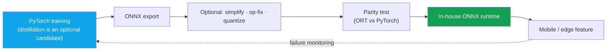

# Deep-Dive: On-Device Human Segmentation (~10ms, Mobile CPU)

on-devicemobile CPU~10msONNX servingefficiency toolboxindependent development: resume-verified

> [!TIP] 30-second pitch
> The resume explicitly says that you **independently developed** a human-segmentation model, achieved about **10 ms on a mobile CPU**, and deployed it through **ONNX-based in-house serving**. Use those three facts as a strong opening sentence. Then support the number and the exact ownership boundary with the actual device, input size, runtime, thread configuration, warm-up, latency statistic, and collaborator interfaces.

> [!NOTE] Confidential internals
> Exact architecture, FLOPs, dataset scale, and A/B figures do not appear in the resume. Treat them as non-public until disclosure approval is confirmed. Everything below is engineering method and general efficiency knowledge, not a reconstruction of internal figures or techniques. Backing chapters: [Mixed Precision & Efficiency](#/foundations/mixed-precision-efficiency), [Segmentation](#/cv/segmentation).

> [!IMPORTANT] Separate resume facts from preparation hypotheses
> The verifiable core is `independent model development · human segmentation · mobile CPU · about 10 ms · ONNX-based in-house serving`. The distillation, quantization, hard-example mining, CPU affinity, p99/p95, and pipeline order below are <strong>general design candidates</strong>, not facts about what this project used. Put a specific design choice into a first-person answer only when your experiment and deployment records confirm it.

## Deployment path

The diagram is a <strong>deployment checklist</strong> to review in an interview, not a reconstruction of the actual internal pipeline.

## The 10ms is frame-budget engineering, not a magic number

<figure>
<svg viewBox="0 0 640 120" role="img" aria-label="33ms frame budget breakdown at 30fps" style="max-width:100%;height:auto;font-family:inherit">
  <text x="0" y="16" font-size="12" fill="currentColor" opacity="0.8">One 30 fps frame = 33 ms</text>
  <rect x="0" y="30" width="90"  height="34" fill="#0ea5e9" opacity="0.85"/><text x="45"  y="52" font-size="11" fill="#fff" text-anchor="middle">preproc 3–5</text>
  <rect x="92" y="30" width="150" height="34" fill="#e0533f"/><text x="167" y="52" font-size="11" fill="#fff" text-anchor="middle" font-weight="700">seg ~10ms</text>
  <rect x="244" y="30" width="70"  height="34" fill="#12a150" opacity="0.85"/><text x="279" y="52" font-size="11" fill="#fff" text-anchor="middle">post 2–3</text>
  <rect x="316" y="30" width="324" height="34" fill="currentColor" opacity="0.15"/><text x="478" y="52" font-size="11" fill="currentColor" text-anchor="middle">other models · UI · headroom</text>
  <line x1="0" y1="72" x2="640" y2="72" stroke="currentColor" opacity="0.3"/>
</svg>
<figcaption>An illustrative 30 fps budget. Actual latency depends on device, resolution, threads, and thermal state; if the segmenter uses 15–20 ms, it may reduce the headroom available to other stages.</figcaption>
</figure>

At 60 fps the budget halves, so the discipline matters more than the specific figure. A useful answer spine is *“I designed the quality–latency Pareto around the required frame budget,”* but use it in the first person only when the real requirement and your decision record support it.

## Compression levers — an example review order

| Lever | What it buys | Watch out for |
| --- | --- | --- |
| **Input resolution** | Biggest single win | Boundary softens first |
| **Width / channel prune** | Linear-ish speedup | Capacity floor on hard poses |
| **Decoder simplification** | Cheap upsampling, fewer skips | Fine detail (hair/fingers) |
| **Depthwise-separable conv** | MobileNet-style FLOP cut | Op support on target runtime |
| **Knowledge distillation** | Recover quality lost to shrinking | Needs a strong soft teacher |
| **Quantization (PTQ → QAT)** | INT8 latency/memory | Boundary collapse if done first |
| **Operator fusion** | Conv-BN-ReLU merges | Runtime-specific |

A preparation heuristic is <strong>resolution → width → decoder → distill if needed → quantize after checking the target runtime</strong>. The best order depends on hardware, operator support, and the quality floor; also measure whether calibration alone makes PTQ sufficient before moving further.

## Predicted deep-dive Q&A

Why mobile CPU and not GPU/NPU?

**Short:** CPU is the worst-case common denominator — maximum device reach, no op-support fragmentation.

**Deep:** Operator and quantization support for NPUs/GPUs varies by device, while CPUs are available more broadly, but a CPU target does not automatically guarantee deployment on every device. Verify the actual target-device matrix and fallback requirements when explaining why CPU was chosen.

If you actually used distillation, how should you explain it?

**Short:** Describe the teacher, student, targets, and losses only if training logs confirm them. Otherwise say, “It is a possible way to recover quality, but I will not claim that this project used it.”

**Deep:** In general, soft targets from a matting or segmentation teacher can carry boundary information that a hard mask discards. But describe the teacher type, boundary-weighted or feature losses, and any relationship to ZIM or the foreground API as methods used in this project only when evidence supports them.

Quantization pitfalls for a small boundary-sensitive model?

**Short:** PTQ is fast but can collapse tiny models at the boundary; QAT is costlier but stable; calibration set must represent the product domain.

**Deep:** Watch activation-distribution outliers, skip connections, and op compatibility (sigmoid/Hardswish under ONNX). If the calibration set isn't product-representative, INT8 error concentrates exactly on hard hair/edge pixels — the thing users notice. So QAT + a domain-matched calibration set, and quantize after distillation.

What ONNX export issues bit you? (general)

| Problem | Fix |
| --- | --- |
| Unsupported op | Rewrite, raise opset, or custom plugin |
| Dynamic shape | Fix input resolution or make it explicit |
| Numeric mismatch | ORT-vs-PyTorch **parity test** on masks |
| Perf regression | Graph optimize, IO binding, thread tuning |
| Preprocess drift | Share mean/std normalization with runtime |

This table lists general ONNX failure modes. Verify from records which issue actually occurred in the project and who resolved it before answering in the first person.

Why not run SAM/ZIM on-device?

A ViT-B foundation model is orders of magnitude off a 10ms mobile-CPU budget (ZIM is ~180ms-class on a V100). Foundations belong on the **server / in tooling**; on-device wants a **specialized tiny closed-set** model. It's a deliberate role split, not a limitation of either.

### Hard follow-ups

Cut latency in half without losing quality. Concretely, how?

First profile latency to determine whether the bottleneck is model compute or pre/post-processing. If the model is the bottleneck, reduce resolution, width, and decoder complexity one at a time, then compare distillation or quantization if they are actually available. Re-measure hard slices and target-device latency at each step, and check ONNX parity. Because zero quality loss cannot be guaranteed, agree on an acceptable quality floor first.

"Robust under tight budget" — what does robust actually mean here?

Preserving an average metric can still hide regressions on hard cases. In general, use hard-slice evaluation, domain-matched data, and failure monitoring to examine a **quality floor**. Say in the first person that you used hard-example mining or distillation, or that a `p95` statistic describes a particular distribution, only after verifying those facts.

Mobile CPU vs "ONNX serving" — which is it?

The two phrases refer to different layers. The <strong>model target</strong> is mobile-CPU latency, while the <strong>deployment/runtime</strong> is the in-house ONNX stack named on the resume. A defensible latency number needs the device, input, runtime, thread configuration, warm-up, sample count, and statistic. Add CPU affinity or a sustained thermal test only if you actually used it, and never mix training-GPU time with target-device time.

## Design assumptions and limitations to verify

- **Closed-set (human/portrait):** open-vocabulary would blow the budget; product KPI justifies the narrowing.
- **Single-pass fixed resolution:** multi-scale/refine would help hard boundaries but breaks 10ms.
- **Heavy post-processing (CRF) is too expensive on mobile;** only light morphology / guided-filter fits.
- <strong>Temporal smoothing (video)</strong> adds cost and isn't free.

## Which JD signals this connects to

| JD signal | Evidence to connect |
| --- | --- |
| On-device / mobile inference | The about-10-ms mobile-CPU claim and its measurement protocol |
| Runtime optimization | ONNX export, parity, and operator-support checklist |
| Efficient perception | Quality-floor and latency trade-off |
| Privacy-sensitive processing | Data transfer that on-device processing may reduce; verify actual privacy guarantees across the whole system |

## Cheat-sheet

| Item | Value |
| --- | --- |
| Task | On-device human/portrait segmentation, mobile CPU |
| Latency | **~10ms** (frame-budget threshold for ~30 fps) |
| Stack | PyTorch → **ONNX** → in-house runtime |
| Lever order | Preparation candidates: profile → resolution/width/decoder → validate distillation/quantization separately |
| Measure | State device, input, runtime, threads, warm-up, sample count, and statistic |
| Narrative | cloud foundation (quality) + on-device specialist (latency/privacy) |
| Confidential | architecture, FLOPs, data scale, A/B numbers |

## Cross-links
- Topical: [Mixed Precision & Efficiency](#/foundations/mixed-precision-efficiency) · [Segmentation](#/cv/segmentation) · [Image Matting](#/cv/matting)
- Deep-dives: [ZIM](#/resume/zim) · [FaceSign](#/resume/facesign) · back to the [CV → Interview Map](#/resume/overview)
