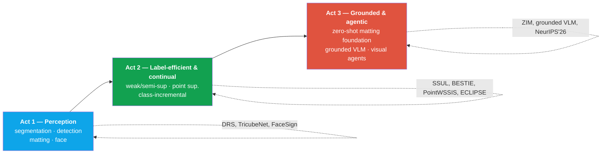

# CV → 인터뷰 맵

deep-dive roundresearch narrativeperception → groundingNAVER Cloud · KAIST

> [!TIP] 이 파트의 목적
> **research deep-dive round**에서 면접관은 CV의 한 줄을 골라 바닥이 드러날 때까지 파고듭니다. *"왜 이 설계인가? 무엇이 이걸 깨뜨리나? 솔직한 한계는 무엇인가?"* 이 페이지는 라우터입니다. 각 CV 줄이 어떤 질문을 부르는지, 그 질문을 리허설하는 deep-dive 챕터가 무엇인지, 그리고 교과서적 근거를 제공하는 주제별 챕터가 무엇인지 연결해 줍니다. 논문 하나하나가 아니라 흐름(arc)을 리허설하세요. 일관된 이야기 하나가 어떤 개별 수치보다도 값집니다.

## 한 문장 스토리

당신은 **정확하면서도 배포 가능한 perception**을 만들고, 그것을 **검증 가능하고(grounded) 근거 있는 multimodal reasoning** 쪽으로 밀어붙입니다. 구체적으로는 segmentation/detection/matting → label-efficient하고 continual하게 → 이제는 grounded VLM과 visual reasoning agent 아래에 놓이는 perception *tool layer*로. 모든 연구 아이디어에는 production 반향이 있습니다(FaceSign, on-device seg, foreground-seg API, CLOVA-X).

## 연구 서사 arc

소리 내어 말할 관통선(through-line): *"저는 계속 '어떻게 하면 더 적은 비용으로 정확한 픽셀/영역을 얻을까 — 더 적은 label, 더 적은 compute, 더 적은 retraining으로'를 물었고, 그것이 저를 supervised mask에서 weak/continual signal로, promptable foundation으로, 그리고 이제는 **자신의 perception이 언제 틀렸는지 알아야 하는** agent로 이끌었습니다."*

## 프로젝트 타임라인

<figure>
<svg viewBox="0 0 760 250" role="img" aria-label="Timeline of publications and products 2021-2026" style="max-width:100%;height:auto;font-family:inherit">
  <line x1="40" y1="130" x2="720" y2="130" stroke="currentColor" stroke-width="1.5" opacity="0.4"/>
  <!-- year ticks -->
  <g fill="currentColor" font-size="12" text-anchor="middle" opacity="0.75">
    <text x="70" y="150">2021</text>
    <text x="200" y="150">2022</text>
    <text x="330" y="150">2023</text>
    <text x="460" y="150">2024</text>
    <text x="590" y="150">2025</text>
    <text x="700" y="150">2026</text>
  </g>
  <!-- research (above line) -->
  <g font-size="11" text-anchor="middle">
    <circle cx="70"  cy="130" r="5" fill="#0ea5e9"/><text x="70"  y="112" fill="#0ea5e9">DRS · SSUL</text>
    <circle cx="200" cy="130" r="5" fill="#12a150"/><text x="200" y="112" fill="#12a150">BESTIE</text>
    <circle cx="200" cy="130" r="5" fill="#12a150"/><text x="200" y="96"  fill="#0ea5e9">TricubeNet</text>
    <circle cx="330" cy="130" r="5" fill="#12a150"/><text x="330" y="112" fill="#12a150">PointWSSIS</text>
    <circle cx="460" cy="130" r="5" fill="#12a150"/><text x="460" y="112" fill="#12a150">ECLIPSE</text>
    <circle cx="460" cy="130" r="5" fill="#12a150"/><text x="460" y="96"  fill="#0ea5e9">EResFD · WSSHM</text>
    <circle cx="590" cy="130" r="6" fill="#e0533f"/><text x="590" y="110" fill="#e0533f" font-weight="700">ZIM ★Highlight</text>
    <circle cx="700" cy="130" r="5" fill="#e0533f"/><text x="700" y="112" fill="#e0533f">ECCV'26</text>
    <text x="700" y="96" fill="#e0533f">NeurIPS'26*</text>
  </g>
  <!-- products (below line) -->
  <g font-size="11" text-anchor="middle" fill="#6366f1">
    <rect x="120" y="170" width="120" height="20" rx="4" fill="#6366f1" opacity="0.15"/><text x="180" y="184">FaceSign (gov-certified)</text>
    <rect x="300" y="196" width="150" height="20" rx="4" fill="#6366f1" opacity="0.15"/><text x="375" y="210">On-device seg · FG-seg API</text>
    <rect x="520" y="170" width="150" height="20" rx="4" fill="#6366f1" opacity="0.15"/><text x="595" y="184">CLOVA-X Image Editing</text>
  </g>
  <text x="40" y="30" font-size="12" font-weight="700" fill="#0ea5e9">● perception</text>
  <text x="180" y="30" font-size="12" font-weight="700" fill="#12a150">● label-efficient/continual</text>
  <text x="430" y="30" font-size="12" font-weight="700" fill="#e0533f">● grounded/agentic</text>
  <text x="620" y="30" font-size="12" font-weight="700" fill="#6366f1">▬ products</text>
</svg>
<figcaption>선 위쪽은 논문, 아래쪽은 제품화된 시스템. *NeurIPS 2026은 심사 중 — accept를 사실처럼 말하지 말 것.</figcaption>
</figure>

## CV 줄 → 부르는 질문 → 복습할 것

| CV line | 무엇을 파고들까 | Deep-dive | 주제별 근거 |
| --- | --- | --- | --- |
| **ZIM** — zero-shot matting foundation, ICCV'25 Highlight | 왜 SAM이 matting에서 실패하는지; data engine(SGA/STL); decoder + masked attention; MicroMat-3K; 왜 *Highlight*인지 | [ZIM](#/resume/zim) | [Matting](#/cv/matting), [Foundation Models](#/cv/foundation-models) |
| **ECLIPSE** — continual panoptic, VPT | 왜 panoptic continual이 어려운지; freeze + prompts vs KD/replay; logit manipulation; plasticity gap | [ECLIPSE](#/resume/eclipse) | [Continual Learning](#/cv/continual-learning) |
| **PointWSSIS / BESTIE** — point & weakly-sup instance seg | proposal bottleneck; point vs image-level; MaskRefineNet; semantic drift; budget–AP Pareto | [PointWSSIS & BESTIE](#/resume/pointwssis-bestie) | [Weak & Semi-Supervised](#/cv/weak-semi-supervised) |
| **DRS / SSUL** (이전) | saliency-guided WSSS; unknown-label class-incremental seg | [PointWSSIS & BESTIE](#/resume/pointwssis-bestie), [ECLIPSE](#/resume/eclipse) | [Weak & Semi-Supervised](#/cv/weak-semi-supervised), [Continual Learning](#/cv/continual-learning) |
| **FaceSign** — gov-certified face anti-spoofing | threat model(print/replay/3D mask/injection); APCER/BPCER; RGB vs depth; compliance 제약 | [FaceSign](#/resume/facesign) | [Detection](#/cv/detection) |
| **On-device human seg** — ~10ms, mobile CPU, ONNX | frame budgeting; distillation; quantization; ONNX export 함정; quality floor | [On-Device Seg](#/resume/on-device-segmentation) | [Efficiency](#/foundations/mixed-precision-efficiency), [Segmentation](#/cv/segmentation) |
| **Foreground-seg API** — Photoroom/Remove.bg/Adobe를 이김 | data curation; boundary quality; eval framing(내부, 대외비) | [ZIM](#/resume/zim), [On-Device Seg](#/resume/on-device-segmentation) | [Matting](#/cv/matting) |
| **Grounded Multimodal AI** *(진행 중)* | 왜 grounding인지; verifiability vs hallucination; region query | [Grounded VLM/Agents](#/resume/grounded-vlm-agents) | [Grounding & Region Reasoning](#/vlm/grounding), [VLM Pretraining](#/vlm/pretraining) |
| **Visual Reasoning Agents** *(진행 중, NeurIPS'26)* | training-free program synthesis; silent failure → typed diagnosis → repair; 3D spatial | [Grounded VLM/Agents](#/resume/grounded-vlm-agents) | [Visual Agents](#/vlm/visual-agents), [Agentic AI](#/llm/agents) |
| **EResFD / TricubeNet** (공동/1저자) | lightweight face detection; kernel-based oriented detection | [FaceSign](#/resume/facesign) | [Detection](#/cv/detection) |

## 면접장에서 쓰는 법

Do

<b>30초 pitch</b>로 열고, 그다음은 면접관이 방향을 잡게 두세요. 그들이 찾아내기 전에 <b>한계</b>를 먼저 꺼내세요 — 성숙함으로 읽힙니다. 프로젝트마다 중요한 <b>3개의 숫자</b>로 주장을 고정하세요. 가능하면 research → product를 연결하세요.

Don't

abstract를 낭독하지 마세요. 내부 지표를 지어내지 마세요(FaceSign, on-device, FG-API는 <b>대외비</b> — 수치가 아니라 framing을 설명하세요). 진행 중인 NeurIPS'26 논문을 accept됐다고 주장하지 마세요. 두 제품이 실제로는 아닌데 하나의 모델을 공유한다고 과장하지 마세요.

## Deep-dive 모음

  <a class="card" href="#/resume/zim">
✂️

ZIM

Zero-shot image matting foundation. SAM → data engine + hierarchical decoder로 soft mask. ICCV'25 Highlight.
</a>
  <a class="card" href="#/resume/eclipse">
🌗

ECLIPSE

Visual prompt tuning으로 하는 continual panoptic segmentation. Distillation-free, ~1.3% trainable params.
</a>
  <a class="card" href="#/resume/pointwssis-bestie">
📍

PointWSSIS & BESTIE

Point 및 image-level supervised instance segmentation. proposal bottleneck 공략.
</a>
  <a class="card" href="#/resume/facesign">
🛡️

FaceSign

Production에서 정부 인증된 face anti-spoofing. Threat model과 compliance framing.
</a>
  <a class="card" href="#/resume/on-device-segmentation">
⚡

On-Device Seg

ONNX로 ~10ms mobile-CPU human segmentation. Frame-budget 엔지니어링.
</a>
  <a class="card" href="#/resume/grounded-vlm-agents">
🧭

Grounded VLM & Agents

진행 중: 검증 가능한 grounding + 자신의 failure를 진단하는 training-free visual reasoning agent.
</a>
  <a class="card" href="#/resume/neurips26-spatial-reasoning">
🔺

Spatial-Reasoning Agent (NeurIPS'26)

심사 중: 3D spatial reasoning을 위한 typed diagnosis + program repair. Task-specific training 없이 frontier VLM에 필적.
</a>

## Cheat-sheet — 핵심 팩트

| Fact | Value |
| --- | --- |
| Publications / citations / h-index | 14+ · 572 · 9 *(검증 가능, CV 기준)* |
| First-author top-tier papers | 7 (CVPR·ICCV·ECCV·NeurIPS) |
| Signature honor | ICCV 2025 **Highlight** (ZIM, 상위 ~3%) |
| Affiliation | Applied Scientist, NAVER Cloud (5+ yrs) · Ph.D. candidate, KAIST MLAI (Sung Ju Hwang) |
| Prior advisor (M.S.) | Prof. Junmo Kim, KAIST SIIT |
| Arc | perception → label-efficient/continual → grounded VLM/visual agents |
| Golden rule | 공개된 사실만; 내부 지표는 대외비; 진행 중인 작업은 framing으로 판다 |

## Cross-links
- 홈그라운드: [Segmentation](#/cv/segmentation) · [Object Detection](#/cv/detection) · [Image Matting](#/cv/matting)
- 효율 & label: [Weak & Semi-Supervised](#/cv/weak-semi-supervised) · [Continual Learning](#/cv/continual-learning) · [Mixed Precision & Efficiency](#/foundations/mixed-precision-efficiency)
- Frontier: [Grounding & Region Reasoning](#/vlm/grounding) · [Visual Reasoning Agents](#/vlm/visual-agents) · [Agentic AI & Tool Use](#/llm/agents)
