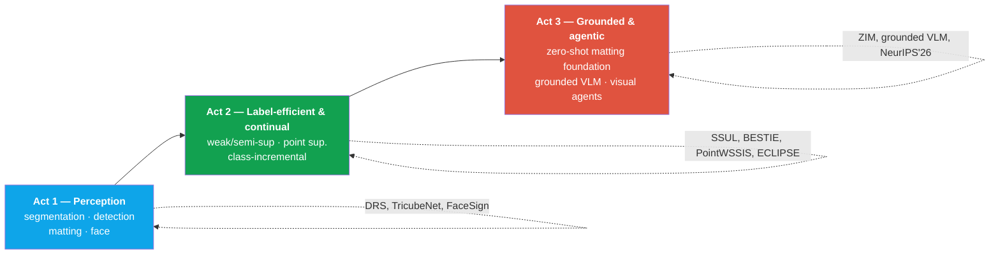

# Your CV → Interview Map

deep-dive roundresearch narrativeperception → groundingNAVER Cloud · KAIST

> [!TIP] What this part is for
> In the **research deep-dive round**, interviewers pick lines off your CV and drill until they hit bedrock: *"Why this design? What breaks it? What's the honest limitation?"* This page is the router. Each CV line maps to the questions it invites, the deep-dive chapter that rehearses them, and the topical chapter that supplies the textbook backing. Rehearse the arc, not just the papers — a coherent story is worth more than any single number.

## The one-sentence story

You build **perception that is accurate *and* deployable**, then push it toward **verifiable, grounded multimodal reasoning**. Concretely: segmentation/detection/matting → made label-efficient and continual → now the perceptual *tool layer* under grounded VLMs and visual reasoning agents. Every research idea has a production echo (FaceSign, on-device seg, the foreground-seg API, CLOVA-X).

## Research narrative arc

The through-line to say out loud: *"I kept asking how to get correct pixels/regions for less — less label, less compute, less retraining — and that pushed me from supervised masks, to weak/continual signals, to promptable foundations, and now to agents that must **know when their perception is wrong**."*

## Project timeline

<figure>
<svg viewBox="0 0 760 250" role="img" aria-label="Timeline of publications and products 2021-2026" style="max-width:100%;height:auto;font-family:inherit">
  <line x1="40" y1="130" x2="720" y2="130" stroke="currentColor" stroke-width="1.5" opacity="0.4"/>
  <!-- year ticks -->
  <g fill="currentColor" font-size="12" text-anchor="middle" opacity="0.75">
    <text x="70" y="150">2021</text>
    <text x="200" y="150">2022</text>
    <text x="330" y="150">2023</text>
    <text x="460" y="150">2024</text>
    <text x="590" y="150">2025</text>
    <text x="700" y="150">2026</text>
  </g>
  <!-- research (above line) -->
  <g font-size="11" text-anchor="middle">
    <circle cx="70"  cy="130" r="5" fill="#0ea5e9"/><text x="70"  y="112" fill="#0ea5e9">DRS · SSUL</text>
    <circle cx="200" cy="130" r="5" fill="#12a150"/><text x="200" y="112" fill="#12a150">BESTIE</text>
    <circle cx="200" cy="130" r="5" fill="#12a150"/><text x="200" y="96"  fill="#0ea5e9">TricubeNet</text>
    <circle cx="330" cy="130" r="5" fill="#12a150"/><text x="330" y="112" fill="#12a150">PointWSSIS</text>
    <circle cx="460" cy="130" r="5" fill="#12a150"/><text x="460" y="112" fill="#12a150">ECLIPSE</text>
    <circle cx="460" cy="130" r="5" fill="#12a150"/><text x="460" y="96"  fill="#0ea5e9">EResFD · WSSHM</text>
    <circle cx="590" cy="130" r="6" fill="#e0533f"/><text x="590" y="110" fill="#e0533f" font-weight="700">ZIM ★Highlight</text>
    <circle cx="700" cy="130" r="5" fill="#e0533f"/><text x="700" y="112" fill="#e0533f">ECCV'26</text>
    <text x="700" y="96" fill="#e0533f">NeurIPS'26*</text>
  </g>
  <!-- products (below line) -->
  <g font-size="11" text-anchor="middle" fill="#6366f1">
    <rect x="120" y="170" width="120" height="20" rx="4" fill="#6366f1" opacity="0.15"/><text x="180" y="184">FaceSign (gov-certified)</text>
    <rect x="300" y="196" width="150" height="20" rx="4" fill="#6366f1" opacity="0.15"/><text x="375" y="210">On-device seg · FG-seg API</text>
    <rect x="520" y="170" width="150" height="20" rx="4" fill="#6366f1" opacity="0.15"/><text x="595" y="184">CLOVA-X Image Editing</text>
  </g>
  <text x="40" y="30" font-size="12" font-weight="700" fill="#0ea5e9">● perception</text>
  <text x="180" y="30" font-size="12" font-weight="700" fill="#12a150">● label-efficient/continual</text>
  <text x="430" y="30" font-size="12" font-weight="700" fill="#e0533f">● grounded/agentic</text>
  <text x="620" y="30" font-size="12" font-weight="700" fill="#6366f1">▬ products</text>
</svg>
<figcaption>Publications above the line, productionized systems below. *NeurIPS 2026 is under review — never state acceptance as fact.</figcaption>
</figure>

## CV line → questions it invites → what to review

| CV line | What they'll drill | Deep-dive | Topical backing |
| --- | --- | --- | --- |
| **ZIM** — zero-shot matting foundation, ICCV'25 Highlight | Why SAM fails at matting; data engine (SGA/STL); decoder + masked attention; MicroMat-3K; why it's a *Highlight* | [ZIM](#/resume/zim) | [Matting](#/cv/matting), [Foundation Models](#/cv/foundation-models) |
| **ECLIPSE** — continual panoptic, VPT | Why panoptic continual is hard; freeze + prompts vs KD/replay; logit manipulation; plasticity gap | [ECLIPSE](#/resume/eclipse) | [Continual Learning](#/cv/continual-learning) |
| **PointWSSIS / BESTIE** — point & weakly-sup instance seg | Proposal bottleneck; point vs image-level; MaskRefineNet; semantic drift; budget–AP Pareto | [PointWSSIS & BESTIE](#/resume/pointwssis-bestie) | [Weak & Semi-Supervised](#/cv/weak-semi-supervised) |
| **DRS / SSUL** (earlier) | Saliency-guided WSSS; unknown-label class-incremental seg | [PointWSSIS & BESTIE](#/resume/pointwssis-bestie), [ECLIPSE](#/resume/eclipse) | [Weak & Semi-Supervised](#/cv/weak-semi-supervised), [Continual Learning](#/cv/continual-learning) |
| **FaceSign** — gov-certified face anti-spoofing | Threat model (print/replay/3D mask/injection); APCER/BPCER; RGB vs depth; compliance constraints | [FaceSign](#/resume/facesign) | [Detection](#/cv/detection) |
| **On-device human seg** — ~10ms, mobile CPU, ONNX | Frame budgeting; distillation; quantization; ONNX export pitfalls; quality floor | [On-Device Seg](#/resume/on-device-segmentation) | [Efficiency](#/foundations/mixed-precision-efficiency), [Segmentation](#/cv/segmentation) |
| **Foreground-seg API** — beats Photoroom/Remove.bg/Adobe | Data curation; boundary quality; eval framing (internal, confidential) | [ZIM](#/resume/zim), [On-Device Seg](#/resume/on-device-segmentation) | [Matting](#/cv/matting) |
| **Grounded Multimodal AI** *(ongoing)* | Why grounding; verifiability vs hallucination; region queries | [Grounded VLM/Agents](#/resume/grounded-vlm-agents) | [Grounding & Region Reasoning](#/vlm/grounding), [VLM Pretraining](#/vlm/pretraining) |
| **Visual Reasoning Agents** *(ongoing, NeurIPS'26)* | Training-free program synthesis; silent failure → typed diagnosis → repair; 3D spatial | [Grounded VLM/Agents](#/resume/grounded-vlm-agents) | [Visual Agents](#/vlm/visual-agents), [Agentic AI](#/llm/agents) |
| **EResFD / TricubeNet** (co/first-author) | Lightweight face detection; kernel-based oriented detection | [FaceSign](#/resume/facesign) | [Detection](#/cv/detection) |

## How to use this in the room

Do

Open with the <b>30-second pitch</b>, then let them steer. Volunteer the <b>limitation</b> before they find it — it reads as maturity. Anchor claims with the <b>3 numbers</b> that matter per project. Connect research → product when you can.

Don't

Recite the abstract. Fabricate internal metrics (FaceSign, on-device, FG-API are <b>confidential</b> — describe framing, not figures). Claim the ongoing NeurIPS'26 paper is accepted. Over-claim that two products share one model when they don't.

## The deep-dives

  <a class="card" href="#/resume/zim">
✂️

ZIM

Zero-shot image matting foundation. SAM → soft masks via a data engine + hierarchical decoder. ICCV'25 Highlight.
</a>
  <a class="card" href="#/resume/eclipse">
🌗

ECLIPSE

Continual panoptic segmentation with visual prompt tuning. Distillation-free, ~1.3% trainable params.
</a>
  <a class="card" href="#/resume/pointwssis-bestie">
📍

PointWSSIS & BESTIE

Point- and image-level supervised instance segmentation. Attacking the proposal bottleneck.
</a>
  <a class="card" href="#/resume/facesign">
🛡️

FaceSign

Government-certified face anti-spoofing in production. Threat models & compliance framing.
</a>
  <a class="card" href="#/resume/on-device-segmentation">
⚡

On-Device Seg

~10ms mobile-CPU human segmentation via ONNX. Frame-budget engineering.
</a>
  <a class="card" href="#/resume/grounded-vlm-agents">
🧭

Grounded VLM & Agents

Ongoing: verifiable grounding + training-free visual reasoning agents that diagnose their own failures.
</a>

## Cheat-sheet — headline facts

| Fact | Value |
| --- | --- |
| Publications / citations / h-index | 14+ · 572 · 9 *(verifiable, as of CV)* |
| First-author top-tier papers | 7 (CVPR·ICCV·ECCV·NeurIPS) |
| Signature honor | ICCV 2025 **Highlight** (ZIM, top ~3%) |
| Affiliation | Applied Scientist, NAVER Cloud (5+ yrs) · Ph.D. candidate, KAIST MLAI (Sung Ju Hwang) |
| Prior advisor (M.S.) | Prof. Junmo Kim, KAIST SIIT |
| Arc | perception → label-efficient/continual → grounded VLM/visual agents |
| Golden rule | Public facts only; internal metrics are confidential; ongoing work sells on framing |

## Cross-links
- Home turf: [Segmentation](#/cv/segmentation) · [Object Detection](#/cv/detection) · [Image Matting](#/cv/matting)
- Efficiency & label: [Weak & Semi-Supervised](#/cv/weak-semi-supervised) · [Continual Learning](#/cv/continual-learning) · [Mixed Precision & Efficiency](#/foundations/mixed-precision-efficiency)
- Frontier: [Grounding & Region Reasoning](#/vlm/grounding) · [Visual Reasoning Agents](#/vlm/visual-agents) · [Agentic AI & Tool Use](#/llm/agents)
