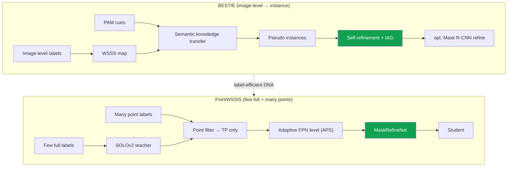

# Deep-Dive: PointWSSIS & BESTIE — Label-Efficient Instance Segmentation

CVPR 2023 · CVPR 2022weakly / semi-supervisedpoint supervisioninstance segfirst author

> [!TIP] 30초 피치
> instance segmentation의 annotation 비용을 **proposal 병목을 공략**해서 줄인 두 편의 1저자 CVPR 논문. **BESTIE** (CVPR 2022)는 image-level (WSSS) 지식을 instance로 전이하고, self-refinement로 *semantic drift*를 잡는다 — off-the-shelf proposal 없이. **PointWSSIS** (CVPR 2023)는 **weakly-semi (소수 full + 다수 point) 세팅**을 제안하고 proposal의 false-negative/false-positive 병목을 직접 제거해서, 마스크는 극히 일부만 쓰면서 near-fully-supervised AP에 도달한다. 둘은 하나의 싸움이다: **레이블에 덜 쓰면서 pseudo-label noise를 통제하기.**

**Public references:** BESTIE [arXiv 2109.09477](https://arxiv.org/abs/2109.09477) / [code](https://github.com/clovaai/BESTIE); PointWSSIS [arXiv 2303.15062](https://arxiv.org/abs/2303.15062) / [code](https://github.com/clovaai/PointWSSIS). Backing chapter: [Weak & Semi-Supervised](#/cv/weak-semi-supervised).

## proposal이 왜 병목인가

거의 모든 instance segmenter는 **proposal → mask** 구조다 (box, point, 또는 query 다음에 mask head). proposal 단계가 객체를 놓치면 (false negative), mask head가 아무리 좋아도 **그 instance를 낼 수 없다.** 더 많이 잡으려고 confidence threshold를 낮추면 false positive가 쏟아진다. semi-supervised instance seg (SSIS)에서 pseudo-label은 정확히 이 FN↔FP 트레이드오프 위에 놓인다. 두 논문 모두 이 과제를 *"mask head를 개선한다"*가 아니라 *"올바른 proposal을 싸게 얻은 뒤 refine한다"*로 재정의한다.

## BESTIE (CVPR 2022) — weak label 하에서 semantic → instance

**문제.** 이전 WSIS는 high-level pretrained **proposal** (MCG, salient-instance segmenter)에 의존했는데, 이는 순수 image-level 전제를 위반하고 도메인 간 전이가 나쁘다. 그리고 pseudo-label로 순진하게 학습하면 *놓친* instance가 background로 가서 → **semantic drift** (같은 클래스가 FG와 BG 양쪽으로 학습됨).

**방법.**
<dl class="kv">
<dt>Semantic Knowledge Transfer</dt><dd>WSSS map과 instance cue를 결합하고, connected-component 후보를 취해서, 단일 cue를 갖는 영역을 instance pseudo-label로 삼는다.</dd>
<dt>PAM (Peak Attention Module)</dt><dd>CAM의 noisy한 multi-peak activation 대신, <b>진짜 peak는 증폭하고 noise는 억제</b>해서 깨끗한 instance cue를 뽑는다 — DRS의 suppression과 의도적으로 반대 방향 (prequel 참고).</dd>
<dt>Representation</dt><dd>Panoptic-DeepLab 스타일의 <b>center heatmap + offset</b> + semantic head.</dd>
<dt>Instance-Aware Guidance (IAG)</dt><dd>center/offset loss를 <b>레이블된 instance 영역에만</b> 적용해서, 레이블 없는/놓친 객체가 background로 끌려가지 않게 한다.</dd>
<dt>Self-refinement</dt><dd>네트워크 자신의 출력을 <b>online</b> (mini-batch 단위)으로 grouping해서 refine된 레이블로 만들고, soft weight와 함께 되먹인다 — offline iteration 없이 FN→TP를 촉진.</dd>
</dl>
선택적으로 Mask R-CNN refinement 단계. **결과:** VOC mAP50 **51.0%** (MRCNN refine 포함); image-level에서 COCO AP50 ~28.0%; point cue로 바꾸면 더 오른다.

## PointWSSIS (CVPR 2023) — weakly-semi 세팅

**세팅 — WSSIS:** **소수의 fully-labeled** 이미지 + **다수의 point-labeled** 이미지 (instance당 point 하나, centroid *또는* mask 내 랜덤 — 어느 쪽이든 방법이 robust하다).

**방법 (teacher → filter → refine → student).**
<dl class="kv">
<dt>1. Teacher</dt><dd>소수의 full label로 SOLOv2 teacher를 학습.</dd>
<dt>2. Point-guided proposal filtering</dt><dd>point를 써서 <b>true-positive</b> proposal만 남긴다 — point가 <i>어디</i>인지 알려주므로 FN/FP 딜레마가 사라진다.</dd>
<dt>3. Adaptive Pyramid-Level Selection (APS)</dt><dd>point는 크기 정보가 없으므로, 여러 level에 걸쳐 <b>confidence argmax</b>로 FPN level을 고른다; GT-size oracle과의 격차는 작다.</dd>
<dt>4. MaskRefineNet</dt><dd>입력 = concat(image crop, rough teacher mask, point Gaussian heatmap) → refined mask. 세 입력 모두 필요하다 (ablation); rough mask가 없으면 수렴하지 않는다. full label이 극소량 (1–5%)일 때 핵심 모듈.</dd>
<dt>5. Student</dt><dd>full + 고품질 pseudo-label로 재학습.</dd>
</dl>
**결과:** COCO **50%** full → **38.8 AP** ≈ fully-supervised 39.7; COCO **5%** full → **33.7** vs SSIS baseline 24.9. BDD100K에서 full 7k를 고정하고 point를 20k→67k로 늘리면 AP 22.1→27.9. budget–AP Pareto에서 box-only weak supervision과 SSIS를 능가한다.

## 표 하나로 비교

| | BESTIE | PointWSSIS |
| --- | --- | --- |
| Labels | image-level (또는 point cue) | few full + many points |
| Core bottleneck | instance cue / semantic drift | proposal FN/FP |
| Key modules | PAM + SKT + IAG + self-refine | point filter + APS + MaskRefineNet |
| Base model | Panoptic-DeepLab-style | SOLOv2 |
| Benchmarks | VOC / COCO WSIS | COCO / BDD WSSIS |

## DRS — the prequel (AAAI 2021)

> [!NOTE] suppression → peak-attention 흐름
> **DRS** (*Discriminative Region Suppression for Weakly-Supervised Semantic Segmentation*, [arXiv 2103.07246](https://arxiv.org/abs/2103.07246), [code](https://github.com/qjadud1994/DRS))가 이 계보의 뿌리다. CAM은 가장 discriminative한 부분에만 반응하는데, DRS는 그 지배적 영역을 **억제**해서 activation이 객체 전체로 *퍼지게* 만든다 → 더 나은 semantic pseudo-mask. BESTIE의 **PAM**은 의도적으로 반대 동작 — peak를 *증폭* — 이다. *instance* cue에서는 diffuse한 커버리지가 아니라 뾰족하고 잘 분리된 seed를 원하기 때문이다. 둘을 함께 이야기하면 *언제 activation을 퍼뜨리고 언제 뾰족하게 만들지*를 이해하고 있음을 보여주는데, 이는 진짜로 세련된 포인트다.

## 예상 deep-dive Q&A

왜 point가 image-level label보다, 이렇게 적은 추가 비용으로, 훨씬 나은가?

**Short:** point는 *위치*를 더해주고, 이것이 true-positive proposal을 선택하게 해준다; image-level은 잘못 분류된 것을 거부하게만 해준다.

**Deep:** point 하나의 annotation 비용은 image-level보다 겨우 몇 초 더 든다 (문헌 추정치는 둘 다 box/mask보다 훨씬 낮다). 하지만 그 위치 신호가 FN/FP proposal 딜레마를 깨끗한 선택으로 바꾼다: point가 들어간 proposal을 남기면 된다. 이것이 비용 격차는 미미한데도 AP 격차 (예: COCO 5%: 33.7 vs 24.9)가 큰 이유다.

왜 MaskRefineNet은 세 입력이 모두 필요한가?

**Short:** image = appearance; rough mask = teacher prior (빼면 학습이 수렴하지 않음); point heatmap = 겹치는 instance를 구분하고 타겟을 고정.

**Deep:** full-label 예산이 극소량이면 teacher mask가 rough하므로, refiner는 appearance를 써서 그것을 *교정*하되 의도한 instance에 계속 anchor되어 있어야 한다. ablation은 보고된 pseudo-label 품질에 도달하려면 셋 다 필요함을 보여준다; point heatmap은 rough mask가 뭉개버리는 맞닿은 instance를 분리하는 역할을 한다.

BESTIE의 semantic drift란 무엇이고 어떻게 막는가?

**Short:** 놓친 instance는 background로 학습되고 시각적으로 동일한 instance는 foreground로 학습됨 → 모순된 supervision. IAG는 center/offset loss를 레이블된 영역으로 제한하고; self-refinement는 FN→TP를 촉진한다.

**Deep:** 이 모순은 클래스가 비슷하게 보이는 바로 그 지점에서 center/offset heatmap을 오염시킨다. Instance-Aware Guidance는 loss를 마스킹해서 레이블 없는 객체가 "background"를 가르치지 않게 하고, online self-refinement는 학습이 진행되며 그것들을 positive로 다시 캐낸다 — 값비싼 offline loop 없이 회복한다.

그냥 off-the-shelf proposal generator를 쓰면 안 되나?

순수 image-level 전제를 깨고, 새 도메인 (예: medical)으로 전이가 나쁘며, 비교를 불공정하게 만든다 (강력한 pretrained segmenter를 들여오는 셈). BESTIE는 IRN 계열 baseline과의 비교가 apples-to-apples가 되도록 MCG/salient proposal을 의도적으로 피한다.

### Hard follow-ups

이건 SOLOv2 / Panoptic-DeepLab을 쓴다 — Mask2Former 시대에는 낡은 아이디어 아닌가?

**기여는 backbone이 아니라 레시피다**: "싼 point로 true-positive proposal/query를 선택한 뒤 refine한다." 이는 query-based detector/segmenter로 바로 이식된다 — point가 query를 선택하거나 seed할 수 있고, refine head는 극소량 label 예산에서 여전히 도움이 된다. 나는 이를 전이 가능한 방법론으로 프레이밍한다.

point label이 비싸지면 이득이 사라지나?

주장은 "point가 공짜다"가 아니라 **budget–AP Pareto** 승리다: 5% full + 다수 point가 비슷하거나 더 낮은 annotation 예산에서 box-only와 SSIS를 이긴다. 나는 가정 (문헌상 label당 초 단위 비용)을 명시하고, 어떤 단일 절대 비용이 아니라 Pareto frontier 위에서 논증한다.

둘 중 어느 쪽을 발표하겠고, 왜?

**제품/데이터 효율** 청중에게는 PointWSSIS (5% 마스크로 near-full AP). **weak-supervision/이론** 청중에게는 BESTIE (drift, cue 추출). 무엇보다도: **그 흐름 자체**를 발표하기 — 둘 다 병목을 재정의하고 (proposal vs cue) pseudo-label noise를 통제해서 이긴다는 점이 재사용 가능한 아이디어다.

## 솔직한 한계

- **BESTIE:** 심한 occlusion이 true-positive pseudo-label을 제한한다 (COCO의 crowd); ceiling은 WSSS 품질에 묶여 있다 (GT semantic이면 ~+7.6 mAP50 추가).
- **PointWSSIS:** 여전히 *일부* point가 필요하다 — 순수 unlabeled web-scale 확장은 future work.
- 둘 다 query-based universal segmenter보다 앞선 시기다; 전이는 논증되었을 뿐 benchmark로 검증되진 않았다.

## 어떤 JD와 연결되나

| Company | Connection |
| --- | --- |
| Apple / Meta | weak/cheap 신호로 하는 대규모 데이터 curation |
| Adobe | 제한된 annotation 하의 mask 품질 |
| NVIDIA | 로보틱스/AV 데이터를 위한 효율적 labeling 파이프라인 |

## Cheat-sheet

| Item | Value |
| --- | --- |
| BESTIE | CVPR 2022, first author; VOC mAP50 **51.0** (w/ MRCNN); PAM + SKT + IAG + self-refine |
| PointWSSIS | CVPR 2023, first author; COCO 5% **33.7** vs 24.9; 50% **38.8** ≈ full 39.7 |
| PointWSSIS modules | point filter → **APS** (confidence로 FPN level) → **MaskRefineNet** (img + rough mask + point heatmap) |
| Prequel | **DRS** (AAAI 2021): discriminative 영역을 억제해서 CAM을 퍼뜨림 |
| One idea | **proposal/cue 병목**을 재정의; **pseudo-label noise**를 통제해서 승리 |

## Cross-links
- Topical: [Weak & Semi-Supervised](#/cv/weak-semi-supervised) · [Segmentation](#/cv/segmentation) · [Object Detection](#/cv/detection)
- Deep-dives: [ECLIPSE](#/resume/eclipse) · [ZIM](#/resume/zim) · back to the [CV → Interview Map](#/resume/overview)
