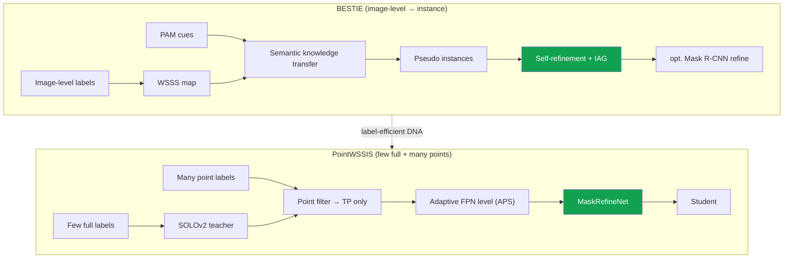

# Deep-Dive: PointWSSIS & BESTIE — Label-Efficient Instance Segmentation

CVPR 2023 · CVPR 2022weakly / semi-supervisedpoint supervisioninstance segfirst author

> [!TIP] 30-second pitch
> Two first-author CVPR papers that reduce instance-segmentation annotation cost at the **proposal bottleneck**. **BESTIE** (CVPR 2022) transfers image-level knowledge into instances and uses self-refinement to reduce semantic drift. **PointWSSIS** (CVPR 2023) uses points to reduce proposal ambiguity and refine masks in a few-full + many-point setting. The paper reports AP close to a fully supervised reference with 50% full labels on COCO, and AP above the compared semi-supervised baseline at 5%. Their shared question is **how to control pseudo-label noise while reducing the label budget**.

**Public references:** BESTIE [arXiv 2109.09477](https://arxiv.org/abs/2109.09477) / [code](https://github.com/clovaai/BESTIE); PointWSSIS [arXiv 2303.15062](https://arxiv.org/abs/2303.15062) / [code](https://github.com/clovaai/PointWSSIS). Backing chapter: [Weak & Semi-Supervised](#/cv/weak-semi-supervised).

## Why the proposal is the bottleneck

Many instance-segmentation pipelines produce proposals, queries, or candidates before predicting masks. If the candidate stage misses an object, the later mask head has difficulty recovering it; lowering the confidence threshold can increase false positives. The two papers recast this SSIS trade-off as candidate selection and pseudo-label refinement.

## BESTIE (CVPR 2022) — semantic → instance under weak labels

**Problem.** Prior WSIS leaned on high-level pretrained **proposals** (MCG, salient-instance segmenters), which violates the pure image-level premise and transfers poorly across domains. And naively training on pseudo-labels sends *missing* instances to background → **semantic drift** (the same class learned as both FG and BG).

**Method.**
<dl class="kv">
<dt>Semantic Knowledge Transfer</dt><dd>Combine a WSSS map with instance cues; take connected-component candidates; regions with a single cue become instance pseudo-labels.</dd>
<dt>PAM (Peak Attention Module)</dt><dd>Instead of CAM's noisy multi-peak activation, <b>amplify true peaks and suppress noise</b> to extract clean instance cues — deliberately the opposite direction of DRS's suppression (see prequel).</dd>
<dt>Representation</dt><dd>Panoptic-DeepLab-style <b>center heatmap + offset</b> + semantic head.</dd>
<dt>Instance-Aware Guidance (IAG)</dt><dd>Apply center/offset losses <b>only on labeled instance regions</b>, so unlabeled/missing objects don't get pulled to background.</dd>
<dt>Self-refinement</dt><dd><b>Online</b> (per mini-batch) grouping of the network's own outputs into refined labels, fed back with soft weights — promotes FN→TP without offline iteration.</dd>
</dl>

Optional Mask R-CNN refinement stage. **Result:** VOC mAP50 **51.0%** (with MRCNN refine); COCO AP50 ~28.0% at image-level; swapping in point cues lifts it further.

## PointWSSIS (CVPR 2023) — the weakly-semi setting

**Setting — WSSIS:** a **few fully-labeled** images + **many point-labeled** images (a single point per instance, centroid *or* random-in-mask — the method is robust to which).

**Method (teacher → filter → refine → student).**
<dl class="kv">
<dt>1. Teacher</dt><dd>Train a SOLOv2 teacher on the few full labels.</dd>
<dt>2. Point-guided proposal filtering</dt><dd>Select proposals matching the point location to reduce the false-positive/false-negative trade-off. Points do not completely eliminate annotation noise or proposal misses, so explain this only within the paper's protocol.</dd>
<dt>3. Adaptive Pyramid-Level Selection (APS)</dt><dd>A point has no size, so pick the FPN level by <b>confidence argmax</b> across levels; small gap to a GT-size oracle.</dd>
<dt>4. MaskRefineNet</dt><dd>Input = concat(image crop, rough teacher mask, point Gaussian heatmap) → refined mask. All three inputs are necessary (ablation); without the rough mask it fails to converge. This is the key module when full labels are tiny (1–5%).</dd>
<dt>5. Student</dt><dd>Retrain on full + high-quality pseudo-labels.</dd>
</dl>

**Results:** COCO **50%** full → **38.8 AP** ≈ fully-supervised 39.7; COCO **5%** full → **33.7** vs SSIS baseline 24.9. On BDD100K, fixing 7k full and growing points 20k→67k lifts AP 22.1→27.9. On a budget–AP Pareto it beats box-only weak supervision and SSIS.

## Compare in one table

| | BESTIE | PointWSSIS |
| --- | --- | --- |
| Labels | image-level (or point cues) | few full + many points |
| Core bottleneck | instance cue / semantic drift | proposal FN/FP |
| Key modules | PAM + SKT + IAG + self-refine | point filter + APS + MaskRefineNet |
| Base model | Panoptic-DeepLab-style | SOLOv2 |
| Benchmarks | VOC / COCO WSIS | COCO / BDD WSSIS |

## DRS — the prequel (AAAI 2021)

> [!NOTE] The suppression → peak-attention arc
> **DRS** (*Discriminative Region Suppression for Weakly-Supervised Semantic Segmentation*, [arXiv 2103.07246](https://arxiv.org/abs/2103.07246), [code](https://github.com/qjadud1994/DRS)) is the root of this line. CAMs fire only on the most discriminative part; DRS **suppresses** those dominant regions to force activation to *spread* over the whole object → better semantic pseudo-masks. BESTIE's **PAM** is the deliberate inverse move — *amplify* peaks — because for *instance* cues you want sharp, well-separated seeds, not diffuse coverage. Telling both together shows you understand *when to spread vs. sharpen activation*, which is a genuinely sophisticated point.

## Predicted deep-dive Q&A

Why is a point so much better than an image-level label, for so little extra cost?

**Short:** A point adds *location*, which lets you select a true-positive proposal; image-level only lets you reject misclassified ones.

**Deep:** Under the annotation-cost assumptions used by the paper, a point is cheaper than a box or mask while adding location information. That location reduces ambiguity by filtering proposals more directly than an image-level label. Actual cost varies with the annotation UI, quality bar, and domain, so state the assumption alongside the COCO 5% result—33.7 versus 24.9 for the compared baseline—rather than asserting an absolute number of seconds.

Why does MaskRefineNet need all three inputs?

**Short:** Image = appearance; rough mask = teacher prior (removes it and training won't converge); point heatmap = disambiguates overlapping instances and pins the target.

**Deep:** With tiny full-label budgets the teacher masks are rough, so the refiner must *correct* them using appearance while staying anchored to the intended instance. Ablations show all three are needed to reach the reported pseudo-label quality; the point heatmap is what separates touching instances the rough mask blurs together.

What is semantic drift in BESTIE and how do you stop it?

**Short:** A missing instance gets learned as background while a visually identical instance is foreground → contradictory supervision. IAG restricts center/offset losses to labeled regions; self-refinement promotes FN→TP.

**Deep:** The contradiction poisons the center/offset heatmaps precisely where classes look alike. Instance-Aware Guidance masks the loss so unlabeled objects don't teach "background," and online self-refinement re-mines them as positives over training — recovering them without an expensive offline loop.

Why not just use an off-the-shelf proposal generator?

It breaks the pure image-level premise, transfers poorly to new domains (e.g., medical), and makes comparisons unfair (you'd be importing a strong pretrained segmenter). BESTIE deliberately avoids MCG/salient proposals so the comparison against IRN-style baselines is apples-to-apples.

### Hard follow-ups

These use SOLOv2 / Panoptic-DeepLab — is the idea obsolete in the Mask2Former era?

The **contribution is the recipe, not the backbone**: "select a true-positive proposal/query with a cheap point, then refine." That ports directly to query-based detectors/segmenters — a point can select or seed a query, and a refine head still helps under tiny label budgets. I'd frame it as transferable methodology.

If point labels get expensive, do the gains vanish?

The claim isn't "points are free," it's a **budget–AP Pareto** win: 5% full + many points beats box-only and SSIS at comparable or lower annotation budget. I'd state the assumptions (seconds/label from the literature) explicitly and argue on the Pareto frontier, not on any single absolute cost.

Which one would you present, and why?

For a **product/data-efficiency** audience, distinguish PointWSSIS's baseline improvement in the 5% setting from its near-fully-supervised-reference result in the 50% setting. For a **weak-supervision** audience, emphasize BESTIE's drift and cue extraction. Their shared idea is redefining the candidate/cue bottleneck and controlling pseudo-label noise.

## Honest limitations

- **BESTIE:** heavy occlusion caps true-positive pseudo-labels (COCO crowds); ceiling is bounded by WSSS quality (GT semantic would add ~+7.6 mAP50).
- **PointWSSIS:** still needs *some* points — pure unlabeled web-scale extension is future work.
- Both predate query-based universal segmenters; the transfer is argued, not benchmarked.

## Which JD signals this connects to

| JD signal | Evidence to connect |
| --- | --- |
| Low-label data curation | Image/point/full-label budgets and the AP Pareto frontier |
| Weak/semi-supervised segmentation | Proposal FN/FP, semantic drift, and pseudo-label refinement |
| Robotics/AV labeling pipeline | Point-annotation assumptions together with domain-transfer limitations |

## Cheat-sheet

| Item | Value |
| --- | --- |
| BESTIE | CVPR 2022, first author; VOC mAP50 **51.0** (w/ MRCNN); PAM + SKT + IAG + self-refine |
| PointWSSIS | CVPR 2023, first author; COCO 5% **33.7** vs 24.9; 50% **38.8** ≈ full 39.7 |
| PointWSSIS modules | point filter → **APS** (FPN level by confidence) → **MaskRefineNet** (img + rough mask + point heatmap) |
| Prequel | **DRS** (AAAI 2021): suppress discriminative regions to spread CAM |
| One idea | Redefine the **proposal/cue bottleneck** and control **pseudo-label noise** |

## Cross-links
- Topical: [Weak & Semi-Supervised](#/cv/weak-semi-supervised) · [Segmentation](#/cv/segmentation) · [Object Detection](#/cv/detection)
- Deep-dives: [ECLIPSE](#/resume/eclipse) · [ZIM](#/resume/zim) · [Phoenix (ECCV'26 mask refinement)](#/resume/phoenix-mask-refinement) — generalizing the MaskRefineNet line · back to the [CV → Interview Map](#/resume/overview)
