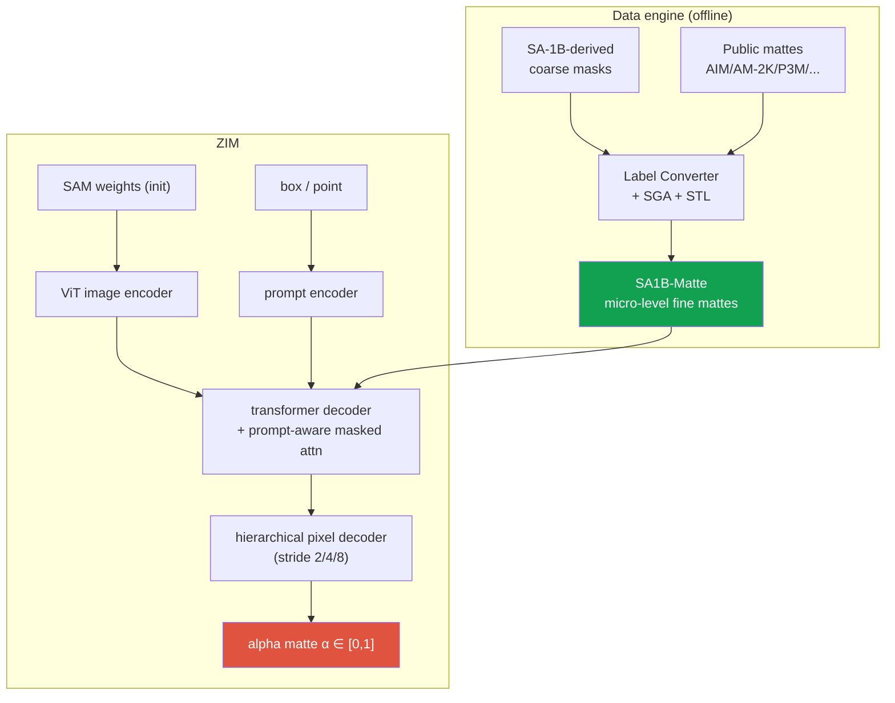

# Deep-Dive: ZIM — Zero-Shot Image Matting for Anything

ICCV 2025 HighlightSAM-basedzero-shot mattingdata enginefirst author

> [!TIP] 30초 pitch
> ZIM은 <strong>promptable, zero-shot image-matting model</strong>입니다. SAM의 prompt 기반 일반화를 유지하면서 hard mask 대신 fine-grained soft alpha matte를 냅니다. 핵심은 공개 matting data에만 fine-tune하는 대신, SA-1B에서 유래한 segmentation label을 micro-level matte로 바꾸는 <strong>label converter(SGA + STL)</strong>를 만들고 <strong>hierarchical pixel decoder</strong>와 <strong>prompt-aware masked attention</strong>을 더한 것입니다. 공개 결과는 ICCV 2025 **Highlight**, code/demo, CLOVA-X Image Editing integration입니다.

**Public references:** [paper (arXiv 2411.00626)](https://arxiv.org/abs/2411.00626) · [code](https://github.com/naver-ai/ZIM) · [project](https://naver-ai.github.io/ZIM/). 주제별 [Matting](#/cv/matting)과 [Vision Foundation Models](#/cv/foundation-models) 챕터도 참고.

## 문제 & 동기

2024년에 두 가지가 동시에 참이면서 서로 긴장 관계였습니다:

1. <strong>SAM</strong>은 대규모 promptable zero-shot segmentation을 제공하지만 출력은 matting의 연속 alpha가 아닌 hard binary mask입니다. 논문은 coarse supervision과 decoder resolution 때문에 머리카락·털·반투명 경계 표현이 제한된다고 봅니다.
2. **Matting** 모델은 아름다운 soft alpha를 내지만, 기존의 "matte anything" 시도들(Matte-Anything, Matting-Anything)은 그저 <strong>공개 matting 데이터셋에 fine-tune</strong>할 뿐인데, 그 데이터는 거의 전부 *macro* 전신 portrait입니다. 이렇게 fine-tune하면 <strong>macro granularity에 overfit</strong>됩니다: 신발끈을 prompt하면 사람 전체를 돌려줍니다. Zero-shot promptability가 붕괴합니다.

순진한 해법 — SA-1B 규모로 micro-level matte를 annotation하기 — 는 경제적으로 불가능합니다. ZIM의 논지: **granularity 문제는 data 문제이므로, 더 많은 사람 label이 아니라 data engine으로 풀어라.**

## Contribution 1 — data engine (SGA + STL)

기존 **segmentation** label을 **matte** label로, SA-1B 규모에서 변환합니다.

<dl class="kv">
<dt>Label Converter</dt><dd>공개 matte(AIM-500, AM-2K, P3M-10K, RWP-636, HIM-2K, RefMatte)와 coarse non-matte mask(ADE20K)를 섞은 데이터로 학습한 network(mask-guided matting 스타일, 예: MGMatting + Hiera backbone). 입력: image + coarse mask. 출력: fine matte. Loss: $\mathcal{L}=\mathcal{L}_{1}+\lambda\,\mathcal{L}_{\text{grad}}$, $\lambda=10$.</dd>
<dt>Spatial Generalization Augmentation (SGA)</dt><dd>segmentation 입력과 matte target 모두에 <b>동일한</b> random cut-out 영역을 적용해, converter가 전체 객체가 아니라 <b>부분 / micro</b> 영역에서 fine detail을 만들어내도록 학습시킵니다. 이것이 "micro granularity"를 가르치는 부분입니다.</dd>
<dt>Selective Transformation Learning (STL)</dt><dd>fine matte가 무의미하거나 noisy한 class(car, desk, 강체)에 대해서는 target을 <b>segmentation mask 자체</b>(identity)로 설정합니다. Converter는 soft edge가 없어야 할 곳에서 *hallucinate하지 않도록* 학습됩니다 → label noise 감소.</dd>
<dt>Output</dt><dd><b>SA1B-Matte</b>: SA-1B 이미지를 micro-level fine matte로 다시 label한 것.</dd>
</dl>

> [!EXAMPLE] 왜 SGA와 STL 둘 다 중요한가 (ablation 직관)
> SGA가 없으면 converter는 전체 객체 matte만 알아서 → micro prompt가 실패합니다. STL이 없으면 강체에 soft edge를 강제해서 → noisy한 학습 신호가 됩니다. 논문의 converter-quality ablation은 둘 중 하나만 빼도 MicroMat 변환 품질이 떨어짐을 보여줍니다. 소리 내어 말할 교훈: *"foundation model의 behavior는 그 data가 쓴 계약이다 — 나는 그 계약을 설계했다."*

## Contribution 2 — 모델

같은 SAM 골격(ViT image encoder + prompt encoder + transformer decoder + pixel decoder), 두 개의 정밀한 변경:

<dl class="kv">
<dt>Hierarchical Pixel Decoder</dt><dd>SAM의 단일 stride-4 upsample 대신, <b>stride 2/4/8의 multi-level feature를 융합</b>해 점진적으로 upsampling하며 image embedding을 concat합니다. 이것이 checkerboard를 없애고, 고주파 boundary detail을 복원하며, semantic을 보존합니다. 비용: V100에서 ~+10ms — 품질 향상에 비하면 저렴합니다.</dd>
<dt>Prompt-Aware Masked Attention</dt><dd>decoder의 <b>token→image</b> cross-attention을 prompt 영역 쪽으로 bias합니다. Box prompt는 박스 밖 attention logit을 $-\infty$로 두고, point prompt는 Gaussian($\sigma=21$)으로 QK score를 조절합니다. 제안 방법은 token→image에만 적용하며, 논문 ablation에서는 image→token까지 적용했을 때 성능이 낮아졌습니다.</dd>
</dl>

학습: SAM weight로 초기화, <strong>SA1B-Matte의 1%(~2.2M matte label)</strong>로 학습, 500K iteration, AdamW LR 1e-5. 흥미롭게도 10%로 늘려도 이득이 미미합니다 — SAM 초기화가 이미 visual prior를 담고 있어서, converter의 *양*보다 *granularity*가 더 중요합니다.

## 평가 & 결과 framing

fine-grained promptable-matting benchmark가 존재하지 않았기 때문에, 논문은 자체 benchmark를 기여합니다:

- **MicroMat-3K**: 3K 고해상도 이미지(*fine* 750 + *coarse* 2,250), point 및 box prompt 포함. DIV2K → SAM AMG pseudo-seg → converter matte → <strong>사람 검토/교정</strong>으로 구축. Fine/coarse 분리로 micro fidelity를 따로 측정할 수 있습니다.
- **Headline (ViT-B, fine subset, box prompt):** ZIM **SAD ≈ 9.96 / MSE ≈ 1.89** vs SAM **36.09 / 11.06**, Matte-Anything **34.66 / 9.75**, Matting-Anything **≈246 / 68**. *(논문 수치; 낮을수록 좋음.)*
- **결정적 ablation:** 같은 architecture를 SA1B-Matte 대신 Public-Matte로 학습 → fine SAD가 ~120으로 급등. **Data granularity가 architecture를 지배한다.** 이것이 외워야 할 슬라이드입니다.
- **Downstream:** ZIM은 Matte-Anything / Matting-Anything / HQ-SAM에 backbone으로 꽂히고, Inpaint-Anything, medical segmentation, SA3D 3D segmentation을 개선합니다. **Grounded-ZIM** = Grounding DINO box → ZIM으로 text-prompted matting.

> [!NOTE] Production 반향 — CLOVA-X (대외비 세부사항)
> 공개 발표는 ZIM과 [CLOVA-X Image Editing](https://dan.naver.com/24/sessions/597)의 integration을 확인하는 근거입니다. 별도 foreground-segmentation API의 내부 경쟁사 비교·SLA·사용자 수는 승인된 표현이 아니면 말하지 않습니다. 두 제품이 같은 weight나 pipeline을 공유한다고 추정하지 말고, 실제로 본인이 다룬 경우에만 resolution·alpha convention·latency·fallback 같은 handoff 항목을 설명하세요.

## 예상 deep-dive Q&A

matting에 그냥 SAM을 쓰면 안 되나요?

**Short:** SA-1B label은 coarse하고, pixel decoder는 단순한 stride-4 upsample(checkerboard)이며, objective는 *hard* mask입니다. 그중 어느 것도 soft alpha나 머리카락 수준 구조에 최적화되어 있지 않습니다.

**Deep:** Matting은 sub-pixel boundary gradient와 연속적인 $\alpha$가 필요합니다. SAM의 decoder는 그에 필요한 고주파 정보를 버리고, 학습 target에는 배울 soft transition이 없습니다. 그래서 supervision(soft matte)과 decoder(multi-scale, high-res)를 <strong>둘 다</strong> 바꿔야 합니다 — 그게 정확히 ZIM의 두 기여입니다.

그러면 왜 그냥 공개 matting 데이터셋에 SAM을 fine-tune하지 않나요?

**Short:** macro-overfit되어 zero-shot promptability가 파괴됩니다.

**Deep:** 공개 matting 데이터는 압도적으로 전신 portrait(macro)입니다. 여기에 fine-tune하면 모델은 "matte = 전체 salient object"를 학습해서, micro prompt(신발끈, 머리카락 한 올)에도 여전히 사람 전체를 돌려줍니다. Public-Matte 학습 ablation(fine SAD ~120 vs ZIM ~10)이 *바로* 이 붕괴를 정량화한 것입니다. 해법은 **micro-granular** supervision을 대규모로 제조하는 converter입니다.

prompt-aware masked attention과 T2I-only 디테일을 설명해 주세요.

**Short:** decoder cross-attention을 prompt된 영역 쪽으로 bias합니다 — box → 박스 밖은 hard $-\infty$ mask; point → Gaussian($\sigma=21$) reweighting — 단, token→image attention에만.

**Deep:** 출력 token은 prompt된 영역을 *봐야* 하므로 token→image를 masking하면 거기에 집중합니다. 하지만 image feature 자체는 공유되는 global representation이라서, image→token까지 masking하면 모든 token에 대해 그 representation을 손상시켜 품질이 떨어집니다. 양방향을 모두 ablate해야만 드러나는 비대칭성입니다.

CV에는 "~1M-image curated dataset"이라고 되어 있습니다. "1% of SA1B-Matte, ~2.2M mattes"와 어떻게 조화시키죠?

**Short:** `이미지 수`와 `matte-label instance 수`는 다른 단위입니다. 공개 논문은 ZIM training에 SA1B-Matte의 1%, 약 2.2M matte label을 썼다고 밝힙니다. CV의 약 1M curated image 문구가 어느 selection stage를 뜻하는지는 원자료로 다시 확인합니다.

**Deep:** 논문이 공개한 단위와 selection rule만 인용하세요. `SA-1B 전체 규모`, `converter를 적용한 image subset`, `생성된 matte instance`, `실제 training 1%`를 섞지 않습니다. 논문은 10%로 늘렸을 때 뚜렷한 추가 이득이 없었다고 보고하지만 그 이유는 저자 해석으로 구분합니다.

왜 이것이 ICCV Highlight이고 "또 하나의 matting fine-tune"이 아닌가요?

**Short:** matting을 *foundation-model + data-engine* 문제로 재정의하고, 재현 가능한 pipeline, 새로운 benchmark, 폭넓은 downstream transfer로 뒷받침합니다.

**Deep (reviewer 관점):** (1) 정밀한 문제 정의 — zero-shot vs fine-grained 긴장; (2) 더 많은 사람 label이 아니라 확장 가능하고 재현 가능한 data 해법; (3) 하나의 hack이 아니라 data + architecture의 *공동* 설계; (4) MicroMat-3K가 benchmark 공백을 메움; (5) inpainting, medical, 3D에서의 downstream 성과가 범용성을 보임; (6) demo와 함께 완전 오픈소스. Public-Matte ablation이 기여를 *가독성 있게* 만듭니다.

### 어려운 follow-up

전통적인 AIM-500 benchmark는 ZIM만큼 box prompt를 선호하지 않습니다. 방어해 보세요.

평가 목표가 다른 <strong>domain/protocol mismatch</strong>입니다. 전통적 matting benchmark는 전체 salient object를 가정하는 경우가 많고, ZIM은 interactive object/part-level prompt를 목표로 합니다. 따라서 prompt budget과 target definition을 맞춰 비교해야 하며, 불리한 결과를 단순히 "잘못 사용했다"고 기각하지 않습니다.

ZIM을 video로 어떻게 가져가겠습니까?

SAM2 스타일의 **memory/propagation** 메커니즘을 $\alpha$의 temporal consistency와 결합합니다(flicker는 hard mask보다 soft matte에서 훨씬 잘 보입니다). 정직한 답: 이건 <strong>미해결 문제</strong>입니다 — occlusion과 re-identification 하에서 matte의 temporal stability는 풀리지 않았고, 저는 이걸 주장이 아니라 future work로 다루겠습니다.

alpha matte는 diffusion editing pipeline에 어떻게 꽂히나요?

soft conditioning signal로: 추출용 premultiplied-alpha compositing, 또는 latent inpainting / region-conditioned generation을 위한 spatial mask로서의 $\alpha$. Soft boundary가 합성물을 오려낸 것처럼 안 보이게 만드는 요소입니다. 핸드오프 이슈(resolution, color spill, premultiply 관례)가 진짜 엔지니어링이고 — CLOVA-X 세부사항은 대외비입니다.

## 솔직한 한계

- SAM에서 물려받은 **prompt ambiguity**(point가 부분을 뜻할 수도 전체를 뜻할 수도 있음).
- $\alpha$에 대한 **uncertainty modeling 없음** — 모델이 "이 머리카락 boundary는 확신이 없다"고 말하지 못함.
- <strong>투명 / 유리 / 불</strong>은 여전히 약함; trimap 기반 SOTA가 아직 이깁니다(data 부족).
- 전체 객체 matting benchmark와의 **철학적 불일치**(object/part vs whole-salient).

## 어떤 JD와 연결되는가

| JD signal | 연결할 근거 |
| --- | --- |
| Precise mask / image editing | soft alpha, promptable object/part selection, public integration |
| Foundation-model data | label converter, SGA/STL, data granularity ablation |
| Controllable generation | region conditioning과 matte handoff의 일반적 trade-off |
| Perception tool layer | downstream inpainting·medical·3D evaluations와 한계 |

## Cheat-sheet

| Item | Value |
| --- | --- |
| Venue | ICCV 2025 **Highlight**, 1저자 |
| One-liner | Promptable **zero-shot matting foundation** (SAM prompt → soft micro-level $\alpha$) |
| Data engine | Label Converter + **SGA** (micro generalization) + **STL** (rigid identity) → SA1B-Matte |
| Model | **Hierarchical pixel decoder** (stride 2/4/8, +~10ms) + **prompt-aware masked attn** (T2I only) |
| Loss | $\mathcal{L}_1 + \lambda\mathcal{L}_{\text{grad}}$, $\lambda=10$; point Gaussian $\sigma=21$ |
| Train | SAM-init, 1% SA1B-Matte (~2.2M mattes), 500K iters, AdamW 1e-5 |
| Benchmark | **MicroMat-3K** (fine 750 / coarse 2250); ViT-B box-fine SAD ~10 vs SAM ~36 |
| 핵심 ablation | Public-Matte vs SA1B-Matte: fine SAD ~120 → ~10; data granularity가 load-bearing |

## Cross-links
- 주제별: [Image Matting](#/cv/matting) · [Vision Foundation Models](#/cv/foundation-models) · [Segmentation](#/cv/segmentation)
- Deep-dive: [On-Device Seg](#/resume/on-device-segmentation) · [Grounded VLM & Agents](#/resume/grounded-vlm-agents) · [CV → Interview Map](#/resume/overview)으로 돌아가기
