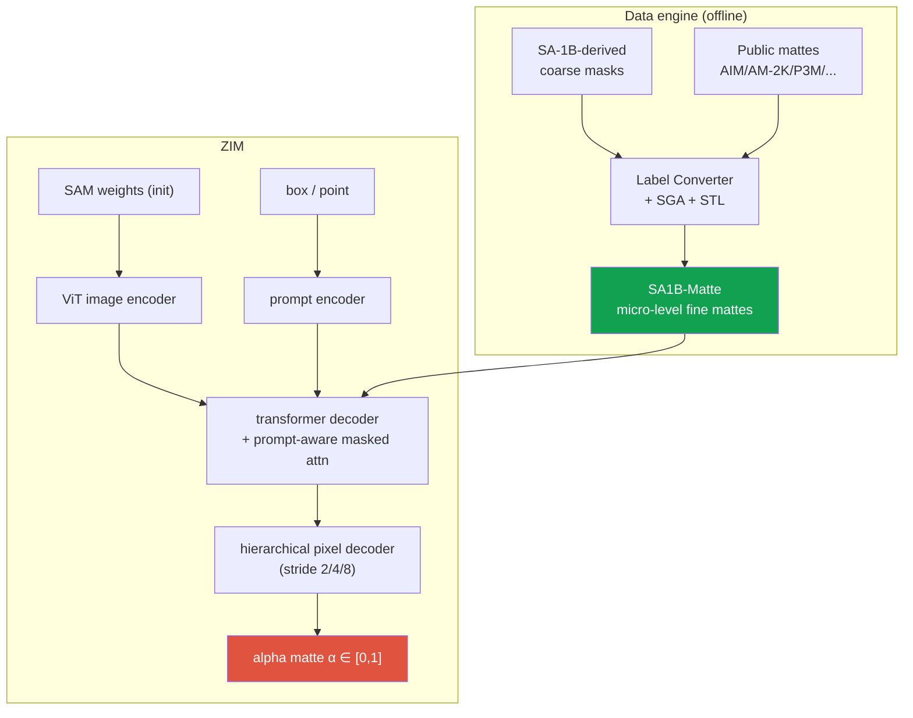

# Deep-Dive: ZIM — Zero-Shot Image Matting for Anything

ICCV 2025 HighlightSAM-basedzero-shot mattingdata enginefirst author

> [!TIP] 30-second pitch
> ZIM is a <strong>promptable, zero-shot image-matting model</strong>. It preserves SAM's prompt-driven generalization while producing fine-grained soft alpha mattes instead of hard masks. Rather than fine-tuning only on public matting data, it builds a <strong>label converter (SGA + STL)</strong> that transforms segmentation labels derived from SA-1B into micro-level mattes, then adds a <strong>hierarchical pixel decoder</strong> and <strong>prompt-aware masked attention</strong>. Public outcomes include an ICCV 2025 **Highlight**, code and demo releases, and integration with CLOVA-X Image Editing.

**Public references:** [paper (arXiv 2411.00626)](https://arxiv.org/abs/2411.00626) · [code](https://github.com/naver-ai/ZIM) · [project](https://naver-ai.github.io/ZIM/). See also the topical [Matting](#/cv/matting) and [Vision Foundation Models](#/cv/foundation-models) chapters.

## Problem & motivation

Two things were true in 2024 and in tension:

1. <strong>SAM</strong> provides promptable zero-shot segmentation at scale, but its output is a hard binary mask rather than the continuous alpha required for matting. The paper attributes limited representation of hair, fur, and semi-transparent boundaries to coarse supervision and decoder resolution.
2. **Matting** models produce beautiful soft alpha — but existing "matte anything" attempts (Matte-Anything, Matting-Anything) just <strong>fine-tune on public matting datasets</strong>, which are almost all *macro* whole-portrait. Fine-tuning this way <strong>overfits to macro granularity</strong>: prompt a shoelace and it returns the whole person. Zero-shot promptability collapses.

The naive fix — annotate micro-level mattes at SA-1B scale — is economically impossible. ZIM's thesis: **the granularity problem is a data problem, so solve it with a data engine, not more human labels.**

## Contribution 1 — the data engine (SGA + STL)

Convert existing **segmentation** labels into **matte** labels, at SA-1B scale.

<dl class="kv">
<dt>Label Converter</dt><dd>A network (mask-guided matting style, e.g. MGMatting + Hiera backbone) trained on a mixture of public mattes (AIM-500, AM-2K, P3M-10K, RWP-636, HIM-2K, RefMatte) plus coarse non-matte masks (ADE20K). Input: image + coarse mask. Output: fine matte. Loss: $\mathcal{L}=\mathcal{L}_{1}+\lambda\,\mathcal{L}_{\text{grad}}$ with $\lambda=10$.</dd>
<dt>Spatial Generalization Augmentation (SGA)</dt><dd>Apply the <b>same</b> random cut-out region to both the segmentation input and the matte target, so the converter learns to produce fine detail on <b>partial / micro</b> regions rather than only whole objects. This is what teaches "micro granularity."</dd>
<dt>Selective Transformation Learning (STL)</dt><dd>For classes where a fine matte is meaningless or noisy (car, desk, rigid objects), the target is set to the <b>segmentation mask itself</b> (identity). The converter learns *not* to hallucinate soft edges where there shouldn't be any → less label noise.</dd>
<dt>Output</dt><dd><b>SA1B-Matte</b>: SA-1B images relabeled with micro-level fine mattes.</dd>
</dl>

> [!EXAMPLE] Why SGA and STL both matter (ablation intuition)
> Without SGA the converter only knows whole-object mattes → micro prompts fail. Without STL it forces soft edges onto rigid objects → noisy training signal. The paper's converter-quality ablation shows removing either degrades MicroMat conversion quality. The lesson to say out loud: *"a foundation model's behaviour is a contract written by its data — I engineered the contract."*

## Contribution 2 — the model

Same SAM skeleton (ViT image encoder + prompt encoder + transformer decoder + pixel decoder), two surgical changes:

<dl class="kv">
<dt>Hierarchical Pixel Decoder</dt><dd>Instead of SAM's single stride-4 upsample, fuse <b>multi-level features at stride 2/4/8</b>, progressively upsampling and concatenating the image embedding. This kills the checkerboard, recovers high-frequency boundary detail, and preserves semantics. Cost: ~+10ms on V100 — cheap for the quality gain.</dd>
<dt>Prompt-Aware Masked Attention</dt><dd>Bias the decoder's <b>token→image</b> cross-attention toward the prompted region. A box prompt sets out-of-box attention logits to $-\infty$; a point prompt modulates the QK score with a Gaussian ($\sigma=21$). The proposed method applies this only to token→image, and the paper's ablation reports lower performance when it is also applied to image→token.</dd>
</dl>

Training: initialize from SAM weights, train on <strong>1% of SA1B-Matte (~2.2M matte labels)</strong>, 500K iterations, AdamW at LR 1e-5. Interestingly, scaling to 10% gives marginal gains — the SAM initialization already carries the visual prior, so the converter's *granularity* matters more than its *quantity*.

## Evaluation & results framing

The paper contributes its own benchmark because no fine-grained promptable-matting benchmark existed:

- **MicroMat-3K**: 3K high-res images (750 *fine* + 2,250 *coarse*), with point and box prompts. Built from DIV2K → SAM AMG pseudo-seg → converter matte → <strong>human review/correction</strong>. Fine/coarse split lets you measure micro fidelity separately.
- **Headline (ViT-B, fine subset, box prompt):** ZIM **SAD ≈ 9.96 / MSE ≈ 1.89** vs SAM **36.09 / 11.06**, Matte-Anything **34.66 / 9.75**, Matting-Anything **≈246 / 68**. *(Numbers from the paper; lower is better.)*
- **The decisive ablation:** same architecture trained on Public-Matte instead of SA1B-Matte → fine SAD jumps to ~120. **Data granularity dominates architecture.** This is the slide to memorize.
- **Downstream:** ZIM drops into Matte-Anything / Matting-Anything / HQ-SAM as a backbone, and improves Inpaint-Anything, medical segmentation, and SA3D 3D segmentation. **Grounded-ZIM** = Grounding DINO boxes → ZIM for text-prompted matting.

> [!NOTE] Production echo — CLOVA-X (confidential specifics)
> A public presentation confirms the integration of ZIM with [CLOVA-X Image Editing](https://dan.naver.com/24/sessions/597). Do not discuss internal competitor comparisons, SLAs, or user counts for the separate foreground-segmentation API unless the wording is approved. Do not infer that the two products share weights or a pipeline; explain handoff issues such as resolution, alpha conventions, latency, and fallbacks only if you personally worked on them.

## Predicted deep-dive Q&A

Why can't you just use SAM for matting?

**Short:** SA-1B labels are coarse, its pixel decoder is a simple stride-4 upsample (checkerboard), and its objective is a *hard* mask. None of that is optimized for soft alpha or hair-level structure.

**Deep:** Matting needs sub-pixel boundary gradients and a continuous $\alpha$. SAM's decoder throws away the high-frequency information you need, and its training target has no soft transition to learn from. So you must change <strong>both</strong> the supervision (soft mattes) and the decoder (multi-scale, high-res) — which is exactly ZIM's two contributions.

Then why not just fine-tune SAM on public matting datasets?

**Short:** It macro-overfits and destroys zero-shot promptability.

**Deep:** Public matting data is overwhelmingly whole-portrait (macro). Fine-tune on it and the model learns "matte = whole salient object," so a micro prompt (shoelace, hair strand) still returns the whole person. The Public-Matte-trained ablation (fine SAD ~120 vs ZIM's ~10) *is* this collapse, quantified. The fix is a converter that manufactures **micro-granular** supervision at scale.

Explain prompt-aware masked attention and the T2I-only detail.

**Short:** Bias decoder cross-attention toward the prompted region — box → hard $-\infty$ mask outside the box; point → Gaussian ($\sigma=21$) reweighting — but only on token→image attention.

**Deep:** The output tokens should *look at* the prompted region, so masking token→image focuses them. But the image features themselves are a shared global representation; if you also mask image→token you corrupt that representation for every token, hurting quality. It's an asymmetry that only shows up when you ablate both directions.

Your CV says "~1M-image curated dataset." Reconcile that with "1% of SA1B-Matte, ~2.2M mattes."

**Short:** `Image count` and `matte-label instance count` are different units. The public paper says ZIM training used 1% of SA1B-Matte, about 2.2M matte labels. Recheck the source material to determine which selection stage the resume's roughly 1M curated images refers to.

**Deep:** Cite only units and selection rules disclosed in the paper. Do not conflate `the full scale of SA-1B`, `the image subset processed by the converter`, `generated matte instances`, and `the 1% actually used for training`. The paper reports no clear additional gain at 10%, but distinguish the authors' interpretation of why from the measured result.

Why is this an ICCV Highlight and not "yet another matting fine-tune"?

**Short:** It reframes matting as a *foundation-model + data-engine* problem and backs it with a reproducible pipeline, a new benchmark, and broad downstream transfer.

**Deep (reviewer lens):** (1) precise problem definition — the zero-shot vs fine-grained tension; (2) a scalable, reproducible data solution rather than more human labels; (3) *joint* data + architecture co-design, not one hack; (4) MicroMat-3K fills a benchmark gap; (5) downstream wins in inpainting, medical, and 3D show generality; (6) fully open-sourced with a demo. The Public-Matte ablation makes the contribution *legible*.

### Hard follow-ups

The traditional AIM-500 benchmark favors box prompts less than ZIM. Defend that.

This is a <strong>domain/protocol mismatch</strong> between evaluation goals. Traditional matting benchmarks often assume one whole salient object, while ZIM targets interactive object- or part-level prompts. Comparisons should therefore align prompt budget and target definition; do not dismiss an unfavorable result simply as “wrong usage.”

How would you take ZIM to video?

Combine a SAM2-style **memory/propagation** mechanism with temporal consistency on $\alpha$ (flicker is far more visible in soft mattes than hard masks). Honest answer: this is an <strong>open problem</strong> — matte temporal stability under occlusion and re-identification isn't solved, and I'd treat it as future work, not a claim.

How does an alpha matte plug into a diffusion editing pipeline?

As a soft conditioning signal: premultiplied-alpha compositing for extraction, or $\alpha$ as a spatial mask for latent inpainting / region-conditioned generation. The soft boundary is what makes composites look non-cut-out. Handoff issues (resolution, color spill, premultiply convention) are the real engineering — and the CLOVA-X specifics are confidential.

## Honest limitations

- **Prompt ambiguity** inherited from SAM (a point can mean part or whole).
- **No uncertainty modeling** on $\alpha$ — the model can't say "I'm unsure at this hair boundary."
- <strong>Transparency / glass / fire</strong> remain weak; trimap-based SOTA still wins there (data scarcity).
- **Philosophical mismatch** with whole-object matting benchmarks (object/part vs whole-salient).

## Which JD this connects to

| JD signal | Evidence to connect |
| --- | --- |
| Precise masks / image editing | Soft alpha, promptable object/part selection, public integration |
| Foundation-model data | Label converter, SGA/STL, and the data-granularity ablation |
| Controllable generation | General trade-offs in region conditioning and matte handoff |
| Perception tool layer | Downstream inpainting, medical, and 3D evaluations and their limits |

## Cheat-sheet

| Item | Value |
| --- | --- |
| Venue | ICCV 2025 **Highlight**, first author |
| One-liner | Promptable **zero-shot matting foundation** (SAM prompts → soft micro-level $\alpha$) |
| Data engine | Label Converter + **SGA** (micro generalization) + **STL** (rigid identity) → SA1B-Matte |
| Model | **Hierarchical pixel decoder** (stride 2/4/8, +~10ms) + **prompt-aware masked attn** (T2I only) |
| Loss | $\mathcal{L}_1 + \lambda\mathcal{L}_{\text{grad}}$, $\lambda=10$; point Gaussian $\sigma=21$ |
| Train | SAM-init, 1% SA1B-Matte (~2.2M mattes), 500K iters, AdamW 1e-5 |
| Benchmark | **MicroMat-3K** (fine 750 / coarse 2250); ViT-B box-fine SAD ~10 vs SAM ~36 |
| Key ablation | Public-Matte vs SA1B-Matte: fine SAD ~120 → ~10; data granularity is load-bearing |

## Cross-links
- Topical: [Image Matting](#/cv/matting) · [Vision Foundation Models](#/cv/foundation-models) · [Segmentation](#/cv/segmentation)
- Deep-dives: [On-Device Seg](#/resume/on-device-segmentation) · [Grounded VLM & Agents](#/resume/grounded-vlm-agents) · back to the [CV → Interview Map](#/resume/overview)
