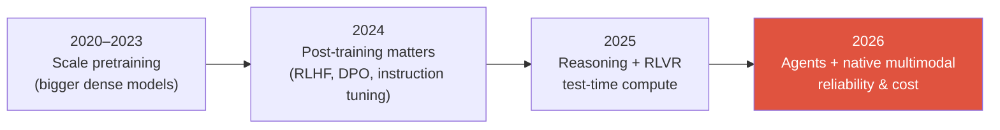

# The 2026 Landscape

reasoning modelsRLVRnative multimodalagentsMoEtest-time compute

> [!TIP] 이 chapter가 존재하는 이유
> 최신 연구를 다루는 직무라면 면접관은 현재의 문제 설정과 평가 관행을 이해하는지도 봅니다. 이 chapter는 유행어를 외우기보다, 2026년 7월 기준 주요 흐름이 *왜* 생겼고 어디까지 검증됐는지 빠르게 정리합니다.

> [!WARNING] 사실 대 과장에 대하여
> 아래의 모델 이름과 날짜는 가능한 한 primary source에서 가져왔습니다. **최신 모델의 benchmark 수치는 vendor가 보고한 경우가 많습니다** — 능력과 메커니즘은 자신 있게 인용하되, 정확한 점수는 신중하게 다루세요. 면접에서 보정된 신중함("SWE-bench Verified가 대략 80% 정도로 보고됐지만, harness를 직접 봐야 할 것 같습니다")은 *강점*입니다.

> [!NOTE] 업데이트 기준
> 마지막 전반 검토: **2026-07-21**. 아래 내용은 영구적인 교과서 정의가 아니라 이 날짜의 snapshot입니다. `vendor-reported`, preprint, 독립 평가를 구분하고, 순위보다 평가 protocol·비용·실패 분포를 먼저 확인하세요.

## 2026년을 읽는 일곱 가지 핵심 축

1. **Reasoning 모델이 주요 제품 범주가 됐습니다.** 여러 모델이 추론 예산과 post-training으로 math·code·planning 성능을 높입니다. 학습 recipe는 RLVR, preference optimization, distillation 등으로 다양하며 내부 chain-of-thought가 사용자에게 그대로 공개된다는 뜻은 아닙니다.
2. **Test-time compute가 일급 scaling 축이 됐습니다.** *추론 시점에 더 오래 생각*함으로써 정확도를 살 수 있습니다. 제품들은 이를 "thinking budgets" / "effort" 노브로 노출합니다.
3. **Mixture-of-Experts가 주요 scaling 선택지가 됐습니다.** Sparse routing은 model capacity를 per-token compute와 어느 정도 분리합니다. 다만 모든 frontier model이 MoE인 것은 아니며, 폐쇄형 모델은 구조 자체를 공개하지 않는 경우도 많습니다.
4. **Multimodal 학습이 초기 단계로 이동했습니다.** 최근 모델은 multimodal data를 pretraining 또는 대규모 continual-training 단계부터 사용합니다. 이것은 사용자 경험과 학습 recipe에 관한 말이지, 반드시 하나의 shared transformer만 쓴다는 뜻은 아닙니다. 별도 vision encoder와 projector를 유지하는 native-multimodal 모델도 있습니다.
5. **Agents가 주요 평가 범주로 확장됐습니다.** Computer-use, tool-calling, long-horizon task completion이 chat 품질과 함께 평가됩니다.
6. **Efficiency가 모델 품질과 분리되지 않습니다.** Low precision, attention kernel, KV cache, speculative decoding은 같은 품질을 어떤 비용·지연으로 제공하는지를 좌우합니다.
7. **평가 신뢰성이 독립된 연구 문제가 됐습니다.** 점수 하나보다 versioned harness, contamination, 비용, 반복 성공률과 실패 분포를 함께 봐야 합니다.

## 1 · Reasoning & test-time compute

최신 reasoning 관련 직무에서 연결해 설명하면 유용한 아이디어의 사슬입니다.

<dl class="kv">
<dt>Process supervision</dt><dd><i>Let's Verify Step by Step</i> (Lightman et al., 2023; PRM800K) — MATH에서 최종 답만 채점하는 것보다 reasoning <b>step</b>을 채점하는 것이 낫다. o1의 개념적 선구자.</dd>
<dt>Test-time scaling</dt><dd>Snell et al. (2024) — 연구가 다룬 설정에서는 고정된 모델에 더 많은 추론 compute(search, best-of-N, adaptive allocation)를 배정하는 편이 추가 pretraining compute보다 효율적일 수 있었다. 효과는 문제 난도·verifier·allocation policy에 의존한다.</dd>
<dt>o1 → R1</dt><dd>OpenAI의 o1 (2024년 9월)은 inference-time reasoning을 제품의 명시적 축으로 널리 알렸다. <b>DeepSeek-R1</b> (arXiv 2025년 1월, 이후 <i>Nature</i> 2025)은 R1-Zero에서 SFT 없이 RL만으로 관찰된 reasoning behavior를 보고했고, 기술 보고서와 model artifact를 공개했다. 이를 모든 reasoning model의 동일한 recipe로 일반화하지 않는다.</dd>
<dt>RLVR</dt><dd>Ai2의 <b>Tülu 3</b> (2024년 11월)가 널리 알린 표현: 학습된 preference reward 대신 test·symbolic rule·grader처럼 결과를 검증할 수 있는 신호로 RL을 수행한다. reward가 꼭 binary이거나 완전무결한 것은 아니며, verifier와 harness 자체도 공격·오설계될 수 있다.</dd>
<dt>GRPO</dt><dd>RLVR에서 널리 쓰이는 critic-free family 중 하나(DeepSeekMath, 2024): 별도 value network 없이 sampled completion group을 이용해 advantage를 추정한다. group variance, length bias, difficulty imbalance 같은 failure mode가 남는다.</dd>
</dl>

> [!QUESTION] 나올 법한 면접 질문
> "RLVR와 RLHF를 대조하라." **답변 골격:** 전형적인 RLHF는 인간 preference로 학습한 reward model을 최적화하고, RLVR는 math·code·tool task처럼 결과를 검사할 수 있는 verifier 신호를 사용한다. 어느 쪽도 자동으로 안전하지 않다. learned reward는 proxy를 exploit할 수 있고, verifier도 불완전한 test나 harness를 game할 수 있다. open-ended task에서는 rubric/judge model과 human audit를 조합한다. [Reasoning & Test-Time Compute](#/llm/reasoning) 참조.

문헌을 따라가고 있음을 보여줄 진짜 *열린* 논쟁은 RLVR가 **새로운 reasoning strategy를 학습시키는 정도**와 base model의 **기존 성공 경로를 재가중·sampling하는 정도**를 어떻게 분리할지입니다. 연구마다 task, base model, verifier와 분석법이 다르므로 하나의 결론으로 말하지 마세요.

## 2 · Post-training이 파편화됐다

2024년의 이야기는 "DPO가 PPO를 대체했다"였습니다. 2026년의 이야기는 **critic-free와 preference 방법의 동물원**이고, acronym을 암기하는 것보다 그 축들을 아는 것이 더 중요합니다.

| Family | Members | 핵심 아이디어 | 언제 |
| --- | --- | --- | --- |
| Offline preference | DPO, KTO, ORPO, SimPO | RLHF를 chosen/rejected(또는 unpaired) 데이터에 대한 classification-style loss로 바꾼다; reference-free 변형들 | 저렴, 안정적, rollout 인프라 불필요 |
| Critic-free online RL | GRPO, DAPO, Dr. GRPO, **GSPO** | Group-relative advantage, 별도 value network 없음; GSPO 논문은 sequence-level importance ratio가 token-level 방식보다 MoE RL을 안정화한다고 보고 | Reasoning, verifiable rewards |
| Feedback source | RLHF 대 **RLAIF** / Constitutional AI | preference를 누가 쓰는가: 인간 대 성문화된 원칙에 대한 AI critic | preference 데이터 스케일업 |

흔히 볼 수 있는 recipe family는 **SFT → preference optimization → online RL/RLVR**이지만, 모든 모델이 이 단계를 모두 또는 이 순서대로 밟지는 않습니다. 데이터·task·인프라에 따라 SFT만 쓰거나, online preference 학습과 RLVR를 섞거나, PPO 계열을 계속 사용할 수도 있습니다. 자세한 내용은 [Post-Training & Alignment](#/llm/alignment).

## 3 · Mixture-of-Experts, 중요한 선택지

2025–2026에 공개된 여러 대형 모델이 MoE를 채택했지만 dense model도 여전히 중요합니다. 공개된 앵커 예로 **DeepSeek-V3는 671B total parameter 중 token당 약 37B를 활성화**한다고 보고합니다. 숫자를 인용할 때는 shared parameter 포함 방식과 active-parameter 정의를 함께 확인하세요. Llama 4, Qwen3 일부 변형, Mistral Large 3 등도 MoE family지만, 이를 비공개 모델의 구조까지 일반화할 수는 없습니다.

<figure>
<svg viewBox="0 0 640 200" xmlns="http://www.w3.org/2000/svg" font-family="Inter, sans-serif" font-size="12">
  <rect x="20" y="85" width="90" height="30" rx="6" fill="#6366f1"/><text x="65" y="105" fill="#fff" text-anchor="middle">token</text>
  <path d="M110 100 H160" stroke="#98a3b2" stroke-width="1.5" marker-end="url(#a)"/>
  <rect x="160" y="80" width="70" height="40" rx="6" fill="none" stroke="#e0533f" stroke-width="2"/><text x="195" y="104" fill="#e0533f" text-anchor="middle">router</text>
  <g fill="none" stroke="#232b36" stroke-width="1.5">
    <rect x="300" y="10" width="90" height="26" rx="5"/><rect x="300" y="44" width="90" height="26" rx="5"/>
    <rect x="300" y="78" width="90" height="26" rx="5" stroke="#12a150"/><rect x="300" y="112" width="90" height="26" rx="5"/>
    <rect x="300" y="146" width="90" height="26" rx="5" stroke="#12a150"/>
  </g>
  <text x="345" y="27" text-anchor="middle" fill="#6b7686">expert 1</text>
  <text x="345" y="61" text-anchor="middle" fill="#6b7686">expert 2</text>
  <text x="345" y="95" text-anchor="middle" fill="#12a150">expert 3 ✓</text>
  <text x="345" y="129" text-anchor="middle" fill="#6b7686">expert 4</text>
  <text x="345" y="163" text-anchor="middle" fill="#12a150">expert 5 ✓</text>
  <path d="M230 95 C 260 85, 270 91, 300 91" stroke="#12a150" stroke-width="2" fill="none"/>
  <path d="M230 105 C 260 130, 270 159, 300 159" stroke="#12a150" stroke-width="2" fill="none"/>
  <text x="500" y="90" fill="#98a3b2">top-k routing →</text>
  <text x="500" y="110" fill="#98a3b2">huge capacity,</text>
  <text x="500" y="130" fill="#98a3b2">small per-token FLOPs</text>
  <defs><marker id="a" markerWidth="8" markerHeight="8" refX="6" refY="3" orient="auto"><path d="M0 0 L6 3 L0 6" fill="#98a3b2"/></marker></defs>
</svg>
<figcaption>MoE: router가 token당 몇 개의 expert를 활성화한다. <b>active</b>(compute/latency)와 <b>total</b>(capacity/memory) 파라미터를 모두 보고하라 — 그리고 load balancing과 expert parallelism에 대한 follow-up을 예상하라.</figcaption>
</figure>

## 4 · Multimodal & vision foundation models

- **Multimodal pretraining의 조기 통합**(예: InternVL3 계열)은 instruction tuning에서 adapter만 붙이는 방식보다 학습 전반에 image-text data를 넣는 방향을 보여줍니다. 폐쇄형 모델의 내부 architecture는 공개 근거가 없는 한 추정하지 않습니다.
- **Native / dynamic-resolution ViT**와 **AnyRes tiling**은 다양한 aspect ratio를 가변 visual-token 수로 처리하는 선택지입니다. OCR·문서·긴 video에서는 해상도와 token budget의 trade-off가 특히 큽니다.
- Vision encoder 선택지가 **CLIP 계열 밖으로 넓어졌습니다.** 예를 들어 **SigLIP 2**와 **AIMv2**는 서로 다른 objective와 학습 recipe로 dense/localization feature도 평가합니다.
- **통합 understanding + generation** ("any-to-any": Janus-Pro → BAGEL → Show-o2)은 활발한 방향입니다. 전용 모델과의 우열은 task·평가 protocol·비용에 따라 따로 확인해야 합니다.

순수 vision 쪽에서 최신 흐름을 설명할 때 유용한 2025년 공개 사례 두 가지:

- **SAM 3** (Meta, 2025년 11월): **Promptable Concept Segmentation**을 추가해 text/exemplar concept으로 detect·segment·track하는 범위를 넓혔습니다. 이후 **SAM 3.1** 업데이트가 나왔으므로 버전별 기능과 속도를 구분하세요.
- **DINOv3** (Meta, 2025년 8월): 최대 7B 규모의 self-supervised vision backbone과 Gram anchoring을 보고했습니다. frozen feature의 우위는 논문이 평가한 task·protocol 범위의 결과이지 모든 특화 모델에 대한 보편 명제가 아닙니다.

[Vision Foundation Models](#/cv/foundation-models), [VLM Pretraining](#/vlm/pretraining), [Grounding](#/vlm/grounding) 참조.

## 5 · Agents & computer-use

2026년의 frontier 능력 범주.

- **OSWorld**는 실제 desktop/web interaction을 평가하지만 environment·version·human intervention·self-reported/verified 여부에 따라 점수가 달라집니다. 2025년 Sonnet 4.5의 61.4%는 Anthropic의 당시 vendor-reported snapshot이며 이후 모델 발표 수치와 직접 한 줄로 비교하면 안 됩니다.
- **Native end-to-end GUI agents** (UI-TARS-style: screenshot → reasoning/action → click/type)와 prompted orchestration framework가 함께 탐색되고 있습니다. GUI grounding(element → pixel coordinate), state 변화 인식, long-horizon recovery가 대표적인 난점입니다.
- **Visual program synthesis** (VisProg / ViperGPT 계보)은 visual task를 specialist tool에 대한 실행 가능한 program으로 표현합니다. 일부 후속 시스템은 여기에 RL을 결합합니다. [Visual Reasoning Agents](#/vlm/visual-agents)에서 이 설계 축을 다룹니다.
- **METR time-horizon 연구**는 agent가 50% 성공하는 software-task 길이가 빠르게 늘었다는 경험적 추세를 보고합니다. 다만 doubling time은 분석 구간과 방법론에 따라 크게 달라지고 uncertainty도 넓습니다. “약 7개월”은 초기 요약값이지 보편 법칙이 아닙니다.

## 6 · Efficiency & systems (돈을 벌어다 주는 부분)

<dl class="kv">
<dt>Attention kernels</dt><dd>FlashAttention-3 (Hopper) → <b>FlashAttention-4</b> (Blackwell) — 하드웨어가 <i>비대칭적으로</i> 스케일하기 때문에(tensor-core throughput이 shared-memory bandwidth / exp unit보다 빠르게 성장) 새 버전이 존재한다.</dd>
<dt>Low precision</dt><dd>지원되는 최신 hardware/software stack에서는 FP8 학습·추론 사용이 넓어졌다. NVIDIA 연구는 <b>NVFP4</b>로 12B/10T-token pretraining 실험을 보고했지만, 이것이 모든 모델과 hardware에서 무손실·기본값이라는 뜻은 아니다. format을 비교할 때 block size, scale format, accumulator와 평가 protocol을 함께 본다.</dd>
<dt>Speculative decoding</dt><dd>EAGLE/Medusa/MTP 계열은 널리 지원되는 serving 선택지다. draft overhead, acceptance rate, batch와 latency 목표가 맞을 때 이득이며, 올바른 rejection/residual sampling을 써야 target distribution을 보존한다.</dd>
<dt>KV cache</dt><dd>PagedAttention (vLLM), <b>MLA</b>(low-rank latent K/V, DeepSeek), quantized KV.</dd>
<dt>Hybrid attention</dt><dd>linear/state-space block과 full attention을 섞는 여러 비율이 탐색되고 있다. 3:1·7:1은 일부 공개 모델의 설계점이지 합의된 보편 비율은 아니다.</dd>
</dl>

자세한 내용은 [Mixed Precision & Efficiency](#/foundations/mixed-precision-efficiency)와 [Distributed Training](#/foundations/distributed-training).

## 7 · Evaluation은 위기다 — 그리고 그게 훌륭한 면접 주제다

일부 인기 benchmark에서 상위권 점수가 높아지면서, 점수의 의미와 재현성을 확인하는 일이 더 중요해졌습니다.

- 공개 leaderboard는 model alias, sampling 설정, hidden prompt, judge와 decontamination 조건이 다르면 같은 이름의 모델도 직접 비교하기 어렵습니다. 사건 이름보다 **versioned artifact와 재현 가능한 harness**를 요구하는 습관이 중요합니다.
- **BenchJack (2026 preprint):** 논문은 10개 popular agent benchmark에서 219개의 exploit 가능 결함을 찾아, 실제 task를 풀지 않고도 다수 benchmark에서 높은 점수를 만들 수 있음을 보였습니다. 블로그 요약의 8개 시연과 논문의 10개 감사 대상을 혼동하지 마세요. 교훈은 **benchmark integrity도 security 문제**라는 것입니다.
- **Cost-per-task와 reliability curve**를 top-1 accuracy와 함께 보고하는 것이 바람직합니다. test-time compute를 늘리면 accuracy뿐 아니라 지연·비용도 함께 움직이기 때문입니다.

> [!QUESTION] 2026년 애용 질문
> "SWE-bench 계열에서 매우 높은 점수가 보고되는데 — 어떻게 검증하겠나요?" 강한 답변은 benchmark·model version, contamination, harness exploit, sampling budget, verified 여부를 확인하고, private held-out set과 per-task cost·반복 성공률 보고를 제안합니다. [Evaluation Metrics](#/foundations/evaluation-metrics) 참조.

## 관통하는 흐름

기존 benchmark에서 raw accuracy가 saturate되면서, 이 분야의 관심은 **reliability, cost, long-horizon autonomy, 그리고 측정 그 자체의 신뢰성**으로 옮겨갔습니다. *그* 메타 전환 — 그리고 여러분 자신의 연구가 그 안에서 어디에 들어맞는지 — 를 명료하게 말할 수 있다면, frontier에 속한 사람처럼 들릴 것입니다.

## Cheat-sheet

| 질문 | 한 줄 답 |
| --- | --- |
| Test-time compute | 새로운 scaling 축: 추론 compute(CoT/search)를 써서 accuracy를 올린다(Snell 2024). |
| RLVR vs RLHF | Verifier signal 대 learned preference reward; 둘 다 proxy/harness를 game할 수 있어 audit가 필요. |
| GRPO / GSPO | Critic-free group-relative RL; GSPO 논문은 sequence-level ratio의 MoE 안정성 개선을 보고. |
| MoE anchor | DeepSeek-V3: 671B total 중 ~37B active; active 대 total을 보고하고, load balancing에 유의. |
| Native multimodal | 학습 초기에 multimodal data를 통합한다는 뜻; 반드시 single-transformer architecture는 아님. |
| SAM 3 / DINOv3 | Promptable concept segmentation; 최대 7B SSL backbone과 Gram anchoring—버전·평가 범위를 함께 말하기. |
| Agents | OSWorld 점수는 verified/vendor·환경 버전을 구분; METR doubling은 방법론 의존 추세이지 법칙이 아님. |
| Eval crisis | Contamination + harness hacking(BenchJack); cost-per-task & reliability를 보고. |

**Related:** [LLM Fundamentals](#/llm/fundamentals) · [Reasoning](#/llm/reasoning) · [Alignment](#/llm/alignment) · [Agents](#/llm/agents) · [Vision Foundation Models](#/cv/foundation-models)

## 업데이트에 사용한 primary source

- [Tülu 3: RL with Verifiable Rewards](https://arxiv.org/abs/2411.15124) · [GSPO](https://arxiv.org/abs/2507.18071)
- [SAM 3 / SAM 3.1 공식 개요](https://ai.meta.com/blog/segment-anything-model-3/) · [DINOv3 공식 publication](https://ai.meta.com/research/publications/dinov3/)
- [FlashAttention-4](https://arxiv.org/abs/2603.05451) · [NVIDIA NVFP4 pretraining 보고](https://arxiv.org/abs/2509.25149)
- [METR time horizons](https://metr.org/time-horizons/) · [BenchJack](https://arxiv.org/abs/2605.12673)

> [!NOTE] 출처를 읽는 법
> 논문/공식 문서는 “저자가 무엇을 보고했는지”를 확인하는 primary source입니다. 그 결과가 독립적으로 재현됐거나 현재 최고라는 뜻까지 자동으로 보장하지는 않습니다.
