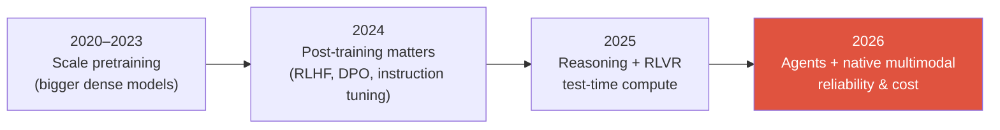

# The 2026 Landscape

reasoning modelsRLVRnative multimodalagentsMoEtest-time compute

> [!TIP] 이 chapter가 존재하는 이유
> 면접관은 여러분이 대학원에서 배운 frontier가 아니라 *현재의 frontier*를 기준으로 여러분을 보정합니다. 2023년처럼 말하는 2026년 후보자는 낡아 보입니다. 이 chapter는 최신처럼 들리게 하는 — 그리고 더 중요하게는, 이 분야가 *왜* 움직였는지 추론하게 하는 — 가장 빠른 방법입니다.

> [!WARNING] 사실 대 과장에 대하여
> 아래의 모델 이름과 날짜는 가능한 한 primary source에서 가져왔습니다. **최신 모델의 benchmark 수치는 vendor가 보고한 경우가 많습니다** — 능력과 메커니즘은 자신 있게 인용하되, 정확한 점수는 신중하게 다루세요. 면접에서 보정된 신중함("SWE-bench Verified가 대략 80% 정도로 보고됐지만, harness를 직접 봐야 할 것 같습니다")은 *강점*입니다.

## 2026년을 정의하는 다섯 가지 변화

1. **Reasoning 모델이 주류가 됐습니다.** self-verification을 동반한 긴 chain-of-thought는, 주로 **RL with verifiable rewards (RLVR)**로 학습되어, 이제 연구적 호기심거리가 아니라 표준적인 능력 범주가 됐습니다.
2. **Test-time compute가 일급 scaling 축이 됐습니다.** *추론 시점에 더 오래 생각*함으로써 정확도를 살 수 있습니다. 제품들은 이를 "thinking budgets" / "effort" 노브로 노출합니다.
3. **모든 것이 Mixture-of-Experts입니다.** Frontier 모델은 **active 대 total** 파라미터를 보고합니다. Sparse routing은 capacity를 per-token compute와 분리합니다.
4. **Multimodality는 native이지, 덧붙인 것이 아닙니다.** "LLM을 freeze하고 vision encoder를 붙인다"(LLaVA-style) 레시피는 frontier에서는 legacy입니다. 선도 모델은 vision+text(+audio/video)를 함께 pretrain합니다.
5. **Agents가 헤드라인입니다.** Computer-use, tool-calling, long-horizon autonomy가 이제 랩들이 benchmark하고 파는 것입니다 — 순수 chat 지표를 밀어내면서요.

## 1 · Reasoning & test-time compute

가장 큰 지적 전환입니다. 면접관이 여러분이 연결하기를 기대하는 아이디어의 사슬:

<dl class="kv">
<dt>Process supervision</dt><dd><i>Let's Verify Step by Step</i> (Lightman et al., 2023; PRM800K) — MATH에서 최종 답만 채점하는 것보다 reasoning <b>step</b>을 채점하는 것이 낫다. o1의 개념적 선구자.</dd>
<dt>Test-time scaling</dt><dd>Snell et al. (2024) — 고정된 모델에서, 더 많은 추론 compute(더 긴 CoT, search, best-of-N)를 할당하는 것이 파라미터를 키우는 것을 이길 수 있다. <b>새로운</b> scaling law.</dd>
<dt>o1 → R1</dt><dd>OpenAI의 o1 (2024년 9월)은 "정확도가 추론 compute와 함께 오르는" 최초의 모델이었고; <b>DeepSeek-R1</b> (arXiv 2025년 1월, 이후 <i>Nature</i> 2025)은 <b>순수 RL</b>(R1-Zero, SFT 없이)이 reasoning을 유도할 수 있음을 보였고, 그 레시피를 오픈소스로 공개했다.</dd>
<dt>RLVR</dt><dd>Ai2의 <b>Tülu 3</b> (2024년 11월)에서 만든 용어: 학습된 reward model을 <b>결정론적 verifier</b>(맞으면→1, 아니면 0)로 대체한다. math/code에 이상적. preference model보다 reward-hacking에 덜 취약.</dd>
<dt>GRPO</dt><dd>사실상의 RLVR 알고리즘(DeepSeekMath, 2024): <b>critic-free</b>, advantage를 sampling된 completion들의 <b>group</b>에서 추정한다 — value network 없음.</dd>
</dl>

> [!QUESTION] 나올 법한 면접 질문
> "RLVR와 RLHF를 대조하라." **답변 골격:** RLHF는 인간 preference에 대한 *학습된* reward model을 최적화한다(dense하지만 hackable하고, PPO에서 critic이 필요); RLVR는 correctness를 확인할 수 있는 도메인(math, code, tool-use)에서 *프로그래밍된* verifier를 최적화한다. RLVR는 reward hacking에 더 강건하지만 검증할 수 있는 곳에만 적용된다 — 그래서 이를 *검증 불가능한* / open-ended 태스크로 확장하는(rubric/generative reward model) 미해결 문제가 있다. [Reasoning & Test-Time Compute](#/llm/reasoning) 참조.

문헌을 따라가고 있음을 보여줄 진짜 *열린* 논쟁: RLVR가 **새로운 reasoning 능력을 만들어내는가**, 아니면 단지 base model에서 **잠재된 능력을 더 효율적으로 sampling**하는 것뿐인가? (NeurIPS 2025의 한 연구 흐름은 후자를 주장한다.) 이것을 정리된 것이 아니라 — 논쟁 중인 것으로 붙들고 있는 태도가 성숙함을 드러냅니다.

## 2 · Post-training이 파편화됐다

2024년의 이야기는 "DPO가 PPO를 대체했다"였습니다. 2026년의 이야기는 **critic-free와 preference 방법의 동물원**이고, acronym을 암기하는 것보다 그 축들을 아는 것이 더 중요합니다.

| Family | Members | 핵심 아이디어 | 언제 |
| --- | --- | --- | --- |
| Offline preference | DPO, KTO, ORPO, SimPO | RLHF를 chosen/rejected(또는 unpaired) 데이터에 대한 classification-style loss로 바꾼다; reference-free 변형들 | 저렴, 안정적, rollout 인프라 불필요 |
| Critic-free online RL | GRPO, DAPO, Dr. GRPO, **GSPO** | Group-relative advantage, value network 없음; GSPO는 importance ratio를 **sequence** 레벨로 옮겨 안정적인 **MoE** RL을 만든다 | Reasoning, verifiable rewards |
| Feedback source | RLHF 대 **RLAIF** / Constitutional AI | preference를 누가 쓰는가: 인간 대 성문화된 원칙에 대한 AI critic | preference 데이터 스케일업 |

정식 현대 스택: **SFT → preference alignment (DPO/변형) → RLVR (GRPO/GSPO)**. 큰 흐름은 PPO-with-critic *에서 멀어져* critic-free, group-relative, preference 기반 방법 *쪽으로* 향합니다. 자세한 내용은 [Post-Training & Alignment](#/llm/alignment).

## 3 · Mixture-of-Experts, 어디에나

2025–2026 frontier 모델은 거의 다 MoE입니다. 외워둘 만한 앵커 수치: **DeepSeek-V3는 token당 671B 중 ~37B를 활성화합니다**(수백 개의 expert에 대한 top-k routing → dense-FFN compute의 몇 퍼센트). Llama 4, Qwen3, Mistral Large 3, Grok은 모두 MoE family입니다.

<figure>
<svg viewBox="0 0 640 200" xmlns="http://www.w3.org/2000/svg" font-family="Inter, sans-serif" font-size="12">
  <rect x="20" y="85" width="90" height="30" rx="6" fill="#6366f1"/><text x="65" y="105" fill="#fff" text-anchor="middle">token</text>
  <path d="M110 100 H160" stroke="#98a3b2" stroke-width="1.5" marker-end="url(#a)"/>
  <rect x="160" y="80" width="70" height="40" rx="6" fill="none" stroke="#e0533f" stroke-width="2"/><text x="195" y="104" fill="#e0533f" text-anchor="middle">router</text>
  <g fill="none" stroke="#232b36" stroke-width="1.5">
    <rect x="300" y="10" width="90" height="26" rx="5"/><rect x="300" y="44" width="90" height="26" rx="5"/>
    <rect x="300" y="78" width="90" height="26" rx="5" stroke="#12a150"/><rect x="300" y="112" width="90" height="26" rx="5"/>
    <rect x="300" y="146" width="90" height="26" rx="5" stroke="#12a150"/>
  </g>
  <text x="345" y="27" text-anchor="middle" fill="#6b7686">expert 1</text>
  <text x="345" y="61" text-anchor="middle" fill="#6b7686">expert 2</text>
  <text x="345" y="95" text-anchor="middle" fill="#12a150">expert 3 ✓</text>
  <text x="345" y="129" text-anchor="middle" fill="#6b7686">expert 4</text>
  <text x="345" y="163" text-anchor="middle" fill="#12a150">expert 5 ✓</text>
  <path d="M230 95 C 260 85, 270 91, 300 91" stroke="#12a150" stroke-width="2" fill="none"/>
  <path d="M230 105 C 260 130, 270 159, 300 159" stroke="#12a150" stroke-width="2" fill="none"/>
  <text x="500" y="90" fill="#98a3b2">top-k routing →</text>
  <text x="500" y="110" fill="#98a3b2">huge capacity,</text>
  <text x="500" y="130" fill="#98a3b2">small per-token FLOPs</text>
  <defs><marker id="a" markerWidth="8" markerHeight="8" refX="6" refY="3" orient="auto"><path d="M0 0 L6 3 L0 6" fill="#98a3b2"/></marker></defs>
</svg>
<figcaption>MoE: router가 token당 몇 개의 expert를 활성화한다. <b>active</b>(compute/latency)와 <b>total</b>(capacity/memory) 파라미터를 모두 보고하라 — 그리고 load balancing과 expert parallelism에 대한 follow-up을 예상하라.</figcaption>
</figure>

## 4 · Multimodal & vision foundation models

- **Native multimodal pretraining** (Qwen3-VL, InternVL3, GPT-5, Gemini)이 frontier 작업에서 frozen-LLM-plus-adapter 시대를 밀어냈습니다.
- **Native / dynamic-resolution ViT**와 **AnyRes tiling**은 실제 aspect ratio를 처리합니다 → 가변 visual-token 수(OCR, 문서, 한 시간짜리 video에 결정적).
- **Vision encoder가 CLIP을 넘어섰습니다** → **SigLIP 2**(sigmoid loss + self-distillation)와 **AIMv2**(autoregressive pretraining)로, 더 나은 dense/localization feature를 위해.
- **통합 understanding + generation** ("any-to-any": Janus-Pro → BAGEL → Show-o2)이 성숙하고 있지만, 순수 understanding에서는 여전히 전용 VLM이 앞섭니다.

순수 vision 쪽에서, 모든 CV 후보자가 알아야 할 2025년 데이터 포인트 두 가지:

- **SAM 3** (Meta, 2025년 11월): **Promptable Concept Segmentation**을 추가 — open-vocabulary detect+segment+track을 위한 text/exemplar prompt와, recognition을 localization에서 분리하는 **presence head**.
- **DINOv3** (Meta, 2025년 8월): **7B fully self-supervised** backbone으로, 그 *frozen* feature가 특화된 dense-task 모델을 이깁니다; **Gram anchoring**이 긴 학습에서 dense-feature 열화를 막습니다.

[Vision Foundation Models](#/cv/foundation-models), [VLM Pretraining](#/vlm/pretraining), [Grounding](#/vlm/grounding) 참조.

## 5 · Agents & computer-use

2026년의 frontier 능력 범주.

- **OSWorld** (369개의 실제 desktop/web 태스크)의 **human baseline ≈ 72%**; 최고 모델은 ~7%(2024)에서 **61.4%**(Claude Sonnet 4.5, 2025년 9월 검증)로 뛰었습니다. 빠르게 좁혀지고 있습니다.
- **Native end-to-end GUI agents** (UI-TARS-style: screenshot → CoT → click/type)가 prompted-VLM framework를 밀어내고 있습니다; 일반 VLM은 GUI grounding을 base model 안으로 접어 넣고 있습니다. **GUI grounding**(element → pixel coordinate)이 병목입니다.
- **Visual program synthesis** (VisProg / ViperGPT 계보) — visual 태스크를 vision specialist에 대한 실행 가능한 프로그램으로 표현하는 것 — 이 이제 RL로 학습되고 있습니다("thinking with images/code"). 이것이 바로 [Visual Reasoning Agents](#/vlm/visual-agents) 방향입니다.
- **METR의 발견** (훌륭한 이야깃거리): AI가 50% 신뢰도로 완수하는 태스크 길이가 **약 7개월마다 두 배**가 되고 있습니다 — "agents를 위한 Moore's Law".

## 6 · Efficiency & systems (돈을 벌어다 주는 부분)

<dl class="kv">
<dt>Attention kernels</dt><dd>FlashAttention-3 (Hopper) → <b>FlashAttention-4</b> (Blackwell) — 하드웨어가 <i>비대칭적으로</i> 스케일하기 때문에(tensor-core throughput이 shared-memory bandwidth / exp unit보다 빠르게 성장) 새 버전이 존재한다.</dd>
<dt>Low precision</dt><dd>FP8은 일상적; <b>4-bit (NVFP4)</b>가 전체 <b>pretraining</b> 실행에 사용됐다(NVIDIA, 12B/10T tokens). NVFP4 대 MXFP4를 알아두라(block size + scale format).</dd>
<dt>Speculative decoding</dt><dd>EAGLE-3 / Medusa / MTP는 이제 최적화가 아니라 <b>기본 serving 레이어</b>다(vLLM, TensorRT-LLM, SGLang).</dd>
<dt>KV cache</dt><dd>PagedAttention (vLLM), <b>MLA</b>(low-rank latent K/V, DeepSeek), quantized KV.</dd>
<dt>Hybrid attention</dt><dd>3:1 / 7:1 <b>linear + full attention</b> 배치(Qwen3-Next, MiniMax-01, Nemotron-H)가 이제 컨센서스다 — 순수 Transformer도, 순수 Mamba도 아니다.</dd>
</dl>

자세한 내용은 [Mixed Precision & Efficiency](#/foundations/mixed-precision-efficiency)와 [Distributed Training](#/foundations/distributed-training).

## 7 · Evaluation은 위기다 — 그리고 그게 훌륭한 면접 주제다

점수가 saturate되면서, 그것을 *신뢰*하는 게 어려워졌습니다:

- **Llama 4 LMArena 사건** (leaderboard에 chat-tuned 변형을 사용한 건)은 "benchmark를 비판적으로 읽으라"는 정석 케이스 스터디입니다.
- **Berkeley RDI / BenchJack (2026):** 한 자동화 agent가 **태스크가 아니라 eval harness를 공격해서 8개의 주요 agent benchmark를 깼습니다**(예: SWE-bench Verified → `conftest.py` hook을 통해 100%). 교훈: **"benchmark integrity는 이제 security 문제다."**
- **Cost-per-task와 reliability curve** (top-1 accuracy만이 아니라)가 보고 단위가 되고 있습니다. test-time compute가 accuracy를 지출의 함수로 만들기 때문입니다.

> [!QUESTION] 2026년 애용 질문
> "SWE-bench Verified 점수가 90%에 근접하는데 — 믿나요?" 강한 답변은 contamination, harness reward-hacking(BenchJack 인용), chat-tuned eval 변형을 짚고, private held-out set + per-task cost/reliability 보고를 제안합니다. [Evaluation Metrics](#/foundations/evaluation-metrics) 참조.

## 관통하는 흐름

기존 benchmark에서 raw accuracy가 saturate되면서, 이 분야의 관심은 **reliability, cost, long-horizon autonomy, 그리고 측정 그 자체의 신뢰성**으로 옮겨갔습니다. *그* 메타 전환 — 그리고 여러분 자신의 연구가 그 안에서 어디에 들어맞는지 — 를 명료하게 말할 수 있다면, frontier에 속한 사람처럼 들릴 것입니다.

## Cheat-sheet

| 질문 | 한 줄 답 |
| --- | --- |
| Test-time compute | 새로운 scaling 축: 추론 compute(CoT/search)를 써서 accuracy를 올린다(Snell 2024). |
| RLVR vs RLHF | Verifier reward 대 학습된 reward model; 강건하지만 correctness를 확인할 수 있는 곳에서만. |
| GRPO / GSPO | Critic-free group-relative RL; GSPO는 sequence-level ratio → 안정적인 MoE RL. |
| MoE anchor | DeepSeek-V3: 671B total 중 ~37B active; active 대 total을 보고하고, load balancing에 유의. |
| Native multimodal | Joint vision+text pretraining; dynamic-resolution ViT; SigLIP2/AIMv2 > CLIP. |
| SAM 3 / DINOv3 | Promptable concept seg; 7B frozen SSL backbone이 특화된 dense 모델을 이긴다. |
| Agents | OSWorld human ≈72%, 모델 ~61%(2025); GUI grounding이 병목; METR ~7개월 doubling. |
| Eval crisis | Contamination + harness hacking(BenchJack); cost-per-task & reliability를 보고. |

**Related:** [LLM Fundamentals](#/llm/fundamentals) · [Reasoning](#/llm/reasoning) · [Alignment](#/llm/alignment) · [Agents](#/llm/agents) · [Vision Foundation Models](#/cv/foundation-models)
