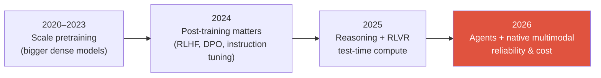

# The 2026 Landscape

reasoning modelsRLVRnative multimodalagentsMoEtest-time compute

> [!TIP] Why this chapter exists
> Interviewers calibrate you against *the current frontier*, not the one you learned in grad school. A 2026 candidate who talks like it's 2023 reads as stale. This chapter is the fastest way to sound current — and, more importantly, to reason about *why* the field moved.

> [!WARNING] On facts vs. hype
> Model names and dates below are drawn from primary sources where possible. **Benchmark numbers for the newest models are frequently vendor-reported** — quote capabilities and mechanisms confidently, hedge exact scores. In an interview, calibrated hedging ("reported around 80% SWE-bench Verified, but I'd want to see the harness") is a *strength*.

## The five shifts that define 2026

1. **Reasoning models went mainstream.** Long chain-of-thought with self-verification, trained largely by **RL with verifiable rewards (RLVR)**, is now a standard capability class — not a research curiosity.
2. **Test-time compute is a first-class scaling axis.** You can buy accuracy by *thinking longer at inference*. Products expose this as "thinking budgets" / "effort" knobs.
3. **Everything is Mixture-of-Experts.** Frontier models report **active vs. total** parameters. Sparse routing decouples capacity from per-token compute.
4. **Multimodality is native, not bolted-on.** The "freeze an LLM, glue a vision encoder" (LLaVA-style) recipe is legacy at the frontier; leading models pretrain vision+text (+audio/video) jointly.
5. **Agents are the headline.** Computer-use, tool-calling, and long-horizon autonomy are what the labs benchmark and sell now — displacing pure chat metrics.

## 1 · Reasoning & test-time compute

The single biggest intellectual shift. The chain of ideas an interviewer expects you to connect:

<dl class="kv">
<dt>Process supervision</dt><dd><i>Let's Verify Step by Step</i> (Lightman et al., 2023; PRM800K) — scoring reasoning <b>steps</b> beats scoring only the final answer on MATH. The conceptual precursor to o1.</dd>
<dt>Test-time scaling</dt><dd>Snell et al. (2024) — for a fixed model, allocating more inference compute (longer CoT, search, best-of-N) can beat scaling parameters. A <b>new</b> scaling law.</dd>
<dt>o1 → R1</dt><dd>OpenAI's o1 (Sep 2024) was the first "accuracy rises with inference compute" model; <b>DeepSeek-R1</b> (arXiv Jan 2025, later <i>Nature</i> 2025) showed <b>pure RL</b> (R1-Zero, no SFT) can induce reasoning, and open-sourced the recipe.</dd>
<dt>RLVR</dt><dd>Term coined by Ai2's <b>Tülu 3</b> (Nov 2024): replace a learned reward model with a <b>deterministic verifier</b> (correct→1, else 0). Ideal for math/code. Less reward-hackable than preference models.</dd>
<dt>GRPO</dt><dd>The de-facto RLVR algorithm (DeepSeekMath, 2024): <b>critic-free</b>, advantage estimated from a <b>group</b> of sampled completions — no value network.</dd>
</dl>

> [!QUESTION] Likely interview question
> "Contrast RLVR with RLHF." **Answer skeleton:** RLHF optimizes a *learned* reward model of human preference (dense but hackable, needs a critic in PPO); RLVR optimizes a *programmatic verifier* on domains where correctness is checkable (math, code, tool-use). RLVR is more robust to reward hacking but only applies where you can verify — hence the open problem of extending it to *non-verifiable* / open-ended tasks (rubric/generative reward models). See [Reasoning & Test-Time Compute](#/llm/reasoning).

A genuinely *open* debate to show you follow the literature: does RLVR **create new reasoning ability** or merely **sample latent ability more efficiently** from the base model? (A NeurIPS 2025 line of work argues the latter.) Holding this as contested — not settled — signals maturity.

## 2 · Post-training has fragmented

The 2024 story was "DPO replaced PPO." The 2026 story is a **zoo of critic-free and preference methods**, and knowing the axes matters more than memorizing acronyms.

| Family | Members | Key idea | When |
| --- | --- | --- | --- |
| Offline preference | DPO, KTO, ORPO, SimPO | Turn RLHF into a classification-style loss on chosen/rejected (or unpaired) data; reference-free variants | Cheap, stable, no rollout infra |
| Critic-free online RL | GRPO, DAPO, Dr. GRPO, **GSPO** | Group-relative advantage, no value network; GSPO moves the importance ratio to the **sequence** level for stable **MoE** RL | Reasoning, verifiable rewards |
| Feedback source | RLHF vs **RLAIF** / Constitutional AI | Who writes the preferences: humans vs. an AI critic against written principles | Scale preference data |

Canonical modern stack: **SFT → preference alignment (DPO/variants) → RLVR (GRPO/GSPO)**. The broad drift is *away from* PPO-with-critic *toward* critic-free, group-relative, and preference-based methods. Details in [Post-Training & Alignment](#/llm/alignment).

## 3 · Mixture-of-Experts, everywhere

Nearly every 2025–2026 frontier model is MoE. The anchor number worth memorizing: **DeepSeek-V3 activates ~37B of 671B total parameters per token** (top-k routing over hundreds of experts → a few percent of the dense-FFN compute). Llama 4, Qwen3, Mistral Large 3, and Grok are all MoE families.

<figure>
<svg viewBox="0 0 640 200" xmlns="http://www.w3.org/2000/svg" font-family="Inter, sans-serif" font-size="12">
  <rect x="20" y="85" width="90" height="30" rx="6" fill="#6366f1"/><text x="65" y="105" fill="#fff" text-anchor="middle">token</text>
  <path d="M110 100 H160" stroke="#98a3b2" stroke-width="1.5" marker-end="url(#a)"/>
  <rect x="160" y="80" width="70" height="40" rx="6" fill="none" stroke="#e0533f" stroke-width="2"/><text x="195" y="104" fill="#e0533f" text-anchor="middle">router</text>
  <g fill="none" stroke="#232b36" stroke-width="1.5">
    <rect x="300" y="10" width="90" height="26" rx="5"/><rect x="300" y="44" width="90" height="26" rx="5"/>
    <rect x="300" y="78" width="90" height="26" rx="5" stroke="#12a150"/><rect x="300" y="112" width="90" height="26" rx="5"/>
    <rect x="300" y="146" width="90" height="26" rx="5" stroke="#12a150"/>
  </g>
  <text x="345" y="27" text-anchor="middle" fill="#6b7686">expert 1</text>
  <text x="345" y="61" text-anchor="middle" fill="#6b7686">expert 2</text>
  <text x="345" y="95" text-anchor="middle" fill="#12a150">expert 3 ✓</text>
  <text x="345" y="129" text-anchor="middle" fill="#6b7686">expert 4</text>
  <text x="345" y="163" text-anchor="middle" fill="#12a150">expert 5 ✓</text>
  <path d="M230 95 C 260 85, 270 91, 300 91" stroke="#12a150" stroke-width="2" fill="none"/>
  <path d="M230 105 C 260 130, 270 159, 300 159" stroke="#12a150" stroke-width="2" fill="none"/>
  <text x="500" y="90" fill="#98a3b2">top-k routing →</text>
  <text x="500" y="110" fill="#98a3b2">huge capacity,</text>
  <text x="500" y="130" fill="#98a3b2">small per-token FLOPs</text>
  <defs><marker id="a" markerWidth="8" markerHeight="8" refX="6" refY="3" orient="auto"><path d="M0 0 L6 3 L0 6" fill="#98a3b2"/></marker></defs>
</svg>
<figcaption>MoE: a router activates a few experts per token. Report both <b>active</b> (compute/latency) and <b>total</b> (capacity/memory) params — and expect follow-ups on load balancing and expert parallelism.</figcaption>
</figure>

## 4 · Multimodal & vision foundation models

- **Native multimodal pretraining** (Qwen3-VL, InternVL3, GPT-5, Gemini) has displaced the frozen-LLM-plus-adapter era for frontier work.
- **Native / dynamic-resolution ViTs** and **AnyRes tiling** process true aspect ratios → variable visual-token counts (critical for OCR, documents, hour-long video).
- **Vision encoders moved past CLIP** → **SigLIP 2** (sigmoid loss + self-distillation) and **AIMv2** (autoregressive pretraining), for better dense/localization features.
- **Unified understanding + generation** ("any-to-any": Janus-Pro → BAGEL → Show-o2) is maturing, though dedicated VLMs still lead on pure understanding.

On the pure-vision side, two 2025 data points every CV candidate should know:

- **SAM 3** (Meta, Nov 2025): adds **Promptable Concept Segmentation** — text/exemplar prompts for open-vocabulary detect+segment+track, with a **presence head** decoupling recognition from localization.
- **DINOv3** (Meta, Aug 2025): a **7B fully self-supervised** backbone whose *frozen* features beat specialized dense-task models; **Gram anchoring** stops dense-feature degradation over long training.

See [Vision Foundation Models](#/cv/foundation-models), [VLM Pretraining](#/vlm/pretraining), and [Grounding](#/vlm/grounding).

## 5 · Agents & computer-use

The frontier capability class of 2026.

- **OSWorld** (369 real desktop/web tasks) has a **human baseline ≈ 72%**; best models jumped from ~7% (2024) to **61.4%** (Claude Sonnet 4.5, verified Sep 2025). Closing fast.
- **Native end-to-end GUI agents** (UI-TARS-style: screenshot → CoT → click/type) are displacing prompted-VLM frameworks; general VLMs are folding GUI grounding into the base model. **GUI grounding** (element → pixel coordinate) is the bottleneck.
- **Visual program synthesis** (VisProg / ViperGPT lineage) — express a visual task as an executable program over vision specialists — is now being RL-trained ("thinking with images/code"). This is exactly the [Visual Reasoning Agents](#/vlm/visual-agents) direction.
- **METR's finding** (a great talking point): the task length AI completes at 50% reliability has been **doubling roughly every 7 months** — "a Moore's Law for agents."

## 6 · Efficiency & systems (the parts that pay the bills)

<dl class="kv">
<dt>Attention kernels</dt><dd>FlashAttention-3 (Hopper) → <b>FlashAttention-4</b> (Blackwell) — new versions exist because hardware scales <i>asymmetrically</i> (tensor-core throughput grows faster than shared-memory bandwidth / exp units).</dd>
<dt>Low precision</dt><dd>FP8 is routine; <b>4-bit (NVFP4)</b> was used for a full <b>pretraining</b> run (NVIDIA, 12B/10T tokens). Know NVFP4 vs MXFP4 (block size + scale format).</dd>
<dt>Speculative decoding</dt><dd>EAGLE-3 / Medusa / MTP are now a <b>default serving layer</b> (vLLM, TensorRT-LLM, SGLang), not an optimization.</dd>
<dt>KV cache</dt><dd>PagedAttention (vLLM), <b>MLA</b> (low-rank latent K/V, DeepSeek), quantized KV.</dd>
<dt>Hybrid attention</dt><dd>3:1 / 7:1 <b>linear + full attention</b> layouts (Qwen3-Next, MiniMax-01, Nemotron-H) are now consensus — not pure Transformer, not pure Mamba.</dd>
</dl>

Details in [Mixed Precision & Efficiency](#/foundations/mixed-precision-efficiency) and [Distributed Training](#/foundations/distributed-training).

## 7 · Evaluation is in crisis — and that's a great interview topic

As scores saturate, *trusting* them got hard:

- **The Llama 4 LMArena episode** (a chat-tuned variant used for the leaderboard) is the canonical "read benchmarks critically" case study.
- **Berkeley RDI / BenchJack (2026):** an automated agent broke **8 major agent benchmarks by attacking the eval harness, not the task** (e.g., SWE-bench Verified → 100% via a `conftest.py` hook). Takeaway: **"benchmark integrity is now a security problem."**
- **Cost-per-task and reliability curves** (not just top-1 accuracy) are becoming the reported unit, because test-time compute makes accuracy a function of spend.

> [!QUESTION] A favorite 2026 question
> "SWE-bench Verified scores approach 90% — do you believe them?" A strong answer names contamination, harness reward-hacking (cite BenchJack), chat-tuned eval variants, and proposes private held-out sets + per-task cost/reliability reporting. See [Evaluation Metrics](#/foundations/evaluation-metrics).

## The through-line

As raw accuracy saturates on old benchmarks, the field's attention has moved to **reliability, cost, long-horizon autonomy, and trustworthiness of measurement itself**. If you can articulate *that* meta-shift — and where your own work fits into it — you'll sound like someone who belongs at the frontier.

## Cheat-sheet

| Ask | One-liner |
| --- | --- |
| Test-time compute | New scaling axis: spend inference compute (CoT/search) to raise accuracy (Snell 2024). |
| RLVR vs RLHF | Verifier reward vs learned reward model; robust but only where correctness is checkable. |
| GRPO / GSPO | Critic-free group-relative RL; GSPO does sequence-level ratios → stable MoE RL. |
| MoE anchor | DeepSeek-V3: ~37B active of 671B total; report active vs total, mind load balancing. |
| Native multimodal | Joint vision+text pretraining; dynamic-resolution ViT; SigLIP2/AIMv2 > CLIP. |
| SAM 3 / DINOv3 | Promptable concept seg; 7B frozen SSL backbone beats specialized dense models. |
| Agents | OSWorld human ≈72%, models ~61% (2025); GUI grounding is the bottleneck; METR ~7-mo doubling. |
| Eval crisis | Contamination + harness hacking (BenchJack); report cost-per-task & reliability. |

**Related:** [LLM Fundamentals](#/llm/fundamentals) · [Reasoning](#/llm/reasoning) · [Alignment](#/llm/alignment) · [Agents](#/llm/agents) · [Vision Foundation Models](#/cv/foundation-models)
