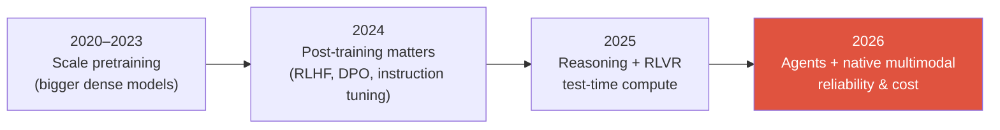

# The 2026 Landscape

reasoning modelsRLVRnative multimodalagentsMoEtest-time compute

> [!TIP] Why this chapter exists
> If a role works on current research, interviewers may also assess whether you understand today's problem formulations and evaluation practices. Rather than asking you to memorize buzzwords, this chapter gives a quick July 2026 snapshot of *why* the major shifts happened and how far the evidence goes.

> [!WARNING] On fact versus hype
> The model names and dates below come from primary sources whenever possible. **Many benchmark numbers for current models are vendor-reported** — cite capabilities and mechanisms confidently, but treat exact scores carefully. Calibrated caution in an interview ("SWE-bench Verified has been reported at roughly 80%, but I would want to inspect the harness") is a *strength*.

> [!NOTE] Currency boundary
> Last comprehensive review: **2026-07-21**. What follows is a snapshot at that date, not a set of permanent textbook definitions. Distinguish `vendor-reported` results, preprints, and independent evaluations, and inspect the evaluation protocol, cost, and failure distribution before relying on rankings.

## Seven axes for reading 2026

1. **Reasoning models became a major product category.** Several model families improve math, coding, and planning with inference budgets and post-training. Their recipes vary across RLVR, preference optimization, distillation, and other methods; this does not mean a model's internal chain of thought is exposed verbatim to users.
2. **Test-time compute became a first-class scaling axis.** You can buy accuracy by letting a model *reason longer at inference time*. Products expose this as a "thinking budget" or "effort" control.
3. **Mixture-of-Experts became a major scaling option.** Sparse routing partly decouples model capacity from per-token compute. Not every frontier model is an MoE, however, and closed models often do not disclose their architecture.
4. **Multimodal learning moved earlier in training.** Recent models use multimodal data during pretraining or large-scale continual-training stages. This is a statement about the user experience and training recipe, not a requirement that the model use one shared transformer. A native-multimodal model may still retain a separate vision encoder and projector.
5. **Agents expanded into a major evaluation category.** Computer use, tool calling, and long-horizon task completion are now evaluated alongside chat quality.
6. **Efficiency is inseparable from model quality.** Low precision, attention kernels, KV caches, and speculative decoding determine the cost and latency at which a given level of quality can be delivered.
7. **Evaluation reliability became a research problem of its own.** A score should be accompanied by a versioned harness, contamination analysis, cost, repeated-run reliability, and a failure distribution.

## 1 · Reasoning & test-time compute

The following chain of ideas is useful when explaining how your work connects to a current reasoning role.

<dl class="kv">
<dt>Process supervision</dt><dd><i>Let's Verify Step by Step</i> (Lightman et al., 2023; PRM800K) — on MATH, scoring reasoning <b>steps</b> worked better than scoring only the final answer. A conceptual precursor to o1.</dd>
<dt>Test-time scaling</dt><dd>Snell et al. (2024) — in the settings studied, allocating more inference compute to a fixed model through search, best-of-N, or adaptive allocation could be more efficient than adding pretraining compute. The effect depends on problem difficulty, the verifier, and the allocation policy.</dd>
<dt>o1 → R1</dt><dd>OpenAI's o1 (September 2024) made inference-time reasoning a widely visible product axis. <b>DeepSeek-R1</b> (arXiv January 2025; later <i>Nature</i> 2025) reported observed reasoning behavior from RL without SFT in R1-Zero and released a technical report and model artifacts. Do not generalize this into one recipe shared by every reasoning model.</dd>
<dt>RLVR</dt><dd>A term popularized by Ai2's <b>Tülu 3</b> (November 2024): reinforcement learning from signals whose outcomes can be checked by tests, symbolic rules, or graders instead of a learned preference reward. The reward need not be binary or flawless; the verifier and harness can themselves be attacked or misdesigned.</dd>
<dt>GRPO</dt><dd>One critic-free family used widely in RLVR (DeepSeekMath, 2024): estimate advantage from a group of sampled completions without a separate value network. Failure modes such as group variance, length bias, and difficulty imbalance remain.</dd>
</dl>

> [!QUESTION] Likely interview question
> "Contrast RLVR with RLHF." **Answer spine:** conventional RLHF optimizes a reward model learned from human preferences, whereas RLVR uses verifier signals for outcomes that can be checked in domains such as math, code, and tool use. Neither is automatically safe. A learned reward can be exploited as a proxy, while a verifier can be gamed through incomplete tests or harness flaws. For open-ended work, combine rubrics or judge models with human audit. See [Reasoning & Test-Time Compute](#/llm/reasoning).

A genuinely *open* debate that shows you follow the literature is how to separate the extent to which RLVR **learns new reasoning strategies** from the extent to which it **reweights or resamples existing successful paths** in the base model. The task, base model, verifier, and analysis differ across studies, so do not present one conclusion as universal.

## 2 · Post-training has fragmented

The 2024 story was "DPO replaced PPO." The 2026 story is a **zoo of critic-free and preference methods**; knowing the axes matters more than memorizing acronyms.

| Family | Members | Core idea | When it fits |
| --- | --- | --- | --- |
| Offline preference | DPO, KTO, ORPO, SimPO | Turn RLHF into a classification-style loss over chosen/rejected—or unpaired—data; includes reference-free variants | Cheaper, stable, no rollout infrastructure |
| Critic-free online RL | GRPO, DAPO, Dr. GRPO, **GSPO** | Group-relative advantage without a separate value network; the GSPO paper reports that sequence-level importance ratios stabilize MoE RL better than token-level alternatives | Reasoning, verifiable rewards |
| Feedback source | RLHF versus **RLAIF** / Constitutional AI | Who produces preferences: humans versus an AI critic applying codified principles | Scaling preference data |

A common recipe family is **SFT → preference optimization → online RL/RLVR**, but not every model uses every stage or follows this order. Depending on data, tasks, and infrastructure, a model may use SFT alone, combine online preference learning with RLVR, or continue using PPO-family methods. See [Post-Training & Alignment](#/llm/alignment) for details.

## 3 · Mixture-of-Experts, an important option

Several large public models released in 2025–2026 use MoE, while dense models remain important. One public anchor is **DeepSeek-V3, reported as activating about 37B of 671B total parameters per token**. When citing the number, check how shared parameters are counted and how active parameters are defined. Llama 4, some Qwen3 variants, and Mistral Large 3 are also MoE families, but none of this reveals the architecture of an undisclosed model.

<figure>
<svg viewBox="0 0 640 200" xmlns="http://www.w3.org/2000/svg" font-family="Inter, sans-serif" font-size="12">
  <rect x="20" y="85" width="90" height="30" rx="6" fill="#6366f1"/><text x="65" y="105" fill="#fff" text-anchor="middle">token</text>
  <path d="M110 100 H160" stroke="#98a3b2" stroke-width="1.5" marker-end="url(#a)"/>
  <rect x="160" y="80" width="70" height="40" rx="6" fill="none" stroke="#e0533f" stroke-width="2"/><text x="195" y="104" fill="#e0533f" text-anchor="middle">router</text>
  <g fill="none" stroke="#232b36" stroke-width="1.5">
    <rect x="300" y="10" width="90" height="26" rx="5"/><rect x="300" y="44" width="90" height="26" rx="5"/>
    <rect x="300" y="78" width="90" height="26" rx="5" stroke="#12a150"/><rect x="300" y="112" width="90" height="26" rx="5"/>
    <rect x="300" y="146" width="90" height="26" rx="5" stroke="#12a150"/>
  </g>
  <text x="345" y="27" text-anchor="middle" fill="#6b7686">expert 1</text>
  <text x="345" y="61" text-anchor="middle" fill="#6b7686">expert 2</text>
  <text x="345" y="95" text-anchor="middle" fill="#12a150">expert 3 ✓</text>
  <text x="345" y="129" text-anchor="middle" fill="#6b7686">expert 4</text>
  <text x="345" y="163" text-anchor="middle" fill="#12a150">expert 5 ✓</text>
  <path d="M230 95 C 260 85, 270 91, 300 91" stroke="#12a150" stroke-width="2" fill="none"/>
  <path d="M230 105 C 260 130, 270 159, 300 159" stroke="#12a150" stroke-width="2" fill="none"/>
  <text x="500" y="90" fill="#98a3b2">top-k routing →</text>
  <text x="500" y="110" fill="#98a3b2">huge capacity,</text>
  <text x="500" y="130" fill="#98a3b2">small per-token FLOPs</text>
  <defs><marker id="a" markerWidth="8" markerHeight="8" refX="6" refY="3" orient="auto"><path d="M0 0 L6 3 L0 6" fill="#98a3b2"/></marker></defs>
</svg>
<figcaption>MoE: the router activates a few experts for each token. Report both <b>active</b> parameters (compute/latency) and <b>total</b> parameters (capacity/memory), and expect follow-ups on load balancing and expert parallelism.</figcaption>
</figure>

## 4 · Multimodal & vision foundation models

- **Earlier integration of multimodal pretraining**—for example, the InternVL3 family—illustrates a shift toward using image-text data throughout training rather than attaching an adapter only during instruction tuning. Do not infer the internal architecture of a closed model without public evidence.
- **Native- or dynamic-resolution ViTs** and **AnyRes tiling** are options for handling varied aspect ratios with a variable number of visual tokens. The resolution–token-budget trade-off is especially important for OCR, documents, and long video.
- Vision-encoder choices have **expanded beyond CLIP-family models.** For example, **SigLIP 2** and **AIMv2** use different objectives and training recipes and are also evaluated for dense or localization features.
- **Unified understanding and generation** ("any-to-any": Janus-Pro → BAGEL → Show-o2) is an active direction. Compare it with specialized models separately for each task, evaluation protocol, and cost regime.

Two useful public examples from 2025 when discussing current pure-vision directions:

- **SAM 3** (Meta, November 2025): added **Promptable Concept Segmentation**, expanding detection, segmentation, and tracking through text or exemplar concepts. A later **SAM 3.1** update means capabilities and speed must be attributed to a specific version.
- **DINOv3** (Meta, August 2025): reported self-supervised vision backbones up to 7B parameters and Gram anchoring. Frozen-feature advantages are results within the paper's evaluated tasks and protocols, not a universal claim over every specialized model.

See [Vision Foundation Models](#/cv/foundation-models), [VLM Pretraining](#/vlm/pretraining), and [Grounding](#/vlm/grounding).

## 5 · Agents & computer use

A frontier capability category in 2026:

- **OSWorld** evaluates real desktop and web interaction, but scores vary with the environment, version, human intervention, and whether results are self-reported or verified. Sonnet 4.5's 61.4% in 2025 was an Anthropic vendor-reported snapshot at that time; do not put it on one undifferentiated line with later model announcements.
- **Native end-to-end GUI agents** (UI-TARS style: screenshot → reasoning/action → click/type) and prompted orchestration frameworks are being explored in parallel. GUI grounding (element → pixel coordinate), state-change recognition, and long-horizon recovery remain representative challenges.
- **Visual program synthesis** in the VisProg / ViperGPT lineage represents visual tasks as executable programs over specialist tools. Some later systems combine this approach with RL. [Visual Reasoning Agents](#/vlm/visual-agents) covers this design axis.
- **METR's time-horizon research** reports an empirical trend in which the length of software tasks agents can complete with 50% success has grown rapidly. The estimated doubling time varies substantially with the analysis window and methodology, however, and uncertainty is wide. "About seven months" was an early summary value, not a universal law.

## 6 · Efficiency & systems — the parts that pay the bills

<dl class="kv">
<dt>Attention kernels</dt><dd>FlashAttention-3 (Hopper) → <b>FlashAttention-4</b> (Blackwell) — a new version exists because hardware scales <i>asymmetrically</i>: tensor-core throughput has grown faster than shared-memory bandwidth and exponential units.</dd>
<dt>Low precision</dt><dd>FP8 training and inference have become more common on supported recent hardware/software stacks. NVIDIA research reports a 12B/10T-token pretraining experiment with <b>NVFP4</b>, but this does not make the format lossless or the default for every model and device. When comparing formats, inspect block size, scale format, accumulator, and evaluation protocol.</dd>
<dt>Speculative decoding</dt><dd>EAGLE/Medusa/MTP-family methods are widely supported serving options. They help when draft overhead, acceptance rate, batch shape, and the latency target align; correct rejection or residual sampling is required to preserve the target distribution.</dd>
<dt>KV cache</dt><dd>PagedAttention (vLLM), <b>MLA</b> (low-rank latent K/V, DeepSeek), and quantized KV.</dd>
<dt>Hybrid attention</dt><dd>Several mixtures of linear or state-space blocks with full attention are being explored. Ratios such as 3:1 or 7:1 are design points from particular public models, not a universally agreed ratio.</dd>
</dl>

See [Mixed Precision & Efficiency](#/foundations/mixed-precision-efficiency) and [Distributed Training](#/foundations/distributed-training) for details.

## 7 · Evaluation is in crisis — and that is a great interview topic

As scores on some popular benchmarks rise, determining what those scores mean and whether they are reproducible has become more important.

- Public leaderboards are hard to compare directly when model aliases, sampling settings, hidden prompts, judges, and decontamination conditions differ. More important than memorizing an incident name is the habit of requesting **versioned artifacts and a reproducible harness**.
- **BenchJack (2026 preprint):** the paper identifies 219 exploitable flaws across 10 popular agent benchmarks and demonstrates that many can be scored highly without solving the intended task. Do not confuse the eight demonstrations summarized in a blog post with the ten benchmarks audited in the paper. The lesson is that **benchmark integrity is also a security problem**.
- **Cost per task and reliability curves** should accompany top-1 accuracy. Increasing test-time compute moves latency and cost along with accuracy.

> [!QUESTION] A favorite 2026 question
> "Very high scores are being reported on SWE-bench-family evaluations. How would you verify them?" A strong answer checks the benchmark and model version, contamination, harness exploits, sampling budget, and verification status, then proposes a private held-out set and reports per-task cost and repeated-run success. See [Evaluation Metrics](#/foundations/evaluation-metrics).

## The thread running through it all

As raw accuracy saturates on existing benchmarks, attention is shifting toward **reliability, cost, long-horizon autonomy, and the trustworthiness of measurement itself**. If you can explain *that* meta-shift—and where your own work fits within it—you will sound like someone working at the frontier.

## Cheat sheet

| Question | One-line answer |
| --- | --- |
| Test-time compute | A new scaling axis: spend inference compute on CoT/search to improve accuracy (Snell 2024). |
| RLVR vs RLHF | Verifier signal versus learned preference reward; both can game a proxy or harness and require audit. |
| GRPO / GSPO | Critic-free group-relative RL; the GSPO paper reports better MoE stability with a sequence-level ratio. |
| MoE anchor | DeepSeek-V3: ~37B active of 671B total; report active versus total and watch load balancing. |
| Native multimodal | Multimodal data is integrated earlier in training; it does not necessarily imply a single-transformer architecture. |
| SAM 3 / DINOv3 | Promptable concept segmentation; up-to-7B SSL backbone with Gram anchoring—state the version and evaluation scope. |
| Agents | Separate verified/vendor OSWorld results and environment versions; METR doubling is a methodology-dependent trend, not a law. |
| Evaluation crisis | Contamination plus harness hacking (BenchJack); report cost per task and reliability. |

**Related:** [LLM Fundamentals](#/llm/fundamentals) · [Reasoning](#/llm/reasoning) · [Alignment](#/llm/alignment) · [Agents](#/llm/agents) · [Vision Foundation Models](#/cv/foundation-models)

## Primary sources used for this update

- [Tülu 3: RL with Verifiable Rewards](https://arxiv.org/abs/2411.15124) · [GSPO](https://arxiv.org/abs/2507.18071)
- [Official SAM 3 / SAM 3.1 overview](https://ai.meta.com/blog/segment-anything-model-3/) · [Official DINOv3 publication](https://ai.meta.com/research/publications/dinov3/)
- [FlashAttention-4](https://arxiv.org/abs/2603.05451) · [NVIDIA NVFP4 pretraining report](https://arxiv.org/abs/2509.25149)
- [METR time horizons](https://metr.org/time-horizons/) · [BenchJack](https://arxiv.org/abs/2605.12673)

> [!NOTE] How to read the sources
> A paper or official document is a primary source for **what its authors reported**. It does not automatically establish that the result was independently reproduced or remains state of the art.
