# An 8-Week Prep Plan

> [!TIP] 시간이 더 없다면
> **2주:** Weeks 7–8만(mock + CV deep-dive + coding 워밍업). **4주:** Weeks 5–8. 이 계획은 앞쪽에 foundations를, 뒤쪽에 integration을 배치했으니, 앞부분을 잘라내는 것이 올바른 우선순위 조정입니다.

research/applied loop는 "끝낼" 수 있을 만큼 좁지 않습니다. 목표는 커버리지가 아니라 — 가장 강한 이야기를 준비 없이도 술술 나올 만큼 리허설한 상태로 **네 축에 걸친 보정된 준비도**입니다. 이 계획은 직장과 병행하며 주당 ~10–12시간의 집중 시간을 가정합니다.

## 전체 형태

```mermaid
gantt
    dateFormat  X
    axisFormat %s
    section Foundations
    Coding patterns        :0, 2
    ML/DL foundations      :0, 3
    section Depth
    Your specialty (CV/VLM):1, 4
    LLM/agents 2026        :2, 4
    section Integration
    System design          :3, 6
    Research + CV deep-dive:3, 7
    section Polish
    Behavioral + mocks     :5, 8
    Company-specific       :6, 8
```

## 주차별

### Weeks 1–2 · coding 반사신경 재구축
- **[core patterns](#/coding/patterns)** 를 순서대로 작업하세요. 양으로 갈아 넣지 말고 — 패턴 *하나당* 3–5문제를 풀고, 그 패턴을 촉발하는 cue를 말할 수 있게 하세요.
- **[ML-from-scratch](#/ml-coding/intro)** 고전들을 재구현하세요: IoU/NMS, conv, softmax-attention, k-means. 이것들이 research 직무의 차별점이고 *유한*합니다.
- **매일:** timed medium 하나를, 소리 내어 설명하면서. 전달력은 채점되는 항목입니다 — [communication chapter](#/playbook/communication) 참조.

### Weeks 2–3 · 반드시 질문받을 foundations
- **[Optimization](#/foundations/optimization)**, **[normalization & stability](#/foundations/normalization-stability)**, **[regularization](#/foundations/regularization-generalization)**, **[evaluation metrics](#/foundations/evaluation-metrics)**.
- linear layer와 softmax-CE를 통과하는 backprop을 손으로 유도하고, BN 대 LN을 설명하고, buzzword 없이 bias–variance에 대해 추론할 수 있어야 합니다.

### Weeks 3–4 · 전문 분야, 깊게
- 자기 영역을 완벽하게 장악하세요: CV 후보자라면 **[segmentation](#/cv/segmentation)**, **[detection](#/cv/detection)**, **[matting](#/cv/matting)**, **[foundation models](#/cv/foundation-models)**.
- 병행해서, **[LLM fundamentals](#/llm/fundamentals)**, **[alignment](#/llm/alignment)**, **[reasoning](#/llm/reasoning)**, **[agents](#/llm/agents)** 를 최신 상태로 만드세요 — 2026 loop는 CV 직무에서도 여기에 대한 유창함을 가정합니다.

### Weeks 4–6 · system design + research framing
- scoping이 자동으로 될 때까지 **[design framework](#/system-design/framework)** 를 5–6개 prompt로 반복 연습하세요; **[LLM/agent system design](#/system-design/llm-systems)** 을 추가하세요.
- **[research job talk](#/research/job-talk)** 을 만들고, 각 **[CV deep-dive](#/resume/overview)** 를 2분 pitch → 10분 deep-dive로 리허설하세요.

### Weeks 6–7 · behavioral + 회사별 타겟팅
- **[STAR story bank](#/behavioral/star)** 를 작성하세요(conflict, failure, leadership, impact를 다루는 6–8개 이야기).
- 각 타겟에 대한 **[company playbook](#/process/companies)** 을 읽고, 여러분의 이야기/프로젝트를 그들의 signal과 research 방향에 매핑하세요.

### Weeks 7–8 · 압박 속에서의 통합
- 모든 축에 대한 **Mock interviews** — 이상적으로는 여러분의 타겟에서 면접 본 적 있는 사람들과. 이만큼 빠르게 쌓이는 건 없습니다.
- mock이 드러낸 상위 3개 약점을 고치세요. 가장 좋은 두 이야기와 대표 프로젝트를 힘들이지 않을 만큼 다시 리허설하세요.
- Taper: 마지막 이틀은 새 자료가 아니라 **수면과 물류**를 위한 것입니다.

## 간단한 준비도 점수표

매주 1–5로 자기 평가하세요; 3 미만이 하나도 없고 전문 분야 + 이야기 하나가 5일 때 면접을 보세요.

| 축 | 1 (불안) | 3 (통과 가능) | 5 (강함) |
| --- | --- | --- | --- |
| Coding | Medium에서 얼어붙음 | Medium을 풀고, 설명함 | 깔끔한 코드 + 테스트, edge case, complexity, 침착함 |
| ML breadth | 사실을 떠올림 | *왜*인지 설명함 | 가르치고, failure mode와 2026 현황을 앎 |
| Specialty depth | 논문을 요약함 | 설계 선택을 방어함 | 분야를 비평하고, 다음 단계를 제안함 |
| System design | 컴포넌트를 나열함 | Scope + 설계 하나 | Trade-off, metric, data, serving, failure mode |
| Research talk | 결과를 서술함 | 동기 + 방법 | Impact story, 모든 reviewer 질문을 예상 |
| Behavioral | 횡설수설 | STAR 구조 | 간결하고, "나" 중심이며, 성찰적 |

> [!NOTE] 기록하세요
> 스터디 세션마다 한 줄 로그를 남기세요(무엇을, 어땠는지, 무엇을 다시 볼지). [changelog](#/resources/changelog) 패턴은 여러분의 준비에도 통합니다 — append-only, 실수를 절대 삭제하지 말 것, 그게 여러분의 성장 기록입니다.
