# 2·4·8주 준비 플랜

> [!TIP] 시간이 더 없다면
> 뒤쪽 주차만 잘라 쓰지 마세요. **2주:** 진단 1회 → 매일 coding/ML retrieval → 대표 프로젝트·STAR → 축별 mock 순으로 압축합니다. **4주:** 아래 8주 계획의 각 두 주를 한 주로 합치되, foundation과 integration을 모두 남깁니다. 자세한 압축안은 아래에 있습니다.

research/applied loop는 "끝낼" 수 있을 만큼 좁지 않습니다. 목표는 커버리지가 아니라 — 가장 강한 이야기를 준비 없이도 술술 나올 만큼 리허설한 상태로 **네 축에 걸친 보정된 준비도**입니다. 이 계획은 직장과 병행하며 주당 ~10–12시간의 집중 시간을 가정합니다.

## Week 0 · 먼저 진단하고 범위를 고정하세요

준비를 시작하기 전에 90분짜리 mini-loop를 한 번 치릅니다: timed coding 35분, ML breadth 구두 질문 20분, 대표 프로젝트 설명 15분, system-design scoping 10분, behavioral 10분. 각 축을 아래 점수표로 채점하고 **상위 세 결함만** backlog에 둡니다. 동시에 recruiter에게 실제 라운드 구성, 실행 환경, 허용 도구, 발표 형식과 시간을 확인하세요. 회사 이름만 보고 loop를 추정하지 않습니다.

2주·4주 압축 경로

**2주:** 1–3일차 진단과 coding/ML 핵심 복구 → 4–7일차 specialty·대표 프로젝트·system design → 8–10일차 STAR·job talk·회사 조사 → 11–13일차 축별 mock과 오답 수정 → 14일차 taper. 매일 30–45분 coding과 20분 구두 retrieval은 유지합니다.

**4주:** 1주차 coding + foundations, 2주차 specialty + frontier breadth, 3주차 system design + research/behavioral, 4주차 회사별 조정 + full-loop mock. 약한 축이 확인되면 시간의 절반을 그 축에 배정합니다.

## 전체 형태

```mermaid
gantt
    dateFormat  X
    axisFormat %s
    section Foundations
    Coding patterns        :0, 2
    ML/DL foundations      :0, 3
    section Depth
    Your specialty (CV/VLM):1, 4
    LLM/agents 2026        :2, 4
    section Integration
    System design          :3, 6
    Research + CV deep-dive:3, 7
    section Polish
    Behavioral + mocks     :5, 8
    Company-specific       :6, 8
```

## 주차별

### Weeks 1–2 · coding 반사신경 재구축
- **[core patterns](#/coding/patterns)** 를 순서대로 작업하세요. 양으로 갈아 넣지 말고 — 패턴 *하나당* 3–5문제를 풀고, 그 패턴을 촉발하는 cue를 말할 수 있게 하세요.
- **[ML-from-scratch](#/ml-coding/intro)** 고전들을 재구현하세요: IoU/NMS, conv, softmax-attention, k-means. 이것들이 research 직무의 차별점이고 *유한*합니다.
- **매일:** timed medium 하나를, 소리 내어 설명하면서. 전달력은 채점되는 항목입니다 — [communication chapter](#/playbook/communication) 참조.

### Weeks 2–3 · 반드시 질문받을 foundations
- **[Optimization](#/foundations/optimization)**, **[normalization & stability](#/foundations/normalization-stability)**, **[regularization](#/foundations/regularization-generalization)**, **[evaluation metrics](#/foundations/evaluation-metrics)**.
- linear layer와 softmax-CE를 통과하는 backprop을 손으로 유도하고, BN 대 LN을 설명하고, buzzword 없이 bias–variance에 대해 추론할 수 있어야 합니다.

### Weeks 3–4 · 전문 분야, 깊게
- 자기 영역의 대표 문제·trade-off·failure mode를 깊게 방어하세요: CV 후보자라면 **[segmentation](#/cv/segmentation)**, **[detection](#/cv/detection)**, **[matting](#/cv/matting)**, **[foundation models](#/cv/foundation-models)**.
- 병행해서 **[LLM fundamentals](#/llm/fundamentals)**, **[alignment](#/llm/alignment)**, **[reasoning](#/llm/reasoning)**, **[agents](#/llm/agents)** 를 훑으세요. CV 직무에서도 요구될 수 있지만 깊이는 JD·팀 연구 방향·recruiter가 확인한 loop에 맞춥니다.

### Weeks 4–6 · system design + research framing
- scoping이 자동으로 될 때까지 **[design framework](#/system-design/framework)** 를 5–6개 prompt로 반복 연습하세요; **[LLM/agent system design](#/system-design/llm-systems)** 을 추가하세요.
- **[research job talk](#/research/job-talk)** 을 만들고, [단계별 예시 답변](#/resume/interview-stage-answers)과 각 **[CV deep-dive](#/resume/overview)** 를 30초 답변 → 2분 pitch → 10분 deep-dive로 리허설하세요.

### Weeks 6–7 · behavioral + 회사별 타겟팅
- **[STAR story bank](#/behavioral/star)** 를 작성하세요(conflict, failure, leadership, impact를 다루는 6–8개 이야기).
- 각 타겟의 최신 공고·공식 자료와 **[회사 조사 플레이북](#/process/companies)** 을 읽고, 이야기와 프로젝트를 날짜가 붙은 근거에 매핑하세요. 회사 이름만으로 평가 성향을 추정하지 않습니다.

### Weeks 7–8 · 압박 속에서의 통합
- 실제 loop 비중에 맞춘 **mock interview**를 진행하세요. 가능하면 해당 직무를 아는 동료에게 rubric 기반 피드백을 받고, 그렇지 않으면 녹화한 self-mock으로도 반복합니다.
- mock이 드러낸 상위 3개 약점을 고치세요. 가장 좋은 두 이야기와 대표 프로젝트를 힘들이지 않을 만큼 다시 리허설하세요.
- Taper: 마지막 이틀은 새 자료가 아니라 **수면과 물류**를 위한 것입니다.

## 간단한 준비도 점수표

매주 1–5로 자기 평가하세요. 아래 숫자는 우선순위를 정하기 위한 **자가 진단 휴리스틱**이지 지원 여부를 결정하는 합격선이 아닙니다. 낮은 축을 찾고, 실제 loop 비중과 남은 시간에 맞춰 보완하세요.

| 축 | 1 (불안) | 3 (통과 가능) | 5 (강함) |
| --- | --- | --- | --- |
| Coding | Medium에서 얼어붙음 | Medium을 풀고, 설명함 | 깔끔한 코드 + 테스트, edge case, complexity, 침착함 |
| ML breadth | 사실을 떠올림 | *왜*인지 설명함 | 가르치고, failure mode와 2026 현황을 앎 |
| Specialty depth | 논문을 요약함 | 설계 선택을 방어함 | 분야를 비평하고, 다음 단계를 제안함 |
| System design | 컴포넌트를 나열함 | Scope + 설계 하나 | Trade-off, metric, data, serving, failure mode |
| Research talk | 결과를 서술함 | 동기 + 방법 | Impact story, 주요 반론·후속 질문에 대비 |
| Behavioral | 횡설수설 | STAR 구조 | 간결하고, "나" 중심이며, 성찰적 |

> [!NOTE] 기록하세요
> 스터디 세션마다 `문제/질문 → 첫 답 → 놓친 가정 → 다음 복습일`을 한 줄로 남기세요. 정답을 다시 읽은 횟수보다, 같은 실수를 간격을 두고 다시 꺼내 고친 횟수가 준비도를 더 잘 보여줍니다.
