# An 8-Week Prep Plan

> [!TIP] If you have less time
> **2 weeks:** Weeks 7–8 only (mocks + your CV deep-dives + coding warm-up). **4 weeks:** Weeks 5–8. The plan is front-loaded on foundations and back-loaded on integration, so cutting from the front is the right triage.

A research/applied loop is too broad to "finish." The goal isn't coverage — it's **calibrated readiness across four axes** with your strongest story rehearsed cold. This plan assumes ~10–12 focused hours/week alongside a job.

## The shape of it

```mermaid
gantt
    dateFormat  X
    axisFormat %s
    section Foundations
    Coding patterns        :0, 2
    ML/DL foundations      :0, 3
    section Depth
    Your specialty (CV/VLM):1, 4
    LLM/agents 2026        :2, 4
    section Integration
    System design          :3, 6
    Research + CV deep-dive:3, 7
    section Polish
    Behavioral + mocks     :5, 8
    Company-specific       :6, 8
```

## Week-by-week

### Weeks 1–2 · Rebuild the coding reflex
- Work the **[core patterns](#/coding/patterns)** in order. Don't grind volume — do 3–5 problems *per pattern* and be able to state the cue that triggers it.
- Re-implement the **[ML-from-scratch](#/ml-coding/intro)** classics: IoU/NMS, a conv, softmax-attention, k-means. These are the research-role differentiator and they're *finite*.
- **Daily:** one timed medium, narrating out loud. Delivery is a scored dimension — see the [communication chapter](#/playbook/communication).

### Weeks 2–3 · Foundations you'll be quizzed on
- **[Optimization](#/foundations/optimization)**, **[normalization & stability](#/foundations/normalization-stability)**, **[regularization](#/foundations/regularization-generalization)**, **[evaluation metrics](#/foundations/evaluation-metrics)**.
- Be able to derive backprop through a linear layer and softmax-CE by hand, explain BN vs LN, and reason about bias–variance without buzzwords.

### Weeks 3–4 · Your specialty, deep
- Own your lane cold: **[segmentation](#/cv/segmentation)**, **[detection](#/cv/detection)**, **[matting](#/cv/matting)**, **[foundation models](#/cv/foundation-models)** for a CV candidate.
- In parallel, get current on **[LLM fundamentals](#/llm/fundamentals)**, **[alignment](#/llm/alignment)**, **[reasoning](#/llm/reasoning)**, and **[agents](#/llm/agents)** — 2026 loops assume fluency here even for CV roles.

### Weeks 4–6 · System design + research framing
- Drill the **[design framework](#/system-design/framework)** on 5–6 prompts until scoping is automatic; add **[LLM/agent system design](#/system-design/llm-systems)**.
- Build your **[research job talk](#/research/job-talk)** and rehearse each **[CV deep-dive](#/resume/overview)** as a 2-minute pitch → 10-minute deep-dive.

### Weeks 6–7 · Behavioral + company targeting
- Write your **[STAR story bank](#/behavioral/star)** (6–8 stories covering conflict, failure, leadership, impact).
- Read the **[company playbook](#/process/companies)** for each target and map your stories/projects to their signals and research directions.

### Weeks 7–8 · Integration under pressure
- **Mock interviews** for every axis — ideally with people who've interviewed at your targets. Nothing else compounds this fast.
- Fix the top 3 weaknesses mocks reveal. Re-rehearse your two best stories and your headline project until they're effortless.
- Taper: the last two days are for **sleep and logistics**, not new material.

## A simple readiness scorecard

Rate yourself 1–5 weekly; interview when nothing is below 3 and your specialty + one story are at 5.

| Axis | 1 (shaky) | 3 (passable) | 5 (strong) |
| --- | --- | --- | --- |
| Coding | Freeze on mediums | Solve mediums, narrate | Clean code + tests, edge cases, complexity, calm |
| ML breadth | Recall facts | Explain *why* | Teach it, know the failure modes and the 2026 state |
| Specialty depth | Summarize papers | Defend design choices | Critique the field, propose next steps |
| System design | List components | Scope + one design | Trade-offs, metrics, data, serving, failure modes |
| Research talk | Describe results | Motivate + method | Impact story, anticipate every reviewer question |
| Behavioral | Ramble | STAR structure | Crisp, "I"-centered, reflective |

> [!NOTE] Track it
> Keep a one-line log per study session (what, how it went, what to revisit). The [changelog](#/resources/changelog) pattern works for your prep too — append-only, never delete a mistake, it's your growth record.
