# A 2-, 4-, or 8-Week Prep Plan

> [!TIP] If you have less time
> Do not simply take the last weeks of the plan. **2 weeks:** compress diagnosis → daily coding/ML retrieval → flagship project and STAR stories → mocks by axis. **4 weeks:** combine every two weeks of the eight-week plan into one while preserving both foundations and integration. Detailed compressed paths appear below.

A research/applied loop is too broad to "finish." The goal isn't coverage — it's **calibrated readiness across four axes** with your strongest story rehearsed cold. This plan assumes ~10–12 focused hours/week alongside a job.

## Week 0 · Diagnose first and fix the scope

Before preparation begins, run one 90-minute mini-loop: 35 minutes of timed coding, 20 minutes of oral ML-breadth questions, 15 minutes explaining your flagship project, 10 minutes scoping a system-design prompt, and 10 minutes of behavioral questions. Score each axis with the rubric below and keep only the **top three defects** in the backlog. At the same time, confirm the actual round composition, execution environment, allowed tools, presentation format, and timing with the recruiter. Do not infer the loop from the company name.

Two- and four-week compressed paths

**2 weeks:** Days 1–3 diagnosis and recovery of coding/ML essentials → days 4–7 specialty, flagship project, and system design → days 8–10 STAR, job talk, and company research → days 11–13 mocks by axis and error correction → day 14 taper. Maintain 30–45 minutes of coding and 20 minutes of oral retrieval every day.

**4 weeks:** Week 1 coding + foundations, week 2 specialty + frontier breadth, week 3 system design + research/behavioral, week 4 company-specific adjustment + full-loop mock. Once the weakest axis is confirmed, allocate half your time to it.

## The shape of it

```mermaid
gantt
    dateFormat  X
    axisFormat %s
    section Foundations
    Coding patterns        :0, 2
    ML/DL foundations      :0, 3
    section Depth
    Your specialty (CV/VLM):1, 4
    LLM/agents 2026        :2, 4
    section Integration
    System design          :3, 6
    Research + CV deep-dive:3, 7
    section Polish
    Behavioral + mocks     :5, 8
    Company-specific       :6, 8
```

## Week-by-week

### Weeks 1–2 · Rebuild the coding reflex
- Work the **[core patterns](#/coding/patterns)** in order. Don't grind volume — do 3–5 problems *per pattern* and be able to state the cue that triggers it.
- Re-implement the **[ML-from-scratch](#/ml-coding/intro)** classics: IoU/NMS, a conv, softmax-attention, k-means. These are the research-role differentiator and they're *finite*.
- **Daily:** one timed medium, narrating out loud. Delivery is a scored dimension — see the [communication chapter](#/playbook/communication).

### Weeks 2–3 · Foundations you'll be quizzed on
- **[Optimization](#/foundations/optimization)**, **[normalization & stability](#/foundations/normalization-stability)**, **[regularization](#/foundations/regularization-generalization)**, **[evaluation metrics](#/foundations/evaluation-metrics)**.
- Be able to derive backprop through a linear layer and softmax-CE by hand, explain BN vs LN, and reason about bias–variance without buzzwords.

### Weeks 3–4 · Your specialty, deep
- Defend the representative problems, trade-offs, and failure modes in your specialty in depth: for a CV candidate, **[segmentation](#/cv/segmentation)**, **[detection](#/cv/detection)**, **[matting](#/cv/matting)**, and **[foundation models](#/cv/foundation-models)**.
- In parallel, survey **[LLM fundamentals](#/llm/fundamentals)**, **[alignment](#/llm/alignment)**, **[reasoning](#/llm/reasoning)**, and **[agents](#/llm/agents)**. These may be expected even in a CV role, but calibrate depth to the JD, the team's research direction, and the recruiter-confirmed loop.

### Weeks 4–6 · System design + research framing
- Drill the **[design framework](#/system-design/framework)** on 5–6 prompts until scoping is automatic; add **[LLM/agent system design](#/system-design/llm-systems)**.
- Build your **[research job talk](#/research/job-talk)** and rehearse the [stage-by-stage sample answers](#/resume/interview-stage-answers) and each **[CV deep dive](#/resume/overview)** as a 30-second answer → 2-minute pitch → 10-minute deep dive.

### Weeks 6–7 · Behavioral + company targeting
- Write your **[STAR story bank](#/behavioral/star)** (6–8 stories covering conflict, failure, leadership, impact).
- Read each target's current job posting and official material alongside the **[company-research playbook](#/process/companies)**, then map stories and projects to dated evidence. Do not infer evaluation tendencies from a company name alone.

### Weeks 7–8 · Integration under pressure
- Run **mock interviews** in the proportions of the actual loop. When possible, ask a colleague familiar with the role for rubric-based feedback; otherwise, iterate with recorded self-mocks.
- Fix the top 3 weaknesses mocks reveal. Re-rehearse your two best stories and your headline project until they're effortless.
- Taper: the last two days are for **sleep and logistics**, not new material.

## A simple readiness scorecard

Rate yourself 1–5 weekly. These numbers are a **self-diagnostic heuristic** for setting priorities, not a passing score that decides whether to apply. Find the weak axis and improve it according to the actual loop weight and time remaining.

| Axis | 1 (shaky) | 3 (passable) | 5 (strong) |
| --- | --- | --- | --- |
| Coding | Freeze on mediums | Solve mediums, narrate | Clean code + tests, edge cases, complexity, calm |
| ML breadth | Recall facts | Explain *why* | Teach it, know the failure modes and the 2026 state |
| Specialty depth | Summarize papers | Defend design choices | Critique the field, propose next steps |
| System design | List components | Scope + one design | Trade-offs, metrics, data, serving, failure modes |
| Research talk | Describe results | Motivate + method | Impact story, prepared for major objections and follow-ups |
| Behavioral | Ramble | STAR structure | Crisp, "I"-centered, reflective |

> [!NOTE] Track it
> For each study session, leave one line in the form `problem/question → first answer → missed assumption → next review date`. The number of times you retrieve and correct the same mistake at intervals says more about readiness than the number of times you reread the solution.
