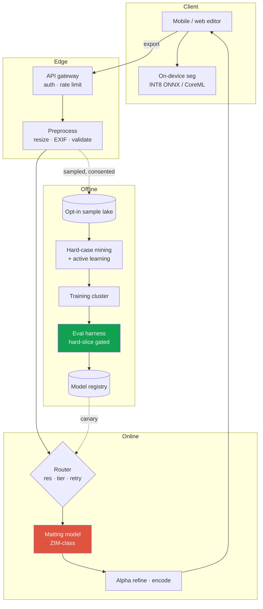
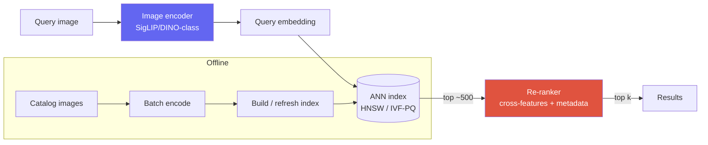
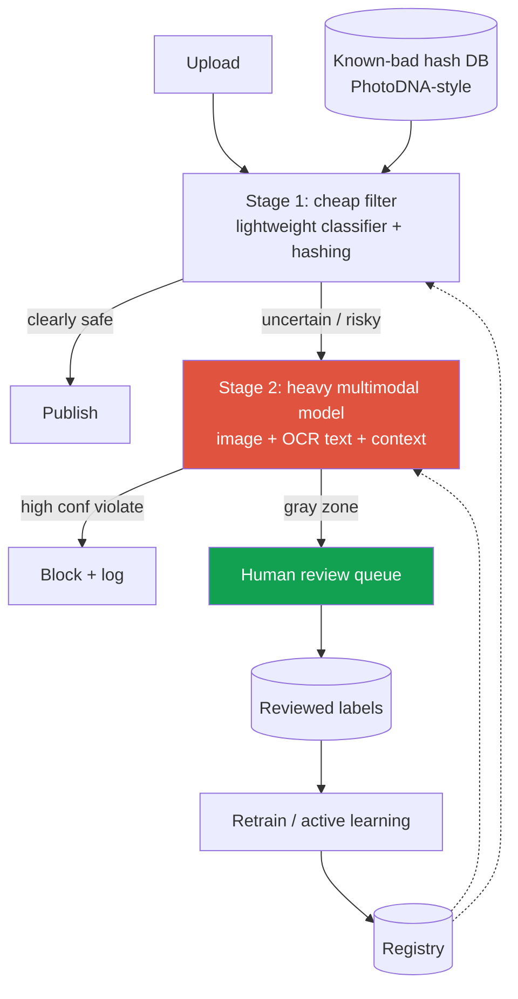
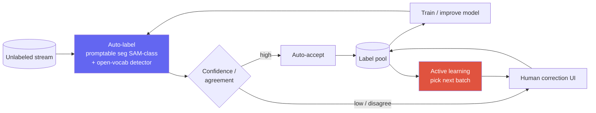
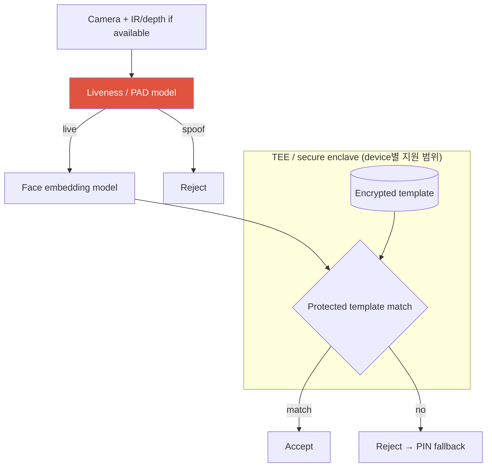
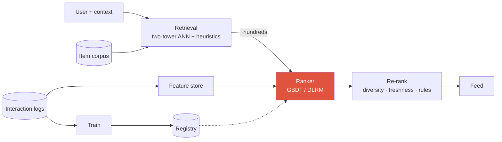
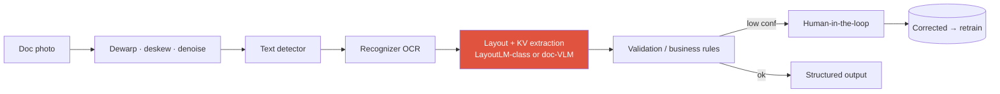

# Worked Case Studies

matting APIvisual searchcontent moderationauto-labeling data engineface auth / anti-spoofingrecommendationOCR / document AI

> [!TIP] 이걸 어떻게 쓰나
> 각 case는 [9-step framework](#/system-design/framework)를 따라 걷습니다. CV/VLM research-applied 후보의 영역 정중앙에 놓이도록 골랐습니다 — background removal / matting, visual search, vision moderation, segmentation data engine, face auth / anti-spoofing, recommendation ranking, OCR / document AI — 그래서 framing을 그대로 당신의 loop로 들어올릴 수 있어요. 정확한 숫자가 아니라 *구조*와 *trade-off 논거*를 훔치세요. 당일에는 당신 자신의 가정을 말하면 됩니다.

> [!NOTE] 당신의 CV를 소리 내어 말하세요
> 아래 경력 예시는 **본인의 제출 CV와 공개 가능한 사실에 실제로 적혀 있을 때만** 1인칭으로 사용하세요. 역할·제품명·latency·배포 범위가 다르면 정확한 본인 기여로 바꾸고, 기밀 수치나 팀 전체 성과를 개인 성과로 말하지 않습니다.

---

## Case A — Image background-removal / matting API at scale

> *"수억 명의 사용자를 가진 사진 앱을 위한 background-removal / image-matting API를 설계하라."*

### 1 · Clarify

| Ask | Assumption I'll state |
| --- | --- |
| Preview인가 export인가? | **두 tier**: interactive preview(soft, fast) + final export(high-quality matte) |
| Latency | preview는 on-device에서 < ~30 ms; export는 server-side에서 ≤ ~1–2 s |
| Subject | 일반 foreground이지만, portrait/hair가 어렵고 volume 큰 case |
| Privacy | 일부 시장(EU/Apple류)은 **on-device-only**를 요구; cloud는 opt-in |
| Output | binary mask *와* soft alpha(matting) — composite를 진짜처럼 보이게 하는 건 alpha |

**ML framing:** dense prediction. Preview = binary/coarse segmentation; export = **alpha matting**([0,1] 범위의 per-pixel opacity)이며 이는 classification이 아니라 regression 문제입니다. 이 구분이 loss와 metric을 모두 좌우합니다.

### 2 · Metrics

<dl class="kv">
<dt>Offline</dt><dd>alpha에 대한 <b>SAD / MSE / Grad / Conn</b>(표준 matting metric) + <b>boundary-F</b>; <b>hard set</b>(hair, fur, semi-transparency, motion blur)으로 slice. 평범한 mIoU는 사용자가 알아채는 바로 그 실패를 숨깁니다.</dd>
<dt>Online</dt><dd>edit-completion rate, export rate, manual-refine / undo rate("matte가 틀렸다"의 proxy).</dd>
<dt>Guardrail</dt><dd>p99 latency, on-device battery/thermal, crash-free rate, empty-mask rate.</dd>
</dl>

### 3 · Architecture

### 4–6 · Data, model, eval

- **Data:** licensed studio matte + **synthetic composite**(다양한 배경 위 foreground — 싸고, 정확한 GT) + opt-in 트래픽에서 mining한 hard case. Synthetic-GT는 실제 label이 noisy/비싼 dense prediction에서 알려진 승리입니다.
- **Model ladder:** baseline = 가벼운 U-Net/MobileNet seg(ship, 기준선 설정) → ambitious = **promptable/trimap-free matting model**(ZIM-class) → on-device preview용 **distilled INT8 student**.
- **Ablations:** hair slice에서의 boundary/Laplacian loss; teacher-distillation 이득; synthetic-vs-real 데이터 비율. 평균 SAD만이 아니라 alpha가 *어디서* 실패하는지(transparency, thin structure) 보고하세요.

### 7–9 · Serve, test, monitor

- **Tiering:** preview는 on-device에서 실행(privacy + latency + battery); export는 cloud matting model로. 이게 cost 스토리 전부입니다 — 대부분의 상호작용은 GPU를 건드리지 않아요.
- **Serving:** GPU autoscaling, 같은 shape의 request를 batch하기 위한 **resolution bucketing**, batch-1 최적화 kernel. Cross-link [Efficiency](#/foundations/mixed-precision-efficiency).
- **Rollout:** shadow → empty-mask spike 시 auto-rollback되는 1% canary → export/undo rate에 대한 A/B.
- **Failure modes:** all-white/all-black mask → 이전 모델로 fallback하거나 tap을 요청; **misuse**(deepfake/celebrity compositing) → policy layer; OS/camera-pipeline 변경이 on-device를 깨뜨림 → device-lab regression suite.

> [!QUESTION] "왜 preview는 on-device인데 export는 cloud인가요 — 왜 하나의 모델이 아니죠?"
> **Short:** 제약이 다릅니다. Preview는 ~30 ms와 privacy가 필요하고; export는 품질이 필요하며 1–2 s와 GPU를 쓸 수 있습니다.
>
> **Deep:** preview와 export의 latency·quality·privacy 제약이 다르면 tiering이 합리적입니다. GPU를 피하는 비율은 사용자 행동과 export rate로 계산해야 하며 근거 없이 99%라고 두지 않습니다. device별 thermal/quality와 cloud 비용 곡선을 측정하고, on-device student를 export teacher에서 distill하되 preview↔export 일관성도 평가합니다.

---

## Case B — Large-scale visual search / recommendation

> *"visual search를 설계하라: 사용자가 이미지를 제출하면 ~100M 카탈로그에서 시각적/의미적으로 유사한 아이템을 받는다."*

### 1–2 · Clarify + metrics

- **Query type:** image → image인가, image → products인가? product 카탈로그에 대한 image query라고 **가정**.
- **Latency:** end-to-end < ~200 ms; 카탈로그 ~10⁸ items, 지속 업데이트.
- **Metric ladder:** offline **Recall@k / nDCG**(labeled relevance set 대비) + embedding-quality probe; online CTR, add-to-cart, purchase; guardrail p99 + index freshness.
- **ML framing:** metric learning + ANN retrieval, 그다음 선택적 re-rank — 정석적인 **two-stage** 설계.

### 3 · Architecture (retrieval → re-rank)

### 4–6 · Data, model, eval

- **Embeddings:** 강한 pretrained vision encoder(SigLIP/DINOv3-class)를 in-domain pair에 대한 **contrastive / triplet** loss로 fine-tune; hard-negative mining이 중요한 레버입니다. Cross-link [VLM Pretraining](#/vlm/pretraining), [Vision Foundation Models](#/cv/foundation-models).
- **Two-stage rationale:** 10⁸ vector에 대한 ANN이 싸게 high-recall candidate를 주고; 더 무거운 cross-feature re-ranker가 top ~500에서 precision을 복원합니다. 10⁸ item 전체에 re-ranker를 돌릴 수는 없어요 — 그게 split의 이유 전부입니다.
- **Index:** **HNSW**(빠르지만 메모리를 많이 먹음) vs **IVF-PQ**(압축, recall/latency 조절 가능). 10⁸ 규모에서 RAM에 맞추려면 vector를 quantize(PQ).
- **Ablations:** encoder 선택 frozen-vs-finetuned; hard-negative 전략; PQ compression vs recall.

### 7–9 · Serve, test, monitor

- **Serving:** query encoder는 online; 카탈로그는 **batch**로 encode; index는 shard + replica; 신규 item은 incremental update, 주기적 full rebuild.
- **Cold start / freshness:** 신규 item이 빨리 검색 가능해야 함 → 작은 "recent" index로 streaming encode하고 query time에 merge.
- **Monitoring:** embedding drift(encoder 버전 변경이 공간을 조용히 이동시킴 — **encoder 업그레이드 시 카탈로그 전체를 re-embed**, 고전적 footgun), held-out probe set에서의 recall@k, category별 CTR.
- **Failure:** stale index → freshness alarm; query와 catalog 간 encoder-version skew → **버전을 pin**하고 mismatch된 serving을 차단.

> [!WARNING] version-skew 함정
> query encoder와 catalog가 *다른* 모델 버전으로 embed되었다면, similarity는 무의미합니다 — 그것도 조용히. embedding-model 버전을 index identity의 일부로 취급하세요. query 쪽만 re-embed하는 canary는 offline에서는 멀쩡해 보이고 production에서는 깨져 있을 겁니다.

---

## Case C — Content-moderation vision system

> *"upload 규모에서 policy 위반 이미지(예: 폭력, 성인물, self-harm)를 탐지하는 시스템을 설계하라."*

### 1–2 · Clarify + metrics

- **Where:** upload 시점(pre-publish)인가 post-hoc sweep인가? **둘 다라고 가정** — 빠른 synchronous gate + async deep pass.
- **Cost asymmetry:** 극악한 콘텐츠에서의 false negative가 false positive보다 훨씬 나쁨 → policy별로 **고정된 낮은 false-positive budget에서의 recall**을 최적화.
- **Metrics:** offline **PR-AUC와 policy class별 recall@fixed-FPR**, fairness를 위해 demographic/region slice로 stratify; online = appeal-overturn rate, human-review load, 빠져나간 위반 콘텐츠의 prevalence; guardrail = p99 latency, reviewer queue depth.
- **ML framing:** **multi-label** detection(policy는 독립적이고 각각 자기 threshold와 cost를 가짐) — 하나의 binary head가 아님.

### 3 · Architecture (cascade + human loop)

### 4–6 · Data, model, eval

- **Known-bad hashing first:** exact/near-dup hash match(PhotoDNA류)가 재유통되는 알려진 콘텐츠를 어떤 모델보다 먼저 결정론적으로 잡습니다 — 싸고, precision 높고, 법적으로 중요.
- **Model:** multimodal(image + OCR한 overlay text + user/context feature). harm이 종종 text-on-image나 context에 있기 때문입니다. policy별 threshold를 가진 multi-label head.
- **Data ethics:** 극단 class는 신중하고 well-being을 보호하는 labeling이 필요; 심한 class imbalance → focal loss / reweighting / targeted sampling.
- **Ablations + fairness:** slice별 recall(skin tone, region, language)은 선택이 아니라 **필수** 분석입니다 — moderation 모델은 정석적인 fairness-liability 표면이에요.

### 7–9 · Serve, test, monitor

- **Cascade**가 cost를 온전하게 유지: 무거운 multimodal model은 uncertain/risky한 일부에만 실행.
- **Threshold policy:** 고심각도 class는 fail-**closed**(review를 위해 보류); 저심각도만 fail-open.
- **Monitoring:** **adversarial drift** — 공격자가 classifier를 능동적으로 probe하므로, 갑작스러운 distribution shift와 campaign spike를 감시; evasion에 맞서 retrain하도록 빠른 human-label loop 유지.
- **Failure:** model down → hashing + 보수적 hold로 fallback; false positive를 위한 appeals pipeline(due-process guardrail).

> [!QUESTION] "왜 모든 upload에 큰 모델 하나가 아니라 cascade인가요?"
> **Short:** Volume × cost. 대부분의 upload는 명백히 괜찮습니다; 전부에 무거운 multimodal model을 쓰는 건 낭비예요.
>
> **Deep:** 가벼운 stage-1이 안전한 다수를 사소한 cost로 걸러내고 uncertain한 일부만 비싼 모델로 라우팅하므로, 평균 cost는 전체 volume이 아니라 *hard* 비율을 따릅니다. 설계 비용은 stage-1 threshold의 calibration입니다: 너무 공격적이면 위반 콘텐츠가 deep pass를 건너뛰고(가장 중요한 class에서의 recall 실패), 너무 느슨하면 stage-2 cost가 폭발합니다. 저라면 그 threshold를 policy별 recall@fixed-FPR 곡선 위에서 설정하고 slip-through를 지속적으로 monitoring하겠습니다.

---

## Case D — Auto-labeling data engine for segmentation

> *"unlabeled 이미지의 스트림을 고품질 segmentation 학습 데이터로 싸게 바꾸는 data engine을 설계하라."*

이건 가장 **research-flavored**한 case이고 현대 CV lab의 실제 작업에 가장 가깝습니다(SAM류 data engine, ZIM, grounded-VLM annotation). panel이 FAIR/Adobe/ByteDance-Seed류라면 이걸 앞세우세요.

### 1–2 · Clarify + metrics

- **Goal:** *human-minute당 labeled-mask 품질*을 최대화. 시스템의 산출물은 **데이터**이고, 그 metric은 단일 모델의 accuracy가 아니라 dollar당 downstream 모델 품질.
- **Metrics:** offline = auto-label의 mIoU/boundary-F와 human-correction rate; system = labels/hour, mask 1,000개당 비용, 생성 label로 학습한 downstream 모델 품질; guardrail = label-noise 상한과 class coverage.

### 3 · Architecture (model-in-the-loop labeling)

이 loop는 **자기 자신의 labeler를 개선**합니다: 더 나은 모델 → 더 많은 auto-accept → 더 싼 label → 더 많은 데이터 → 더 나은 모델. 그 flywheel이 산출물입니다.

### 4–6 · Methods, model, eval

- **Auto-labeler:** **open-vocabulary detector**(Grounding-DINO-class)가 box/concept를 프롬프트하는 promptable segmentation(SAM-class)으로 zero-shot mask 생성; confidence 추정을 위한 ensemble/consistency.
- **Routing:** high-confidence, high-agreement mask는 auto-accept; low-confidence 또는 disagree mask는 사람에게. Multi-model **agreement**는 싸고 효과적인 confidence proxy입니다.
- **Active learning:** 모델을 가장 많이 움직이는 곳에 human-minute를 쓰기 — uncertainty + diversity 샘플링, 그리고 명시적 **long-tail / hard-slice** 타깃팅.
- **Ablations (research 핵심):** auto-accept threshold vs downstream mIoU(label noise를 얼마나 견딜 수 있나?); active-learning acquisition vs random; synthetic augmentation 기여. **Feedback bias를 경계** — 모델 자신의 error가 label에 구워져 들어가므로, labeler가 절대 학습하지 않는 *human-only audited gold set*을 유지해 진짜 drift를 측정.

### 7–9 · Scale, monitor, govern

- **Scale:** GPU 클러스터에서 batch auto-labeling; 사람은 라우팅된 일부에만; label pool은 버전 관리.
- **Lineage / governance:** dataset version → checkpoint → eval report가 추적 가능해야 함(rater-guideline 버전 관리, dedup, PII/NSFW 필터링). 이것이 모델을 *재현*하고 *방어*하게 해줍니다 — 일급 research-integrity 관심사.
- **Monitoring:** correction-rate 추세(상승 = labeler drifting 또는 distribution shifting), gold-set mIoU, class coverage.

> [!QUESTION] "모델이 자기 실수를 스스로 가르치는 걸 어떻게 막나요?"
> **Short:** auto-labeler가 절대 학습하지 않는, frozen된 human-audited gold set, 여기에 confidence를 위한 multi-model agreement와 auto-accept의 주기적 human audit.
>
> **Deep:** 실패는 confirmation bias입니다: high-confidence한 *틀린* mask가 auto-accept되고, 학습되고, 강화됩니다. 완화책: (1) labeler 자신의 logit이 아니라 *독립적인* 신호(ensemble/detector agreement)에서 나온 confidence; (2) loop의 self-reported 품질 대비 진짜 품질을 측정하는, loop 밖의 gold set; (3) low-confidence만이 아니라 auto-accept의 random sample을 audit; (4) auto-accept rate를 상한 걸어서 사람이 tail에 신선한 신호를 계속 주입하게. 이는 생성 데이터에서의 model-collapse 우려를 그대로 반영합니다 — 실제 supervision을 축적하되 대체하지 마세요. [Weak & Semi-Supervised](#/cv/weak-semi-supervised)를 보세요.

---

## Case E — Face authentication & liveness (anti-spoofing)

> *"spoofing(사진, replay, mask)에 견고한 face-authentication 시스템(unlock / payment)을 설계하라."* 후보가 정확히 이것을 ship했습니다 — **FaceSign** — 그러니 security/on-device 비중이 큰 panel에서는 이걸 앞세우세요.

### 1–2 · Clarify + metrics
- **두 개의 하위 문제:** face **recognition**(이게 enroll된 사용자인가?) + liveness / **presentation-attack detection (PAD)**(사진/replay/mask가 아니라 살아있는 사람인가?). PAD가 어렵고 security-critical한 절반입니다.
- **Cost asymmetry:** system false accept는 recognition impostor accept와 PAD attack accept가 결합된 결과입니다. recognition은 목표 FAR에서 TAR/FRR을, PAD는 공격 유형별 APCER와 BPCER trade-off를 따로 설계합니다. $10^{-5}$ 같은 극저 FAR 주장은 충분한 negative trial과 confidence interval이 없으면 검증할 수 없습니다.
- **Metrics:** recognition = **TAR@FAR**; PAD = **APCER / BPCER**, 필요 시 ACER. ACER 평균 하나는 공격별 최악값과 비용 비대칭을 숨길 수 있으므로 attack instrument·device·demographic slice와 confidence interval을 보고합니다.
- **Privacy:** face template은 biometric → **on-device, encrypted, 원본 이미지를 서버로 보내지 않음**(FaceSign의 정부 인증 맥락).

### 3 · Architecture

### 4–6 · Data, model, eval
- **PAD data:** device/lighting에 걸친 다양한 **attack instrument**(print, screen replay, 2D/3D mask, cutout); 이는 **open-set** 문제(새 attack이 계속 등장)이므로 단순 binary classification이 아니라 robustness/anomaly framing.
- **Signals:** 하드웨어가 허락하면 IR/depth가 일부 print/screen replay에 추가 신호를 주지만 센서 spoof·3D mask·domain shift를 무력화하지는 않습니다. texture/moiré와 선택적 challenge도 replay·accessibility·UX 위협 모델을 함께 평가합니다.
- **Model:** 컴팩트한 CNN embedding(recognition은 **ArcFace-style margin loss**) + PAD head; enclave용으로 distill/quantize.
- **Eval:** **cross-dataset / cross-attack** generalization이 진짜 시험(일부 attack으로 학습, 보지 못한 것으로 테스트) — in-distribution PAD 수치는 오해를 부를 만큼 높습니다.

### 7–9 · Serve, monitor, govern
- inference는 가능한 한 on-device에서 수행하되, 일반 NPU/GPU 연산 전체가 secure enclave 안에서 돈다고 가정하지 않습니다. enclave/TEE는 보통 key·template·match 같은 작은 trusted component를 보호하며 범위는 OS/SoC별로 확인합니다. 서버 telemetry도 최소화·동의·보존기간을 적용합니다.
- **Monitoring:** spoof-attempt rate, device/OS 업데이트별 FRR drift, new-attack campaign 탐지; 새로 관측된 attack을 추가하는 빠른 loop.
- **Failure/abuse:** liveness down → PIN/다중 인증으로 fail-closed. 생체정보는 바꿀 수 없으므로 raw embedding만 저장하지 말고 keyed/cancellable template, device-bound key와 version을 써 유출 시 transformation/key를 회전하고 재등록할 수 있게 합니다.

> [!QUESTION] "왜 face-auth를 accuracy 하나로 최적화하지 않나요?"
> **Short:** recognition은 TAR@FAR, PAD는 공격별 APCER@BPCER로 분리합니다. 최종 operating point는 공격 비용·사용자 마찰과 두 단계의 결합 오류로 정합니다. ACER/accuracy 하나는 희귀하지만 치명적인 attack accept를 숨길 수 있습니다.

---

## Case F — Recommendation / ranking system

> *"feed / product recommendation을 위한 ranking 시스템을 설계하라."*

### 1–2 · Clarify + metrics
- **단계로 나누기:** candidate **retrieval**(수백만 → 수백) → **ranking**(각각 점수화) → **re-rank / policy**(diversity, freshness, business rule).
- **Objective:** 보통은 blend — pCTR, dwell/watch-time, conversion — 을 하나의 score로 결합; 단일 proxy 최적화(clickbait)를 경계.
- **Metrics:** offline은 logged data에서 **AUC / logloss / NDCG**; online은 north-star(engagement, revenue)에 대한 **A/B** + guardrail(diversity, reported-content, latency). Online이 진실이고, offline은 candidate를 *순위 매길* 뿐입니다.

### 3 · Architecture (multi-stage funnel)

### 4–6 · Data, model, eval
- **Retrieval:** in-batch negative를 쓰는 **two-tower**(user tower / item tower) → item embedding에 대한 ANN(Case B와 같은 기술).
- **Ranker:** 풍부한 cross-feature(user×item×context); **GBDT** baseline → high-cardinality ID를 위한 embedding을 가진 **DLRM / deep ranking**. score가 blend/auction으로 들어간다면 calibrated probability가 중요합니다.
- **Feedback loop & bias:** 보여 준 item의 outcome만 관측하므로 logging policy의 **propensity와 노출 위치**를 기록하고, 안전한 exploration으로 support/overlap을 확보합니다. IPS/self-normalized IPS는 작은 propensity의 높은 분산에 clipping·diagnostic이 필요하고, outcome model을 결합한 doubly robust estimator도 model misspecification을 점검합니다.
- **Eval:** replay/off-policy estimate는 overlap이 있는 정책 변화에만 신뢰하고 effective sample size와 CI를 보고한 뒤 staged A/B로 확인합니다. novelty·interference·장기 효과 때문에 "online이 항상 즉시 진실"이라고 단순화하지 않습니다.

### 7–9 · Serve, monitor, govern
- **Serving:** **train/serve parity**(최우선 버그 원천)를 갖춘 feature store, 사전 계산된 user/item embedding, 빠듯한 p99, caching.
- **Cold start:** 신규 user/item → interaction이 쌓일 때까지 content feature + exploration.
- **Monitoring:** train/serve skew, feature drift, calibration, diversity/fairness, 그리고 offline↔online gap.

> [!QUESTION] "왜 큰 모델로 전부 점수화하지 않고 two-stage인가요?"
> **Short:** 요청마다 수백만 item에 무거운 ranker를 돌릴 수 없습니다; 싼 retrieval이 수백으로 좁히고, 비싼 모델이 그것들을 점수화합니다 — visual search와 같은 latency-vs-quality split이죠(retrieval은 싸게 recall을 사고, ranking은 작은 집합에서 precision을 삽니다).

---

## Case G — OCR / document understanding pipeline

> *"촬영된 문서/영수증에서 structured data(총액, 날짜, 필드)를 대규모로 추출하라."*

### 1–2 · Clarify + metrics
- **Stages:** text region 탐지 → text 인식(OCR) → **layout** 이해 → **key-value / entity** 추출. 사진은 skew, blur, lighting, 굽은 페이지를 더합니다.
- **Metrics:** OCR = **CER / WER**; detection = box F1; **end-task = field-level precision/recall / exact-match**(사용자가 실제로 신경 쓰는 것) + human-correction rate. Guardrail: latency, 언어별 coverage.
- **ML framing:** staged pipeline(detector + recognizer + layout/KV) **또는** end-to-end **document VLM**(Qwen-VL / InternVL-class) — 논쟁할 만한 진짜 trade-off.

### 3 · Architecture

### 4–6 · Data, model, eval
- **Pipeline vs VLM:** staged pipeline은 component별 제어·측정이 쉽고, document VLM은 open-ended layout에 유연할 수 있지만 무겁고 field를 hallucinate할 수 있습니다. Hybrid에서도 deterministic parser/schema/checksum은 **형식과 산술 일관성**만 검증하며 이미지의 실제 값을 읽었다는 사실까지 보장하지 않습니다.
- **Data:** synthetic document 생성(font, template, augmentation) + real labeled scan; multilingual.
- **Eval:** field별·document-type별 slice(receipt vs invoice vs ID); VLM 경로의 **hallucinated-field** rate 추적.

### 7–9 · Serve, monitor, govern
- **Confidence-gated human loop:** low-confidence field → reviewer → correction이 retraining으로 피드백(data engine, cf. Case D).
- **Monitoring:** template/language별 field accuracy, OCR CER drift, new-template 탐지.
- **Failure:** 영수증의 틀린 총액은 high-cost → validation rule(checksum, 총액이 합과 일치해야) + 사람에게 fail.

> [!QUESTION] "document-VLM 하나인가, staged pipeline인가?"
> **Short:** VLM과 pipeline을 같은 document/language slice와 비용에서 비교합니다. numeric field에는 regex·schema·checksum·subtotal 합 같은 일관성 검사를 적용하되, 통과가 정답을 보장하지 않으므로 source span/box를 함께 반환하고 high-risk·low-confidence는 사람이 확인합니다.

### Follow-ups they'll push (any case)

- *"offline metric은 좋아졌는데 online metric은 안 그래요 — debug하세요."* → proxy/KPI mismatch, game 가능한 metric, 검정력 부족한 A/B, 혹은 train/serve skew.
- *"내일 규모가 10× — 뭐가 먼저 깨지죠?"* → 보통 index(Case B), human-review queue(Case C), 혹은 heavy model의 GPU cost(A/C); bottleneck과 완화책(sharding, cascade threshold, distillation)을 대세요.
- *"fairness / safety 리스크는 어디 있고, 어떻게 측정하죠?"* → slice별 metric, audited gold set, appeals/rollback.
- *"오늘 걸 여전히 이기는 가장 싼 v1은?"* → ladder의 baseline rung; 먼저 shadow test 뒤에 ship하겠다고 보이세요.

## Cheat-sheet

| Case | ML framing | Signature design move | Top failure mode |
| --- | --- | --- | --- |
| **A · Matting API** | dense prediction (alpha regression) | on-device preview + cloud export tiering | empty mask; on-device OS/camera drift |
| **B · Visual search** | metric learning + ANN + re-rank | two-stage retrieval; PQ-compressed index | encoder version skew across query/catalog |
| **C · Moderation** | multi-label detection | hash-first + cheap→heavy cascade; fail-closed | adversarial drift; slice-unfair recall |
| **D · Data engine** | model-in-the-loop labeling | self-improving flywheel + active learning | self-reinforcing label bias (no gold set) |
| **E · Face auth / PAD** | recognition + presentation-attack detection | on-device + protected template; TAR@FAR와 APCER/BPCER 분리 | system false accept; cross-attack generalization |
| **F · Recommendation** | retrieval + ranking (+ re-rank) | two-tower ANN → heavy ranker; debias logs | feedback-loop bias; train/serve skew |
| **G · OCR / doc AI** | detect → recognize → layout/KV | pipeline vs doc-VLM + deterministic validation | VLM hallucinated numeric fields |

> [!TIP] 모든 case에서 점수를 따는 수
> **gaming에 견디는 metric과 hard-case slice**를 앞세우고, **SOTA 모델 전에 baseline**을 제안하고, **monitoring할 하나의 failure mode**를 대세요. 그 세 가지 — 측정의 엄밀함, 이겨야 할 기준선, 이름 붙인 리스크 — 가 panel이 실제로 사는 research/applied 신호입니다.

**Related:** [The Design Framework](#/system-design/framework) · [Designing LLM/Agent Systems](#/system-design/llm-systems) · [Segmentation](#/cv/segmentation) · [Image Matting](#/cv/matting) · [Object Detection](#/cv/detection) · [Weak & Semi-Supervised](#/cv/weak-semi-supervised) · [Vision Foundation Models](#/cv/foundation-models) · [VLM Pretraining](#/vlm/pretraining) · [Evaluation Metrics](#/foundations/evaluation-metrics)
