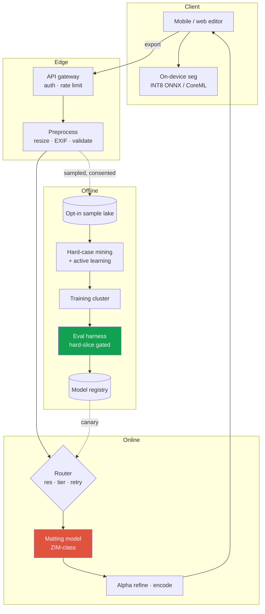
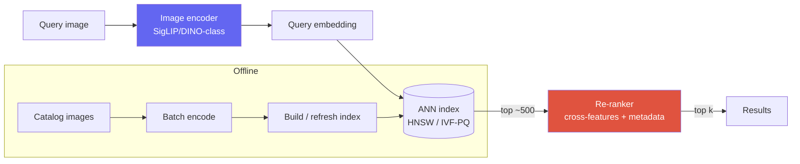
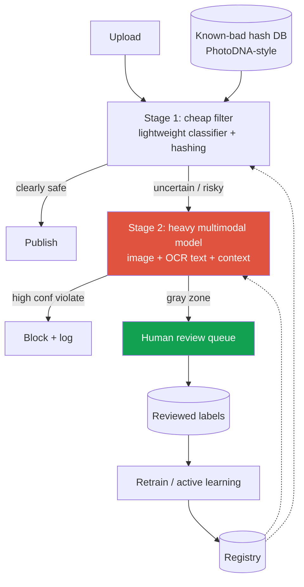
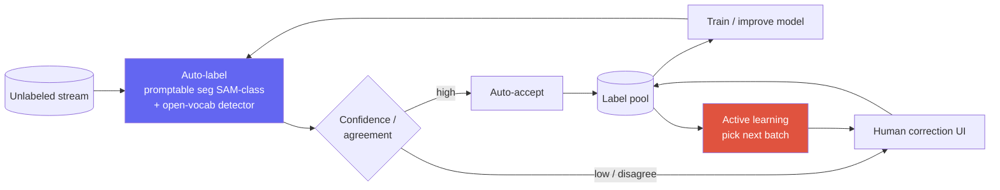
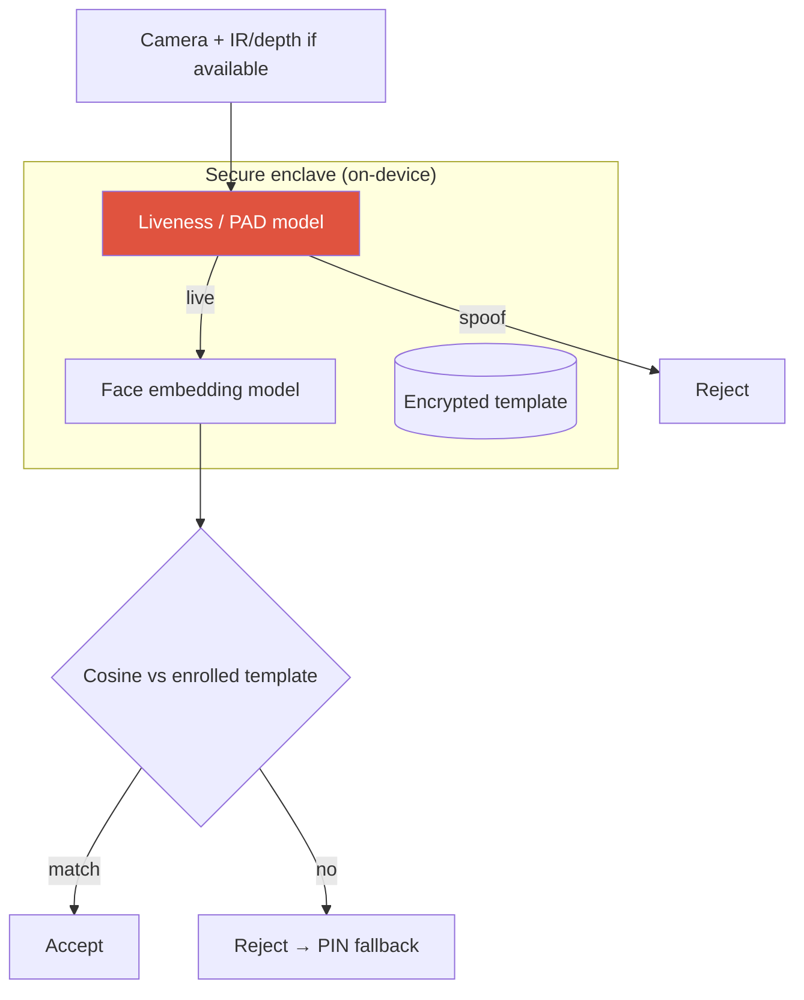
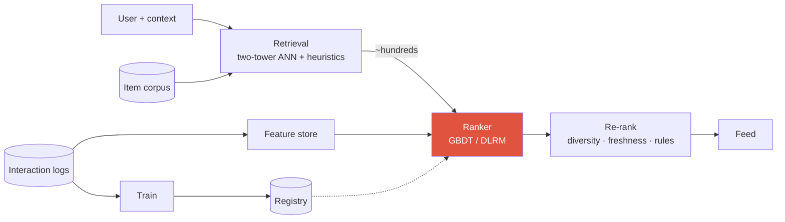
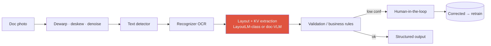

# Worked Case Studies

matting APIvisual searchcontent moderationauto-labeling data engineface auth / anti-spoofingrecommendationOCR / document AI

> [!TIP] How to use these
> Each case is walked through the [9-step framework](#/system-design/framework). They're chosen to sit squarely on a CV/VLM research-applied candidate's turf — background removal / matting, visual search, vision moderation, a segmentation data engine, face auth / anti-spoofing, recommendation ranking, and OCR / document AI — so you can lift the framing straight into your own loop. Steal the *structure* and the *trade-off arguments*, not the exact numbers; state your own assumptions on the day.

> [!NOTE] Say your CV out loud
> Where a case touches shipped work — foreground-segmentation API, ZIM zero-shot matting → CLOVA X, on-device ONNX human seg (~10 ms class), FaceSign anti-spoofing, grounded-VLM data work — **name it**. "I shipped a version of exactly this; here's what I'd reuse and what I'd change at 100× scale" is the strongest sentence you can say in a design round.

---

## Case A — Image background-removal / matting API at scale

> *"Design a background-removal / image-matting API for a photo app with hundreds of millions of users."*

### 1 · Clarify

| Ask | Assumption I'll state |
| --- | --- |
| Preview or export? | **Two tiers**: interactive preview (soft, fast) + final export (high-quality matte) |
| Latency | preview < ~30 ms on-device; export ≤ ~1–2 s server-side |
| Subject | general foreground, but portrait/hair is the hard, high-volume case |
| Privacy | some markets (EU/Apple-style) require **on-device-only**; cloud is opt-in |
| Output | binary mask *and* soft alpha (matting) — alpha is what makes composites look real |

**ML framing:** dense prediction. Preview = binary/coarse segmentation; export = **alpha matting** (per-pixel opacity in [0,1]), which is a regression problem, not classification. That distinction drives both the loss and the metric.

### 2 · Metrics

<dl class="kv">
<dt>Offline</dt><dd><b>SAD / MSE / Grad / Conn</b> on alpha (standard matting metrics) + <b>boundary-F</b>; sliced on a <b>hard set</b> (hair, fur, semi-transparency, motion blur). Plain mIoU hides exactly the failures users notice.</dd>
<dt>Online</dt><dd>edit-completion rate, export rate, manual-refine / undo rate (a proxy for "the matte was wrong").</dd>
<dt>Guardrail</dt><dd>p99 latency, on-device battery/thermal, crash-free rate, empty-mask rate.</dd>
</dl>

### 3 · Architecture

### 4–6 · Data, model, eval

- **Data:** licensed studio mattes + **synthetic composites** (foreground over diverse backgrounds — cheap, exact GT) + hard cases mined from opt-in traffic. Synthetic-GT is a known win for dense prediction where real labels are noisy/expensive.
- **Model ladder:** baseline = a light U-Net/MobileNet seg (ships, sets the bar) → ambitious = a **promptable/trimap-free matting model** (ZIM-class) → **distilled INT8 student** for on-device preview.
- **Ablations:** boundary/Laplacian loss on the hair slice; teacher-distillation gain; synthetic-vs-real data mix. Report *where* alpha fails (transparency, thin structure), not just mean SAD.

### 7–9 · Serve, test, monitor

- **Tiering:** preview runs on-device (privacy + latency + battery); export hits the cloud matting model. This is the whole cost story — most interactions never touch a GPU.
- **Serving:** GPU autoscaling, **resolution bucketing** to batch same-shape requests, batch-1-optimized kernels. Cross-link [Efficiency](#/foundations/mixed-precision-efficiency).
- **Rollout:** shadow → 1% canary with auto-rollback on empty-mask spike → A/B on export/undo rate.
- **Failure modes:** all-white/all-black mask → fall back to previous model or ask for a tap; **misuse** (deepfake/celebrity compositing) → policy layer; OS/camera-pipeline change breaks on-device → device-lab regression suite.

> [!QUESTION] "Why on-device preview but cloud export — why not one model?"
> **Short:** Different constraints. Preview needs ~30 ms and privacy; export needs quality and can spend 1–2 s and a GPU.
>
> **Deep:** A single model that's good enough for export can't hit 30 ms on a mid-tier phone, and a single model small enough for the phone leaves visible alpha errors on export. Tiering lets each optimize its own objective, keeps ~99% of interactions off the GPU fleet (cost), and satisfies privacy-first markets. The cost is *two* models to train, distill, and keep consistent — I'd distill the on-device student *from* the export teacher so their behavior agrees.

---

## Case B — Large-scale visual search / recommendation

> *"Design visual search: a user submits an image and gets visually/semantically similar items from a catalog of ~100M."*

### 1–2 · Clarify + metrics

- **Query type:** image → image, or image → products? **Assume** image query over a product catalog.
- **Latency:** end-to-end < ~200 ms; catalog ~10⁸ items, updated continuously.
- **Metric ladder:** offline **Recall@k / nDCG** against a labeled relevance set + embedding-quality probes; online CTR, add-to-cart, purchase; guardrail p99 + index freshness.
- **ML framing:** metric learning + ANN retrieval, then optional re-rank — the canonical **two-stage** design.

### 3 · Architecture (retrieval → re-rank)

### 4–6 · Data, model, eval

- **Embeddings:** a strong pretrained vision encoder (SigLIP/DINOv3-class), fine-tuned with **contrastive / triplet** loss on in-domain pairs; hard-negative mining is the lever that matters. Cross-link [VLM Pretraining](#/vlm/pretraining), [Vision Foundation Models](#/cv/foundation-models).
- **Two-stage rationale:** ANN over 10⁸ vectors gives cheap high-recall candidates; a heavier cross-feature re-ranker restores precision on the top ~500. You cannot run the re-ranker over 10⁸ items — that's the whole reason for the split.
- **Index:** **HNSW** (fast, memory-hungry) vs **IVF-PQ** (compressed, tunable recall/latency). Quantize vectors (PQ) to fit RAM at 10⁸ scale.
- **Ablations:** encoder choice frozen-vs-finetuned; hard-negative strategy; PQ compression vs recall.

### 7–9 · Serve, test, monitor

- **Serving:** query encoder online; catalog encoded in **batch**; index sharded + replicated; incremental updates for new items, periodic full rebuild.
- **Cold start / freshness:** new items must be searchable fast → streaming encode into a small "recent" index merged at query time.
- **Monitoring:** embedding drift (encoder version change silently shifts the space — **re-embed the whole catalog on encoder upgrades**, a classic footgun), recall@k on a held-out probe set, per-category CTR.
- **Failure:** stale index → freshness alarm; encoder-version skew between query and catalog → **pin the version**, block mismatched serving.

> [!WARNING] The version-skew trap
> If the query encoder and the catalog were embedded by *different* model versions, similarity is meaningless — silently. Treat the embedding-model version as part of the index identity; a canary that re-embeds only the query side will look fine offline and be broken in production.

---

## Case C — Content-moderation vision system

> *"Design a system to detect policy-violating images (e.g., violence, adult, self-harm) at upload scale."*

### 1–2 · Clarify + metrics

- **Where:** at upload (pre-publish) vs post-hoc sweep? **Assume both** — a fast synchronous gate + an async deep pass.
- **Cost asymmetry:** a false negative on egregious content is far worse than a false positive → optimize **recall at a fixed, low false-positive budget**, per policy.
- **Metrics:** offline **PR-AUC and recall@fixed-FPR per policy class**, stratified by demographic/region slices for fairness; online = appeal-overturn rate, human-review load, prevalence of violating content that slips through; guardrail = p99 latency, reviewer queue depth.
- **ML framing:** **multi-label** detection (policies are independent, each with its own threshold and cost) — not one binary head.

### 3 · Architecture (cascade + human loop)

### 4–6 · Data, model, eval

- **Known-bad hashing first:** exact/near-dup hash match (PhotoDNA-style) catches recirculated known content deterministically before any model — cheap, high precision, legally important.
- **Model:** multimodal (image + OCR'd overlay text + user/context features), because harm is often in the text-on-image or context. Multi-label heads with per-policy thresholds.
- **Data ethics:** extreme classes need careful, well-being-protected labeling; heavy class imbalance → focal loss / reweighting / targeted sampling.
- **Ablations + fairness:** per-slice recall (skin tone, region, language) is a **required** analysis, not optional — moderation models are a canonical fairness-liability surface.

### 7–9 · Serve, test, monitor

- **Cascade** keeps cost sane: the heavy multimodal model runs only on the uncertain/risky fraction.
- **Threshold policy:** fail-**closed** (hold for review) for high-severity classes; fail-open only for low-severity.
- **Monitoring:** **adversarial drift** — attackers actively probe the classifier, so watch for sudden distribution shifts and campaign spikes; keep a fast human-label loop to retrain against evasion.
- **Failure:** model down → fall back to hashing + conservative hold; appeals pipeline for false positives (due-process guardrail).

> [!QUESTION] "Why cascade instead of one big model on every upload?"
> **Short:** Volume × cost. Most uploads are obviously fine; spending a heavy multimodal model on all of them is wasteful.
>
> **Deep:** A lightweight stage-1 clears the safe majority at trivial cost and routes only the uncertain fraction to the expensive model, so average cost tracks the *hard* fraction, not total volume. The design cost is calibrating the stage-1 threshold: too aggressive and violating content skips the deep pass (a recall failure on the class that matters most), too lax and stage-2 cost explodes. I'd set that threshold on the recall@fixed-FPR curve per policy and monitor slip-through continuously.

---

## Case D — Auto-labeling data engine for segmentation

> *"Design a data engine that turns a stream of unlabeled images into high-quality segmentation training data, cheaply."*

This is the most **research-flavored** case and the one closest to a modern CV lab's real work (SAM-style data engines, ZIM, grounded-VLM annotation). Lead with it if the panel is FAIR/Adobe/ByteDance-Seed-style.

### 1–2 · Clarify + metrics

- **Goal:** maximize *labeled-mask quality per human-minute*. The system's output is **data**, and its metric is downstream model quality per dollar, not a single model's accuracy.
- **Metrics:** offline = **mask quality** (mIoU/boundary-F of auto-labels vs an audited gold set) + **human-correction rate**; system = labels/hour, $/1k masks, model mIoU trained on the engine's output; guardrail = label-noise ceiling, class coverage.

### 3 · Architecture (model-in-the-loop labeling)

The loop **improves its own labeler**: better model → more auto-accepts → cheaper labels → more data → better model. That flywheel is the deliverable.

### 4–6 · Methods, model, eval

- **Auto-labeler:** promptable segmentation (SAM-class) prompted by an **open-vocabulary detector** (Grounding-DINO-class) for boxes/concepts, giving zero-shot masks; ensemble/consistency to estimate confidence.
- **Routing:** high-confidence, high-agreement masks auto-accept; low-confidence or disagreeing masks go to humans. Multi-model **agreement** is a cheap, effective confidence proxy.
- **Active learning:** spend human minutes where they move the model most — uncertainty + diversity sampling, and explicit **long-tail / hard-slice** targeting.
- **Ablations (the research core):** auto-accept threshold vs downstream mIoU (how much label noise can you tolerate?); active-learning acquisition vs random; synthetic augmentation contribution. **Guard against feedback bias** — the model's own errors get baked into labels, so keep a *human-only audited gold set* that the labeler never trains on, to measure true drift.

### 7–9 · Scale, monitor, govern

- **Scale:** batch auto-labeling on a GPU cluster; humans only on the routed fraction; label pool versioned.
- **Lineage / governance:** dataset version → checkpoint → eval report must be traceable (rater-guideline versioning, dedup, PII/NSFW filtering). This is what lets you *reproduce* and *defend* a model — a first-class research-integrity concern.
- **Monitoring:** correction-rate trend (rising = labeler drifting or distribution shifting), gold-set mIoU, class coverage.

> [!QUESTION] "How do you stop the model from teaching itself its own mistakes?"
> **Short:** A frozen, human-audited gold set the auto-labeler never trains on, plus multi-model agreement for confidence and periodic human audits of auto-accepts.
>
> **Deep:** The failure is confirmation bias: high-confidence *wrong* masks get auto-accepted, trained on, and reinforced. Mitigations: (1) confidence from *independent* signals (ensemble/detector agreement), not the labeler's own logit; (2) a gold set outside the loop to measure real quality vs the loop's self-reported quality; (3) audit a random sample of auto-accepts, not just low-confidence ones; (4) cap the auto-accept rate so humans keep injecting fresh signal on the tail. This mirrors the model-collapse concern in generative data — accumulate real supervision, don't replace it. See [Weak & Semi-Supervised](#/cv/weak-semi-supervised).

---

## Case E — Face authentication & liveness (anti-spoofing)

> *"Design a face-authentication system (unlock / payment) robust to spoofing — photos, replays, masks."* The candidate shipped exactly this — **FaceSign** — so lead with it at a security/on-device-heavy panel.

### 1–2 · Clarify + metrics
- **Two sub-problems:** face **recognition** (is this the enrolled user?) + **liveness / presentation-attack detection (PAD)** (a live person, not a photo/replay/mask?). PAD is the hard, security-critical half.
- **Cost asymmetry:** a **false accept** (spoof succeeds) is catastrophic for payments; a false reject is merely annoying → operate at a **fixed, very low FAR** (e.g. 1e-5–1e-6) and minimize FRR *there*.
- **Metrics:** recognition = **TAR@FAR** (verification ROC); PAD = **APCER / BPCER / ACER** (ISO 30107-3 attack vs bona-fide error rates). Guardrail: on-device latency; **fairness** = error parity across skin tone / age / gender is mandatory.
- **Privacy:** face templates are biometric → **on-device, encrypted, no raw images to server** (FaceSign's government-certified context).

### 3 · Architecture

### 4–6 · Data, model, eval
- **PAD data:** diverse **attack instruments** (print, screen replay, 2D/3D mask, cutout) across devices/lighting; it's an **open-set** problem (new attacks appear) → robustness/anomaly framing, not just binary classification.
- **Signals:** multi-modal when hardware allows (**IR/depth** kills most 2D replays), texture/moiré cues, optional active challenge (blink/turn) for high-risk actions.
- **Model:** compact CNN embeddings (**ArcFace-style margin loss** for recognition) + a PAD head; distilled/quantized for the enclave.
- **Eval:** **cross-dataset / cross-attack** generalization is the real test (train on some attacks, test on unseen) — in-distribution PAD numbers are misleadingly high.

### 7–9 · Serve, monitor, govern
- All inference **on-device** in a secure enclave; server sees only pass/fail + audit metadata.
- **Monitoring:** spoof-attempt rate, FRR drift by device/OS update, new-attack campaign detection; a fast loop to add newly-seen attacks.
- **Failure/abuse:** liveness down → fall back to PIN (**never** fail-open to accept); template compromise → revocable, re-enrollable.

> [!QUESTION] "Why optimize PAD at a fixed FAR instead of accuracy?"
> **Short:** the costs are wildly asymmetric — one false accept can drain a payment account — so the operating point is chosen on the PAD ROC at a tiny fixed FAR, and data/threshold/model are all tuned to minimize false rejects *there*. Plain accuracy hides the only number that matters for a security system.

---

## Case F — Recommendation / ranking system

> *"Design the ranking system for a feed / product recommendations."*

### 1–2 · Clarify + metrics
- **Stage it:** candidate **retrieval** (millions → hundreds) → **ranking** (score each) → **re-rank / policy** (diversity, freshness, business rules).
- **Objective:** usually a blend — pCTR, dwell/watch-time, conversion — combined into one score; beware optimizing a single proxy (clickbait).
- **Metrics:** offline **AUC / logloss / NDCG** on logged data; online **A/B** on the north-star (engagement, revenue) + guardrails (diversity, reported-content, latency). Online is truth; offline only *ranks candidates*.

### 3 · Architecture (multi-stage funnel)

### 4–6 · Data, model, eval
- **Retrieval:** **two-tower** (user tower / item tower) with in-batch negatives → ANN over item embeddings (same tech as Case B).
- **Ranker:** rich cross-features (user×item×context); **GBDT** baseline → **DLRM / deep ranking** with embeddings for high-cardinality IDs. Calibrated probabilities matter if scores feed a blend/auction.
- **Feedback loops & bias:** logs are **biased by the current model** (you only observe clicks on what was shown) → **position-bias** correction, exploration (ε-greedy / bandits), inverse-propensity weighting. This is *the* defining subtlety of rec systems.
- **Eval:** counterfactual/replay estimates offline, then A/B; watch **feedback-loop amplification** (rich-get-richer, filter bubbles).

### 7–9 · Serve, monitor, govern
- **Serving:** feature store with **train/serve parity** (the #1 bug source), precomputed user/item embeddings, tight p99, caching.
- **Cold start:** new users/items → content features + exploration until interactions accrue.
- **Monitoring:** train/serve skew, feature drift, calibration, diversity/fairness, and the offline↔online gap.

> [!QUESTION] "Why two stages instead of scoring everything with the big model?"
> **Short:** you can't run a heavy ranker over millions of items per request; cheap retrieval narrows to hundreds, then the expensive model scores those — the same latency-vs-quality split as visual search (retrieval buys recall cheaply, ranking buys precision on a small set).

---

## Case G — OCR / document understanding pipeline

> *"Extract structured data (totals, dates, fields) from photographed documents/receipts at scale."*

### 1–2 · Clarify + metrics
- **Stages:** detect text regions → recognize text (OCR) → understand **layout** → extract **key-value / entities**. Photos add skew, blur, lighting, curved pages.
- **Metrics:** OCR = **CER / WER**; detection = box F1; **end-task = field-level precision/recall / exact-match** (what users actually care about) + human-correction rate. Guardrail: latency, per-language coverage.
- **ML framing:** a staged pipeline (detector + recognizer + layout/KV) **or** an end-to-end **document VLM** (Qwen-VL / InternVL-class) — a real trade-off to argue.

### 3 · Architecture

### 4–6 · Data, model, eval
- **Pipeline vs VLM:** the classic pipeline (DBNet-class detector + CRNN/transformer recognizer + LayoutLM) is controllable, cheap, debuggable per stage; a **document VLM** is simpler and stronger on messy layouts but heavier and can **hallucinate** fields. Hybrid: VLM for understanding, **deterministic parsing/validation** for the numbers.
- **Data:** synthetic document generation (fonts, templates, augmentation) + real labeled scans; multilingual.
- **Eval:** per-field and per-document-type slices (receipt vs invoice vs ID); track the VLM path's **hallucinated-field** rate.

### 7–9 · Serve, monitor, govern
- **Confidence-gated human loop:** low-confidence fields → reviewers → corrections feed retraining (a data engine, cf. Case D).
- **Monitoring:** field accuracy by template/language, OCR CER drift, new-template detection.
- **Failure:** a wrong total on a receipt is high-cost → validation rules (checksums, totals must sum) + fail to human.

> [!QUESTION] "One document-VLM or a staged pipeline?"
> **Short:** VLM for robustness to messy/curved layouts and less per-template engineering; pipeline for per-stage metrics, cost, and control. I'd use a VLM for layout/understanding but keep **deterministic validation** (regex, checksums, totals) on numeric fields and route low-confidence to humans — VLMs hallucinate exactly the numbers that matter.

### Follow-ups they'll push (any case)

- *"Your offline metric improved but the online metric didn't — debug it."* → proxy/KPI mismatch, gameable metric, underpowered A/B, or train/serve skew.
- *"10× the scale tomorrow — what breaks first?"* → usually the index (Case B), the human-review queue (Case C), or GPU cost on the heavy model (A/C); name the bottleneck and the mitigation (sharding, cascade threshold, distillation).
- *"Where's the fairness / safety risk, and how do you measure it?"* → per-slice metrics, audited gold sets, appeals/rollback.
- *"What's the cheapest v1 that still beats today?"* → the baseline rung of the ladder; show you'd ship it behind a shadow test first.

## Cheat-sheet

| Case | ML framing | Signature design move | Top failure mode |
| --- | --- | --- | --- |
| **A · Matting API** | dense prediction (alpha regression) | on-device preview + cloud export tiering | empty mask; on-device OS/camera drift |
| **B · Visual search** | metric learning + ANN + re-rank | two-stage retrieval; PQ-compressed index | encoder version skew across query/catalog |
| **C · Moderation** | multi-label detection | hash-first + cheap→heavy cascade; fail-closed | adversarial drift; slice-unfair recall |
| **D · Data engine** | model-in-the-loop labeling | self-improving flywheel + active learning | self-reinforcing label bias (no gold set) |
| **E · Face auth / PAD** | recognition + presentation-attack detection | on-device enclave; operate at fixed low FAR | false accept (spoof); cross-attack generalization |
| **F · Recommendation** | retrieval + ranking (+ re-rank) | two-tower ANN → heavy ranker; debias logs | feedback-loop bias; train/serve skew |
| **G · OCR / doc AI** | detect → recognize → layout/KV | pipeline vs doc-VLM + deterministic validation | VLM hallucinated numeric fields |

> [!TIP] The move that scores in every case
> Lead with the **metric that resists gaming and the hard-case slice**, propose a **baseline before the SOTA model**, and name the **one failure mode you'd monitor for**. That trio — measurement rigor, a bar to beat, and a named risk — is the research/applied signal panels are actually buying.

**Related:** [The Design Framework](#/system-design/framework) · [Designing LLM/Agent Systems](#/system-design/llm-systems) · [Segmentation](#/cv/segmentation) · [Image Matting](#/cv/matting) · [Object Detection](#/cv/detection) · [Weak & Semi-Supervised](#/cv/weak-semi-supervised) · [Vision Foundation Models](#/cv/foundation-models) · [VLM Pretraining](#/vlm/pretraining) · [Evaluation Metrics](#/foundations/evaluation-metrics)
