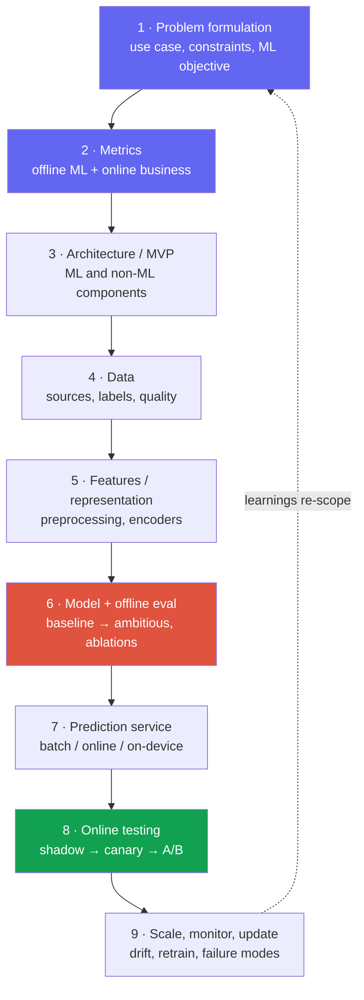
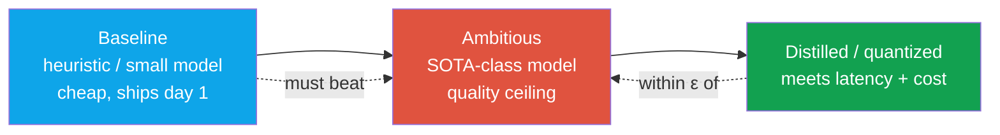

# The Design Framework

<div class="tag-row"><span class="tag">9-step spine</span><span class="tag">problem → metric → data → model → serve → monitor</span><span class="tag">research vs product framing</span><span class="tag">45–60 min</span></div>

> [!TIP] 첫 60초에 이 말을 하세요
> "뭔가를 설계하기 전에, use case와 제약, 그리고 성공을 어떻게 측정할지를 먼저 명확히 하고, 그다음에 baseline 시스템을 스케치한 뒤 원하시는 부분을 deep-dive하겠습니다." 실제 rubric은 조직마다 다르지만, 이런 오프닝은 문제 framing과 구조화 능력을 바로 보여줍니다.

[다음 챕터](#/system-design/case-studies)의 worked case는 이 spine을 공통 출발점으로 씁니다. 여기의 framework는 [alirezadir의 9-step ML system-design outline](https://github.com/alirezadir/machine-learning-interviews/blob/main/src/MLSD/ml-system-design.md)을 화이트보드에서 한 바퀴 돌 수 있는 loop로 조정한 것입니다. 순서를 외우기보다 질문의 위험에 따라 시간을 재배분하세요.

> [!WARNING] research/applied 관점의 반전
> Product-MLE framing은 웬만한 infra가 이미 있다고 가정하고, 깔끔한 data→features→ranking→serve→A/B 파이프라인에 보상을 줍니다. **Research/applied framing은 무게중심을 옮겨서** *문제 정의, metric 설계, 실험적 엄밀성(ablation, baseline, failure analysis), 모델링의 새로움* 쪽으로 갑니다. 전체 시스템을 여전히 그리긴 하지만, 추가 시간은 과학자가 가치를 더하는 곳에 씁니다. **무엇을 측정할지, 그리고 내가 옳다는 걸 어떻게 알지.** *(방어 가능 — RS/AS loop 리포트에서 종합)*

## The 9 steps as one loop



점선 edge가 핵심입니다. ML 시스템은 waterfall이 아니라 **iterative**해요. 이걸 소리 내어 말하세요 — "현재 baseline을 이기는 가장 단순한 걸 먼저 ship하고, 그다음 monitoring과 error analysis가 문제를 re-scope하게 두겠습니다." 이 한 문장이 production 성숙도로 읽힙니다.

## Time budget (45-minute round)

| Phase | Min | What you must produce |
| --- | --- | --- |
| Clarify + success metrics | 6–8 | 가정을 적어두기; ML objective; offline 2–3개 + online 1–2개 metric |
| High-level architecture | 6–8 | box diagram 하나, request path, offline vs online 분리 |
| Data + features | 8–10 | sources, labeling 전략, leakage/PII, representation |
| Model + offline eval | 8–10 | baseline → ambitious model; **ablation + failure analysis** |
| Serving + scale | 6–8 | latency budget, batch vs online, 대략적 cost 계산 |
| Online eval + monitoring + failure | 5–7 | A/B 설계, drift, rollback, degraded mode |

> [!NOTE] 분위기를 읽되, 암송하지 마세요
> 좋은 면접관은 끼어들어서 한 box를 deep-dive하게 만듭니다. **그들이 방향을 잡게 두세요** — 위 budget은 *그들이* 방향을 잡지 않을 때의 기본값입니다. "끝내려고" 아홉 단계를 전력질주하지 마세요. 그들이 관심 있는 box에서의 깊이가, 묻지도 않은 넓이를 이깁니다.

## Step 1 — Problem formulation (where research candidates win)

모호한 목표를 정확한 ML 문제로 번역한 다음, 그것을 심문하세요. 아래 clarifying question들이 라운드 전체에서 leverage가 가장 큰 몇 분입니다.

| Axis | Ask | Why it forks the design |
| --- | --- | --- |
| **Users / scale** | DAU? QPS peak? request size (image res, tokens)? | batch vs online; 모델 크기 상한 |
| **Latency** | p50 / p99 목표? mobile인지 server인지? interactive인가? | on-device vs cloud; distillation 필요성 |
| **Quality bar** | 허용 error rate? human in the loop? 비대칭 비용? | metric 선택; calibration; fail-open vs fail-closed |
| **Data** | label이 있나? cold start? privacy/consent? | supervised vs weak/self-sup; data engine |
| **Cost** | GPU budget? 요청 1,000건당 비용? | quantization, cascade, caching |
| **Scope / horizon** | 지금의 MVP인가, 18개월 비전인가? | 얼마나 야심찬 모델을 제안할지 |

그다음 **ML framing**을 명시적으로 말하세요. binary/multi-label classification인가, dense prediction(segmentation/matting)인가, retrieval인가, ranking인가, regression인가, generation인가? framing을 이름 붙이는 것 — 그리고 당신이 고른 *reduction* — 이 research-taste 신호입니다. *"저라면 moderation을 하나의 binary head가 아니라 policy별 threshold를 가진 multi-label detection으로 framing하겠습니다. policy들은 서로 독립적인 비용 trade-off를 갖기 때문입니다."*

> [!QUESTION] "여기서 research role을 위한 설계가 product MLE와 어떻게 다른가요?"
> **Short:** 뼈대는 같습니다. 저는 추가 시간을 candidate-generation → ranking funnel이 아니라 *무엇을 측정하고 내가 옳다는 걸 어떻게 알지*에 씁니다.
>
> **Deep:** product 답변은 기존 infra를 통해 business KPI를 최적화합니다. research/applied 답변은 시스템을 **실험 장치**로 다룹니다. metric을 game할 수 없게 정의하고, 화려한 모델이 반드시 이겨야 할 baseline을 제안하고, *왜* 작동하는지를 분리하는 **ablation**을 설계하고, 어디서 깨지는지 알려주는 **failure analysis**를 계획합니다. Infra 감각(FSDP, mixed precision, throughput)도 여전히 중요합니다 — foundation-model 규모가 그걸 요구하니까요 — 하지만 제 차별점은 objective와 증거에 대한 엄밀함입니다.

## Step 2 — Metrics: offline, online, guardrail

가장 흔한 실패는 이들을 뒤섞는 것입니다. 세 tier를 분리하고 hypothesis로 연결하세요.

<dl class="kv">
<dt>Offline ML metrics</dt><dd>배포 전에 선택 기준으로 삼되 <b>decision과 operating point</b>에 맞춥니다. 불균형·희귀 positive에서는 PR curve와 precision/recall@threshold가 흔히 더 직접적이지만 ROC-AUC가 항상 열등한 것은 아닙니다. calibration은 ECE 하나만 쓰지 말고 reliability diagram, NLL/Brier score, class·slice별 calibration과 목표 threshold의 risk/coverage를 봅니다. Dense prediction은 mIoU·boundary-F·SAD/MSE, retrieval/ranking은 Recall@k·nDCG·MRR, generation은 task metric과 검증된 human/judge 평가를 조합합니다.</dd>
<dt>Online business metrics</dt><dd>제품이 실제로 신경 쓰는 것: edit-completion rate, retention, CTR, report rate, task success. ship하기 전엔 이걸로 A/B를 못 하므로, offline <b>proxy</b>와 이 둘을 잇는 명시적 hypothesis가 필요합니다.</dd>
<dt>Guardrail metrics</dt><dd>절대 regress하면 안 되는 제약: p99 latency, cost/req, crash rate, slice별 fairness, safety violation rate. primary metric에서 이겼는데 guardrail을 건드렸다면 그건 승리가 <b>아닙니다</b>.</dd>
</dl>

> [!EXAMPLE] research 신호로서의 metric 설계
> metric을 이름만 대지 말고 — **gaming에 맞서 방어하세요**. "mIoU는 픽셀 전체에 평균을 내기 때문에, 모델이 머리카락 같은 얇은 구조를 다 뭉개면서도 점수는 잘 받을 수 있습니다. 그래서 저는 **boundary-F** metric과 hard-case slice(미세 디테일, 투명도)를 추가해서, 제가 최적화하는 숫자가 사용자가 보는 품질과 일치하게 만들겠습니다." 이것이 바로 research panel이 탐침하는 판단력입니다. [Evaluation Metrics](#/foundations/evaluation-metrics)를 보세요.

## Step 3 — Architecture / MVP

입력→전처리→모델→후처리→저장/응답의 **online path**와 수집→label→학습→registry→배포의 **offline path**를 분리해 그립니다. 이때 auth, cache, queue, human-review와 fallback도 모델 바깥의 일급 component입니다. 각 화살표에 대략적인 QPS·payload·latency budget을 붙이고 single point of failure와 backpressure 경계를 표시하세요.

## Steps 4–5 — Data and features

이 수준에서는 데이터 품질이 모델 선택을 압도합니다. 간단히 다루세요:

- **Sources & labels** — licensed vs scraped vs synthetic; 누가 label하는지, guideline 버전 관리, inter-annotator agreement; label이 부족할 때의 weak/self-supervised 신호.
- **The data engine** — 샘플링된 production 데이터 → hard-case mining → active learning → re-label → retrain. 이 loop를 그리세요. 종종 진짜 제품 해자입니다.
- **Splits & leakage** — row가 아니라 *entity*(user/scene/identity) 기준으로 split하세요. 아니면 metric이 거짓말을 합니다. drift가 있는 것엔 temporal split.
- **PII / consent / retention** — lawful basis/동의, purpose limitation, 최소 수집, retention·삭제, 접근 감사를 설계합니다. 구체적 요구는 관할 법·데이터 종류·조직 정책에 따라 확인하세요.
- **Representation** — 어떤 encoder/feature; normalization; class imbalance 처리(resampling, focal/reweighted loss).

## Step 6 — Model & offline evaluation

단일 후보만 던지기보다, 비교 가능한 **model ladder**를 자주 제안할 수 있습니다:



- **Baseline first.** 일주일 안에 ship되는 rule 하나 또는 작은 모델. 야심찬 모델이 넘어야 할 기준선을 세우고 프로젝트 전체의 리스크를 줄입니다. *언제 더 단순한 baseline이 이기는지*를 아는 것이 senior 신호예요.
- **Ablations.** 답변의 research 심장부: 각 component가 *무엇을 사주는가*? encoder, loss term, data source를 분리하세요. "저라면 boundary loss를 hard-hair slice에서 ablate해서, 이득이 그냥 데이터가 더 많아서 온 게 아님을 확인하겠습니다."
- **Failure analysis.** error를 slice하세요(demographic, resolution, class, scene별로). 집계 accuracy만이 아니라 *어디서* 실패하는지 보고하세요 — 이것이 과학자를 leaderboard 추격자와 구분합니다.
- **Distillation/quantization**으로 quality ceiling을 포기하지 않으면서 serving budget을 맞추세요. Cross-link: [Mixed Precision & Efficiency](#/foundations/mixed-precision-efficiency), [Distributed Training](#/foundations/distributed-training).

## Steps 7–9 — Serve, test online, monitor

**Serving pattern**은 Step 1의 latency/cost/privacy 제약을 따릅니다:

| Pattern | Use when | Cost of getting it wrong |
| --- | --- | --- |
| Synchronous online API | interactive edit, auth, search | p99 폭발, capacity outage |
| Async queue / batch | video, bulk indexing, offline scoring | staleness, backlog |
| On-device | privacy, offline, 초저 latency | 모델 크기·열/배터리·기기 파편화; hotfix/rollback이 서버보다 느림 |
| Cascade (cheap → expensive) | 대규모에서의 cost 제어 | router/threshold의 calibration |

**Online testing/rollout**은 가능한 경우 단계적으로 진행합니다: **shadow**(안전·privacy가 허용하는 트래픽 미러링) → **canary**(작은 비율, guardrail 위반 시 rollback) → **A/B**(간섭·윤리·검정력 조건을 만족할 때) → ramp. 모든 제품이 이 순서를 그대로 쓸 수 있는 것은 아니므로, 고위험·저빈도 시스템은 simulation, prospective validation, human gate가 더 중요할 수 있습니다. 시작 전 **hypothesis, primary metric, guardrail, stopping rule**을 정하세요.

<details class="concept-code">
<summary>개념 코드로 보기</summary>

> 아래는 배포와 실험 판단을 분리한 Python식 **의사코드**입니다. 실제 통계 검정·배포 플랫폼 API가 아닙니다.

```python
def staged_rollout(candidate, baseline, preregistered_plan):
    plan = validate_plan(preregistered_plan)  # 분석 단위·primary·guardrail·기간 고정
    verify_artifact_hash(candidate)

    if privacy_and_side_effect_policy.allows_shadow:
        shadow_report = shadow(candidate, sampled_traffic(), actions_disabled=True)
        require_no_operational_regression(shadow_report)

    deployment = canary(candidate, traffic_fraction=0.01)
    while deployment.in_canary_window():
        health = monitor_guardrails(deployment)  # latency, error, safety, cost
        if health.crosses_emergency_boundary:    # 사전에 정한 즉시 중단 경계
            deployment.rollback()
            return "rolled_back"

    experiment = assign_stably_by_unit(          # request가 아니라 user 등 분석 단위
        units=eligible_population(), variants=[baseline, candidate], seed=plan.seed
    )
    results = run_until_planned_horizon(experiment, plan)  # 매일 보고 임의 조기종료 금지
    effect, interval = paired_or_cluster_aware_estimate(results, plan)
    if plan.primary_wins(effect, interval) and plan.guardrails_pass(results):
        return deployment.ramp_with_monitoring()
    deployment.rollback()
    return "no_ship"
```

</details>

**Monitoring & failure modes** — junior가 건너뛰고 senior가 앞세우는 box:

- *Operational:* QPS, error rate, latency, GPU util, cost.
- *Capacity & queues:* arrival rate, queue depth/age, saturation, admission control, timeout, retry storm. 과부하에서는 무한 대기보다 backpressure·load shedding·degraded mode를 명시합니다.
- *ML health:* prediction distribution, confidence drift, training 대비 **data/concept drift**, slice별 metric.
- *Failure modes & degraded mode:* 나쁜 모델(registry로 rollback), 나쁜 input(validation, fallback UI), abuse(rate limit + policy 모델), outage 시 무슨 일이 일어나는가. 가능하면 **기능은 줄지만 더 안전한 fallback**을 두고, 안전한 fallback이 없다면 fail closed·human escalation·명시적 outage를 선택합니다.

<details class="qa"><summary>어떤 design 라운드에서도 돌릴, 재사용 가능한 design checklist를 설명해 주세요.</summary>
<div class="qa-body">

**Short:** box 아홉 개, 그리고 면접관이 어느 걸 deep-dive하고 싶은지 소리 내어 물어봅니다.

**Deep:**

1. **Problem formulation** — users, scale, latency, cost, privacy를 묻고 classification/dense/retrieval/ranking/generation 중 objective와 reduction을 정합니다.
2. **Metrics** — offline(decision/operating point) · online(KPI) · guardrail(latency, cost, fairness, safety)을 proxy hypothesis로 연결합니다.
3. **Architecture / MVP** — online request path와 offline train/data path, non-ML baseline, auth·queue·fallback을 그립니다.
4. **Data** — sources, labeling guideline, entity/temporal split, leakage, PII/consent, data-engine loop.
5. **Features / representation** — encoder, preprocessing, normalization, train/serve parity.
6. **Model + offline eval** — baseline → ambitious → distilled; ablation, uncertainty, failure slice.
7. **Serving** — batch/online/on-device/cascade; latency·capacity·cost와 backpressure.
8. **Online testing** — shadow→canary→A/B; hypothesis, power, stopping rule, rollback.
9. **Scale / monitor / update** — drift, queue·SLO, slice metric, retrain trigger, degraded mode와 governance.

그다음: *"어느 box를 깊게 파볼까요?"*
</div></details>

<details class="qa"><summary>45분이 있고 면접관은 조용합니다. 어떻게 쓰나요?</summary>
<div class="qa-body">

**Short:** 8분 clarify + metric, 8분 architecture, ~20분 data+model(ML 심장부), ~8분 serving+monitoring, 그리고 내내 trade-off를 내레이션합니다.

**Deep:** 면접관의 침묵만으로 의도를 추측하지 말고, "Would you like me to go deeper here or continue end-to-end?"처럼 확인하세요. 다시 하기 어려운 problem framing과 metric을 앞에 배치하고, "데이터에 ~2분 더 쓰고 모델로 넘어가겠습니다"처럼 timebox를 소리 내어 공유합니다. 시간이 부족하면 역할과 질문에 맞춰 serving 또는 modeling detail을 압축합니다.
</div></details>

### Follow-ups they'll push after your first answer

- *"metric은 올랐는데 제품 KPI는 안 움직였어요 — 무슨 일이죠?"* → proxy/KPI mismatch, 혹은 metric이 game 가능했던 것; offline metric의 유효성과 실험 검정력을 재검토.
- *"training/eval split이 leak되고 있는지 어떻게 아나요?"* → 의심스러울 만큼 높은 offline 대비 online gap; entity overlap, temporal leakage, near-duplicate를 확인.
- *"오늘 시스템을 이기는 가장 싼 건 뭐죠?"* → SOTA 모델 전에 baseline에 손을 뻗는지 테스트하는 것.
- *"어느 component를 가장 먼저 ablate하고, 어떤 결과가 나오면 마음을 바꾸겠어요?"* → 반증 가능한 예측을 대세요; 그게 research 성숙도입니다.

## Cheat-sheet

| Step | One-liner | Research emphasis |
| --- | --- | --- |
| 1 Problem | Clarify + ML objective와 reduction을 말하기 | **High** — framing은 taste |
| 2 Metrics | Offline · online · guardrail, proxy→KPI hypothesis와 함께 | **High** — gaming에 맞선 설계 |
| 3 Architecture | box diagram 하나; offline vs online 분리 | Med |
| 4 Data | sources, label, splits/leakage, PII, data engine | High |
| 5 Features | encoder, preprocessing, imbalance | Med |
| 6 Model + eval | baseline → ambitious → distilled; **ablation + failure analysis** | **Highest** |
| 7 Serving | batch / online / on-device / cascade; latency + cost | Med (infra-aware) |
| 8 Online test | shadow → canary → A/B; hypothesis + stopping rule | High |
| 9 Monitor/scale | drift, slice별 metric, rollback, degraded mode | Med |

> [!TIP] 한 문장 마무리
> "저라면 baseline을 shadow test 뒤에 ship하고, 야심찬 모델이 hard-case slice *와* guardrail에서 그걸 이긴다는 걸 증명하고, latency budget에 맞게 distill한 다음, slice별 monitoring이 다음에 무엇을 고칠지 알려주게 하겠습니다." 이 문장 하나에 아홉 단계가 다 들어 있습니다.

**Related:** [이력서 기반 단계별 예시 답변](#/resume/interview-stage-answers) · [Worked Case Studies](#/system-design/case-studies) · [Designing LLM/Agent Systems](#/system-design/llm-systems) · [Evaluation Metrics](#/foundations/evaluation-metrics) · [Mixed Precision & Efficiency](#/foundations/mixed-precision-efficiency) · [Distributed Training](#/foundations/distributed-training) · [Experiment Design & Ablations](#/research/experiment-design) · [The RS/AS Pipeline](#/process/pipeline)
