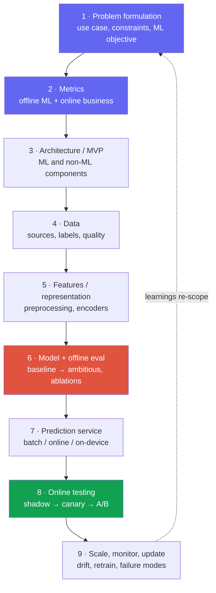
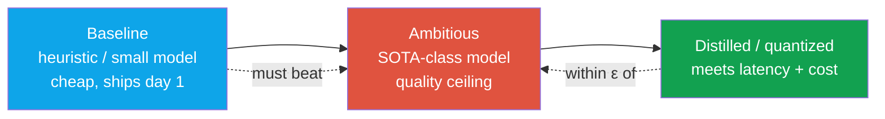

# The Design Framework

9-step spineproblem → metric → data → model → serve → monitorresearch vs product framing45–60 min

> [!TIP] Say this in the first 60 seconds
> "Before I design anything, let me clarify the use case, constraints, and how we'll measure success — then I'll sketch a baseline system and deep-dive wherever you want." A structured opening is itself a scored signal. The interviewer is filling a rubric box that reads *"frames the problem before jumping to a model."* Give them that evidence immediately.

Every worked case in the [next chapter](#/system-design/case-studies) rides this same spine. Learn it once; instantiate it under pressure. The framework here is the widely-cited **9-step ML system design** structure (alirezadir), compressed into a loop you can walk on a whiteboard.

> [!WARNING] The research/applied twist
> Product-MLE framing assumes garden-variety infra exists and rewards a clean data→features→ranking→serve→A/B pipeline. **Research/applied framing shifts the weight** toward *problem formulation, metric design, experimental rigor (ablations, baselines, failure analysis), and modeling novelty.* You still draw the whole system, but you spend your extra minutes where a scientist adds value: **what to measure and how to know you're right.** *(defensible — synthesized from RS/AS loop reports)*

## The 9 steps as one loop

The dashed edge is the point: an ML system is **iterative**, not a waterfall. Say so out loud — "I'd ship the simplest thing that beats the current baseline, then let monitoring and error analysis re-scope the problem." That single sentence reads as production maturity.

## Time budget (45-minute round)

| Phase | Min | What you must produce |
| --- | --- | --- |
| Clarify + success metrics | 6–8 | Assumptions written down; ML objective; 2–3 offline + 1–2 online metrics |
| High-level architecture | 6–8 | One box diagram, request path, offline vs online split |
| Data + features | 8–10 | Sources, labeling strategy, leakage/PII, representation |
| Model + offline eval | 8–10 | Baseline → ambitious model; **ablations + failure analysis** |
| Serving + scale | 6–8 | Latency budget, batch vs online, cost back-of-envelope |
| Online eval + monitoring + failure | 5–7 | A/B design, drift, rollback, degraded mode |

> [!NOTE] Read the room, don't recite
> A strong interviewer will interrupt to deep-dive one box. **Let them steer** — the budget above is your default when *they* don't. Never sprint through all nine steps to "finish"; depth on the box they care about beats breadth they didn't ask for.

## Step 1 — Problem formulation (where research candidates win)

Translate a fuzzy goal into a precise ML problem, then interrogate it. The clarifying questions below are the highest-leverage minutes of the whole round.

| Axis | Ask | Why it forks the design |
| --- | --- | --- |
| **Users / scale** | DAU? QPS peak? request size (image res, tokens)? | batch vs online; model size ceiling |
| **Latency** | p50 / p99 target? mobile or server? interactive? | on-device vs cloud; distillation need |
| **Quality bar** | acceptable error rate? human in the loop? asymmetric cost? | metric choice; calibration; fail-open vs fail-closed |
| **Data** | labels exist? cold start? privacy/consent? | supervised vs weak/self-sup; data engine |
| **Cost** | GPU budget? cost per 1k requests? | quantization, cascades, caching |
| **Scope / horizon** | MVP now, or 18-month vision? | how ambitious a model to propose |

Then state the **ML framing** explicitly: is this binary/multi-label classification, dense prediction (segmentation/matting), retrieval, ranking, regression, or generation? Naming the framing — and the *reduction* you chose — is a research-taste signal. *"I'd frame moderation as multi-label detection with a per-policy threshold rather than one binary head, because policies have independent cost trade-offs."*

> [!QUESTION] "How is designing for a research role different from product MLE here?"
> **Short:** Same skeleton; I spend the extra minutes on *what to measure and how I'd know I'm right*, not on a candidate-generation → ranking funnel.
>
> **Deep:** A product answer optimizes a business KPI through existing infra. A research/applied answer treats the system as an **experimental apparatus**: I'll define the metric so it can't be gamed, propose a baseline the fancy model must beat, design the **ablations** that isolate *why* it works, and plan the **failure analysis** that tells me where it breaks. Infra awareness (FSDP, mixed precision, throughput) still matters — foundation-model scale demands it — but my differentiator is rigor about the objective and the evidence.

## Step 2 — Metrics: offline, online, guardrail

The most common failure is conflating them. Separate three tiers and connect them with a hypothesis.

<dl class="kv">
<dt>Offline ML metrics</dt><dd>What you optimize/select on before deploy. Must match the <b>decision</b>, not convenience. Classification: PR-AUC (imbalanced) &gt; ROC-AUC; Fβ to weight recall vs precision; calibration (ECE) for anything safety-critical. Dense prediction: mIoU, boundary-F, SAD/MSE for matting. Retrieval/ranking: Recall@k, nDCG, MRR. Generation: task-specific + human/LLM-judge.</dd>
<dt>Online business metrics</dt><dd>What the product actually cares about: edit-completion rate, retention, CTR, report rate, task success. You cannot A/B on these until you ship, so you need an offline <b>proxy</b> and a stated hypothesis linking them.</dd>
<dt>Guardrail metrics</dt><dd>Must-not-regress constraints: p99 latency, cost/req, crash rate, fairness across slices, safety violation rate. A win on the primary metric that trips a guardrail is <b>not</b> a win.</dd>
</dl>

> [!EXAMPLE] Metric design as a research signal
> Don't just name a metric — **defend it against gaming**. "mIoU averages over pixels, so a model can score well while destroying thin structures like hair; I'd add a **boundary-F** metric and a hard-case slice (fine detail, transparency) so the number I optimize matches the quality users see." That is exactly the judgment a research panel probes for. See [Evaluation Metrics](#/foundations/evaluation-metrics).

## Steps 4–5 — Data and features

Data quality dominates model choice at this level. Cover, briefly:

- **Sources & labels** — licensed vs scraped vs synthetic; who labels, guideline versioning, inter-annotator agreement; weak/self-supervised signals when labels are scarce.
- **The data engine** — sampled production data → hard-case mining → active learning → re-label → retrain. Draw this loop; it's often the real product moat.
- **Splits & leakage** — split by *entity* (user/scene/identity), not by row, or your metric lies. Temporal splits for anything with drift.
- **PII / consent / retention** — opt-in sampling, retention windows, purpose limitation. Naming this unprompted is an integrity signal (and a hard requirement at Apple-style orgs).
- **Representation** — which encoder/features; normalization; class imbalance handling (resampling, focal/reweighted loss).

## Step 6 — Model & offline evaluation

Always propose a **ladder**, never a single model:

- **Baseline first.** A rule or a small model that ships in a week. It sets the bar the ambitious model must clear and de-risks the whole project. Knowing *when a simpler baseline wins* is a senior signal.
- **Ablations.** The research heart of the answer: what does each component *buy*? Isolate the encoder, the loss term, the data source. "I'd ablate the boundary loss on the hard-hair slice to confirm the gain isn't just from more data."
- **Failure analysis.** Slice the errors (by demographic, resolution, class, scene). Report *where* it fails, not just aggregate accuracy — this is what distinguishes a scientist from a leaderboard chaser.
- **Distillation/quantization** to hit the serving budget without giving up the quality ceiling. Cross-link: [Mixed Precision & Efficiency](#/foundations/mixed-precision-efficiency), [Distributed Training](#/foundations/distributed-training).

## Steps 7–9 — Serve, test online, monitor

**Serving pattern** follows the latency/cost/privacy constraints from Step 1:

| Pattern | Use when | Cost of getting it wrong |
| --- | --- | --- |
| Synchronous online API | interactive edits, auth, search | p99 blowups, capacity outages |
| Async queue / batch | video, bulk indexing, offline scoring | staleness, backlog |
| On-device | privacy, offline, ultra-low latency | model-size ceiling, fragmentation, no hotfix |
| Cascade (cheap → expensive) | cost control at scale | calibration of the router/threshold |

**Online testing** is a staged rollout, never a big-bang: **shadow** (mirror traffic, no user impact) → **canary** (1% with auto-rollback on guardrail breach) → **A/B** (powered experiment on the online metric) → ramp. State your **hypothesis, primary metric, guardrails, and stopping rule** before you ramp.

**Monitoring & failure modes** — the box juniors skip and seniors lead with:

- *Operational:* QPS, error rate, latency, GPU util, cost.
- *ML health:* prediction distribution, confidence drift, **data/concept drift** vs training, per-slice metrics.
- *Failure modes & degraded mode:* what happens on a bad model (rollback via registry), bad input (validation, fallback UI), abuse (rate limits + policy model), or outage (serve the cheaper baseline). Always have a **fallback that is worse but safe.**

Walk me through your reusable design checklist — the one you'd run in any design round.

**Short:** Nine boxes, and I say out loud which one the interviewer wants to deep-dive.

**Deep:**

1. **Clarify** — users, scale, latency, quality bar, cost, privacy, horizon. Write assumptions down.
2. **ML framing + objective** — classification / dense / retrieval / ranking / generation; the reduction I chose and why.
3. **Metrics** — offline (matches the decision, resists gaming) · online (business) · guardrails (latency, cost, fairness, safety). State the proxy→KPI hypothesis.
4. **Architecture** — one box diagram; request path; offline vs online split.
5. **Data** — sources, labeling + guidelines, splits/leakage, PII/consent, imbalance, the data-engine loop.
6. **Features/representation** — encoder, preprocessing, normalization.
7. **Model ladder** — baseline → ambitious → distilled; **ablations + failure analysis**.
8. **Serving** — batch/online/on-device/cascade; latency & cost back-of-envelope.
9. **Online eval + monitoring + failure** — shadow→canary→A/B; drift; rollback; degraded mode.

Then: *"Which box do you want me to go deep on?"*

You've got 45 minutes and the interviewer stays quiet. How do you spend them?

**Short:** 8 min clarify + metrics, 8 min architecture, ~20 min on data+model (the ML heart), ~8 min serving+monitoring, and I narrate trade-offs the whole way.

**Deep:** Silence usually means "keep driving, I'm assessing structure." I front-load the parts that are hard to redo — problem framing and metrics — because a wrong objective invalidates everything downstream. I timebox myself aloud ("I'll spend ~2 more minutes on data, then move to the model") so the interviewer can redirect. If I'm running long, I compress serving to the pattern table and spend the recovered minutes on ablations, because for a research role that's where my signal is.

### Follow-ups they'll push after your first answer

- *"Your metric went up but the product KPI didn't move — what happened?"* → proxy/KPI mismatch, or the metric was gameable; re-examine the offline metric's validity and the experiment power.
- *"How would you know your training/eval split is leaking?"* → suspiciously high offline vs online gap; check for entity overlap, temporal leakage, near-duplicates.
- *"What's the cheapest thing that beats today's system?"* → they're testing whether you reach for the baseline before the SOTA model.
- *"Which single component would you ablate first, and what result would change your mind?"* → name a falsifiable prediction; that's research maturity.

## Cheat-sheet

| Step | One-liner | Research emphasis |
| --- | --- | --- |
| 1 Problem | Clarify + state the ML objective and reduction | **High** — framing is taste |
| 2 Metrics | Offline · online · guardrail, with a proxy→KPI hypothesis | **High** — design against gaming |
| 3 Architecture | One box diagram; offline vs online split | Med |
| 4 Data | Sources, labels, splits/leakage, PII, data engine | High |
| 5 Features | Encoder, preprocessing, imbalance | Med |
| 6 Model + eval | Baseline → ambitious → distilled; **ablations + failure analysis** | **Highest** |
| 7 Serving | Batch / online / on-device / cascade; latency + cost | Med (infra-aware) |
| 8 Online test | Shadow → canary → A/B; hypothesis + stopping rule | High |
| 9 Monitor/scale | Drift, per-slice metrics, rollback, degraded mode | Med |

> [!TIP] The one-sentence close
> "I'd ship the baseline behind a shadow test, prove the ambitious model beats it on the hard-case slice *and* the guardrails, distill it to the latency budget, then let per-slice monitoring tell me what to fix next." That sentence contains all nine steps.

**Related:** [Worked Case Studies](#/system-design/case-studies) · [Designing LLM/Agent Systems](#/system-design/llm-systems) · [Evaluation Metrics](#/foundations/evaluation-metrics) · [Mixed Precision & Efficiency](#/foundations/mixed-precision-efficiency) · [Distributed Training](#/foundations/distributed-training) · [Experiment Design & Ablations](#/research/experiment-design) · [The RS/AS Pipeline](#/process/pipeline)
