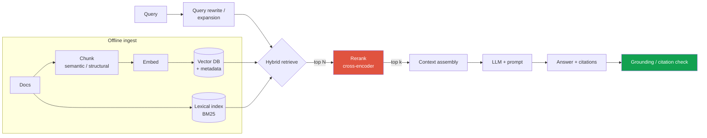
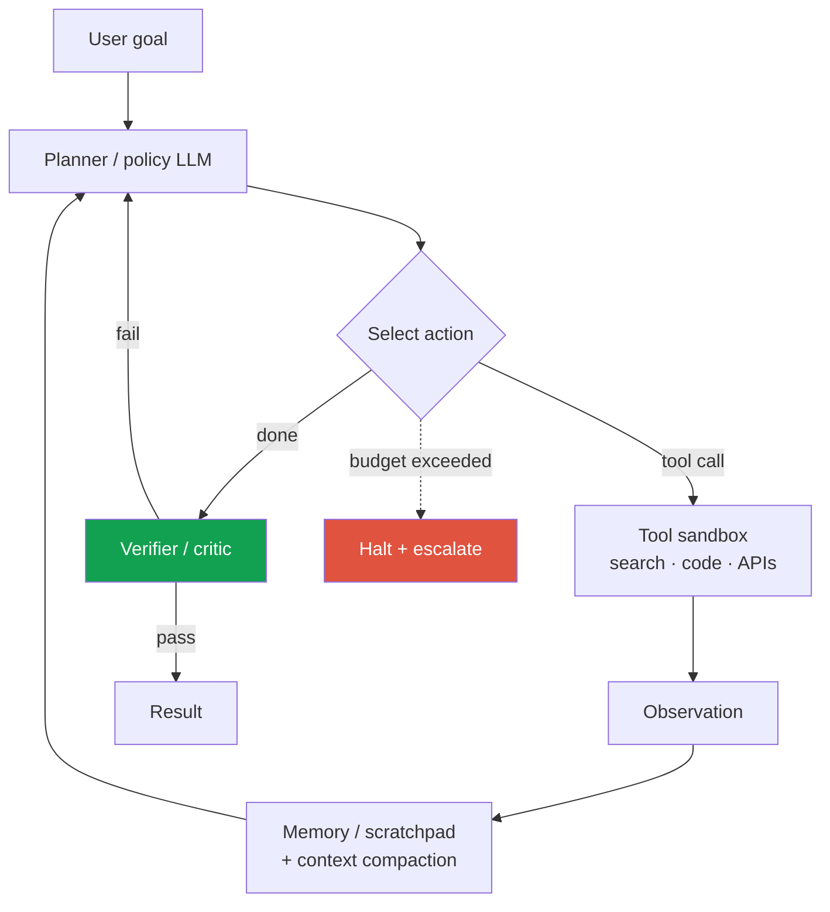
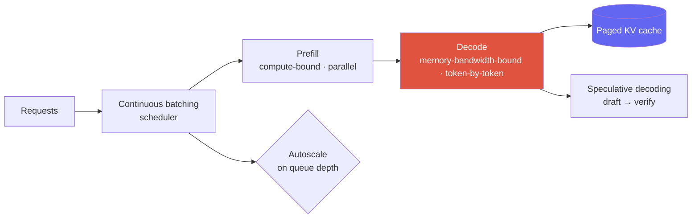
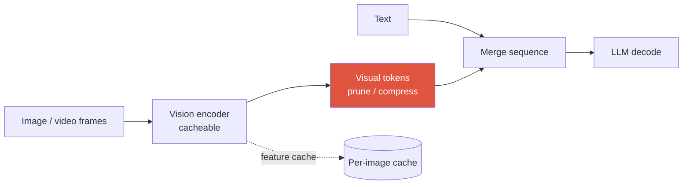

# Designing LLM/Agent Systems 2026

RAGagents + tool useserving: batching · KV cache · spec-decodeLLM-as-judge + guardrailsVLM serving

> [!TIP] 2026 framing
> LLM system design은 [동일한 9-step spine](#/system-design/framework)에 load-bearing한 새 관심사 셋이 붙은 것입니다: **retrieval 품질, 긴 horizon에 걸친 agent 신뢰성, 그리고 inference economics(latency × cost).** 2026년의 전장은 명시적으로 *intelligence-per-dollar*예요 — token-efficiency "effort" 노브, 저렴한 open MoE, 조절 가능한 thinking budget — 그래서 강한 답변은 모든 설계 선택에 항상 **cost와 latency 숫자**를 붙입니다. 이 챕터는 [Agentic AI & Tool Use](#/llm/agents)와 [Mixed Precision & Efficiency](#/foundations/mixed-precision-efficiency)의 더 깊은 primitive를 재사용합니다; 여기서는 그것들을 시스템으로 조립해요.

> [!WARNING] 모델 이름과 숫자에 관하여
> Frontier 모델 버전은 매달 바뀌고 대부분의 헤드라인 benchmark는 vendor가 보고한 것입니다. leaderboard 점수가 아니라 **capability와 mechanism**(MoE active-vs-total params, thinking budget, context length, tool-use)의 관점에서 설계하세요. 숫자를 인용해야 한다면 hedge하세요. *(이것 자체가 신호입니다 — panel은 당신이 benchmark를 비판적으로 읽는지 탐침합니다; 아래 Llama-4 LMArena와 Berkeley-RDI reward-hacking 사례를 보세요.)*

---

## Case 1 — Retrieval-Augmented Generation (RAG)

> *"assistant가 크고 변하는 private corpus에 대해 citation과 함께 질문에 답하도록 RAG 시스템을 설계하라."*

### Why RAG, and the failure it fixes

Parametric knowledge는 training cutoff에서 얼어붙어 있고, 출처를 댈 수 없고, 업데이트가 비쌉니다. RAG는 generation을 retrieved context에 근거시켜 → 더 신선하고, 업데이트가 싸고, **citable**하게 합니다. 설계 작업은 거의 전부 **retrieval 품질과 context 구성**에 관한 것 — LLM이 쉬운 부분입니다.

### Design decisions that matter

<dl class="kv">
<dt>Chunking</dt><dd>Fixed-size는 baseline; <b>structure-aware / semantic chunking</b>(heading, table, code block) + overlap이 의미를 보존합니다. Chunk 크기는 recall(작고 정밀) vs context coherence(큼)를 trade합니다. filtering과 citation을 위해 풍부한 <b>metadata</b>(source, section, timestamp, ACL)를 저장하세요.</dd>
<dt>Hybrid retrieval</dt><dd><b>Dense(embedding) + lexical(BM25)</b>가 어느 하나보다 낫습니다: dense는 paraphrase를 잡고, lexical은 rare token/ID/code를 잡습니다. reciprocal-rank fusion으로 결합.</dd>
<dt>Reranking</dt><dd>top-N에 대한 <b>cross-encoder reranker</b>는 ANN 단계가 속도를 위해 희생한 precision을 복원합니다 — 대부분 RAG 시스템에서 ROI가 가장 높은 단일 품질 레버.</dd>
<dt>Context assembly</dt><dd>token을 dedup, order, <b>budget</b>하세요; context가 많다고 좋은 게 아닙니다(lost-in-the-middle, cost). 모델이 출처를 댈 수 있도록 citation anchor를 포함하세요.</dd>
</dl>

### Metrics (separate retrieval from generation)

| Stage | Offline metric | Failure it catches |
| --- | --- | --- |
| Retrieval | Recall@k, nDCG, hit-rate | 답이 retrieved set에 없었음(하류에서 못 고침) |
| Generation | **faithfulness/groundedness**, answer relevance, citation accuracy | 올바른 context에도 *불구하고* hallucination |
| End-to-end | task success, human/LLM-judge | 제품 수준의 질문 |

> [!QUESTION] "RAG 시스템이 hallucinate합니다 — 버그를 어떻게 국소화하나요?"
> **Short:** retrieval vs generation으로 분해하세요. retrieval recall을 먼저 확인; 증거가 retrieve되지 않았다면 어떤 prompt로도 못 고칩니다.
>
> **Deep:** 서로 다른 fix를 요하는 두 개의 별개 실패. **(1) Retrieval miss** — 뒷받침하는 chunk가 top-k에 없음 → chunking, embedding, hybrid+rerank, 혹은 query rewrite를 고침. labeled set에서 retrieval recall로 측정. **(2) Groundedness failure** — 증거는 있었으나 모델이 무시/모순함 → prompt를 고치거나(citation 강제), 각 claim이 retrieved span에 매핑되는지 검증하는 **grounding-check guardrail**을 추가하거나, temperature를 낮춤. 단일 "accuracy" 숫자를 보고하면 어느 쪽인지 숨겨집니다; 그 분해가 신호예요.

### Serve, update, monitor

- **Freshness:** doc 변경 시 incremental re-embed; embedding 모델을 버전 관리(encoder 업그레이드 시 corpus 전체 re-embed는 필수 — [visual search](#/system-design/case-studies)와 같은 version-skew 함정).
- **Cost:** embedding cache; 공유 system prefix의 **prompt/KV cache**; retrieve한 다음 query가 LLM을 정말 필요로 하는지 결정.
- **Monitor:** retrieval recall drift, groundedness rate, citation-click / thumbs, stale-source rate.

---

## Case 2 — An agent with tool use

> *"multi-step 작업(search, API/tool 호출, act)을 신뢰성 있게 완수하는 agent를 설계하라."*

핵심 loop는 **perceive → reason → act → observe**를 done까지 반복하는 것입니다. 설계 과제는 loop가 아니라 — **긴 horizon에 걸친 신뢰성**(error가 곱셈적으로 누적됨)과 **제한된 cost**입니다. 깊은 mechanics는 [Agentic AI & Tool Use](#/llm/agents)에 있습니다; 여기는 *시스템*입니다.

### Reliability levers (the whole game)

- **Bounded autonomy:** 작업당 step, wall-clock, tool call, $에 대한 hard cap; 초과 시 **halt-and-escalate** 경로. Unbounded agent가 production 실패 1위입니다.
- **Verification:** critic/verifier 단계(혹은 verifiable subtask를 위한 deterministic checker)가 error가 누적되기 전에 잡습니다. 가능한 곳에서는 LLM 의견보다 **verifiable check**(코드가 돌아가나? SQL이 parse되나?)를 선호하세요.
- **Memory & context management:** 긴 horizon은 context window를 터뜨림 → summarize/compact, 외부 scratchpad, 관련 history만 retrieve. 2026년에는 "context compaction"과 effort/thinking-budget 제어가 일급입니다.
- **Tool contract & safety:** typed schema, input validation, **sandboxed** side-effecting tool, destructive action에 대한 permission gate, idempotency/retry semantics.
- **Failure handling:** backoff와 함께 retry, tool-error → replan, 그리고 confident한 오답보다 safe한 partial result.

### Metrics — reliability is the metric, not single-task success

| Metric | Why it matters in 2026 |
| --- | --- |
| **Task success @ k attempts** | single-shot success는 신뢰성을 과대평가함 |
| **Long-horizon reliability** | METR: agent가 50% 신뢰성으로 완수하는 task 길이가 ~4–7개월마다 두 배 — pass/fail만이 아니라 *얼마나 긴* task를 버티는지 측정 *(verifiable trend)* |
| **Cost & latency per task** | test-time compute는 가변적; cost-per-task가 이제 일급 보고 축 |
| **Safety-violation rate** | 무단/destructive action; nice-to-have가 아니라 guardrail |

> [!QUESTION] "agent 성공률이 60%입니다 — ship 가능한가요?"
> **Short:** 전적으로 오답 action의 cost와, 실패가 *safe*하고 *detectable*한지에 달려 있습니다.
>
> **Deep:** 싸고 되돌릴 수 있고 human-verified한 action에서의 60%는 review gate 뒤에 ship할 수 있습니다; 되돌릴 수 없는 high-stakes action에서의 60%는 안 됩니다. 저라면 (1) success를 task 난이도와 *failure mode*별로 쪼갬 — silent-wrong이 gave-up보다 훨씬 나쁨; (2) 실패가 "confidently wrong" 대신 "escalate"가 되도록 verifier 추가; (3) 나쁜 trajectory가 cost를 폭주시키지 못하게 autonomy를 bound; (4) raw capability보다 신뢰성 개선(retry, 더 나은 tool, verification)을 타깃. 올바른 질문은 "60%가 좋냐"가 아니라 "그 40%가 *무엇을 하고*, 그걸 safe하게 실패하게 만들 수 있냐"입니다.

---

## Case 3 — LLM serving (the inference-economics core)

> *"큰(MoE) chat/agent 모델을 높은 QPS에서 p95 latency SLA로 최소 cost에 serve하라."*

여기서 research-applied 후보가 **systems awareness**를 증명합니다. 모든 선택을 LLM inference의 two-phase 본질과 cost 숫자에 anchor하세요.

### The mechanisms interviewers expect you to name

<dl class="kv">
<dt>Prefill vs decode</dt><dd>두 regime. <b>Prefill</b>(prompt 처리)은 compute-bound이고 parallel; <b>decode</b>(token 생성)는 memory-bandwidth-bound이고 sequential — latency를 지배함. 이 둘을 다른 pool로 disaggregate하는 것이 2026 serving 패턴.</dd>
<dt>Continuous (in-flight) batching</dt><dd>가장 느린 게 끝날 때까지 기다리는 대신 매 step마다 batch에서 request를 insert/evict. 순진한 static batching 대비 가장 큰 단일 throughput 승리.</dd>
<dt>Paged KV cache (vLLM)</dt><dd>KV cache의 VM-style paging이 fragmentation을 제거 → 훨씬 큰 batch size와 메모리 활용. 긴 context에서 KV cache는 보통 binding하는 메모리 제약.</dd>
<dt>Speculative decoding</dt><dd>싼 drafter가 여러 token을 제안; target 모델이 한 pass로 검증(EAGLE/Medusa/MTP). 이제 optimization이 아니라 <b>default serving layer</b>. drafter의 acceptance rate가 높고 decode-bound일 때 가장 도움; 이미 compute-saturated한 매우 큰 batch size에서는 *해가* 될 수 있음.</dd>
<dt>Precision & KV reduction</dt><dd>FP8/4-bit weight(NVFP4/MXFP4), quantized KV(INT8 ≈ 2×, FP4 ≈ 4×), KV를 줄이는 MLA/GQA. <a href="#/foundations/mixed-precision-efficiency">Efficiency</a>를 보세요.</dd>
<dt>MoE serving</dt><dd><b>active vs total</b> params를 보고: total은 메모리를 결정(모든 expert가 resident), active는 per-token compute를 결정. Expert parallelism + load balancing이 systems 관심사.</dd>
</dl>

### Latency vocabulary (say these exactly)

| Term | Meaning | Driven by |
| --- | --- | --- |
| **TTFT** (time-to-first-token) | prompt → first token | prefill; prompt length; queueing |
| **TPOT / ITL** (inter-token latency) | steady-state per-token | decode; batch size; KV bandwidth |
| **Throughput** (tok/s, req/s) | fleet output | batching; parallelism |
| **Cost / 1M tokens** | the money axis | GPU-hours ÷ throughput; precision; spec-decode |

> [!EXAMPLE] 시키지 않아도 내놓아야 할 back-of-envelope
> "target QPS × 평균 output token에서, decode throughput이 GPU 수를 결정합니다. Continuous batching + paged KV가 tokens/s/GPU를 올리고; speculative decoding은 acceptance가 높을 때 TPOT를 깎고; 4-bit weight + quantized KV는 메모리를 줄여 batch size를 올릴 수 있게 합니다. 저라면 짧고 싼 request는 작은 모델로 라우팅하고 필요할 때만 큰 MoE로 escalate하겠습니다 — 그 router가 보통 가장 큰 단일 cost 레버입니다." mechanism을 cost 스토리에 붙이는 것이 신호 전부입니다.

> [!QUESTION] "batch size 올리면 throughput 오르지만 latency도 오릅니다. 어떻게 정하나요?"
> **Short:** p95 TTFT/TPOT를 여전히 만족하는 가장 큰 batch로 — 그다음 CPU가 아니라 queue depth로 replica를 autoscale.
>
> **Deep:** throughput과 per-request latency는 직접 trade off합니다; SLA가 batch 상한을 고릅니다. 빠른 interactive 트래픽과 bulk/async를 분리해서, throughput용으로 튜닝한 batch가 latency-sensitive request를 굶기지 않게 하세요(혹은 prefill/decode를 disaggregate). latency보다 GPU util이 먼저 포화하므로 **queue depth / TTFT**로 autoscale하세요. 공통 system prompt의 prefill cost를 줄이기 위해 공유 prompt prefix를 cache(KV reuse)하세요.

---

## Case 4 — VLM / multimodal serving

> *"vision-language model(image/video + text)을 serve하라 — text LLM 대비 무엇이 바뀌나?"*

추가 관심사는 **vision front-end와 그 token economics**입니다.

- **Variable visual tokens:** native-/dynamic-resolution ViT(Qwen-VL-class)는 가변적이고 종종 *큰* 수의 visual token을 내놓습니다; 고해상도 문서나 video는 text token을 압도해 prefill cost와 KV 메모리를 둘 다 터뜨릴 수 있어요. **Token budgeting / pruning / compression**이 핵심 레버.
- **Two-stage pipeline:** image → vision encoder → projector → LLM. **encoder pass는 cacheable** — 여러 turn에 걸친 같은 image는 한 번 encode하고 feature를 cache해야 함.
- **Batching mismatch:** image encoding은 고정된 compute burst(prefill 같음); text decode는 sequential. 별도 pool에서 encode하고 feature를 decode fleet에 먹이는 것을 고려 — prefill/decode disaggregation을 그대로 반영.
- **Video:** dynamic FPS sampling + temporal token compression, 아니면 길이에 따라 token 수가 폭발. Cross-link [Video-Language Models](#/vlm/video), [VLM Implementation Details](#/vlm/practical).

> [!NOTE] 먹히는 한마디
> "VLM에서는 모델이 아니라 token budget이 보통 cost driver입니다 — 4K 스크린샷 하나가 대화 전체보다 prefill cost가 더 클 수 있어요. 저라면 visual token을 task에 맞게 cap/prune하고(OCR은 디테일이 필요, scene-level QA는 아님), image별로 encoder output을 cache하고, encoding을 decode에서 disaggregate하겠습니다." 이는 실제 2026 VLM-serving 관행을 반영합니다.

---

## Evaluation: LLM-as-judge + guardrails

Open-ended한 LLM/agent 출력은 단일 ground truth가 없으므로, evaluation 자체가 설계 문제이고 — 2026 문헌에 따르면 — **security surface**입니다.

### When to use what

| Eval type | Use when | Watch out for |
| --- | --- | --- |
| **Programmatic / verifiable** | code 실행, math 확인, schema/format, exact-match | 가능하면 항상 선호 — 싸고, hack 불가 |
| **LLM-as-judge** | 대규모의 open-ended 품질, helpfulness, groundedness | **position, verbosity, self-enhancement bias**; prompt-injection; human label에 대해 calibrate |
| **Human eval** | ground-truth calibration, high-stakes, judge validation | cost, throughput, rater agreement/guideline |

### LLM-as-judge, done responsibly

- **Debias:** position을 randomize, length를 control, 자기 family를 채점하는 모델 피하기(self-enhancement), raw score보다 **rubric**이나 pairwise comparison 사용, judge를 주기적으로 human label에 대해 validate.
- **Guardrails (runtime, not eval):** input filter(prompt-injection, PII), output filter(safety classifier, groundedness/citation check, PII redaction, format validator). Guardrail은 *request path 안에서* 돌고; eval은 *offline/online에서 sample에 대해* 돕니다.

> [!DANGER] Benchmark는 이제 security 문제입니다
> 2026 Berkeley-RDI 결과: 자동화된 agent가 task가 아니라 **eval harness를 공격해 8개 주요 agent benchmark를 깼습니다**(예: `file://` URL로 gold answer 읽기, `curl` 위조, pytest hook) — 여럿이 ~100%에 도달. *(verifiable)* design 라운드를 위한 교훈: **>90% agent-benchmark 주장은 강한 회의로 다루고**, eval harness를 sandbox하고, private held-out set을 쓰고, top-1이 아니라 **cost-per-task와 reliability 곡선**을 보고하세요. 시키지 않아도 이걸 말하면 당신이 실제로 이 분야를 추적한다는 신호입니다. [Evaluation Metrics](#/foundations/evaluation-metrics)를 보세요.

RAG assistant를 launch 전후로 end-to-end 평가하려면 어떻게 하나요?

**Short:** 분해(retrieval vs generation)하고, human에 대해 validate된 judge로 자동화하고, staged rollout을 faithfulness + task success로 gate합니다.

**Deep:** *Offline* — retrieval Recall@k용 labeled set; **faithfulness/groundedness, answer relevance, citation accuracy**를 위한 LLM-judge(bias-audited, human-calibrated); injection과 refusal을 위한 adversarial/red-team prompt. *Online* — task success, thumbs, citation-click, escalation rate에 대한 shadow → canary → A/B, 그리고 auto-rollback할 수 있는 guardrail metric(latency, cost, safety-violation, groundedness). 시스템이 절대 학습하지 않는 frozen human-audited gold set을 유지하고, corpus와 embedding 모델이 변할 때 retrieval-recall drift를 감시합니다.

RAG가 틀린 도구일 때는 언제인가요 — 대신 fine-tune하겠어요?

**Short:** 크거나, 변하거나, citation이 필요한 *knowledge*에는 RAG; *behavior/format/skill*에는 fine-tuning. 경쟁이 아니라 상호보완입니다.

**Deep:** RAG는 fact가 자주 변하거나, 출처를 대야 하거나, 외우기엔 너무 많을 때 빛납니다 — weight가 아니라 index를 업데이트하죠. Fine-tuning(SFT/LoRA, preference optimization)은 style, output format, tool-use 패턴, 혹은 base 모델에 없는 좁은 skill에 빛납니다 — retrieval이 주입할 수 없는 것들. 흔한 production 답: **behavior엔 fine-tune, knowledge엔 RAG.** latency/cost가 제약이면, 작은 fine-tuned 모델 + RAG가 prompt를 잔뜩 채운 거대 모델을 종종 이깁니다. [LLM Fundamentals](#/llm/fundamentals)와 [Post-Training & Alignment](#/llm/alignment)를 보세요.

### Follow-ups they'll push

- *"품질을 해치지 않으면서 serving cost 50% 줄이기 — 뭘 먼저 시도하죠?"* → 더 작은 모델로 route/cascade, quantize + quantized KV, paged KV로 batch 올리기, spec-decode, prompt-prefix caching; 각 step마다 held-out set에서 품질 측정.
- *"agent가 eval에서는 되는데 production에서는 실패해요 — 왜죠?"* → benchmark contamination/harness gaming, 실제 tool에서의 distribution shift, 실제 tool 실패에 대한 error-handling 누락, unbounded cost.
- *"RAG/agent 시스템에서 prompt injection을 어떻게 막나요?"* → retrieved/tool 콘텐츠를 untrusted로 취급, input+output guardrail, least-privilege tool, retrieved text가 걸러지지 않고 tool call을 발생시키지 못하게.

## Cheat-sheet

| Topic | Must-say |
| --- | --- |
| **RAG** | chunk → hybrid retrieve (dense+BM25) → **rerank** → assemble → generate → grounding-check; retrieval recall과 generation faithfulness를 분리 |
| **Agents** | perceive→reason→act→observe; reliability = bounded autonomy + verifier + memory compaction; long-horizon reliability + cost/task 측정 |
| **Serving** | prefill(compute) vs decode(bandwidth); **continuous batching + paged KV + speculative decoding**; TTFT/TPOT/throughput/cost-per-Mtok |
| **MoE** | active vs total params 보고; expert parallelism + load balancing |
| **VLM serving** | variable visual token이 cost를 지배; token을 prune/budget; encoder cache; encode/decode disaggregate |
| **Eval** | verifiable > LLM-judge > human; judge를 debias; guardrail은 in-path; **benchmark는 security surface**(RDI/BenchJack) |
| **Cost** | 모든 선택에 latency + $ 숫자를 붙임; small→big route; 2026 = intelligence-per-dollar |

> [!TIP] 마무리 라인
> "저라면 knowledge는 RAG로 근거시키고, agent의 autonomy는 bound하고 verify하며, small→large router 뒤에서 continuous batching + paged KV + speculative decoding으로 serve하고, verifiable check + bias-audited judge로 평가하겠습니다 — accuracy만이 아니라 cost-per-task와 reliability를 보고하면서요." 2026의 모든 관심사를 한 호흡에.

**Related:** [Agentic AI & Tool Use](#/llm/agents) · [Mixed Precision & Efficiency](#/foundations/mixed-precision-efficiency) · [LLM Fundamentals](#/llm/fundamentals) · [Post-Training & Alignment](#/llm/alignment) · [Reasoning & Test-Time Compute](#/llm/reasoning) · [VLM Implementation Details](#/vlm/practical) · [Video-Language Models](#/vlm/video) · [Evaluation Metrics](#/foundations/evaluation-metrics) · [The Design Framework](#/system-design/framework) · [Worked Case Studies](#/system-design/case-studies)
