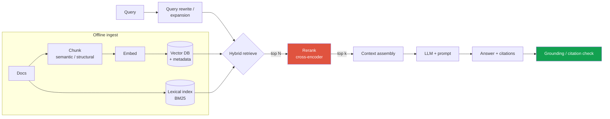
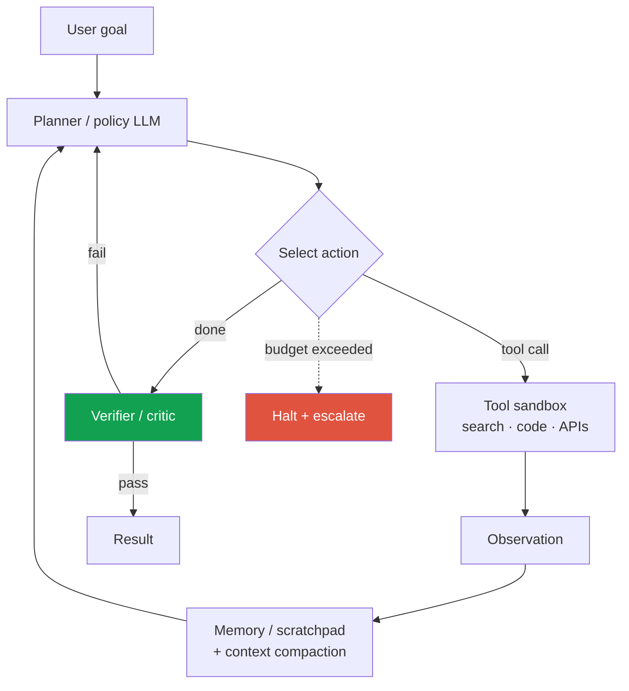
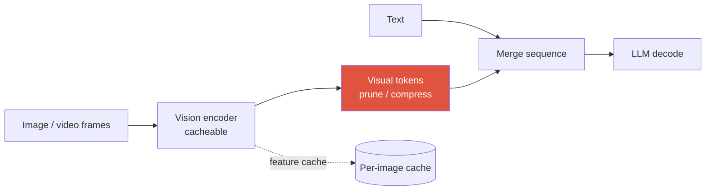

# Designing LLM/Agent Systems <span class="badge badge-2026">2026</span>

<div class="tag-row"><span class="tag">RAG</span><span class="tag">agents + tool use</span><span class="tag">serving: batching · KV cache · spec-decode</span><span class="tag">LLM-as-judge + guardrails</span><span class="tag">VLM serving</span></div>

> [!TIP] 2026 framing
> LLM system design은 [동일한 9-step spine](#/system-design/framework)에 load-bearing한 새 관심사 셋이 붙은 것입니다: **retrieval 품질, 긴 horizon에 걸친 agent 신뢰성, 그리고 inference economics(latency × cost).** effort/thinking-budget, MoE, routing처럼 quality-latency-cost 곡선을 바꾸는 노브가 늘었으므로, 강한 답변은 **의사결정을 바꾸는 핵심 선택**에 측정값이나 back-of-the-envelope bound를 붙입니다. 모든 세부에 근거 없는 숫자를 만드는 것이 아니라, workload 가정·불확실성·검증 계획을 함께 밝히세요. 이 챕터는 [Agentic AI & Tool Use](#/llm/agents)와 [Mixed Precision & Efficiency](#/foundations/mixed-precision-efficiency)의 더 깊은 primitive를 재사용합니다; 여기서는 그것들을 시스템으로 조립해요.

> [!WARNING] 모델 이름과 숫자에 관하여
> Frontier 모델 버전과 제공 조건은 자주 바뀝니다. leaderboard 숫자는 model snapshot, tool/access 조건, judge, 날짜와 독립 검증 여부를 함께 적고, capability·mechanism과 실제 workload의 quality-latency-cost 곡선으로 설계하세요. 아래 BenchJack 사례처럼 benchmark harness 자체도 위협 모델에 넣습니다.

---

## Case 1 — Retrieval-Augmented Generation (RAG)

> *"assistant가 크고 변하는 private corpus에 대해 citation과 함께 질문에 답하도록 RAG 시스템을 설계하라."*

### Why RAG, and the failure it fixes

Parametric knowledge만으로는 최신 private corpus의 버전·출처·권한을 통제하기 어렵습니다. RAG는 외부 문서를 검색해 citation 후보를 제공하지만, 검색 성공 뒤에도 합성·답변 보류·인용 일치가 별도 난제입니다. 이 챕터는 운영 설계를 다루고, 청킹·검색 mechanics의 canonical 설명은 [RAG](#/llm/rag)를 참고하세요.



### Design decisions that matter

<dl class="kv">
<dt>Chunking</dt><dd>Fixed-size는 baseline; <b>structure-aware / semantic chunking</b>(heading, table, code block) + overlap이 의미를 보존합니다. Chunk 크기는 recall(작고 정밀) vs context coherence(큼)를 trade합니다. filtering과 citation을 위해 풍부한 <b>metadata</b>(source, section, timestamp, ACL)를 저장하세요.</dd>
<dt>Hybrid retrieval</dt><dd>Dense는 paraphrase, lexical은 rare ID/code에 강해 결합이 자주 recall을 높이지만, domain·query mix에 따라 단일 retriever가 더 나을 수도 있습니다. score calibration 또는 RRF를 labeled set에서 비교합니다.</dd>
<dt>Reranking</dt><dd>top-N cross-encoder가 precision을 개선할 수 있지만 latency·비용과 domain mismatch가 있습니다. N·model·top-k를 recall/latency curve로 고릅니다.</dd>
<dt>Context assembly</dt><dd>dedup·순서·token budget과 provenance를 관리합니다. citation anchor는 추적을 가능하게 할 뿐 실제 claim을 뒷받침한다고 보장하지 않으므로 citation entailment를 평가합니다.</dd>
</dl>

### Metrics (separate retrieval from generation)

| Stage | Offline metric | Failure it catches |
| --- | --- | --- |
| Retrieval | Recall@k, nDCG, hit-rate | 답이 retrieved set에 없었음(하류에서 못 고침) |
| Generation | answer correctness, faithfulness/attribution, citation precision/recall, no-answer calibration | 올바른 context를 무시하거나 근거 없는 주장 |
| End-to-end | task success, calibrated human/LLM judge, latency·cost | 제품 수준의 품질·운영 trade-off |

> [!QUESTION] "RAG 시스템이 hallucinate합니다 — 버그를 어떻게 국소화하나요?"
> **Short:** retrieval vs generation으로 분해하세요. retrieval recall을 먼저 확인; 증거가 retrieve되지 않았다면 어떤 prompt로도 못 고칩니다.
>
> **Deep:** **(1) Retrieval miss**는 labeled set의 Recall@k로 확인해 chunking·embedding·filter·hybrid·rerank를 고칩니다. **(2) Generation/attribution failure**는 evidence가 있어도 claim이 지지되지 않는 경우입니다. 프롬프트나 낮은 temperature는 완화책일 뿐 강제가 아니며, claim↔span 검증·답변 보류·사람 감사가 필요합니다. **(3) 권한/신선도 실패**는 맞는 내용이어도 다른 tenant 자료나 삭제 문서를 보여 준 경우라 별도 보안 incident입니다.

### Serve, update, monitor

- **Freshness/version:** 추가·수정·삭제를 증분 반영하고 document/chunk/embedding/index 버전을 기록합니다. encoder 변경은 호환성을 확인한 뒤 dual-index/backfill로 전환하며, 무조건 즉시 전체 재색인하는 단일 방법만 있는 것은 아닙니다.
- **Authorization:** tenant·ACL/row-level filter를 검색 전에 적용하고 결과·citation에도 재검사합니다. metadata filter가 post-filter라면 top-k recall과 누출 위험을 함께 봅니다.
- **Cache:** key에 tenant/user authorization, model·prompt·embedding·preprocess·document version을 포함하고 암호화·TTL·삭제 전파·audit를 둡니다. 공유 prefix/KV cache가 사용자 데이터 경계를 넘지 않게 합니다.
- **Monitor:** retrieval recall drift, answer/attribution, citation precision/recall, no-answer calibration, stale/deleted-source·ACL violation, latency·cost.

---

## Case 2 — An agent with tool use

> *"multi-step 작업(search, API/tool 호출, act)을 신뢰성 있게 완수하는 agent를 설계하라."*

핵심 loop는 **perceive → reason → act → observe**를 done까지 반복하는 것입니다. 설계 과제는 loop가 아니라 — **긴 horizon에 걸친 신뢰성**(error가 곱셈적으로 누적됨)과 **제한된 cost**입니다. 깊은 mechanics는 [Agentic AI & Tool Use](#/llm/agents)에 있습니다; 여기는 *시스템*입니다.



### Reliability levers (the whole game)

- **Bounded autonomy:** 작업당 step, wall-clock, tool call, 비용의 hard cap과 **halt-and-escalate** 경로를 둡니다. 우선순위·deadline·cancellation과 queue backpressure도 계약에 포함합니다.
- **Verification:** critic/verifier 단계(혹은 verifiable subtask를 위한 deterministic checker)가 error가 누적되기 전에 잡습니다. 가능한 곳에서는 LLM 의견보다 **verifiable check**(코드가 돌아가나? SQL이 parse되나?)를 선호하세요.
- **Memory & context management:** 긴 horizon은 context window를 터뜨림 → summarize/compact, 외부 scratchpad, 관련 history만 retrieve. 2026년에는 "context compaction"과 effort/thinking-budget 제어가 일급입니다.
- **Tool contract & safety:** typed schema와 semantic validation, per-tool authz·least privilege, secret 격리, sandbox/network allowlist, destructive action 승인, idempotency key·retry semantics·audit log. tool output과 retrieved text는 untrusted data로 취급합니다.
- **Failure handling:** backoff와 함께 retry, tool-error → replan, 그리고 confident한 오답보다 safe한 partial result.

### Metrics — reliability is the metric, not single-task success

| Metric | Why it matters in 2026 |
| --- | --- |
| **pass@1과 success@k** | k회 최고값은 단일 실행 신뢰성을 **과대평가**할 수 있으므로 둘과 시도당 비용·상관을 함께 보고 |
| **Long-horizon reliability** | METR TH1.1의 software-task 50% horizon은 기간별 doubling 추정이 다르고 불확실; 일반 자율성으로 외삽 금지 |
| **Cost & latency per task** | test-time compute는 가변적; cost-per-task가 이제 일급 보고 축 |
| **Safety-violation rate** | 무단/destructive action; nice-to-have가 아니라 guardrail |

[METR TH1.1(2026-01)](https://metr.org/blog/2026-1-29-time-horizon-1-1/)은 전체 기간 약 196.5일, 2023년 이후 약 130.8일, 2024년 이후 약 88.6일의 doubling 추정을 보고합니다. task set·human-time 추정·기간 선택의 불확실성을 함께 인용하고 단일 "4–7개월 법칙"으로 만들지 마세요.

> [!QUESTION] "agent 성공률이 60%입니다 — ship 가능한가요?"
> **Short:** 전적으로 오답 action의 cost와, 실패가 *safe*하고 *detectable*한지에 달려 있습니다.
>
> **Deep:** 싸고 되돌릴 수 있고 human-verified한 action에서의 60%는 review gate 뒤에 ship할 수 있습니다; 되돌릴 수 없는 high-stakes action에서의 60%는 안 됩니다. 저라면 (1) success를 task 난이도와 *failure mode*별로 쪼갬 — silent-wrong이 gave-up보다 훨씬 나쁨; (2) 실패가 "confidently wrong" 대신 "escalate"가 되도록 verifier 추가; (3) 나쁜 trajectory가 cost를 폭주시키지 못하게 autonomy를 bound; (4) raw capability보다 신뢰성 개선(retry, 더 나은 tool, verification)을 타깃. 올바른 질문은 "60%가 좋냐"가 아니라 "그 40%가 *무엇을 하고*, 그걸 safe하게 실패하게 만들 수 있냐"입니다.

---

## Case 3 — LLM serving (the inference-economics core)

> *"큰(MoE) chat/agent 모델을 높은 QPS에서 p95 latency SLA로 최소 cost에 serve하라."*

여기서 research-applied 후보가 **systems awareness**를 증명합니다. 먼저 LLM inference의 two-phase 본질과 workload를 잡고, 큰 trade-off를 latency·throughput·memory·cost estimate에 연결하세요.

### The mechanisms interviewers expect you to name


<dl class="kv">
<dt>Prefill vs decode</dt><dd>Prefill은 prompt token을 병렬 처리해 흔히 compute 비중이 크고, decode는 token-by-token이라 작은 batch에서 memory-bandwidth 비중이 큽니다. 실제 병목은 model·batch·sequence·parallelism에 따라 바뀌므로 roofline/profile로 확인합니다. disaggregation도 traffic mix가 이득일 때 선택합니다.</dd>
<dt>Continuous (in-flight) batching</dt><dd>가장 느린 request가 끝날 때까지 기다리는 대신 step 경계에서 request를 insert/evict합니다. traffic·sequence-length 분산이 큰 online serving에서 static batching 대비 중요한 throughput/utilization 최적화 중 하나지만, 실제 이득은 scheduler overhead·SLA·batch saturation을 포함해 측정합니다.</dd>
<dt>Paged KV cache (vLLM)</dt><dd>KV를 block 단위로 관리해 fragmentation과 예약 낭비를 크게 줄이지만 metadata·internal fragmentation까지 제거하지는 않습니다. 긴 context에서는 weight, activation, KV와 allocator overhead를 함께 측정합니다.</dd>
<dt>Speculative decoding</dt><dd>Drafter 제안과 target 검증으로 latency를 줄일 수 있는 선택적 최적화입니다. 표준 rejection-sampling 방식은 target 분포를 보존할 수 있지만 Medusa/EAGLE/MTP 등 모든 변형이 같은 보장을 갖는 것은 아닙니다. acceptance·verification overhead·batch 조건을 benchmark하며 기본값으로 단정하지 않습니다.</dd>
<dt>Precision & KV reduction</dt><dd>FP8/4-bit weight(NVFP4/MXFP4), quantized KV(INT8 ≈ 2×, FP4 ≈ 4×), KV를 줄이는 MLA/GQA. <a href="#/foundations/mixed-precision-efficiency">Efficiency</a>를 보세요.</dd>
<dt>MoE serving</dt><dd>Active params는 token FLOP, total params는 weight memory의 중요한 요인이지만 실제 latency·resident memory는 sharding/offload, shared layer, all-to-all, load imbalance와 batch에도 좌우됩니다.</dd>
</dl>

<details class="concept-code">
<summary>개념 코드로 보기</summary>

> 아래는 continuous batching scheduler의 **의사코드**입니다. 실제 GPU kernel·paged allocator 구현이 아니라 admission과 cache 생명주기를 보여 줍니다.

```python
def scheduler_tick(waiting, running, kv_pool, now):
    cancel_expired(running, now)                         # 불필요한 decode/KV 즉시 회수
    while waiting and kv_pool.can_admit(waiting.peek()):
        req = deadline_fair_pop(waiting)                 # 긴 요청의 starvation 방지
        req.kv_blocks = kv_pool.reserve(prompt_bound(req))
        running.add(req)

    prefill_batch = choose_prefills(running, token_budget=PREFILL_BUDGET)
    if prefill_batch:
        prefill(prefill_batch)                           # 길이가 다른 prompt는 mask 필요

    decode_batch = [r for r in running if r.prefilled and not r.finished]
    if decode_batch:
        next_logits = decode_one_token(decode_batch)     # 요청마다 현재 KV 길이가 다름
        for req, logits in zip(decode_batch, next_logits):
            req.append(sample(logits), kv_pool)
            if req.hit_eos_or_limit():
                stream_finish(req)
                kv_pool.release(req.kv_blocks)
                running.remove(req)

    record(queue_age=waiting.max_age(), free_kv=kv_pool.free_blocks,
           ttft_by_priority=measure_ttft())
```

Prefill을 무제한 끼워 넣으면 decode의 TPOT가, decode만 우선하면 새 요청의 TTFT가 악화될 수 있습니다. 따라서 token budget·priority·deadline과 KV headroom을 함께 조정합니다.

</details>

### Latency vocabulary (say these exactly)

| Term | Meaning | Driven by |
| --- | --- | --- |
| **TTFT** (time-to-first-token) | prompt → first token | prefill; prompt length; queueing |
| **TPOT / ITL** (inter-token latency) | steady-state per-token | decode; batch size; KV bandwidth |
| **Throughput** (tok/s, req/s) | fleet output | batching; parallelism |
| **Cost / 1M tokens** | the money axis | GPU-hours ÷ throughput; precision; spec-decode |

> [!EXAMPLE] 시키지 않아도 내놓아야 할 back-of-envelope
> "target QPS × 평균 output token에서, decode throughput이 필요한 GPU 규모의 주요 항입니다. Continuous batching + paged KV는 tokens/s/GPU를 높일 수 있고, speculative decoding은 acceptance가 높을 때 TPOT를 줄일 수 있으며, weight/KV quantization은 메모리와 가능한 batch를 바꿉니다. Quality가 유지된다면 작은 모델로 먼저 routing하는 방안도 비용 레버로 비교하겠습니다." 어떤 레버가 가장 큰지는 traffic mix와 품질 제약에 따라 benchmark로 결정합니다.

> [!QUESTION] "batch size 올리면 throughput 오르지만 latency도 오릅니다. 어떻게 정하나요?"
> **Short:** p95 TTFT/TPOT와 fairness를 만족하는 batch를 찾고, queue depth/age·arrival rate·saturation을 이용해 autoscale과 admission control을 설계합니다.
>
> **Deep:** interactive와 bulk/async를 queue·priority별로 격리하고 deadline-aware scheduling, max queue age, load shedding, cancellation을 둡니다. GPU utilization만으로는 대기열 증가를 늦게 보므로 queue depth/age와 TTFT를 함께 사용합니다. prefix/KV cache는 exact token·model·adapter·tenant/authorization key가 일치할 때만 재사용합니다.

---

## Case 4 — VLM / multimodal serving

> *"vision-language model(image/video + text)을 serve하라 — text LLM 대비 무엇이 바뀌나?"*

추가 관심사는 **vision front-end와 그 token economics**입니다.

- **Variable visual tokens:** native-/dynamic-resolution ViT(Qwen-VL-class)는 가변적이고 종종 *큰* 수의 visual token을 내놓습니다; 고해상도 문서나 video는 text token을 압도해 prefill cost와 KV 메모리를 둘 다 터뜨릴 수 있어요. **Token budgeting / pruning / compression**이 핵심 레버.
- **Two-stage pipeline:** image → vision encoder → projector → LLM. 같은 image의 feature를 cache할 수 있지만 content hash뿐 아니라 preprocess·encoder/projector version, crop/resize와 권한을 key에 넣고 개인정보 TTL·삭제를 적용합니다.
- **Batching mismatch:** image encoding은 고정된 compute burst(prefill 같음); text decode는 sequential. 별도 pool에서 encode하고 feature를 decode fleet에 먹이는 것을 고려 — prefill/decode disaggregation을 그대로 반영.
- **Video:** dynamic FPS sampling + temporal token compression, 아니면 길이에 따라 token 수가 폭발. Cross-link [Video-Language Models](#/vlm/video), [VLM Implementation Details](#/vlm/practical).



> [!NOTE] 먹히는 한마디
> "VLM에서는 모델이 아니라 token budget이 보통 cost driver입니다 — 4K 스크린샷 하나가 대화 전체보다 prefill cost가 더 클 수 있어요. 저라면 visual token을 task에 맞게 cap/prune하고(OCR은 디테일이 필요, scene-level QA는 아님), image별로 encoder output을 cache하고, encoding을 decode에서 disaggregate하겠습니다." 이는 실제 2026 VLM-serving 관행을 반영합니다.

---

## Evaluation: LLM-as-judge + guardrails

Open-ended한 LLM/agent 출력은 단일 ground truth가 없으므로, evaluation 자체가 설계 문제이고 — 2026 문헌에 따르면 — **security surface**입니다.

### When to use what

| Eval type | Use when | Watch out for |
| --- | --- | --- |
| **Programmatic / verifiable** | code 실행, math 확인, schema/format, exact-match | 명확한 범위에서 강하지만 test/harness·부분 명세를 game할 수 있음 |
| **LLM-as-judge** | 대규모의 open-ended 품질, helpfulness, groundedness | **position, verbosity, self-enhancement bias**; prompt-injection; human label에 대해 calibrate |
| **Human eval** | ground-truth calibration, high-stakes, judge validation | cost, throughput, rater agreement/guideline |

### LLM-as-judge, done responsibly

- **Debias:** position을 randomize, length를 control, 자기 family를 채점하는 모델 피하기(self-enhancement), raw score보다 **rubric**이나 pairwise comparison 사용, judge를 주기적으로 human label에 대해 validate.
- **Guardrails (runtime, not eval):** input filter(prompt-injection, PII), output filter(safety classifier, groundedness/citation check, PII redaction, format validator). Guardrail은 *request path 안에서* 돌고; eval은 *offline/online에서 sample에 대해* 돕니다.
- **Judge isolation:** candidate output과 retrieved/tool content를 untrusted로 delimit하고 judge의 tool/network/secret 접근을 막습니다. judge prompt/version·순서·seed를 기록하고 disagreement·abstention을 사람 표본과 calibration합니다.

<details class="concept-code">
<summary>개념 코드로 보기</summary>

> 아래는 pairwise judge를 사람 label에 calibration하는 **평가 의사코드**입니다. judge 점수를 ground truth로 쓰는 예가 아닙니다.

```python
def evaluate_pair(ex, candidate_a, candidate_b, rng):
    order = rng.permutation([("A", candidate_a), ("B", candidate_b)])
    packet = render_untrusted_candidates(ex.rubric, order)  # tool/network/secret 없음
    verdict = judge.eval().compare(packet, allow_abstain=True)
    verdict = map_back_to_original_order(verdict, order)

    swapped = judge.compare(render_untrusted_candidates(ex.rubric, order[::-1]),
                            allow_abstain=True)
    swapped = map_back_to_original_order(swapped, order[::-1])
    if verdict != swapped:                                 # position-sensitive sample
        verdict = "abstain_or_human_review"
    return verdict

def validate_judge(frozen_human_set):
    rng = SeededRNG(EVAL_SEED)
    predictions = [evaluate_pair(ex, ex.candidate_a, ex.candidate_b, rng)
                   for ex in frozen_human_set]
    report = agreement_and_confusion(predictions, human_labels(frozen_human_set))
    report.by_slice(["length_gap", "topic", "safety", "model_family"])
    # prompt/judge version이 바뀔 때마다 threshold와 abstention policy를 재검증한다.
    return report
```

</details>

> [!DANGER] Benchmark는 이제 security 문제입니다
> [BenchJack](https://arxiv.org/abs/2605.12673)은 10개 benchmark에서 219개 flaw를 보고했고, [Berkeley RDI 요약](https://rdi.berkeley.edu/blog/trustworthy-benchmarks-cont/)은 그중 8개 prominent benchmark 감사를 설명합니다. blog의 8과 논문의 10을 섞지 마세요. 교훈은 programmatic check도 명세·권한·harness가 취약하면 game된다는 것입니다. sandbox, immutable/private held-out, canary task, filesystem/network 격리와 cost/reliability 보고가 필요합니다.

<details class="qa"><summary>RAG assistant를 launch 전후로 end-to-end 평가하려면 어떻게 하나요?</summary>
<div class="qa-body">

**Short:** 분해(retrieval vs generation)하고, human에 대해 validate된 judge로 자동화하고, staged rollout을 faithfulness + task success로 gate합니다.

**Deep:** *Offline* — retrieval Recall@k용 labeled set; **faithfulness/groundedness, answer relevance, citation accuracy**를 위한 LLM-judge(bias-audited, human-calibrated); injection과 refusal을 위한 adversarial/red-team prompt. *Online* — task success, thumbs, citation-click, escalation rate에 대한 shadow → canary → A/B, 그리고 auto-rollback할 수 있는 guardrail metric(latency, cost, safety-violation, groundedness). 시스템이 절대 학습하지 않는 frozen human-audited gold set을 유지하고, corpus와 embedding 모델이 변할 때 retrieval-recall drift를 감시합니다.
</div></details>

<details class="qa"><summary>RAG가 틀린 도구일 때는 언제인가요 — 대신 fine-tune하겠어요?</summary>
<div class="qa-body">

**Short:** 크거나, 변하거나, citation이 필요한 *knowledge*에는 RAG; *behavior/format/skill*에는 fine-tuning. 경쟁이 아니라 상호보완입니다.

**Deep:** RAG는 fact가 자주 변하거나, 출처를 대야 하거나, 외우기엔 너무 많을 때 빛납니다 — weight가 아니라 index를 업데이트하죠. Fine-tuning(SFT/LoRA, preference optimization)은 style, output format, tool-use 패턴, 혹은 base 모델에 없는 좁은 skill에 빛납니다 — retrieval이 주입할 수 없는 것들. 흔한 production 답: **behavior엔 fine-tune, knowledge엔 RAG.** latency/cost가 제약이면, 작은 fine-tuned 모델 + RAG가 prompt를 잔뜩 채운 거대 모델을 종종 이깁니다. [LLM Fundamentals](#/llm/fundamentals)와 [Post-Training & Alignment](#/llm/alignment)를 보세요.
</div></details>

### Follow-ups they'll push

- *"품질을 해치지 않으면서 serving cost 50% 줄이기 — 뭘 먼저 시도하죠?"* → 더 작은 모델로 route/cascade, quantize + quantized KV, paged KV로 batch 올리기, spec-decode, prompt-prefix caching; 각 step마다 held-out set에서 품질 측정.
- *"agent가 eval에서는 되는데 production에서는 실패해요 — 왜죠?"* → benchmark contamination/harness gaming, 실제 tool에서의 distribution shift, 실제 tool 실패에 대한 error-handling 누락, unbounded cost.
- *"RAG/agent 시스템에서 prompt injection을 어떻게 막나요?"* → content와 instruction 경계를 분리하고 retrieved/tool 결과를 untrusted로 taint; per-tool authz·least privilege·secret isolation·egress allowlist·human approval·audit. 필터 하나로 "막는다"고 말하지 말고 피해 반경을 제한.

## Cheat-sheet

| Topic | Must-say |
| --- | --- |
| **RAG** | chunk → hybrid retrieve (dense+BM25) → **rerank** → assemble → generate → grounding-check; retrieval recall과 generation faithfulness를 분리 |
| **Agents** | perceive→reason→act→observe; reliability = bounded autonomy + verifier + memory compaction; long-horizon reliability + cost/task 측정 |
| **Serving** | prefill/decode를 profile; continuous batching·paged KV·speculative는 workload별 선택; TTFT/TPOT/throughput/cost |
| **MoE** | active vs total params 보고; expert parallelism + load balancing |
| **VLM serving** | variable visual token이 cost를 지배; token을 prune/budget; encoder cache; encode/decode disaggregate |
| **Eval** | programmatic·judge·human은 상호보완; harness/권한까지 위협 모델에 포함하고 judge를 human-calibrate |
| **Cost** | 의사결정을 바꾸는 선택에 latency·memory·통화 단위 estimate를 붙이고 품질과 함께 평가 |

> [!TIP] 마무리 라인
> "저라면 knowledge source와 권한을 먼저 정하고, agent의 autonomy를 bound하고 verify하며, workload에 맞는 batching/KV/quantization 최적화를 고른 뒤, verifiable check와 calibrated evaluation으로 quality·cost-per-task·reliability를 함께 보고하겠습니다." RAG·router·speculative decoding은 요구사항과 benchmark가 정당화할 때 선택합니다.

**Related:** [Agentic AI & Tool Use](#/llm/agents) · [Mixed Precision & Efficiency](#/foundations/mixed-precision-efficiency) · [LLM Fundamentals](#/llm/fundamentals) · [Post-Training & Alignment](#/llm/alignment) · [Reasoning & Test-Time Compute](#/llm/reasoning) · [VLM Implementation Details](#/vlm/practical) · [Video-Language Models](#/vlm/video) · [Evaluation Metrics](#/foundations/evaluation-metrics) · [The Design Framework](#/system-design/framework) · [Worked Case Studies](#/system-design/case-studies)
