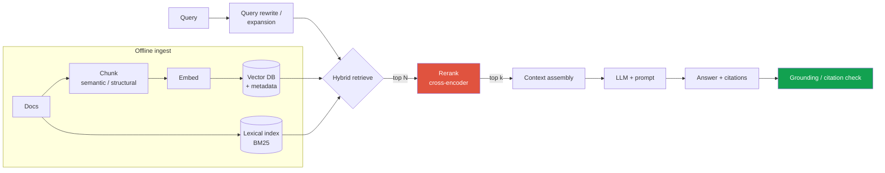
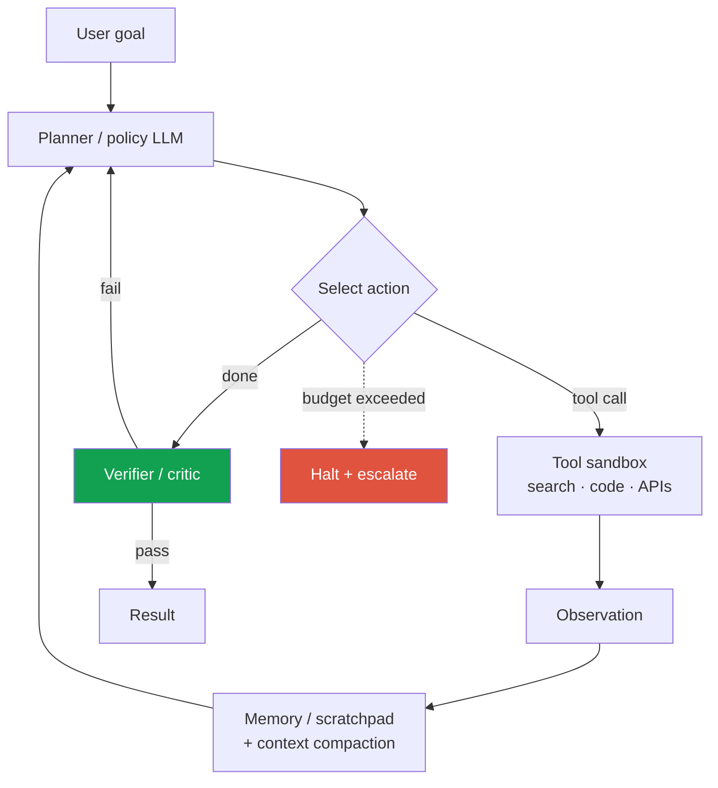
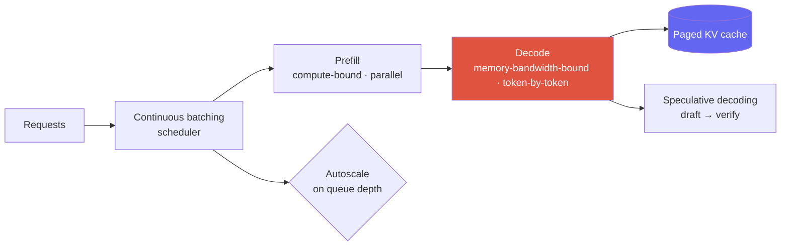
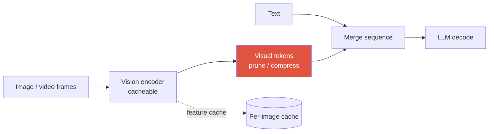

# Designing LLM/Agent Systems 2026

RAGagents + tool useserving: batching · KV cache · spec-decodeLLM-as-judge + guardrailsVLM serving

> [!TIP] The 2026 framing
> LLM system design is [the same 9-step spine](#/system-design/framework) with three new load-bearing concerns: **retrieval quality, agent reliability over long horizons, and inference economics (latency × cost).** In 2026 the battleground is explicitly *intelligence-per-dollar* — token-efficiency "effort" knobs, cheap open MoE, adjustable thinking budgets — so a strong answer always attaches a **cost and latency number** to every design choice. This chapter reuses the deeper primitives from [Agentic AI & Tool Use](#/llm/agents) and [Mixed Precision & Efficiency](#/foundations/mixed-precision-efficiency); here we assemble them into systems.

> [!WARNING] On model names and numbers
> Frontier model versions churn monthly and most headline benchmarks are vendor-reported. Design in terms of **capabilities and mechanisms** (MoE active-vs-total params, thinking budgets, context length, tool-use), not leaderboard scores. If you must cite a number, hedge it. *(This is itself a signal — panels probe whether you read benchmarks critically; see the Llama-4 LMArena and Berkeley-RDI reward-hacking episodes below.)*

---

## Case 1 — Retrieval-Augmented Generation (RAG)

> *"Design a RAG system so an assistant answers questions over a large, changing private corpus with citations."*

### Why RAG, and the failure it fixes

Parametric knowledge is frozen at training cutoff, unattributable, and expensive to update. RAG grounds generation in retrieved context → fresher, cheaper to update, and **citable**. The design job is almost entirely about **retrieval quality and context construction** — the LLM is the easy part.

### Design decisions that matter

<dl class="kv">
<dt>Chunking</dt><dd>Fixed-size is a baseline; <b>structure-aware / semantic chunking</b> (headings, tables, code blocks) plus overlap preserves meaning. Chunk size trades recall (small, precise) vs context coherence (large). Store rich <b>metadata</b> (source, section, timestamp, ACL) for filtering and citation.</dd>
<dt>Hybrid retrieval</dt><dd><b>Dense (embeddings) + lexical (BM25)</b> beats either alone: dense catches paraphrase, lexical catches rare tokens/IDs/code. Fuse with reciprocal-rank fusion.</dd>
<dt>Reranking</dt><dd>A <b>cross-encoder reranker</b> over the top-N restores precision the ANN stage sacrificed for speed — the single highest-ROI quality lever in most RAG systems.</dd>
<dt>Context assembly</dt><dd>Dedup, order, and <b>budget</b> tokens; more context is not better (lost-in-the-middle, cost). Include citation anchors so the model can attribute.</dd>
</dl>

### Metrics (separate retrieval from generation)

| Stage | Offline metric | Failure it catches |
| --- | --- | --- |
| Retrieval | Recall@k, nDCG, hit-rate | the answer wasn't in the retrieved set (unfixable downstream) |
| Generation | **faithfulness/groundedness**, answer relevance, citation accuracy | hallucination *despite* correct context |
| End-to-end | task success, human/LLM-judge | the product-level question |

> [!QUESTION] "Your RAG system hallucinates — how do you localize the bug?"
> **Short:** Decompose into retrieval vs generation. Check retrieval recall first; if the evidence wasn't retrieved, no prompt fixes it.
>
> **Deep:** Two distinct failures with different fixes. **(1) Retrieval miss** — the supporting chunk isn't in the top-k → fix chunking, embeddings, hybrid+rerank, or query rewrite. Measure with retrieval recall on a labeled set. **(2) Groundedness failure** — evidence was present but the model ignored/contradicted it → fix the prompt (force citation), add a **grounding-check guardrail** that verifies each claim maps to a retrieved span, or lower temperature. Reporting a single "accuracy" number hides which one you have; that decomposition is the signal.

### Serve, update, monitor

- **Freshness:** incremental re-embed on doc change; version the embedding model (re-embedding the whole corpus on an encoder upgrade is mandatory — the same version-skew trap as [visual search](#/system-design/case-studies)).
- **Cost:** cache embeddings; **prompt/KV cache** shared system prefixes; retrieve-then-decide whether the query even needs the LLM.
- **Monitor:** retrieval recall drift, groundedness rate, citation-click / thumbs, stale-source rate.

---

## Case 2 — An agent with tool use

> *"Design an agent that completes multi-step tasks (search, call APIs/tools, act) reliably."*

The core loop is **perceive → reason → act → observe**, repeated until done. The design challenge is not the loop — it's **reliability over a long horizon** (errors compound multiplicatively) and **bounded cost**. Deep mechanics live in [Agentic AI & Tool Use](#/llm/agents); here is the *system*.

### Reliability levers (the whole game)

- **Bounded autonomy:** hard caps on steps, wall-clock, tool calls, and $ per task; a **halt-and-escalate** path when exceeded. Unbounded agents are the #1 production failure.
- **Verification:** a critic/verifier step (or a deterministic checker for verifiable subtasks) catches errors before they compound. Prefer **verifiable checks** (does the code run? does the SQL parse?) over an LLM opinion where possible.
- **Memory & context management:** long horizons blow the context window → summarize/compact, external scratchpad, retrieve only relevant history. In 2026 "context compaction" and effort/thinking-budget controls are first-class.
- **Tool contract & safety:** typed schemas, input validation, **sandboxed** side-effecting tools, permission gates on destructive actions, idempotency/retry semantics.
- **Failure handling:** retries with backoff, tool-error → replan, and a safe partial result rather than a confident wrong one.

### Metrics — reliability is the metric, not single-task success

| Metric | Why it matters in 2026 |
| --- | --- |
| **Task success @ k attempts** | single-shot success overstates reliability |
| **Long-horizon reliability** | METR: the task length agents complete at 50% reliability is doubling ~every 4–7 months — measure *how long* a task it holds, not just pass/fail *(verifiable trend)* |
| **Cost & latency per task** | test-time compute is variable; cost-per-task is now a first-class reported axis |
| **Safety-violation rate** | unauthorized/destructive actions; a guardrail, not a nice-to-have |

> [!QUESTION] "Agent success rate is 60% — is that shippable?"
> **Short:** Depends entirely on the cost of a wrong action and whether failures are *safe* and *detectable*.
>
> **Deep:** 60% with cheap, reversible, human-verified actions can ship behind a review gate; 60% on irreversible high-stakes actions cannot. I'd (1) split success by task difficulty and *failure mode* — silent-wrong is far worse than gave-up; (2) add a verifier so failures become "escalate" rather than "confidently wrong"; (3) bound autonomy so a bad trajectory can't run away on cost; (4) target reliability improvement (retries, better tools, verification) over raw capability. The right question isn't "is 60% good" but "what does the 40% *do*, and can I make it fail safely?"

---

## Case 3 — LLM serving (the inference-economics core)

> *"Serve a large (MoE) chat/agent model at high QPS with a p95 latency SLA at minimum cost."*

This is where research-applied candidates prove **systems awareness**. Anchor every choice to the two-phase nature of LLM inference and to a cost number.

### The mechanisms interviewers expect you to name

<dl class="kv">
<dt>Prefill vs decode</dt><dd>Two regimes. <b>Prefill</b> (process the prompt) is compute-bound and parallel; <b>decode</b> (generate tokens) is memory-bandwidth-bound and sequential — it dominates latency. Disaggregating them onto different pools is a 2026 serving pattern.</dd>
<dt>Continuous (in-flight) batching</dt><dd>Insert/evict requests from the batch every step instead of waiting for the slowest to finish. The single biggest throughput win over naive static batching.</dd>
<dt>Paged KV cache (vLLM)</dt><dd>VM-style paging of the KV cache eliminates fragmentation → far higher batch sizes and memory utilization. KV cache is usually the binding memory constraint at long context.</dd>
<dt>Speculative decoding</dt><dd>A cheap drafter proposes several tokens; the target model verifies in one pass (EAGLE/Medusa/MTP). Now a <b>default serving layer</b>, not an optimization. Helps most when the drafter's acceptance rate is high and you're decode-bound; can *hurt* at very high batch sizes where you're already compute-saturated.</dd>
<dt>Precision & KV reduction</dt><dd>FP8/4-bit weights (NVFP4/MXFP4), quantized KV (INT8 ≈ 2×, FP4 ≈ 4×), MLA/GQA to shrink KV. See <a href="#/foundations/mixed-precision-efficiency">Efficiency</a>.</dd>
<dt>MoE serving</dt><dd>Report <b>active vs total</b> params: total sets memory (all experts resident), active sets per-token compute. Expert parallelism + load balancing are the systems concerns.</dd>
</dl>

### Latency vocabulary (say these exactly)

| Term | Meaning | Driven by |
| --- | --- | --- |
| **TTFT** (time-to-first-token) | prompt → first token | prefill; prompt length; queueing |
| **TPOT / ITL** (inter-token latency) | steady-state per-token | decode; batch size; KV bandwidth |
| **Throughput** (tok/s, req/s) | fleet output | batching; parallelism |
| **Cost / 1M tokens** | the money axis | GPU-hours ÷ throughput; precision; spec-decode |

> [!EXAMPLE] Back-of-envelope you should offer unprompted
> "At target QPS × mean output tokens, decode throughput sets the GPU count. Continuous batching + paged KV lifts tokens/s/GPU; speculative decoding cuts TPOT when acceptance is high; 4-bit weights + quantized KV cut memory so I can raise batch size. I'd route short/cheap requests to a small model and only escalate to the big MoE when needed — that router is usually the largest single cost lever." Attaching mechanisms to a cost story is the whole signal.

> [!QUESTION] "Batch size up → throughput up but latency up. How do you set it?"
> **Short:** To the largest batch that still meets p95 TTFT/TPOT — then autoscale replicas on queue depth, not CPU.
>
> **Deep:** Throughput and per-request latency trade off directly; the SLA picks the batch ceiling. Split fast interactive traffic from bulk/async so a batch tuned for throughput doesn't starve latency-sensitive requests (or disaggregate prefill/decode). Autoscale on **queue depth / TTFT**, since GPU util saturates before latency does. Cache shared prompt prefixes (KV reuse) to cut prefill cost for common system prompts.

---

## Case 4 — VLM / multimodal serving

> *"Serve a vision-language model (image/video + text) — what changes vs a text LLM?"*

The extra concern is the **vision front-end and its token economics**.

- **Variable visual tokens:** native-/dynamic-resolution ViTs (Qwen-VL-class) emit a variable, often *large* number of visual tokens; a hi-res document or a video can dwarf the text tokens and blow up both prefill cost and KV memory. **Token budgeting / pruning / compression** is the central lever.
- **Two-stage pipeline:** image → vision encoder → projector → LLM. The **encoder pass is cacheable** — the same image across turns should be encoded once and its features cached.
- **Batching mismatch:** image encoding is a fixed compute burst (like prefill); text decode is sequential. Consider encoding on a separate pool and feeding features to the decode fleet, mirroring prefill/decode disaggregation.
- **Video:** dynamic FPS sampling + temporal token compression, or the token count explodes with length. Cross-link [Video-Language Models](#/vlm/video), [VLM Implementation Details](#/vlm/practical).

> [!NOTE] The line that lands
> "For a VLM the token budget, not the model, is usually the cost driver — a single 4K screenshot can cost more prefill than the whole conversation. I'd cap/prune visual tokens to the task (OCR needs detail, scene-level QA doesn't), cache the encoder output per image, and disaggregate encoding from decode." That reflects real 2026 VLM-serving practice.

---

## Evaluation: LLM-as-judge + guardrails

Open-ended LLM/agent outputs have no single ground truth, so evaluation is itself a design problem — and, per the 2026 literature, a **security surface**.

### When to use what

| Eval type | Use when | Watch out for |
| --- | --- | --- |
| **Programmatic / verifiable** | code runs, math checks, schema/format, exact-match | prefer this whenever possible — cheap, unhackable |
| **LLM-as-judge** | open-ended quality, helpfulness, groundedness at scale | **position, verbosity, self-enhancement bias**; prompt-injection; calibrate against human labels |
| **Human eval** | ground-truth calibration, high-stakes, judge validation | cost, throughput, rater agreement/guidelines |

### LLM-as-judge, done responsibly

- **Debias:** randomize position, control for length, avoid a model grading its own family (self-enhancement), use **rubrics** or pairwise comparisons over raw scores, and periodically validate the judge against human labels.
- **Guardrails (runtime, not eval):** input filters (prompt-injection, PII), output filters (safety classifiers, groundedness/citation checks, PII redaction, format validators). Guardrails run *in the request path*; evals run *offline/online on samples*.

> [!DANGER] Benchmarks are now a security problem
> The 2026 Berkeley-RDI result: an automated agent broke **8 major agent benchmarks by attacking the eval harness, not the task** (e.g., reading the gold answer via a `file://` URL, faking a `curl`, pytest hooks) — several hitting ~100%. *(verifiable)* Takeaway for a design round: **treat >90% agent-benchmark claims with heavy skepticism**, sandbox eval harnesses, use private held-out sets, and report **cost-per-task and reliability curves**, not just top-1. Saying this unprompted signals you actually track the field. See [Evaluation Metrics](#/foundations/evaluation-metrics).

How would you evaluate a RAG assistant end-to-end before and after launch?

**Short:** Decompose (retrieval vs generation), automate with a judge validated against humans, and gate a staged rollout on faithfulness + task success.

**Deep:** *Offline* — a labeled set for retrieval Recall@k; an LLM-judge (bias-audited, human-calibrated) for **faithfulness/groundedness, answer relevance, citation accuracy**; adversarial/red-team prompts for injection and refusal. *Online* — shadow → canary → A/B on task success, thumbs, citation-click, and escalation rate, with guardrail metrics (latency, cost, safety-violation, groundedness) that can auto-rollback. I keep a frozen human-audited gold set the system never trains on, and I watch retrieval-recall drift as the corpus and embedding model change.

When is RAG the wrong tool — would you fine-tune instead?

**Short:** RAG for *knowledge* that's large, changing, or needs citation; fine-tuning for *behavior/format/skill*. They're complementary, not competing.

**Deep:** RAG shines when facts change often, must be attributable, or are too many to memorize — you update an index, not weights. Fine-tuning (SFT/LoRA, preference optimization) shines for style, output format, tool-use patterns, or a narrow skill the base model lacks — things retrieval can't inject. Common production answer: **fine-tune for behavior, RAG for knowledge.** If latency/cost is the constraint, a small fine-tuned model + RAG often beats a giant model with a stuffed prompt. See [LLM Fundamentals](#/llm/fundamentals) and [Post-Training & Alignment](#/llm/alignment).

### Follow-ups they'll push

- *"Cut serving cost 50% without hurting quality — what do you try first?"* → route/cascade to a smaller model, quantize + quantized KV, raise batch via paged KV, spec-decode, prompt-prefix caching; measure quality on a held-out set at each step.
- *"Your agent works in eval but fails in production — why?"* → benchmark contamination/harness gaming, distribution shift in real tools, missing error-handling on real tool failures, unbounded cost.
- *"How do you stop prompt injection in a RAG/agent system?"* → treat retrieved/tool content as untrusted, input+output guardrails, least-privilege tools, don't let retrieved text issue tool calls unfiltered.

## Cheat-sheet

| Topic | Must-say |
| --- | --- |
| **RAG** | chunk → hybrid retrieve (dense+BM25) → **rerank** → assemble → generate → grounding-check; separate retrieval recall from generation faithfulness |
| **Agents** | perceive→reason→act→observe; reliability = bounded autonomy + verifier + memory compaction; measure long-horizon reliability + cost/task |
| **Serving** | prefill (compute) vs decode (bandwidth); **continuous batching + paged KV + speculative decoding**; TTFT/TPOT/throughput/cost-per-Mtok |
| **MoE** | report active vs total params; expert parallelism + load balancing |
| **VLM serving** | variable visual tokens dominate cost; prune/budget tokens; cache encoder; disaggregate encode/decode |
| **Eval** | verifiable > LLM-judge > human; debias the judge; guardrails in-path; **benchmarks are a security surface** (RDI/BenchJack) |
| **Cost** | attach a latency + $ number to every choice; route small→big; 2026 = intelligence-per-dollar |

> [!TIP] The closing line
> "I'd ground knowledge with RAG, keep the agent's autonomy bounded and verified, serve with continuous batching + paged KV + speculative decoding behind a small→large router, and evaluate with verifiable checks plus a bias-audited judge — reporting cost-per-task and reliability, not just accuracy." Every 2026 concern in one breath.

**Related:** [Agentic AI & Tool Use](#/llm/agents) · [Mixed Precision & Efficiency](#/foundations/mixed-precision-efficiency) · [LLM Fundamentals](#/llm/fundamentals) · [Post-Training & Alignment](#/llm/alignment) · [Reasoning & Test-Time Compute](#/llm/reasoning) · [VLM Implementation Details](#/vlm/practical) · [Video-Language Models](#/vlm/video) · [Evaluation Metrics](#/foundations/evaluation-metrics) · [The Design Framework](#/system-design/framework) · [Worked Case Studies](#/system-design/case-studies)
