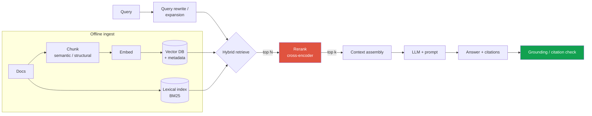
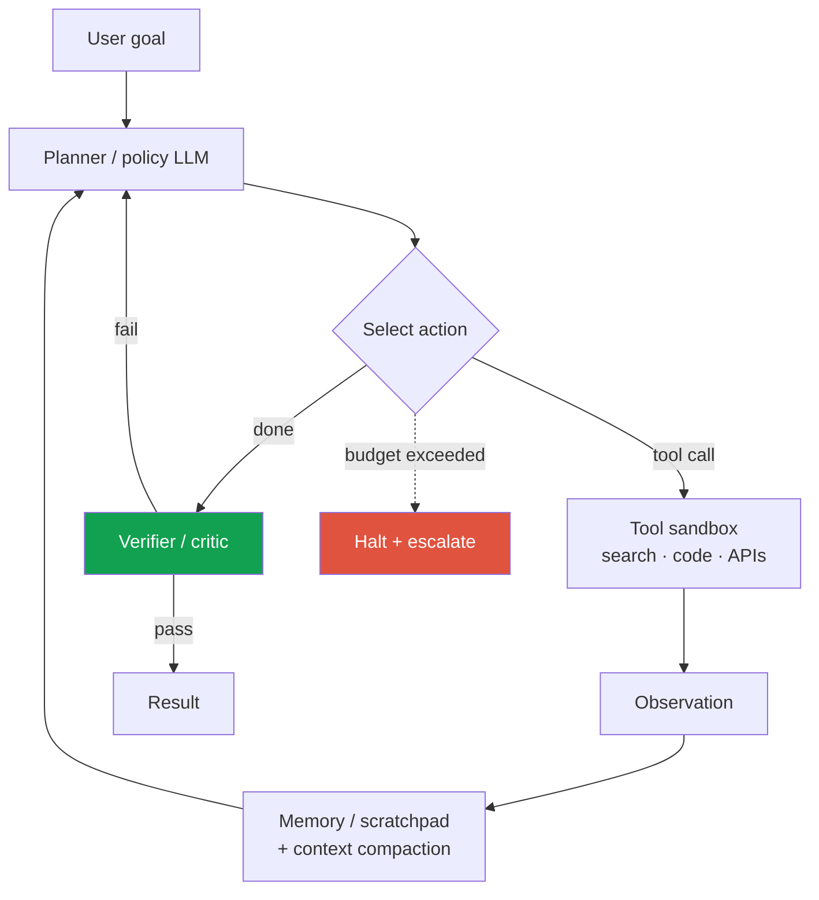
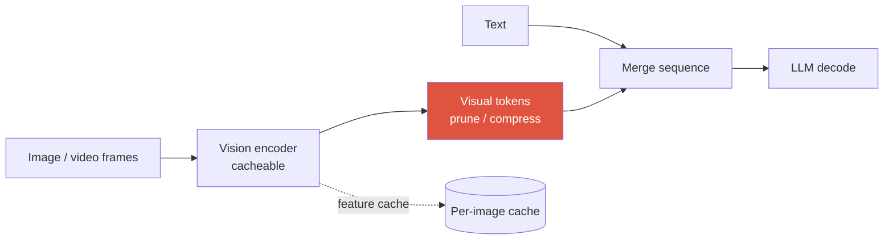

# Designing LLM/Agent Systems <span class="badge badge-2026">2026</span>

<div class="tag-row"><span class="tag">RAG</span><span class="tag">agents + tool use</span><span class="tag">serving: batching · KV cache · spec-decode</span><span class="tag">LLM-as-judge + guardrails</span><span class="tag">VLM serving</span></div>

> [!TIP] The 2026 framing
> LLM system design is [the same 9-step spine](#/system-design/framework) with three new load-bearing concerns: **retrieval quality, agent reliability over long horizons, and inference economics (latency × cost).** Knobs such as effort or thinking budgets, MoE, and routing reshape the quality–latency–cost curve, so a strong answer attaches a measurement or back-of-the-envelope bound to the **key choices that could change the decision**. Do not invent a number for every detail; state the workload assumptions, uncertainty, and validation plan with it. This chapter reuses the deeper primitives from [Agentic AI & Tool Use](#/llm/agents) and [Mixed Precision & Efficiency](#/foundations/mixed-precision-efficiency); here we assemble them into systems.

> [!WARNING] On model names and numbers
> Frontier model versions and access terms change frequently. When citing a leaderboard result, name the model snapshot, tool/access conditions, judge, date, and whether the result was independently verified. Design around capabilities and mechanisms and the quality–latency–cost curve of the actual workload. As the BenchJack example below shows, include the benchmark harness itself in the threat model.

---

## Case 1 — Retrieval-Augmented Generation (RAG)

> *"Design a RAG system so an assistant answers questions over a large, changing private corpus with citations."*

### Why RAG, and the failure it fixes

Parametric knowledge alone makes it difficult to control the version, provenance, and authorization of a current private corpus. RAG retrieves external documents and supplies citation candidates, but synthesis, abstention, and citation agreement remain separate problems even after retrieval succeeds. This chapter covers the operational design; see [RAG](#/llm/rag) for the canonical treatment of chunking and retrieval mechanics.



### Design decisions that matter

<dl class="kv">
<dt>Chunking</dt><dd>Fixed-size is a baseline; <b>structure-aware / semantic chunking</b> (headings, tables, code blocks) plus overlap preserves meaning. Chunk size trades recall (small, precise) vs context coherence (large). Store rich <b>metadata</b> (source, section, timestamp, ACL) for filtering and citation.</dd>
<dt>Hybrid retrieval</dt><dd>Dense retrieval is strong on paraphrases and lexical retrieval on rare IDs or code, so combining them often raises recall; depending on the domain and query mix, however, one retriever may be better. Compare score calibration or RRF on a labeled set.</dd>
<dt>Reranking</dt><dd>A top-N cross-encoder can improve precision, but it adds latency and cost and can suffer domain mismatch. Choose N, model, and top-k from the measured recall–latency curve.</dd>
<dt>Context assembly</dt><dd>Manage deduplication, ordering, token budget, and provenance. A citation anchor makes tracing possible but does not prove that the source supports a claim, so evaluate citation entailment.</dd>
</dl>

### Metrics (separate retrieval from generation)

| Stage | Offline metric | Failure it catches |
| --- | --- | --- |
| Retrieval | Recall@k, nDCG, hit-rate | the answer wasn't in the retrieved set (unfixable downstream) |
| Generation | answer correctness, faithfulness/attribution, citation precision/recall, no-answer calibration | correct context is ignored or unsupported claims are made |
| End-to-end | task success, calibrated human/LLM judge, latency·cost | product-level quality and operational trade-off |

> [!QUESTION] "Your RAG system hallucinates — how do you localize the bug?"
> **Short:** Decompose into retrieval vs generation. Check retrieval recall first; if the evidence wasn't retrieved, no prompt fixes it.
>
> **Deep:** **(1) Retrieval miss** is diagnosed with Recall@k on a labeled set; then inspect chunking, embeddings, filters, hybrid retrieval, and reranking. **(2) Generation/attribution failure** means the evidence was present but the claim is not supported. A prompt or lower temperature can mitigate this but does not enforce it; use claim-to-span verification, abstention, and human audit. **(3) Authorization/freshness failure** is a separate security incident: the answer may be factually correct but expose another tenant's material or a deleted document.

### Serve, update, monitor

- **Freshness/version:** propagate additions, edits, and deletions incrementally, and record document, chunk, embedding, and index versions. On an encoder change, verify compatibility and migrate with a dual index or backfill; an immediate full reindex is not the only valid strategy.
- **Authorization:** apply tenant and ACL or row-level filters before retrieval, then recheck results and citations. If a metadata filter is post-retrieval, evaluate both top-k recall and leakage risk.
- **Cache:** include tenant/user authorization, model, prompt, embedding, preprocessing, and document version in the key; add encryption, TTL, deletion propagation, and auditing. Do not let a shared prefix or KV cache cross user-data boundaries.
- **Monitor:** retrieval-recall drift, answer and attribution quality, citation precision/recall, no-answer calibration, stale or deleted sources, ACL violations, latency, and cost.

---

## Case 2 — An agent with tool use

> *"Design an agent that completes multi-step tasks (search, call APIs/tools, act) reliably."*

The core loop is **perceive → reason → act → observe**, repeated until done. The design challenge is not the loop — it's **reliability over a long horizon** (errors compound multiplicatively) and **bounded cost**. Deep mechanics live in [Agentic AI & Tool Use](#/llm/agents); here is the *system*.



### Reliability levers (the whole game)

- **Bounded autonomy:** hard caps on steps, wall-clock, tool calls, and cost per task, plus a **halt-and-escalate** path. Include priority, deadlines, cancellation, and queue backpressure in the contract.
- **Verification:** a critic/verifier step (or a deterministic checker for verifiable subtasks) catches errors before they compound. Prefer **verifiable checks** (does the code run? does the SQL parse?) over an LLM opinion where possible.
- **Memory & context management:** long horizons blow the context window → summarize/compact, external scratchpad, retrieve only relevant history. In 2026 "context compaction" and effort/thinking-budget controls are first-class.
- **Tool contract & safety:** typed schemas and semantic validation, per-tool authorization and least privilege, secret isolation, a sandbox and network allowlist, approval for destructive actions, idempotency keys, retry semantics, and audit logs. Treat tool output and retrieved text as untrusted data.
- **Failure handling:** retries with backoff, tool-error → replan, and a safe partial result rather than a confident wrong one.

### Metrics — reliability is the metric, not single-task success

| Metric | Why it matters in 2026 |
| --- | --- |
| **pass@1 and success@k** | the best of k attempts can **overstate** single-run reliability, so report both along with per-attempt cost and correlation |
| **Long-horizon reliability** | METR TH1.1 reports different and uncertain doubling estimates for the 50% software-task horizon; do not extrapolate it to general autonomy |
| **Cost & latency per task** | test-time compute is variable; cost-per-task is now a first-class reported axis |
| **Safety-violation rate** | unauthorized/destructive actions; a guardrail, not a nice-to-have |

[METR TH1.1 (2026-01)](https://metr.org/blog/2026-1-29-time-horizon-1-1/) reports doubling estimates of about 196.5 days over the full period, 130.8 days since 2023, and 88.6 days since 2024. Cite the task set, human-time estimates, period choice, and uncertainty rather than turning these into one "four-to-seven-month law."

> [!QUESTION] "Agent success rate is 60% — is that shippable?"
> **Short:** Depends entirely on the cost of a wrong action and whether failures are *safe* and *detectable*.
>
> **Deep:** 60% with cheap, reversible, human-verified actions can ship behind a review gate; 60% on irreversible high-stakes actions cannot. I'd (1) split success by task difficulty and *failure mode* — silent-wrong is far worse than gave-up; (2) add a verifier so failures become "escalate" rather than "confidently wrong"; (3) bound autonomy so a bad trajectory can't run away on cost; (4) target reliability improvement (retries, better tools, verification) over raw capability. The right question isn't "is 60% good" but "what does the 40% *do*, and can I make it fail safely?"

---

## Case 3 — LLM serving (the inference-economics core)

> *"Serve a large (MoE) chat/agent model at high QPS with a p95 latency SLA at minimum cost."*

This is where research-applied candidates demonstrate **systems awareness**. Start from the two-phase nature of LLM inference and the workload, then connect the major trade-offs to estimates of latency, throughput, memory, and cost.

### The mechanisms interviewers expect you to name


<dl class="kv">
<dt>Prefill vs decode</dt><dd>Prefill processes prompt tokens in parallel and is often compute-heavy; decode is token by token and, at small batches, often weighted toward memory bandwidth. The real bottleneck changes with model, batch, sequence, and parallelism, so verify it with profiling or a roofline analysis. Choose disaggregation only when the traffic mix benefits.</dd>
<dt>Continuous (in-flight) batching</dt><dd>Insert and evict requests at step boundaries instead of waiting for the slowest request. It is an important throughput and utilization optimization over static batching for online traffic with variable sequence lengths, but measure scheduler overhead, the SLA, and batch saturation.</dd>
<dt>Paged KV cache (vLLM)</dt><dd>Block-based KV management can greatly reduce fragmentation and reservation waste, but it does not remove metadata or internal fragmentation. At long context, measure weights, activations, KV, and allocator overhead together.</dd>
<dt>Speculative decoding</dt><dd>A drafter proposes tokens and the target verifies them; this is an optional latency optimization. Standard rejection-sampling forms can preserve the target distribution, but variants such as Medusa, EAGLE, and MTP do not all carry the same guarantee. Benchmark acceptance, verification overhead, and batch conditions rather than treating it as a default.</dd>
<dt>Precision & KV reduction</dt><dd>FP8/4-bit weights (NVFP4/MXFP4), quantized KV (INT8 ≈ 2×, FP4 ≈ 4×), MLA/GQA to shrink KV. See <a href="#/foundations/mixed-precision-efficiency">Efficiency</a>.</dd>
<dt>MoE serving</dt><dd>Active parameters are an important factor in token FLOPs and total parameters in weight memory, but actual latency and resident memory also depend on sharding or offload, shared layers, all-to-all communication, load imbalance, and batch size.</dd>
</dl>

<details class="concept-code">
<summary>View as conceptual code</summary>

> This is **pseudocode** for a continuous-batching scheduler. It illustrates admission and cache lifecycle, not a real GPU kernel or paged-allocator implementation.

```python
def scheduler_tick(waiting, running, kv_pool, now):
    cancel_expired(running, now)                         # Reclaim unnecessary decode and KV immediately
    while waiting and kv_pool.can_admit(waiting.peek()):
        req = deadline_fair_pop(waiting)                 # Prevent starvation of long requests
        req.kv_blocks = kv_pool.reserve(prompt_bound(req))
        running.add(req)

    prefill_batch = choose_prefills(running, token_budget=PREFILL_BUDGET)
    if prefill_batch:
        prefill(prefill_batch)                           # Different prompt lengths require masking

    decode_batch = [r for r in running if r.prefilled and not r.finished]
    if decode_batch:
        next_logits = decode_one_token(decode_batch)     # Each request has a different current KV length
        for req, logits in zip(decode_batch, next_logits):
            req.append(sample(logits), kv_pool)
            if req.hit_eos_or_limit():
                stream_finish(req)
                kv_pool.release(req.kv_blocks)
                running.remove(req)

    record(queue_age=waiting.max_age(), free_kv=kv_pool.free_blocks,
           ttft_by_priority=measure_ttft())
```

Allowing unlimited prefills can degrade decode TPOT, while always prioritizing decode can degrade TTFT for new requests. Tune token budgets, priority, deadlines, and KV headroom together.

</details>

### Latency vocabulary (say these exactly)

| Term | Meaning | Driven by |
| --- | --- | --- |
| **TTFT** (time-to-first-token) | prompt → first token | prefill; prompt length; queueing |
| **TPOT / ITL** (inter-token latency) | steady-state per-token | decode; batch size; KV bandwidth |
| **Throughput** (tok/s, req/s) | fleet output | batching; parallelism |
| **Cost / 1M tokens** | the money axis | GPU-hours ÷ throughput; precision; spec-decode |

> [!EXAMPLE] Back-of-envelope you should offer unprompted
> "At target QPS × mean output tokens, decode throughput is a major term in the required fleet size. Continuous batching and paged KV can raise tokens/s/GPU, speculative decoding can reduce TPOT when acceptance is high, and weight/KV quantization changes memory use and feasible batch size. If quality holds, I would also compare routing to a smaller model first as a cost lever." Benchmark which lever matters most for the traffic mix and quality constraints.

> [!QUESTION] "Batch size up → throughput up but latency up. How do you set it?"
> **Short:** Find a batch that meets p95 TTFT/TPOT and fairness, then design autoscaling and admission control from queue depth and age, arrival rate, and saturation.
>
> **Deep:** Isolate interactive and bulk or asynchronous work by queue and priority, and add deadline-aware scheduling, a maximum queue age, load shedding, and cancellation. GPU utilization alone can reveal queue growth too late, so use queue depth/age and TTFT as well. Reuse a prefix/KV cache only when the exact tokens, model, adapter, tenant, and authorization key match.

---

## Case 4 — VLM / multimodal serving

> *"Serve a vision-language model (image/video + text) — what changes vs a text LLM?"*

The extra concern is the **vision front-end and its token economics**.

- **Variable visual tokens:** native-/dynamic-resolution ViTs (Qwen-VL-class) emit a variable, often *large* number of visual tokens; a hi-res document or a video can dwarf the text tokens and blow up both prefill cost and KV memory. **Token budgeting / pruning / compression** is the central lever.
- **Two-stage pipeline:** image → vision encoder → projector → LLM. Features for the same image can be cached, but key them on preprocessing and encoder/projector versions, crop/resize settings, and authorization as well as the content hash; apply privacy-aware TTL and deletion.
- **Batching mismatch:** image encoding is a fixed compute burst (like prefill); text decode is sequential. Consider encoding on a separate pool and feeding features to the decode fleet, mirroring prefill/decode disaggregation.
- **Video:** dynamic FPS sampling + temporal token compression, or the token count explodes with length. Cross-link [Video-Language Models](#/vlm/video), [VLM Implementation Details](#/vlm/practical).



> [!NOTE] The line that lands
> "For a VLM the token budget, not the model, is usually the cost driver — a single 4K screenshot can cost more prefill than the whole conversation. I'd cap/prune visual tokens to the task (OCR needs detail, scene-level QA doesn't), cache the encoder output per image, and disaggregate encoding from decode." That reflects real 2026 VLM-serving practice.

---

## Evaluation: LLM-as-judge + guardrails

Open-ended LLM/agent outputs have no single ground truth, so evaluation is itself a design problem — and, per the 2026 literature, a **security surface**.

### When to use what

| Eval type | Use when | Watch out for |
| --- | --- | --- |
| **Programmatic / verifiable** | code runs, math checks, schema/format, exact-match | strong within a clear scope, but tests, harnesses, and partial specifications can be gamed |
| **LLM-as-judge** | open-ended quality, helpfulness, groundedness at scale | **position, verbosity, self-enhancement bias**; prompt-injection; calibrate against human labels |
| **Human eval** | ground-truth calibration, high-stakes, judge validation | cost, throughput, rater agreement/guidelines |

### LLM-as-judge, done responsibly

- **Debias:** randomize position, control for length, avoid a model grading its own family (self-enhancement), use **rubrics** or pairwise comparisons over raw scores, and periodically validate the judge against human labels.
- **Guardrails (runtime, not eval):** input filters (prompt-injection, PII), output filters (safety classifiers, groundedness/citation checks, PII redaction, format validators). Guardrails run *in the request path*; evals run *offline/online on samples*.
- **Judge isolation:** delimit candidate output and retrieved/tool content as untrusted, and deny the judge tool, network, and secret access. Record judge prompt/version, order, and seed; calibrate disagreement and abstention against human samples.

<details class="concept-code">
<summary>View as conceptual code</summary>

> This is **evaluation pseudocode** for calibrating a pairwise judge against human labels. It does not treat judge scores as ground truth.

```python
def evaluate_pair(ex, candidate_a, candidate_b, rng):
    order = rng.permutation([("A", candidate_a), ("B", candidate_b)])
    packet = render_untrusted_candidates(ex.rubric, order)  # No tool, network, or secret access
    verdict = judge.eval().compare(packet, allow_abstain=True)
    verdict = map_back_to_original_order(verdict, order)

    swapped = judge.compare(render_untrusted_candidates(ex.rubric, order[::-1]),
                            allow_abstain=True)
    swapped = map_back_to_original_order(swapped, order[::-1])
    if verdict != swapped:                                 # Position-sensitive sample
        verdict = "abstain_or_human_review"
    return verdict

def validate_judge(frozen_human_set):
    rng = SeededRNG(EVAL_SEED)
    predictions = [evaluate_pair(ex, ex.candidate_a, ex.candidate_b, rng)
                   for ex in frozen_human_set]
    report = agreement_and_confusion(predictions, human_labels(frozen_human_set))
    report.by_slice(["length_gap", "topic", "safety", "model_family"])
    # Revalidate thresholds and the abstention policy whenever prompt or judge version changes.
    return report
```

</details>

> [!DANGER] Benchmarks are now a security problem
> [BenchJack](https://arxiv.org/abs/2605.12673) reports 219 flaws across 10 benchmarks, while the [Berkeley RDI summary](https://rdi.berkeley.edu/blog/trustworthy-benchmarks-cont/) describes audits of eight prominent benchmarks. Do not conflate the blog's eight with the paper's ten. The lesson is that even programmatic checks can be gamed when the specification, permissions, or harness is vulnerable. Use sandboxing, immutable private held-out data, canary tasks, filesystem/network isolation, and cost and reliability reporting.

<details class="qa"><summary>How would you evaluate a RAG assistant end-to-end before and after launch?</summary>
<div class="qa-body">

**Short:** Decompose (retrieval vs generation), automate with a judge validated against humans, and gate a staged rollout on faithfulness + task success.

**Deep:** *Offline* — a labeled set for retrieval Recall@k; an LLM-judge (bias-audited, human-calibrated) for **faithfulness/groundedness, answer relevance, citation accuracy**; adversarial/red-team prompts for injection and refusal. *Online* — shadow → canary → A/B on task success, thumbs, citation-click, and escalation rate, with guardrail metrics (latency, cost, safety-violation, groundedness) that can auto-rollback. I keep a frozen human-audited gold set the system never trains on, and I watch retrieval-recall drift as the corpus and embedding model change.
</div></details>

<details class="qa"><summary>When is RAG the wrong tool — would you fine-tune instead?</summary>
<div class="qa-body">

**Short:** RAG for *knowledge* that's large, changing, or needs citation; fine-tuning for *behavior/format/skill*. They're complementary, not competing.

**Deep:** RAG shines when facts change often, must be attributable, or are too many to memorize — you update an index, not weights. Fine-tuning (SFT/LoRA, preference optimization) shines for style, output format, tool-use patterns, or a narrow skill the base model lacks — things retrieval can't inject. Common production answer: **fine-tune for behavior, RAG for knowledge.** If latency/cost is the constraint, a small fine-tuned model + RAG often beats a giant model with a stuffed prompt. See [LLM Fundamentals](#/llm/fundamentals) and [Post-Training & Alignment](#/llm/alignment).
</div></details>

### Follow-ups they'll push

- *"Cut serving cost 50% without hurting quality — what do you try first?"* → route/cascade to a smaller model, quantize + quantized KV, raise batch via paged KV, spec-decode, prompt-prefix caching; measure quality on a held-out set at each step.
- *"Your agent works in eval but fails in production — why?"* → benchmark contamination/harness gaming, distribution shift in real tools, missing error-handling on real tool failures, unbounded cost.
- *"How do you stop prompt injection in a RAG/agent system?"* → separate content from instructions and taint retrieved/tool output as untrusted; use per-tool authorization, least privilege, secret isolation, an egress allowlist, human approval, and auditing. Do not claim one filter "stops" it; limit the blast radius.

## Cheat-sheet

| Topic | Must-say |
| --- | --- |
| **RAG** | chunk → hybrid retrieve (dense+BM25) → **rerank** → assemble → generate → grounding-check; separate retrieval recall from generation faithfulness |
| **Agents** | perceive→reason→act→observe; reliability = bounded autonomy + verifier + memory compaction; measure long-horizon reliability + cost/task |
| **Serving** | profile prefill and decode; choose continuous batching, paged KV, and speculative decoding by workload; TTFT/TPOT/throughput/cost |
| **MoE** | report active vs total params; expert parallelism + load balancing |
| **VLM serving** | variable visual tokens dominate cost; prune/budget tokens; cache encoder; disaggregate encode/decode |
| **Eval** | programmatic, judge, and human evaluation are complementary; include harness and permissions in the threat model and calibrate judges against humans |
| **Cost** | attach latency, memory, and currency estimates to decision-changing choices and evaluate them with quality |

> [!TIP] The closing line
> "I'd first define the knowledge source and authorization boundary, bound and verify the agent's autonomy, choose batching, KV, and quantization optimizations for the workload, and then report quality, cost per task, and reliability with verifiable checks and calibrated evaluation." Choose RAG, routing, and speculative decoding only when the requirements and benchmarks justify them.

**Related:** [Agentic AI & Tool Use](#/llm/agents) · [Mixed Precision & Efficiency](#/foundations/mixed-precision-efficiency) · [LLM Fundamentals](#/llm/fundamentals) · [Post-Training & Alignment](#/llm/alignment) · [Reasoning & Test-Time Compute](#/llm/reasoning) · [VLM Implementation Details](#/vlm/practical) · [Video-Language Models](#/vlm/video) · [Evaluation Metrics](#/foundations/evaluation-metrics) · [The Design Framework](#/system-design/framework) · [Worked Case Studies](#/system-design/case-studies)
