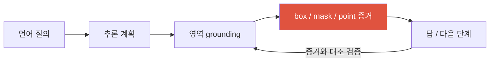

# Grounding & Region-Level Reasoning

<div class="tag-row"><span class="tag">referring expressions</span><span class="tag">grounded captioning</span><span class="tag">coordinates-as-tokens</span><span class="tag">region features</span><span class="tag">detection-as-VLM</span><span class="tag">open-vocab</span></div>

> [!NOTE] 이 챕터의 목표
> 일반 VLM은 이미지를 보고 말로만 답할 수 있습니다. **Grounding**은 언어 표현과 box·mask·point 같은 영역을 연결해 주장을 검사할 수 있게 만듭니다. 좋은 grounding 데이터·학습·검증은 환각을 줄이는 데 도움을 줄 수 있지만, 좌표를 함께 출력한다는 사실만으로 답이 진실이 되지는 않습니다.

## 무엇을 / 왜 — 말을 픽셀에 묶기

한 문장으로: **Grounding = 단어(말)를 이미지의 특정 영역(픽셀)에 묶는 것.** "왼쪽의 빨간 컵" 같은 **지시 표현(referring expression, 무엇을 가리키는지 말로 지정한 구절)** 을 받아, 그것이 가리키는 곳에 상자나 마스크를 돌려줍니다.

왜 필요할까요? 일반 VLM은 존재하지도 않는 객체를 자신 있게 묘사하거나, 컵을 한 번도 localize(위치 파악)하지 않고 "파란 컵 뒤에 뭐가 있어?"에 답하기도 합니다. 근거 없이 **language prior(언어 사전지식 — 학습 데이터에서 본 흔한 패턴으로 하는 추측)** 로 찍기 때문입니다. Grounding은 그 루프를 닫습니다 — 답하기 전에(또는 답하면서) **증거 영역을 먼저 가리키게** 합니다. 그러면 사람이 "정말 거기 그게 있네" 하고 확인할 수 있습니다.

<figure>
<svg viewBox="0 0 640 220" xmlns="http://www.w3.org/2000/svg" font-family="Inter, sans-serif" font-size="12">
  <!-- query -->
  <rect x="20" y="30" width="220" height="34" rx="8" fill="none" stroke="#6366f1" stroke-width="1.6"/>
  <text x="130" y="52" text-anchor="middle" fill="currentColor">"왼쪽의 빨간 컵을 찾아줘"</text>
  <path d="M130 64 V96" stroke="#98a3b2" stroke-width="1.5" marker-end="url(#gA)"/>
  <text x="150" y="84" fill="#98a3b2">grounding</text>
  <!-- scene -->
  <rect x="300" y="30" width="320" height="170" rx="8" fill="none" stroke="#98a3b2" stroke-width="1.4"/>
  <text x="460" y="22" text-anchor="middle" fill="#98a3b2">이미지</text>
  <!-- red cup left (grounded) -->
  <rect x="330" y="120" width="60" height="55" rx="4" fill="rgba(224,83,63,.18)" stroke="#e0533f" stroke-width="2.5"/>
  <path d="M338 135 h44 v22 a22 10 0 0 1 -44 0 z" fill="#e0533f"/>
  <text x="360" y="192" text-anchor="middle" fill="#e0533f" font-size="11">✓ box (증거)</text>
  <!-- blue cup right (not selected) -->
  <rect x="520" y="120" width="60" height="55" rx="4" fill="none" stroke="#0ea5e9" stroke-width="1.2" stroke-dasharray="4 3"/>
  <path d="M528 135 h44 v22 a22 10 0 0 1 -44 0 z" fill="#0ea5e9" opacity="0.5"/>
  <text x="550" y="192" text-anchor="middle" fill="#98a3b2" font-size="11">파란 컵 (제외)</text>
  <!-- answer arrow -->
  <path d="M20 96 h120 v40" fill="none" stroke="#98a3b2" stroke-width="1.5"/>
  <rect x="20" y="136" width="220" height="46" rx="8" fill="none" stroke="#12a150" stroke-width="1.6"/>
  <text x="130" y="156" text-anchor="middle" fill="#12a150" font-size="11">답 = 가리킨 box와</text>
  <text x="130" y="172" text-anchor="middle" fill="#12a150" font-size="11">일치해야 인정 (검증 가능)</text>
  <defs><marker id="gA" markerWidth="8" markerHeight="8" refX="6" refY="3" orient="auto"><path d="M0 0 L6 3 L0 6" fill="#98a3b2"/></marker></defs>
</svg>
<figcaption>"왼쪽의 빨간 컵"에 대해 모델이 box를 제시합니다. 이 출력을 사람이 확인하거나 IoU·일관성 검증기로 채점할 수 있습니다. box 자체도 틀릴 수 있으므로 답과 영역을 모두 평가합니다.</figcaption>
</figure>



> [!TIP] 핵심 한 줄
> Grounding은 텍스트 주장을 영역과 함께 내게 해 **검사 가능성**을 높입니다. "증거를 출력했다"와 "증거가 맞다"를 분리하고, answer accuracy와 localization quality를 함께 보고하세요.

## 1 · 과제 계열 (task family)

grounding은 하나의 과제가 아니라 "영역을 출력하는" 과제들의 묶음입니다. 아래 이름들은 벤치마크·논문에서 계속 마주치므로 미리 정리해 둡니다.

| 과제 | 입력 → 출력 | 벤치마크 |
| --- | --- | --- |
| **REC** (referring expression comprehension) | 이미지 + 표현 → 지칭된 box 1개 | RefCOCO/+/g |
| **RES** (referring expression segmentation) | 이미지 + 표현 → mask | RefCOCO 계열 mask |
| Phrase grounding | 이미지 + caption 구절들 → 각 box | Flickr30K Entities |
| Grounded captioning | 이미지 → 명사와 영역이 연결된 caption | grounded caption sets |
| Open-vocabulary detection (OVD) | 이미지 + text vocabulary/prompt → boxes | LVIS, ODinW 등 |
| Pixel-grounded reasoning | 이미지 + 질의 → 답과 mask/좌표/행동 | 데이터셋별 정의 확인 |

**Referring(지시)** 은 *출력 유형* 때문에 VQA·captioning과 다릅니다: 전역 설명(caption)이나 답 문자열(VQA)이 아니라 **영역(region)** 을 냅니다. "Grounded VQA"는 답 + 증거 영역을 함께 냅니다 — 말과 증거를 한 번에.

## 2 · 영역을 어떻게 출력하나: 설계 스펙트럼

여기가 핵심 아키텍처 선택이자 면접에서 가장 깊이 파고들 지점입니다. VLM은 애초에 텍스트를 뱉는 기계인데, 어떻게 "상자"라는 기하 정보를 내놓게 만들까요? 크게 네 갈래입니다.

<figure>
<svg viewBox="0 0 680 250" xmlns="http://www.w3.org/2000/svg" font-family="Inter, sans-serif" font-size="11.5">
  <text x="10" y="20" fill="#98a3b2">query + image</text>
  <rect x="10" y="35" width="200" height="60" rx="6" fill="none" stroke="#6366f1" stroke-width="2"/>
  <text x="110" y="55" text-anchor="middle" fill="#6366f1">A. 좌표를 텍스트로</text>
  <text x="110" y="72" text-anchor="middle" fill="#98a3b2">LLM이 "[x1,y1,x2,y2]"</text>
  <text x="110" y="87" text-anchor="middle" fill="#98a3b2">또는 &lt;box&gt; 토큰 출력</text>
  <rect x="240" y="35" width="200" height="60" rx="6" fill="none" stroke="#0ea5e9" stroke-width="2"/>
  <text x="340" y="55" text-anchor="middle" fill="#0ea5e9">B. 영역 특징</text>
  <text x="340" y="72" text-anchor="middle" fill="#98a3b2">ROI-pooled / proxy 토큰이</text>
  <text x="340" y="87" text-anchor="middle" fill="#98a3b2">visual latent를 index</text>
  <rect x="470" y="35" width="200" height="60" rx="6" fill="none" stroke="#12a150" stroke-width="2"/>
  <text x="570" y="55" text-anchor="middle" fill="#12a150">C. grounding head</text>
  <text x="570" y="72" text-anchor="middle" fill="#98a3b2">LM hidden state 위</text>
  <text x="570" y="87" text-anchor="middle" fill="#98a3b2">연속 box/mask head</text>
  <rect x="240" y="120" width="200" height="60" rx="6" fill="none" stroke="#e0533f" stroke-width="2"/>
  <text x="340" y="140" text-anchor="middle" fill="#e0533f">D. 외부 전문가(도구)</text>
  <text x="340" y="157" text-anchor="middle" fill="#98a3b2">Grounding DINO + SAM을</text>
  <text x="340" y="172" text-anchor="middle" fill="#98a3b2">agent tool로 호출</text>
  <text x="10" y="212" fill="#98a3b2">트레이드오프 →</text>
  <text x="120" y="212" fill="#98a3b2">단순, 공간 연결 약함</text>
  <text x="360" y="212" fill="#98a3b2">visual 연결 tight, 기계 장치↑</text>
  <text x="470" y="234" fill="#98a3b2">모듈러하지만 오류 전파</text>
</svg>
<figcaption>영역을 만드는 네 가지 설계 패턴입니다. 어느 방식이 가장 정확한지는 출력 단위, 감독 데이터, encoder·decoder, 해상도와 latency에 따라 달라집니다. D는 모듈 교체가 쉽지만 도구 오류를 전파할 수 있습니다.</figcaption>
</figure>

<dl class="kv">
<dt>A · Coordinates-as-tokens (좌표를 토큰으로)</dt><dd>LLM이 말 그대로 숫자나 <code>&lt;box&gt;</code> token을 씁니다(Kosmos-2, Shikra, Qwen-VL). 추가가 사소함 — 새 head 없음 — 그리고 grounding을 그냥 text generation의 일부로 통합. <b>약점: semantic-spatial gap(의미-공간 간극)</b> — 좌표 토큰은 language 공간에 살아서 실제 visual feature(픽셀)와 약하게만 연결되므로 box가 drift(엉뚱한 곳으로 어긋남).</dd>
<dt>B · Region features (영역 특징)</dt><dd>ROI-pooled feature(또는 visual latent를 index하는, 학습된 "proxy token(대리 토큰)")를 LLM에 되먹임. 더 tight한 visual link; 객체 간 관계 추론에 유리. 배관(구현)이 더 많음.</dd>
<dt>C · Grounding head (그라운딩 헤드)</dt><dd>LM hidden state 위에서 box/mask를 예측하는 별도 head(LISA식 mask token → segmentation decoder 등). 연속 출력과 dense 감독을 직접 최적화할 수 있지만, 정확도가 자동 보장되지는 않으며 decoder·해상도·label 비용이 추가됩니다.</dd>
<dt>D · External specialist (외부 전문가)</dt><dd>Grounding DINO / SAM을 <b>도구(tool)</b> 로 호출(Grounded-SAM). 모듈러하고 교체하기 쉬워 specialist의 개선을 활용할 수 있지만, 인터페이스·domain이 맞지 않으면 이득이 그대로 전달되지 않고 오류도 조용히 전파됩니다. end-to-end joint optimization이 없다는 trade-off가 있으며, 이것이 <a href="#/vlm/visual-agents">Visual Reasoning Agents</a>로 가는 다리입니다.</dd>
</dl>

### 좌표를 토큰으로 — 실제로 무슨 일이 벌어지나

방식 A의 한 구현은 박스를 정규화한 수로 바꿔 생성하는 것입니다. **0~1000은 일부 모델의 규약일 뿐 표준이 아닙니다**. 0~1 실수, 0~999/1000의 전용 location token, 문자열 숫자 등 모델마다 범위·끝점 포함·반올림·좌표 순서가 다르므로 processor 계약을 따라야 합니다.

<figure>
<svg viewBox="0 0 660 210" xmlns="http://www.w3.org/2000/svg" font-family="Inter, sans-serif" font-size="11.5">
  <!-- image box -->
  <rect x="20" y="45" width="120" height="120" rx="6" fill="none" stroke="#98a3b2" stroke-width="1.4"/>
  <rect x="52" y="95" width="46" height="55" rx="3" fill="rgba(224,83,63,.18)" stroke="#e0533f" stroke-width="2"/>
  <text x="80" y="38" text-anchor="middle" fill="#98a3b2">이미지 + 질의</text>
  <!-- LLM -->
  <rect x="180" y="70" width="90" height="70" rx="8" fill="#6366f1"/>
  <text x="225" y="102" text-anchor="middle" fill="#fff" font-weight="700">VLM</text>
  <text x="225" y="120" text-anchor="middle" fill="#fff" font-size="10">(LLM 디코더)</text>
  <path d="M140 105 H180" stroke="#98a3b2" stroke-width="1.5" marker-end="url(#gB)"/>
  <path d="M270 105 H310" stroke="#98a3b2" stroke-width="1.5" marker-end="url(#gB)"/>
  <!-- token stream -->
  <text x="485" y="38" text-anchor="middle" fill="#98a3b2">출력 토큰 열 (한 번에 하나씩)</text>
  <g font-size="10.5">
    <rect x="315" y="55" width="46" height="26" rx="4" fill="none" stroke="currentColor" stroke-width="1.2"/><text x="338" y="72" text-anchor="middle" fill="currentColor">The</text>
    <rect x="367" y="55" width="46" height="26" rx="4" fill="none" stroke="currentColor" stroke-width="1.2"/><text x="390" y="72" text-anchor="middle" fill="currentColor">red</text>
    <rect x="419" y="55" width="46" height="26" rx="4" fill="none" stroke="currentColor" stroke-width="1.2"/><text x="442" y="72" text-anchor="middle" fill="currentColor">cup</text>
    <rect x="471" y="55" width="58" height="26" rx="4" fill="none" stroke="#0ea5e9" stroke-width="1.6"/><text x="500" y="72" text-anchor="middle" fill="#0ea5e9">&lt;box&gt;</text>
    <!-- coord tokens -->
    <rect x="315" y="95" width="50" height="26" rx="4" fill="rgba(224,83,63,.14)" stroke="#e0533f" stroke-width="1.6"/><text x="340" y="112" text-anchor="middle" fill="#e0533f">433</text>
    <rect x="371" y="95" width="50" height="26" rx="4" fill="rgba(224,83,63,.14)" stroke="#e0533f" stroke-width="1.6"/><text x="396" y="112" text-anchor="middle" fill="#e0533f">575</text>
    <rect x="427" y="95" width="50" height="26" rx="4" fill="rgba(224,83,63,.14)" stroke="#e0533f" stroke-width="1.6"/><text x="452" y="112" text-anchor="middle" fill="#e0533f">816</text>
    <rect x="483" y="95" width="50" height="26" rx="4" fill="rgba(224,83,63,.14)" stroke="#e0533f" stroke-width="1.6"/><text x="508" y="112" text-anchor="middle" fill="#e0533f">908</text>
    <rect x="539" y="95" width="62" height="26" rx="4" fill="none" stroke="#0ea5e9" stroke-width="1.6"/><text x="570" y="112" text-anchor="middle" fill="#0ea5e9">&lt;/box&gt;</text>
  </g>
  <text x="458" y="150" text-anchor="middle" fill="#98a3b2" font-size="10.5">← 네 좌표 값을 직렬화: [x1, y1, x2, y2] (이 모델은 0~1000)</text>
  <text x="458" y="172" text-anchor="middle" fill="#98a3b2" font-size="10.5">디코딩 후 픽셀로 되돌려(denormalize) 화면에 상자를 그림</text>
  <defs><marker id="gB" markerWidth="8" markerHeight="8" refX="6" refY="3" orient="auto"><path d="M0 0 L6 3 L0 6" fill="#98a3b2"/></marker></defs>
</svg>
<figcaption>Coordinates-as-tokens의 개념 예입니다. 박스는 네 좌표 <em>값</em>으로 직렬화되지만, 문자열 숫자는 tokenizer에서 여러 subword가 될 수 있습니다. 모델이 전용 location token 네 개를 쓰는 경우에만 정확히 네 token이라고 말할 수 있습니다.</figcaption>
</figure>

실제로 모델이 뱉는 토큰 열은 대략 이렇게 생겼습니다(스타일은 모델마다 다름 — Qwen-VL / Kosmos-2 계열 예):

```text
질의:  "왼쪽의 빨간 컵을 찾아줘"

출력:  There is a <ref>red cup</ref><box>(433,575),(816,908)</box> on the left.
        └─ 지시 표현 ─┘        └── 0~1000 정규화 정수 4개 ──┘

디코딩:  (433,575)-(816,908)  →  이미지 크기(예: 640×480)를 곱해
         픽셀 박스 (277,276)-(522,436) 로 복원해서 화면에 그림
```

`<ref>…</ref>`와 좌표 직렬화 방식은 모델별입니다. 숫자 문자열을 일반 vocabulary로 만들 수도 있고 전용 location token을 쓸 수도 있습니다. 어느 경우든 autoregressive 생성으로 좌표를 낼 수 있지만 visual feature와의 결합 강도는 학습 objective와 구조에 달려 있습니다.

<details class="concept-code">
<summary>개념 코드로 보기</summary>

> 아래는 좌표-token grounding의 train/inference 경계를 보여 주는 **의사코드**입니다. 좌표 범위와 resize 규약은 반드시 해당 processor를 따라야 합니다.

```python
def train_grounder(image, prompt_ids, gt_box_xyxy):
    pixels, transform = processor.resize_and_pad(image)
    # 원본 픽셀 좌표 → 실제 model canvas 좌표 → 모델 전용 location 값
    box_model = transform.forward_box(gt_box_xyxy)
    box_tokens = coord_codec.encode(box_model, canvas=shape(pixels)[-2:])
    answer_ids = serialize([BOX_OPEN, *box_tokens, BOX_CLOSE])

    inputs, labels = pack_visual_prompt_answer(pixels, prompt_ids, answer_ids)
    labels[inputs.is_visual_or_prompt_or_padding] = IGNORE_INDEX
    return vlm.train().forward(inputs, labels=labels).loss

@no_grad()
def predict_box(image, prompt_ids):
    vlm.eval()
    pixels, transform = processor.resize_and_pad(image)
    ids = constrained_generate(vlm, pixels, prompt_ids, grammar=BOX_GRAMMAR)
    values = coord_codec.parse(ids)
    if len(values) != 4 or not (values[0] <= values[2] and values[1] <= values[3]):
        return InvalidGrounding("malformed box")
    box_model = coord_codec.decode(values, canvas=shape(pixels)[-2:])
    box_original = transform.inverse_box(box_model)  # padding/resize를 정확히 역변환
    return clip_to_image(box_original, image.size)    # syntax-valid ≠ object-correct
```

</details>

### 코드 랩 — 픽셀 박스를 0~1000 좌표 값으로

정규화가 말로는 추상적이니 직접 짜 봅시다. 목표는 픽셀 박스 `[x1,y1,x2,y2]`를 이 예시 규약의 **0~1000 정수 좌표 네 값**으로 바꾸는 것입니다. 이 값이 전용 location token 하나씩인지, 여러 숫자 subword인지는 tokenizer 설계에 달려 있습니다.

<div class="widget" data-widget="code">
<script type="application/json" class="code-config">
{"func":"box_to_tokens","packages":[],"starter":"def box_to_tokens(box, width, height):\n    # 교육용 규약: 네 픽셀 좌표를 round(coord / size * 1000)한 정수 값으로 반환.\n    # 실제 모델의 범위·반올림·끝점 규약은 processor를 따릅니다.\n    # TODO\n    return [0, 0, 0, 0]","tests":[{"args":[[50,100,150,300],200,400],"expect":[250,250,750,750]},{"args":[[0,0,200,400],200,400],"expect":[0,0,1000,1000]},{"args":[[100,50,100,50],200,100],"expect":[500,500,500,500]},{"args":[[277,276,522,436],640,480],"expect":[433,575,816,908]}],"solution":"def box_to_tokens(box, width, height):\n    if width <= 0 or height <= 0:\n        raise ValueError('width and height must be positive')\n    x1, y1, x2, y2 = box\n    return [\n        round(x1 / width  * 1000),\n        round(y1 / height * 1000),\n        round(x2 / width  * 1000),\n        round(y2 / height * 1000),\n    ]"}
</script>
</div>

되돌리려면(denormalize) 정확히 반대로 — `x_pixel = token / 1000 * width` — 하면 됩니다. 이 왕복(normalize ↔ denormalize)이 방식 A의 전부이고, 나머지는 모델이 그 토큰들을 *잘 예측하도록* 학습시키는 문제입니다.

## 3 · Detection-as-VLM과 open-vocabulary

수렴하는 두 트렌드:

- **Detection을 VLM에 접기(detection-as-VLM):** "객체를 box와 함께 나열하라"는 생성 과제로 표현할 수 있습니다. open-ended prompt에 유연하지만 latency·작은 객체·AP는 task별로 전문 detector와 동일 조건에서 비교해야 합니다.
- **Open-vocabulary detection (OVD, 열린 어휘 검출)** 는 CLIP식 text alignment를 detector에 융합: **Grounding DINO**(text → box), YOLO-World, OWLv2, APE. 이들은 grounded VLM(설계 D)이 호출하는 전문 도구이며, 시스템이 localize할 수 있는 것의 *하한*을 정합니다. 심층: [객체 검출](#/cv/detection), [Vision Foundation Models](#/cv/foundation-models)(SAM 3의 Promptable Concept Segmentation).

> [!NOTE] 영역(box) 증거 vs 픽셀(mask) 증거
> Box는 싸고 빠르지만 경계·occlusion(가림)·겹침에 눈이 멉니다; **mask** 는 편집·측정·검증에 필수입니다. SAM 계보와 zero-shot matting 같은 고품질 segmentation 모델이 이 픽셀 증거의 *공급자* 역할을 합니다 — grounded reasoner는 자신의 mask만큼만 신뢰할 수 있습니다. "픽셀·region 수준"은 의도적인 both-and입니다.

## 4 · Grounded RL과 다단계 grounding (2025–2026)

프런티어 방향: 모델이 **다시 보게** 하기. 좌표를 내고 → crop/zoom하고 → 그 영역을 다시 인코딩하고 → 계속. 텍스트 chain-of-thought의 visual 버전인 셈입니다.

- **Visual 좌표로 grounded reasoning:** 각 추론 단계를 자유 텍스트가 아니라 실제 영역에 anchor(고정)합니다.
- 일부 연구에서는 crop/zoom 도구와 최종 답 reward를 제공했을 때 **grounding 행동이 학습되는 사례**를 보입니다. 이는 도구·task·reward·초기 정책에 조건부이며, box 감독 없이 일반적으로 올바른 grounding이 창발한다는 보장은 아닙니다. (RL 기초는 [RL 프라이머](#/llm/rl-primer).)
- 이것은 agentic "thinking with images(이미지로 사고하기)"로 이어집니다 — [Visual Reasoning Agents](#/vlm/visual-agents).

> [!WARNING] 가짜 성공 (spurious success)
> 모델이 **틀린 증거로 맞는 답**을 낼 수 있습니다(prior로 찍고, box는 엉뚱한 곳에). 답 정확도만 보면 이걸 보상해 버립니다. **항상 grounding 품질을 함께 보고하세요:** mask IoU, pointing-game 정확도, grounded recall. grounding 시스템에서 핵심 평가 설계 지점입니다.

## 5 · grounding 데이터가 비싼 이유

box/mask + 언어 정렬은 라벨링 비용이 큽니다(사람이 상자 치고, 그 상자에 문장을 달아야 함). 스케일링 트릭(과 그 위험):

- **Pseudo-labeling(의사 라벨):** detector + LLM이 region-text 쌍을 자동 생성 → 대량 확보되지만 노이즈.
- **Synthetic / simulator** 데이터(3D scene)로 공간 관계 → 깨끗한 라벨, 대신 domain gap(도메인 격차 — 합성과 실사의 차이).
- **Label-efficient / weakly-supervised**(point, image-level tag 등 값싼 라벨) — PointWSSIS/BESTIE 계열; [Weak & Semi-Supervised](#/cv/weak-semi-supervised) 참고.

## 6 · 평가: 답 *그리고* 증거

grounding은 두 축 모두에서 metric이 필요합니다. 답 정확도만으로는 위에서 본 "가짜 성공"을 보상하기 때문입니다.

| Metric | 무엇을 재나 |
| --- | --- |
| REC accuracy @ IoU 0.5 | 예측 box가 정답과 충분히 겹치나? |
| Mask IoU / cIoU | sample별 IoU 또는 전체 intersection/union을 누적한 cumulative IoU; 논문별 aggregation 확인 |
| Pointing game | peak/point가 올바른 영역에 떨어지나? |
| Grounded recall / precision | 인용된 영역이 맞고 *그리고* 빠짐없나? |
| POPE / CHAIR | 생성 텍스트의 객체 hallucination 정도 |
| Answer↔evidence consistency | 진술된 답이 인용한 영역과 일치하나? |

모델이 틀린 이유로 맞을 수 있고, 완벽히 ground하고도 답은 틀릴 수 있습니다. **두 축을 쌍으로 보고하세요.**

## Q&A

<details class="qa"><summary>grounding이 hallucination을 어떻게 줄이고, 어떻게 새 오류를 만드나?</summary>
<div class="qa-body">

**짧게:** 답 전/중에 증거를 localize하도록 요구하면 순전히 prior에 이끌린 주장이 억제됩니다 — 영역이 뒷받침하지 않으면 "왼쪽의 빨간 컵"을 묘사할 수 없습니다. 하지만 *틀린* grounding은 새 실패 양상입니다: 틀린 box에 anchor된 자신 있는 답.

**깊게:** grounding은 반증 불가능한 텍스트 단언을 확인 가능한 주장으로 바꿉니다(box가 텍스트가 말하는 것을 담고 있나?). 그것이 검증·rejection sampling·사람의 신뢰를 가능하게 합니다. 함정은 오류의 *재배치*입니다: hallucination이 mis-grounding이 되고, 평가가 답만 채점하면 **가짜 성공**을 얻습니다. 그래서 grounded 시스템은 증거 품질(IoU, pointing game)을 답 정확도와 함께 평가하고, 이상적으로 answer↔evidence consistency 검증 단계를 둡니다.
</div></details>

<details class="qa"><summary>Coordinates-as-tokens vs region features vs grounding head — 하나 골라 방어하라.</summary>
<div class="qa-body">

**짧게:** 빠른 반복·open-set 유연성엔 coordinates-as-tokens(새 head 없음, 텍스트와 통합). 정밀 localization·경계 중요 과제엔 grounding head(mask token → segmentation decoder). region feature는 관계 추론이 중요할 때 그 사이.

**깊게:** coordinates-as-tokens는 가장 싸지만 **semantic-spatial gap** 을 겪습니다 — 텍스트 공간 숫자가 픽셀과 약하게 연결 — 그래서 작은/붐비는 객체에서 box가 drift; visual latent를 index하는 proxy/region token이 그 link를 tight하게 합니다. grounding head(연속 regression / mask-token → SAM)는 가장 정확하고 end-to-end 미분 가능하지만 mask 감독·decoder가 필요하고 임의 open-vocab엔 덜 유연. 실무에선 제품으로 선택합니다: 편집/측정 제품은 mask 필요(head 또는 전문 도구); 유연한 visual assistant는 좌표 토큰으로 시작하고 관계가 중요한 곳에 region feature 추가.
</div></details>

<details class="qa"><summary>(연구 프레이밍) grounded VLM의 공간 추론을 어떻게 검증 가능하게 만들까?</summary>
<div class="qa-body">

**짧게:** 각 추론 단계에서 증거를 강제하고, 답이 아니라 *증거*를 평가하세요 — mask/box IoU, pointing 정확도, answer↔evidence consistency. 답이 맞아도 틀린 증거는 실패로 취급.

**깊게:** end-to-end VLM은 뒷받침 없는 textual description에 기대어 공간/지시 질의에 답하는데, 이는 디버그 불가능합니다. 추론을 픽셀/region 증거에 연결하면 각 단계가 반증 가능해지고 chain이 *어디서* 깨졌는지 localize할 수 있습니다. 관련 트렌드: zoom/crop을 쓰는 grounded RL, pixel-grounded CoT, open-vocab concept segmentation(SAM 3), 그리고 증거 공급자로서의 perception foundation 모델(SAM 계보, zero-shot matting). 전체 프레이밍: [Deep-Dive: Grounded VLM/Agents](#/resume/grounded-vlm-agents).
</div></details>

**Follow-ups**

- "semantic-spatial gap이 뭐고 proxy token이 어떻게 다루나?" (텍스트 좌표가 visual feature에 묶이지 않음; 학습된 proxy token이 image latent를 index.)
- "open-vocab grounding 실패 양상?" (희귀 개념, 부정 "빨간 게 아닌 것", 관계 절, 유사 instance 무리, 아주 작은 객체.)
- "왜 IoU를 답 정확도와 함께 보고하나?" (가짜 성공 — 맞는 답, 틀린 증거.)
- "전문 detector가 detection-as-VLM을 어디서 이기나?" (엄격한 AP, 작은 객체, real-time; VLM은 open-set 유연성·language conditioning에서 이김.)
- "사람 box/mask 라벨 없이 grounding 데이터를 어떻게 스케일하나?" (detector+LLM pseudo-label, synthetic 3D scene, point/tag weak supervision — 각각 noise/domain-gap 비용.)

## Cheat-sheet

| 용어 | 뜻 |
| --- | --- |
| Grounding | 단어(말)를 이미지의 특정 영역(box/mask)에 묶기 — 답을 검증 가능하게 |
| Referring expression | "왼쪽의 빨간 컵"처럼 대상을 말로 지정한 구절(지시 표현) |
| REC / RES | 지시 표현 이해(box) / 분할(mask) |
| Phrase grounding | caption 구절 → box (Flickr30K Entities) |
| Coordinates-as-tokens | 좌표를 숫자/전용 location token으로 직렬화; 범위·반올림·token 수는 모델별 |
| Region features | visual latent를 index하는 ROI/proxy 토큰 — 더 tight |
| Grounding head | LM hidden 위 연속 box/mask head (LISA → SAM) — 정밀 |
| Detection-as-VLM | 텍스트 출력으로 검출; 유연, 전문 AP 아래 |
| Open-vocab (OVD) | text→box: Grounding DINO, OWLv2, YOLO-World, SAM 3 |
| Spurious success | 맞는 답, 틀린 증거 → 항상 IoU/pointing도 평가 |

> [!NOTE] 큰 그림
> Grounding은 사람이 확인하거나 metric으로 채점할 수 있는 영역 출력을 더합니다. 최신 공개 사례로 Meta는 [SAM 3 및 2026년 SAM 3.1 업데이트](https://ai.meta.com/blog/segment-anything-model-3/)를 설명하지만, 외부 segmenter의 mask도 오류·도메인 이동·prompt 민감성을 가지므로 provenance와 confidence를 보존해야 합니다.

**다음:** [Visual Reasoning Agents](#/vlm/visual-agents) · [객체 검출](#/cv/detection) · [Vision Foundation Models](#/cv/foundation-models) · [Deep-Dive: Grounded VLM/Agents](#/resume/grounded-vlm-agents) · [Instruction Tuning & Decoding](#/vlm/instruction-tuning) · [Deep-Dive: ZIM](#/resume/zim)
