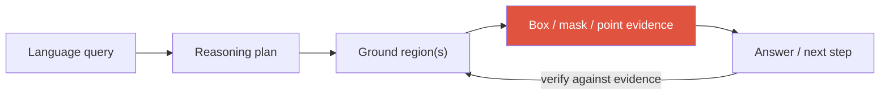

# Grounding & Region-Level Reasoning

referring expressionsgrounded captioningcoordinates-as-tokensregion featuresdetection-as-VLMopen-vocab

> [!TIP] The one-sentence thesis
> Grounding forces a VLM to *point at its evidence* — a box, mask, or point — instead of asserting from a language prior. That makes answers **verifiable** and is the direct antidote to hallucination. This is the candidate's own research area (grounded VLMs connecting language reasoning to pixel- and region-level evidence), so own the framing: "unsupported textual descriptions → verifiable visual evidence."

## Why grounding

A global VLM can confidently describe objects that aren't there, or answer "what's behind the blue cup" without ever localizing the cup. Grounding closes the loop:

## 1 · The task family

| Task | Input → Output | Benchmark |
| --- | --- | --- |
| Referring expression comprehension (REC) | text → the referred box | RefCOCO/+/g |
| Referring expression segmentation (RES) | text → mask | RefCOCO(g) masks |
| Phrase grounding | caption phrases → boxes | Flickr30K Entities |
| Grounded captioning | image → caption *with* boxes per noun | (grounded caption sets) |
| Open-vocabulary detection | text vocab → boxes | LVIS, ODinW |
| Pixel-grounded reasoning | query → CoT interleaved with masks/coords | recent 2025-26 sets |

Referring differs from VQA and captioning by its **output type**: not a global description (caption) or an answer string (VQA), but a *region*. "Grounded VQA" is answer + evidence region together.

## 2 · How to emit a region: the design spectrum

This is the core architectural choice and the most likely deep-dive.

<figure>
<svg viewBox="0 0 680 250" xmlns="http://www.w3.org/2000/svg" font-family="Inter, sans-serif" font-size="11.5">
  <text x="10" y="20" fill="#6b7686">query + image</text>
  <!-- A: coords as text -->
  <rect x="10" y="35" width="200" height="60" rx="6" fill="none" stroke="#6366f1" stroke-width="2"/>
  <text x="110" y="55" text-anchor="middle" fill="#6366f1">A. Coordinates as text</text>
  <text x="110" y="72" text-anchor="middle" fill="#6b7686">LLM emits "[x1,y1,x2,y2]"</text>
  <text x="110" y="87" text-anchor="middle" fill="#6b7686">or &lt;box&gt; tokens</text>
  <!-- B: region features -->
  <rect x="240" y="35" width="200" height="60" rx="6" fill="none" stroke="#0ea5e9" stroke-width="2"/>
  <text x="340" y="55" text-anchor="middle" fill="#0ea5e9">B. Region features</text>
  <text x="340" y="72" text-anchor="middle" fill="#6b7686">ROI-pooled / proxy tokens</text>
  <text x="340" y="87" text-anchor="middle" fill="#6b7686">index into visual latents</text>
  <!-- C: detection head -->
  <rect x="470" y="35" width="200" height="60" rx="6" fill="none" stroke="#12a150" stroke-width="2"/>
  <text x="570" y="55" text-anchor="middle" fill="#12a150">C. Grounding head</text>
  <text x="570" y="72" text-anchor="middle" fill="#6b7686">continuous box/mask head</text>
  <text x="570" y="87" text-anchor="middle" fill="#6b7686">on LM hidden states</text>
  <!-- D: external tool -->
  <rect x="240" y="120" width="200" height="60" rx="6" fill="none" stroke="#e0533f" stroke-width="2"/>
  <text x="340" y="140" text-anchor="middle" fill="#e0533f">D. External specialist</text>
  <text x="340" y="157" text-anchor="middle" fill="#6b7686">Grounding DINO + SAM</text>
  <text x="340" y="172" text-anchor="middle" fill="#6b7686">as an agent tool</text>
  <text x="10" y="215" fill="#6b7686">trade-off →</text>
  <text x="120" y="215" fill="#6b7686">simple, weak spatial link</text>
  <text x="360" y="215" fill="#6b7686">tight visual link, more machinery</text>
  <text x="470" y="235" fill="#6b7686">modular but error-propagating</text>
</svg>
<figcaption>Four ways a VLM produces a region. A is easiest to train (text tokens); C gives the tightest visual grounding; D keeps specialists swappable but propagates their errors.</figcaption>
</figure>

<dl class="kv">
<dt>A · Coordinates-as-tokens</dt><dd>The LLM literally writes numbers or <code>&lt;box&gt;</code> tokens (Kosmos-2, Shikra, Qwen-VL). Trivial to add — no new heads — and unifies grounding with text generation. <b>Weakness:</b> the <b>semantic-spatial gap</b> — coordinate tokens live in language space, only weakly tied to visual features, so boxes drift.</dd>
<dt>B · Region features</dt><dd>Feed ROI-pooled features (or learned "proxy tokens" that index visual latents) back into the LLM. Tighter visual link; better for relational reasoning. More plumbing.</dd>
<dt>C · Grounding head</dt><dd>A continuous box/mask regression head on LM hidden states (LISA-style mask token → SAM decoder). End-to-end differentiable, precise. Needs mask supervision and a decoder.</dd>
<dt>D · External specialist</dt><dd>Call Grounding DINO / SAM as a <b>tool</b> (Grounded-SAM). Modular, swappable, benefits from SOTA detectors — but errors propagate silently and there's no joint training. This is the bridge to <a href="#/vlm/visual-agents">Visual Reasoning Agents</a>.</dd>
</dl>

## 3 · Detection-as-VLM and open-vocabulary

Two convergent trends:

- **Detection folded into the VLM:** instead of a bespoke detection head, phrase the task as "list objects with boxes as text." General VLMs (Qwen3-VL, InternVL) increasingly do competent detection/OCR this way — great for open-set, flexible prompts; still behind specialist detectors on strict AP.
- **Open-vocabulary detection (OVD)** fuses CLIP-style text alignment into a detector: **Grounding DINO** (text → boxes), YOLO-World, OWLv2, APE. These are the specialist tools a grounded VLM (design D) calls, and they set the *lower bound* on what a grounded system can localize. Deep dive: [Object Detection](#/cv/detection) and [Vision Foundation Models](#/cv/foundation-models) (SAM 3's Promptable Concept Segmentation is the 2025 open-vocab detect+segment+track datapoint).

> [!NOTE] Region vs. pixel evidence
> Boxes are cheap and fast but blind to boundaries, occlusion, and overlap; **masks** are essential for editing, measurement, and verification. The candidate's [ZIM](#/resume/zim) (zero-shot matting) and SAM-lineage work is exactly the *supplier* of high-quality pixel evidence — a grounded reasoner is only as trustworthy as its masks. "Pixel- and region-level" in the CV is a deliberate both-and.

## 4 · Grounded RL and multi-step grounding (2025–2026)

The frontier direction: let the model **look again**. It emits coordinates, crops/zooms, re-encodes the region, and continues — a visual analogue of chain-of-thought.

- **Grounded reasoning with visual coordinates:** anchor each reasoning step to a region rather than free text.
- **RL with only a final-answer reward** can make grounding *behavior* emerge (the model learns to zoom because it helps the answer) — no dense box supervision needed.
- This blurs into agentic "thinking with images" — see [Visual Reasoning Agents](#/vlm/visual-agents).

> [!WARNING] Spurious success
> A model can output the **right answer with the wrong evidence** (guessed from the prior, box points elsewhere). Answer accuracy alone rewards this. **Always co-report grounding quality:** mask IoU, pointing-game accuracy, grounded recall. This is a core evaluation-design point in the candidate's grounding work.

## 5 · Why grounding data is expensive

Box/mask + language alignment is costly to annotate. Scaling tricks (and their risks):

- **Pseudo-labeling:** a detector + LLM generate region-text pairs → scale, but noisy.
- **Synthetic / simulator** data (3D scenes) for spatial relations → clean labels, domain gap.
- **Label-efficient / weakly-supervised** approaches (points, image-level tags) — directly the candidate's PointWSSIS/BESTIE lineage; see [Weak & Semi-Supervised](#/cv/weak-semi-supervised).

## 6 · Evaluation: answer *and* evidence

Grounding needs metrics on both axes, because answer accuracy alone rewards spurious success.

| Metric | Measures |
| --- | --- |
| REC accuracy @ IoU 0.5 | is the predicted box correct? |
| Mask IoU / cIoU | segmentation grounding quality |
| Pointing game | does the peak/point land in the right region? |
| Grounded recall / precision | are cited regions right *and* complete? |
| POPE / CHAIR | object hallucination in generated text |
| Answer↔evidence consistency | does the stated answer match its cited region? |

A model can be right for the wrong reason; a model can also ground perfectly yet answer wrong. Report the pair. Human evaluation of *whether the evidence aids understanding* is a useful complement for grounded-reasoning systems.

## Q&A

How does grounding reduce hallucination, and how can it introduce new errors?

**Short:** Requiring the model to localize evidence before/while answering suppresses purely prior-driven claims — you can't describe a "red cup on the left" if no region supports it. But a *wrong* grounding is a new failure mode: confident answer anchored to the wrong box.

**Deep:** Grounding converts an unfalsifiable text assertion into a checkable claim (does the box contain what the text says?). That enables verification, rejection sampling, and human trust. The catch is error *relocation*: hallucination becomes mis-grounding, and if evaluation only scores the answer you get **spurious success**. So grounded systems must be evaluated on evidence quality (IoU, pointing game) jointly with answer accuracy, and ideally add a verification step that checks answer↔evidence consistency.

Coordinates-as-tokens vs. region features vs. a grounding head — pick one and defend it.

**Short:** For fast iteration and open-set flexibility, coordinates-as-tokens (no new heads, unifies with text). For precise localization and boundary-critical tasks, a grounding head (mask token → segmentation decoder). Region features sit in between when relational reasoning matters.

**Deep:** Coordinates-as-tokens is cheapest but suffers the **semantic-spatial gap** — text-space numbers weakly linked to pixels — so boxes are coarse and drift on small/crowded objects; proxy/region tokens that index visual latents tighten that link. A grounding head (continuous regression / mask-token → SAM) is most accurate and differentiable end-to-end but needs mask supervision and a decoder, and is less flexible for arbitrary open-vocab. In practice I'd choose by the product: an editing/measurement product needs masks (head or specialist tool); a flexible visual assistant can start with coordinate tokens and add region features where relations matter.

(Ongoing-research framing) How would you make a grounded VLM's spatial reasoning verifiable?

**Short:** Force evidence at each reasoning step, and evaluate the *evidence*, not just the answer — mask/box IoU, pointing accuracy, and answer↔evidence consistency. Treat wrong evidence as a failure even when the answer is right.

**Deep:** (Method specifics of the under-review work stay unpublished.) The motivation I can discuss: end-to-end VLMs answer spatial/referential queries by leaning on unsupported textual description, which is undebuggable. Connecting reasoning to pixel/region evidence makes each step falsifiable and lets you localize *where* a chain broke. Public trends I build on: grounded RL with zoom/crop, pixel-grounded CoT, open-vocab concept segmentation (SAM 3), and my perception-foundation background ([ZIM](#/resume/zim), SAM-lineage) as the evidence supplier. Full framing: [Deep-Dive: Grounded VLM/Agents](#/resume/grounded-vlm-agents).

**Follow-ups**

- "What's the semantic-spatial gap and how do proxy tokens address it?" (Text coords aren't tied to visual features; learned proxy tokens index image latents.)
- "Open-vocab grounding failure modes?" (Rare concepts, negation "not the red one", relational clauses, crowds of similar instances, tiny objects.)
- "Why co-report IoU with answer accuracy?" (Spurious success — right answer, wrong evidence.)
- "Where does a specialist detector beat detection-as-VLM?" (Strict AP, small objects, real-time; the VLM wins on open-set flexibility and language conditioning.)
- "How do you scale grounding data without human box/mask labels?" (Detector+LLM pseudo-labels, synthetic 3D scenes, weak supervision from points/tags — each with a noise/domain-gap cost.)
- "A grounded editing product: box or mask evidence?" (Mask — boundaries and alpha matter for compositing; boxes are too coarse for pixel-accurate editing.)

## Cheat-sheet

| Term | Meaning |
| --- | --- |
| REC / RES | referring expression comprehension (box) / segmentation (mask) |
| Phrase grounding | caption phrases → boxes (Flickr30K Entities) |
| Coordinates-as-tokens | LLM writes box numbers / `<box>` tokens — simple, semantic-spatial gap |
| Region features | ROI/proxy tokens indexing visual latents — tighter link |
| Grounding head | continuous box/mask head on LM hidden (LISA → SAM) — precise |
| Detection-as-VLM | phrase detection as text output; flexible, below specialist AP |
| Open-vocab (OVD) | text→boxes: Grounding DINO, OWLv2, YOLO-World, SAM 3 |
| Spurious success | right answer, wrong evidence → always eval IoU/pointing too |

> [!QUOTE] Interview positioning (the candidate's angle)
> "CLIP and LLaVA opened a rich semantic space. My contribution is putting *pixel-accurate perception and verifiable grounding* on top of it — so a VLM cites evidence a human can check, instead of narrating from a language prior. My segmentation/matting foundation ([ZIM](#/resume/zim), SAM-lineage) is the supplier of that evidence."

**Related:** [Object Detection](#/cv/detection) · [Vision Foundation Models](#/cv/foundation-models) · [Visual Reasoning Agents](#/vlm/visual-agents) · [Deep-Dive: Grounded VLM/Agents](#/resume/grounded-vlm-agents) · [Instruction Tuning & Decoding](#/vlm/instruction-tuning) · [Deep-Dive: ZIM](#/resume/zim)
