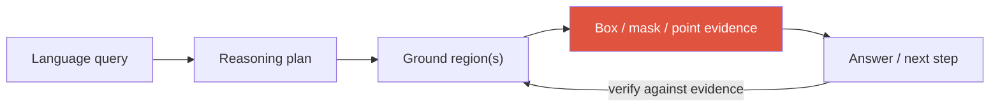

# Grounding & Region-Level Reasoning

<div class="tag-row"><span class="tag">referring expressions</span><span class="tag">grounded captioning</span><span class="tag">coordinates-as-tokens</span><span class="tag">region features</span><span class="tag">detection-as-VLM</span><span class="tag">open-vocab</span></div>

> [!NOTE] Goal of this chapter
> A general VLM can look at an image and answer only in words. **Grounding** links language to a box, mask, point, or other region so a claim can be checked. Good grounding data, training, and verification can reduce hallucination, but emitting coordinates does not by itself make an answer true.

## What and why — tying words to pixels

In one sentence, **grounding ties a word or phrase to a particular image region**. Given a **referring expression** such as “the red cup on the left,” the system returns the box or mask it denotes.

Why is this useful? A global VLM can confidently describe an object that does not exist, or answer “what is behind the blue cup?” without ever localizing the cup. It is guessing from a **language prior**—common patterns learned from text. Grounding closes the loop by requiring the model to point to the evidence region before or while answering. A human can then check whether the object is actually there.

<figure>
<svg viewBox="0 0 640 220" xmlns="http://www.w3.org/2000/svg" font-family="Inter, sans-serif" font-size="12">
  <!-- query -->
  <rect x="20" y="30" width="220" height="34" rx="8" fill="none" stroke="#6366f1" stroke-width="1.6"/>
  <text x="130" y="52" text-anchor="middle" fill="currentColor">"Find the red cup on the left"</text>
  <path d="M130 64 V96" stroke="#98a3b2" stroke-width="1.5" marker-end="url(#gA)"/>
  <text x="150" y="84" fill="#98a3b2">grounding</text>
  <!-- scene -->
  <rect x="300" y="30" width="320" height="170" rx="8" fill="none" stroke="#98a3b2" stroke-width="1.4"/>
  <text x="460" y="22" text-anchor="middle" fill="#98a3b2">Image</text>
  <!-- red cup left (grounded) -->
  <rect x="330" y="120" width="60" height="55" rx="4" fill="rgba(224,83,63,.18)" stroke="#e0533f" stroke-width="2.5"/>
  <path d="M338 135 h44 v22 a22 10 0 0 1 -44 0 z" fill="#e0533f"/>
  <text x="360" y="192" text-anchor="middle" fill="#e0533f" font-size="11">✓ box (evidence)</text>
  <!-- blue cup right (not selected) -->
  <rect x="520" y="120" width="60" height="55" rx="4" fill="none" stroke="#0ea5e9" stroke-width="1.2" stroke-dasharray="4 3"/>
  <path d="M528 135 h44 v22 a22 10 0 0 1 -44 0 z" fill="#0ea5e9" opacity="0.5"/>
  <text x="550" y="192" text-anchor="middle" fill="#98a3b2" font-size="11">blue cup (excluded)</text>
  <!-- answer arrow -->
  <path d="M20 96 h120 v40" fill="none" stroke="#98a3b2" stroke-width="1.5"/>
  <rect x="20" y="136" width="220" height="46" rx="8" fill="none" stroke="#12a150" stroke-width="1.6"/>
  <text x="130" y="156" text-anchor="middle" fill="#12a150" font-size="11">Accept the answer only when it</text>
  <text x="130" y="172" text-anchor="middle" fill="#12a150" font-size="11">matches the cited box (verifiable)</text>
  <defs><marker id="gA" markerWidth="8" markerHeight="8" refX="6" refY="3" orient="auto"><path d="M0 0 L6 3 L0 6" fill="#98a3b2"/></marker></defs>
</svg>
<figcaption>The model supplies a box for “the red cup on the left.” A human can inspect it, or a verifier can score IoU and consistency. Because the box itself can be wrong, evaluate both the answer and the region.</figcaption>
</figure>



> [!TIP] Core one-liner
> Grounding increases **inspectability** by emitting a text claim together with a region. Separate “the model produced evidence” from “the evidence is correct,” and report answer accuracy together with localization quality.

## 1 · The task family

| Task | Input → Output | Benchmark |
| --- | --- | --- |
| Referring expression comprehension (REC) | text → the referred box | RefCOCO/+/g |
| Referring expression segmentation (RES) | text → mask | RefCOCO(g) masks |
| Phrase grounding | caption phrases → boxes | Flickr30K Entities |
| Grounded captioning | image → caption *with* boxes per noun | (grounded caption sets) |
| Open-vocabulary detection | text vocab → boxes | LVIS, ODinW |
| Pixel-grounded reasoning | query → CoT interleaved with masks/coords | recent 2025-26 sets |

Referring differs from VQA and captioning by its **output type**: not a global description (caption) or an answer string (VQA), but a *region*. "Grounded VQA" is answer + evidence region together.

## 2 · How to emit a region: the design spectrum

This is the core architectural choice and the most likely deep-dive.

<figure>
<svg viewBox="0 0 680 250" xmlns="http://www.w3.org/2000/svg" font-family="Inter, sans-serif" font-size="11.5">
  <text x="10" y="20" fill="#6b7686">query + image</text>
  <!-- A: coords as text -->
  <rect x="10" y="35" width="200" height="60" rx="6" fill="none" stroke="#6366f1" stroke-width="2"/>
  <text x="110" y="55" text-anchor="middle" fill="#6366f1">A. Coordinates as text</text>
  <text x="110" y="72" text-anchor="middle" fill="#6b7686">LLM emits "[x1,y1,x2,y2]"</text>
  <text x="110" y="87" text-anchor="middle" fill="#6b7686">or &lt;box&gt; tokens</text>
  <!-- B: region features -->
  <rect x="240" y="35" width="200" height="60" rx="6" fill="none" stroke="#0ea5e9" stroke-width="2"/>
  <text x="340" y="55" text-anchor="middle" fill="#0ea5e9">B. Region features</text>
  <text x="340" y="72" text-anchor="middle" fill="#6b7686">ROI-pooled / proxy tokens</text>
  <text x="340" y="87" text-anchor="middle" fill="#6b7686">index into visual latents</text>
  <!-- C: detection head -->
  <rect x="470" y="35" width="200" height="60" rx="6" fill="none" stroke="#12a150" stroke-width="2"/>
  <text x="570" y="55" text-anchor="middle" fill="#12a150">C. Grounding head</text>
  <text x="570" y="72" text-anchor="middle" fill="#6b7686">continuous box/mask head</text>
  <text x="570" y="87" text-anchor="middle" fill="#6b7686">on LM hidden states</text>
  <!-- D: external tool -->
  <rect x="240" y="120" width="200" height="60" rx="6" fill="none" stroke="#e0533f" stroke-width="2"/>
  <text x="340" y="140" text-anchor="middle" fill="#e0533f">D. External specialist</text>
  <text x="340" y="157" text-anchor="middle" fill="#6b7686">Grounding DINO + SAM</text>
  <text x="340" y="172" text-anchor="middle" fill="#6b7686">as an agent tool</text>
  <text x="10" y="212" fill="#6b7686">trade-off →</text>
  <text x="120" y="212" fill="#6b7686">simple, weak spatial link</text>
  <text x="360" y="212" fill="#6b7686">tight visual link, more machinery</text>
  <text x="470" y="234" fill="#6b7686">modular but error-propagating</text>
</svg>
<figcaption>Four design patterns for producing regions. Which is most accurate depends on output granularity, supervision, encoder and decoder, resolution, and latency. D makes modules easy to swap but can propagate tool errors.</figcaption>
</figure>

<dl class="kv">
<dt>A · Coordinates-as-tokens</dt><dd>The LLM literally writes numbers or <code>&lt;box&gt;</code> tokens (Kosmos-2, Shikra, Qwen-VL). Trivial to add — no new heads — and unifies grounding with text generation. <b>Weakness:</b> the <b>semantic-spatial gap</b> — coordinate tokens live in language space, only weakly tied to visual features, so boxes drift.</dd>
<dt>B · Region features</dt><dd>Feed ROI-pooled features (or learned "proxy tokens" that index visual latents) back into the LLM. Tighter visual link; better for relational reasoning. More plumbing.</dd>
<dt>C · Grounding head</dt><dd>A separate head predicts a box or mask from LM hidden states (for example, a LISA-style mask token feeding a segmentation decoder). It directly optimizes continuous outputs and dense supervision, but accuracy is not automatic; decoder, resolution, and label costs remain.</dd>
<dt>D · External specialist</dt><dd>Call Grounding DINO or SAM as a <b>tool</b> (Grounded-SAM). It is modular and easy to replace, but improvements do not transfer automatically when the interface or domain mismatches, and errors can propagate silently. The lack of joint end-to-end optimization is a trade-off and a bridge to <a href="#/vlm/visual-agents">Visual Reasoning Agents</a>.</dd>
</dl>

### Coordinates as tokens — what actually happens

One implementation of design A normalizes a box into numbers and generates them. **The range 0–1000 is only one model convention, not a standard.** Models differ in whether they use 0–1 floats, dedicated 0–999/1000 location tokens, or numeric strings, and in endpoint, rounding, and coordinate-order rules. Follow the processor contract.

<figure>
<svg viewBox="0 0 660 210" xmlns="http://www.w3.org/2000/svg" font-family="Inter, sans-serif" font-size="11.5">
  <!-- image box -->
  <rect x="20" y="45" width="120" height="120" rx="6" fill="none" stroke="#98a3b2" stroke-width="1.4"/>
  <rect x="52" y="95" width="46" height="55" rx="3" fill="rgba(224,83,63,.18)" stroke="#e0533f" stroke-width="2"/>
  <text x="80" y="38" text-anchor="middle" fill="#98a3b2">Image + query</text>
  <!-- LLM -->
  <rect x="180" y="70" width="90" height="70" rx="8" fill="#6366f1"/>
  <text x="225" y="102" text-anchor="middle" fill="#fff" font-weight="700">VLM</text>
  <text x="225" y="120" text-anchor="middle" fill="#fff" font-size="10">(LLM decoder)</text>
  <path d="M140 105 H180" stroke="#98a3b2" stroke-width="1.5" marker-end="url(#gB)"/>
  <path d="M270 105 H310" stroke="#98a3b2" stroke-width="1.5" marker-end="url(#gB)"/>
  <!-- token stream -->
  <text x="485" y="38" text-anchor="middle" fill="#98a3b2">Output sequence (one token at a time)</text>
  <g font-size="10.5">
    <rect x="315" y="55" width="46" height="26" rx="4" fill="none" stroke="currentColor" stroke-width="1.2"/><text x="338" y="72" text-anchor="middle" fill="currentColor">The</text>
    <rect x="367" y="55" width="46" height="26" rx="4" fill="none" stroke="currentColor" stroke-width="1.2"/><text x="390" y="72" text-anchor="middle" fill="currentColor">red</text>
    <rect x="419" y="55" width="46" height="26" rx="4" fill="none" stroke="currentColor" stroke-width="1.2"/><text x="442" y="72" text-anchor="middle" fill="currentColor">cup</text>
    <rect x="471" y="55" width="58" height="26" rx="4" fill="none" stroke="#0ea5e9" stroke-width="1.6"/><text x="500" y="72" text-anchor="middle" fill="#0ea5e9">&lt;box&gt;</text>
    <rect x="315" y="95" width="50" height="26" rx="4" fill="rgba(224,83,63,.14)" stroke="#e0533f" stroke-width="1.6"/><text x="340" y="112" text-anchor="middle" fill="#e0533f">433</text>
    <rect x="371" y="95" width="50" height="26" rx="4" fill="rgba(224,83,63,.14)" stroke="#e0533f" stroke-width="1.6"/><text x="396" y="112" text-anchor="middle" fill="#e0533f">575</text>
    <rect x="427" y="95" width="50" height="26" rx="4" fill="rgba(224,83,63,.14)" stroke="#e0533f" stroke-width="1.6"/><text x="452" y="112" text-anchor="middle" fill="#e0533f">816</text>
    <rect x="483" y="95" width="50" height="26" rx="4" fill="rgba(224,83,63,.14)" stroke="#e0533f" stroke-width="1.6"/><text x="508" y="112" text-anchor="middle" fill="#e0533f">908</text>
    <rect x="539" y="95" width="62" height="26" rx="4" fill="none" stroke="#0ea5e9" stroke-width="1.6"/><text x="570" y="112" text-anchor="middle" fill="#0ea5e9">&lt;/box&gt;</text>
  </g>
  <text x="458" y="150" text-anchor="middle" fill="#98a3b2" font-size="10.5">← serialize four coordinate values: [x1, y1, x2, y2] (0–1000 in this model)</text>
  <text x="458" y="172" text-anchor="middle" fill="#98a3b2" font-size="10.5">After decoding, denormalize to pixels and draw the box</text>
  <defs><marker id="gB" markerWidth="8" markerHeight="8" refX="6" refY="3" orient="auto"><path d="M0 0 L6 3 L0 6" fill="#98a3b2"/></marker></defs>
</svg>
<figcaption>A conceptual coordinates-as-tokens example. A box is serialized as four coordinate <em>values</em>, but numeric strings may tokenize into several subwords. It is exactly four tokens only when the model uses one dedicated location token per value.</figcaption>
</figure>

A generated sequence may look roughly like this; syntax varies by model family:

```text
Query:  "Find the red cup on the left"

Output: There is a <ref>red cup</ref><box>(433,575),(816,908)</box> on the left.
        └ referring phrase ┘       └ four 0–1000 coordinate values ┘

Decode: (433,575)-(816,908) → multiply by image size (for example 640×480)
        → recover pixel box (277,276)-(522,436) and draw it
```

The `<ref>…</ref>` markup and coordinate serialization are model-specific. A model may use numeric strings from the ordinary vocabulary or dedicated location tokens. Either can be generated autoregressively; how strongly they connect to visual features depends on the objective and architecture.

<details class="concept-code">
<summary>View as concept code</summary>

> This **pseudocode** shows the train/inference boundary for coordinate-token grounding. The coordinate range and resize convention must match the model's processor.

```python
def train_grounder(image, prompt_ids, gt_box_xyxy):
    pixels, transform = processor.resize_and_pad(image)
    # Original pixel coordinates → model canvas → model-specific location values
    box_model = transform.forward_box(gt_box_xyxy)
    box_tokens = coord_codec.encode(box_model, canvas=shape(pixels)[-2:])
    answer_ids = serialize([BOX_OPEN, *box_tokens, BOX_CLOSE])

    inputs, labels = pack_visual_prompt_answer(pixels, prompt_ids, answer_ids)
    labels[inputs.is_visual_or_prompt_or_padding] = IGNORE_INDEX
    return vlm.train().forward(inputs, labels=labels).loss

@no_grad()
def predict_box(image, prompt_ids):
    vlm.eval()
    pixels, transform = processor.resize_and_pad(image)
    ids = constrained_generate(vlm, pixels, prompt_ids, grammar=BOX_GRAMMAR)
    values = coord_codec.parse(ids)
    if len(values) != 4 or not (values[0] <= values[2] and values[1] <= values[3]):
        return InvalidGrounding("malformed box")
    box_model = coord_codec.decode(values, canvas=shape(pixels)[-2:])
    box_original = transform.inverse_box(box_model)  # Exactly undo padding/resize
    return clip_to_image(box_original, image.size)    # Syntax-valid does not mean object-correct
```

</details>

### Code lab — pixel box to 0–1000 coordinate values

Normalize a pixel box `[x1,y1,x2,y2]` into the four integer values used by this example's **0–1000 convention**. Whether each value becomes one dedicated location token or several numeric subwords depends on tokenizer design.

<div class="widget" data-widget="code">
<script type="application/json" class="code-config">
{"func":"box_to_tokens","packages":[],"starter":"def box_to_tokens(box, width, height):\n    # Educational convention: return four integer values using round(coord / size * 1000).\n    # Follow the real model processor for range, rounding, and endpoint conventions.\n    # TODO\n    return [0, 0, 0, 0]","tests":[{"args":[[50,100,150,300],200,400],"expect":[250,250,750,750]},{"args":[[0,0,200,400],200,400],"expect":[0,0,1000,1000]},{"args":[[100,50,100,50],200,100],"expect":[500,500,500,500]},{"args":[[277,276,522,436],640,480],"expect":[433,575,816,908]}],"solution":"def box_to_tokens(box, width, height):\n    if width <= 0 or height <= 0:\n        raise ValueError('width and height must be positive')\n    x1, y1, x2, y2 = box\n    return [\n        round(x1 / width  * 1000),\n        round(y1 / height * 1000),\n        round(x2 / width  * 1000),\n        round(y2 / height * 1000),\n    ]"}
</script>
</div>

Denormalization is the exact inverse—for example, `x_pixel = token / 1000 * width`. The normalize ↔ denormalize round trip is all that design A adds geometrically; the remaining challenge is training the model to predict those values correctly.

## 3 · Detection-as-VLM and open-vocabulary

Two convergent trends:

- **Detection folded into the VLM:** express detection as the generative task “list objects with boxes.” It is flexible under open-ended prompts, but latency, small-object performance, and AP must be compared with a specialist detector under matched conditions.
- **Open-vocabulary detection (OVD)** fuses CLIP-style text alignment into a detector: **Grounding DINO** (text → boxes), YOLO-World, OWLv2, and APE. These are specialist tools a grounded VLM (design D) can call, and they set a practical lower bound on what the system can localize. See [Object Detection](#/cv/detection) and [Vision Foundation Models](#/cv/foundation-models) for SAM 3's Promptable Concept Segmentation.

> [!NOTE] Region vs. pixel evidence
> Boxes are cheap and fast but blind to boundaries, occlusion, and overlap; **masks** are essential for editing, measurement, and verification. SAM-lineage and zero-shot matting models supply this pixel evidence—a grounded reasoner is only as trustworthy as its masks. “Pixel- and region-level” intentionally means both.

## 4 · Grounded RL and multi-step grounding (2025–2026)

The frontier direction: let the model **look again**. It emits coordinates, crops/zooms, re-encodes the region, and continues — a visual analogue of chain-of-thought.

- **Grounded reasoning with visual coordinates:** anchor each reasoning step to a region rather than free text.
- Some studies report that crop/zoom tools plus a final-answer reward can teach **grounding behavior**. This is conditional on the tool, task, reward, and initial policy; it does not guarantee generally correct grounding without box supervision. See the [RL Primer](#/llm/rl-primer).
- This blurs into agentic "thinking with images" — see [Visual Reasoning Agents](#/vlm/visual-agents).

> [!WARNING] Spurious success
> A model can output the **right answer with the wrong evidence** (guessed from the prior while the box points elsewhere). Answer accuracy alone rewards this. **Always co-report grounding quality:** mask IoU, pointing-game accuracy, and grounded recall. This is a core evaluation-design point for grounding systems.

## 5 · Why grounding data is expensive

Box/mask + language alignment is costly to annotate. Scaling tricks (and their risks):

- **Pseudo-labeling:** a detector + LLM generate region-text pairs → scale, but noisy.
- **Synthetic / simulator** data (3D scenes) for spatial relations → clean labels, domain gap.
- **Label-efficient / weakly-supervised** approaches use cheaper labels such as points and image-level tags—the PointWSSIS/BESTIE family is an example; see [Weak & Semi-Supervised](#/cv/weak-semi-supervised).

## 6 · Evaluation: answer *and* evidence

Grounding needs metrics on both axes, because answer accuracy alone rewards spurious success.

| Metric | Measures |
| --- | --- |
| REC accuracy @ IoU 0.5 | is the predicted box correct? |
| Mask IoU / cIoU | per-sample IoU, or cumulative intersection/union; check each paper's aggregation |
| Pointing game | does the peak/point land in the right region? |
| Grounded recall / precision | are cited regions right *and* complete? |
| POPE / CHAIR | object hallucination in generated text |
| Answer↔evidence consistency | does the stated answer match its cited region? |

A model can be right for the wrong reason; it can also ground perfectly and still answer incorrectly. Report both axes together.

## Q&A

<details class="qa"><summary>How does grounding reduce hallucination, and how can it introduce new errors?</summary>
<div class="qa-body">

**Short:** Requiring the model to localize evidence before/while answering suppresses purely prior-driven claims — you can't describe a "red cup on the left" if no region supports it. But a *wrong* grounding is a new failure mode: confident answer anchored to the wrong box.

**Deep:** Grounding converts an unfalsifiable text assertion into a checkable claim (does the box contain what the text says?). That enables verification, rejection sampling, and human trust. The catch is error *relocation*: hallucination becomes mis-grounding, and if evaluation only scores the answer you get **spurious success**. So grounded systems must be evaluated on evidence quality (IoU, pointing game) jointly with answer accuracy, and ideally add a verification step that checks answer↔evidence consistency.
</div></details>

<details class="qa"><summary>Coordinates-as-tokens vs. region features vs. a grounding head — pick one and defend it.</summary>
<div class="qa-body">

**Short:** For fast iteration and open-set flexibility, coordinates-as-tokens (no new heads, unifies with text). For precise localization and boundary-critical tasks, a grounding head (mask token → segmentation decoder). Region features sit in between when relational reasoning matters.

**Deep:** Coordinates-as-tokens is cheapest but suffers the **semantic-spatial gap** — text-space numbers weakly linked to pixels — so boxes are coarse and drift on small/crowded objects; proxy/region tokens that index visual latents tighten that link. A grounding head (continuous regression / mask-token → SAM) is most accurate and differentiable end-to-end but needs mask supervision and a decoder, and is less flexible for arbitrary open-vocab. In practice I'd choose by the product: an editing/measurement product needs masks (head or specialist tool); a flexible visual assistant can start with coordinate tokens and add region features where relations matter.
</div></details>

<details class="qa"><summary>(Ongoing-research framing) How would you make a grounded VLM's spatial reasoning verifiable?</summary>
<div class="qa-body">

**Short:** Force evidence at each reasoning step, and evaluate the *evidence*, not just the answer — mask/box IoU, pointing accuracy, and answer↔evidence consistency. Treat wrong evidence as a failure even when the answer is right.

**Deep:** end-to-end VLMs can answer spatial or referential questions by leaning on unsupported textual descriptions, which are difficult to debug. Connecting reasoning to pixel/region evidence makes each step falsifiable and localizes where a chain breaks. Related trends include grounded RL with zoom/crop, pixel-grounded CoT, open-vocabulary concept segmentation (SAM 3), and perception foundation models such as SAM-lineage and zero-shot matting as evidence suppliers. See [Deep-Dive: Grounded VLM/Agents](#/resume/grounded-vlm-agents).
</div></details>

**Follow-ups**

- "What's the semantic-spatial gap and how do proxy tokens address it?" (Text coords aren't tied to visual features; learned proxy tokens index image latents.)
- "Open-vocab grounding failure modes?" (Rare concepts, negation "not the red one", relational clauses, crowds of similar instances, tiny objects.)
- "Why co-report IoU with answer accuracy?" (Spurious success — right answer, wrong evidence.)
- "Where does a specialist detector beat detection-as-VLM?" (Strict AP, small objects, real-time; the VLM wins on open-set flexibility and language conditioning.)
- "How do you scale grounding data without human box/mask labels?" (Detector+LLM pseudo-labels, synthetic 3D scenes, weak supervision from points/tags — each with a noise/domain-gap cost.)

## Cheat-sheet

| Term | Meaning |
| --- | --- |
| Grounding | tie words to a specific image region (box/mask), making an answer inspectable |
| Referring expression | a phrase that identifies an object, such as “the red cup on the left” |
| REC / RES | referring expression comprehension (box) / segmentation (mask) |
| Phrase grounding | caption phrases → boxes (Flickr30K Entities) |
| Coordinates-as-tokens | serialize coordinates as numbers/dedicated location tokens; range, rounding, and token count are model-specific |
| Region features | ROI/proxy tokens indexing visual latents — tighter link |
| Grounding head | continuous box/mask head on LM hidden (LISA → SAM) — precise |
| Detection-as-VLM | phrase detection as text output; flexible, below specialist AP |
| Open-vocab (OVD) | text→boxes: Grounding DINO, OWLv2, YOLO-World, SAM 3 |
| Spurious success | right answer, wrong evidence → always eval IoU/pointing too |

> [!NOTE] Big picture
> Grounding adds region output that a human or metric can inspect. As one recent public example, Meta describes [SAM 3 and its 2026 SAM 3.1 update](https://ai.meta.com/blog/segment-anything-model-3/). An external segmenter's mask still has errors, domain shift, and prompt sensitivity, so preserve provenance and confidence.

**Next:** [Visual Reasoning Agents](#/vlm/visual-agents) · [Object Detection](#/cv/detection) · [Vision Foundation Models](#/cv/foundation-models) · [Deep-Dive: Grounded VLM/Agents](#/resume/grounded-vlm-agents) · [Instruction Tuning & Decoding](#/vlm/instruction-tuning) · [Deep-Dive: ZIM](#/resume/zim)
