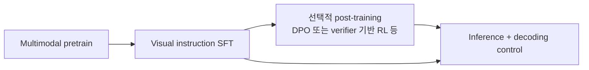
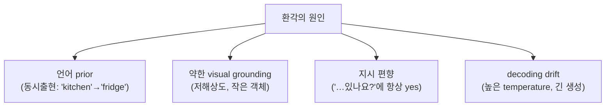

# Instruction Tuning & Decoding

<div class="tag-row"><span class="tag">visual instruction tuning</span><span class="tag">data recipes</span><span class="tag">preference alignment</span><span class="tag">guided decoding</span><span class="tag">hallucination</span><span class="tag">POPE</span></div>

> [!NOTE] 이 챕터의 목표
> [VLM Pretraining](#/vlm/pretraining)에서 이미지와 텍스트를 함께 이해하는 **base VLM**을 만들었습니다. 하지만 base 모델은 아직 "지시를 따르는 조수"가 아닙니다 — 사진을 던지고 "이거 설명해줘"라고 해도 엉뚱한 웹 문장을 이어 쓸 수 있습니다. 이 챕터는 base VLM을 실제로 쓸 만하게 만드는 두 단계를 입문자 눈높이로 잡습니다: **① 지시를 따르도록 가르치기(instruction tuning)**, **② 나오는 답의 형식과 신뢰성을 제어하기(decoding + 환각 줄이기)**.

## 무엇을, 왜

**무엇을.** 두 가지 일을 합니다.

1. **지시를 따르게 가르치기.** (이미지, 질문, 답변) 예시를 잔뜩 보여주며 "이미지를 보고 질문에 답하라"는 행동을 학습시킵니다. 이것을 **visual instruction tuning(시각 지시 튜닝)** 이라 부릅니다.
2. **디코딩(decoding, 다음 토큰을 실제로 고르는 규칙)을 제어하기.** 답의 *형식*(예: 정상 종료 시 schema-valid JSON)을 강제하고 sampling behavior를 조절합니다. 내용의 신뢰성은 데이터·모델·검증기를 함께 써야 합니다.

**왜.** 프로덕션 VLM은 두 성질을 *동시에* 요구받기 때문입니다 — 답이 **맞아야** 하고, 동시에 **파싱 가능한 형태**여야 합니다. 예를 들어 사진 속 물건 위치를 JSON으로 뽑아 다음 시스템에 넘기는 서비스라면, 답이 정확해도 JSON이 깨지면 파이프라인이 통째로 멈춥니다. 반대로 형식은 완벽해도 이미지에 없는 물건을 지어내면(=**환각/hallucination**) 신뢰를 잃습니다. 그래서 이 챕터는 "지시 튜닝(무엇을 말할지)"과 "디코딩 제어(어떻게 내보낼지)"를 한 묶음으로 다룹니다.

> [!TIP] 면접 한 줄
> "Instruction tuning은 VLM을 *지시를 따르게* 만들고(visual SFT → preference alignment), decoding 제어는 나오는 답의 *형태와 신뢰성*을 잡는다." 프로덕션 VLM은 정확하면서 *동시에* 파싱 가능한 답이 필요해서 면접관은 둘 다 봅니다.

### 먼저 용어부터 (한 줄씩)

| 용어 | 한 줄 뜻 |
| --- | --- |
| **Visual instruction tuning** (시각 지시 튜닝) | (이미지, 지시, 답변) 쌍으로 학습해 지시를 따르게 만드는 미세조정 |
| **SFT** (Supervised Fine-Tuning, 지도 미세조정) | 정답 답변을 그대로 모방하도록 배우는 학습 |
| **Data recipe / mix** (데이터 배합) | 어떤 종류의 학습 데이터를 어떤 비율로 섞을지에 대한 설계 |
| **Preference alignment** (선호 정렬) | "좋은 답 > 나쁜 답"이라는 선호 신호로 모델을 다듬기 |
| **Decoding** (디코딩) | 확률 분포에서 다음 토큰을 실제로 고르는 규칙 |
| **Guided / constrained decoding** (제약 디코딩) | 허용 token을 제한해 문법 형식을 강제; 종료·값 의미는 별도 검증 |
| **Hallucination** (환각) | 이미지가 뒷받침하지 않는 것을 자신 있게 말하는 현상 |

## 파이프라인 한눈에

사전학습된 VLM이 실제 제품이 되기까지의 흐름입니다:



| 단계 | 데이터 | loss 대상 | 결과 |
| --- | --- | --- | --- |
| Pretrain | interleaved image-text web | 대부분 token | base VLM |
| Visual SFT | (image, instruction, response) | **assistant token만** | instruct VLM |
| Preference / RL | chosen-rejected 또는 verifier가 채점 가능한 sample | DPO 또는 RL objective | 목표 선호·행동을 강화(보장 아님) |
| Inference | user prompt + image | — | 생성된 답변 |

## 1 · Visual instruction tuning(시각 지시 튜닝)

**한 줄 직관:** 텍스트 LLM의 지시 튜닝(질문–답변 쌍으로 학습)에 **이미지를 더한 것**입니다. (이미지, 질문, 답변) 형태로 학습해, "이 사진 속 상황을 설명해줘" 같은 지시를 따르게 만듭니다.

LLaVA의 핵심 기여는 아키텍처가 아니라 **data recipe(데이터 배합 — 어떤 데이터를 어떻게 섞는지)** 였습니다: 강한 텍스트 LLM에게 이미지의 ground-truth caption(정답 설명) + box를 텍스트로 주고 프롬프팅해서, 대화·상세 묘사·추론 데이터를 자동 생성했습니다 (모델은 이미지를 실제로 보지 않고, *주석(annotation)* 이 이미지를 대신함). 즉 비싼 사람 라벨링 없이 지시 데이터를 대량으로 찍어낸 것이 요령이었습니다.

### Data recipe: 크기보다 배합이 중요

| 데이터 종류 | 가르치는 것 | 주의할 점 |
| --- | --- | --- |
| Detailed captioning | 언어를 내용에 grounding(근거 대기) | verbosity bias, 없는 디테일을 지어냄 |
| Conversational VQA | multi-turn 지시 따르기 | 안 보고 지름길로 답하기 |
| Region / grounding | referring, coordinate | coordinate 형식 일관성 |
| OCR / document / chart | 밀집 text 읽기 | high-res tile / native-res 필요 |
| Reasoning / CoT | 다단계 시각 추론 | teacher 오류 전파 |
| Multi-image / interleaved | 비교, in-context | 순서·어느-이미지 혼동 |
| **Text-only replay** | 언어 능력 보존 | 빼면 → forgetting(망각) |

> [!NOTE] 품질 > 양, 그리고 negative(부정 예시)가 중요하다
> 2025-2026의 반복된 발견: 더 작더라도 *선별·중복제거·균형 잡힌* 배합이 크지만 노이즈 많은 배합을 이깁니다. 그리고 **"아니요 / 없음" 답변을 포함**하는 것이 가장 저렴한 환각 대책입니다 — "X가 있다"만 배운 모델은 무엇을 물어도 "네"라고 답하게 됩니다.

예시적 출발점으로 7B급 full fine-tuning은 LR $10^{-5}$ 부근, LoRA는 더 큰 LR을 탐색할 수 있습니다. 그러나 batch·epoch·warmup·optimizer 값은 데이터 크기, trainable parameter, vision token 수, precision에 종속됩니다. 고정 레시피로 외우지 말고 validation loss, text-only 회귀, task별 slice와 effective token batch로 sweep하세요.

## 2 · Preference alignment(선호 정렬) for VLMs

**한 줄 직관:** SFT가 "정답을 흉내 내라"였다면, preference alignment는 "이 답이 저 답보다 낫다"는 **비교 신호**로 모델을 한 번 더 다듬는 단계입니다.

SFT 다음에 **DPO**는 chosen/rejected 선호쌍으로 정책을 최적화하고, **RLVR**은 counting·OCR match·coordinate IoU처럼 프로그램으로 확인 가능한 reward를 써 RL을 수행합니다. 둘은 데이터와 최적화가 다른 선택지입니다. grounded chosen과 hallucinated rejected를 구성하면 환각 감소를 목표로 할 수 있지만, 선호 데이터 편향·reward hacking·다른 능력 회귀 때문에 실제 효과는 별도 평가해야 합니다.

메커니즘 자체는 텍스트 LLM과 동일합니다 — [Post-Training & Alignment](#/llm/alignment)와 [RL 기초 프라이머](#/llm/rl-primer)에서 이미 다뤘으니 여기서 다시 유도하지 않습니다. VLM에서 **다른 점은 딱 하나**: reward/선호 신호가 "시각적 충실성(visual faithfulness, 이미지에 얼마나 충실한가)"에 관한 것이라는 점입니다. (InternVL3의 "Mixed Preference Optimization"이 native-multimodal 레시피에 이를 접은 사례.)

## 3 · Decoding: 샘플링 전략 (요약)

다음 토큰 선택의 기초는 [디코딩 & 샘플링 전략](#/llm/decoding-sampling)이 담당합니다. 여기서는 VLM 출력 계약만 다룹니다. 양의 temperature가 낮으면 1등에 확률이 더 몰리지만 여전히 sampling이고, `temperature=0`은 API가 보통 greedy로 별도 처리합니다.

<figure>
<svg viewBox="0 0 640 220" xmlns="http://www.w3.org/2000/svg" font-family="Inter, sans-serif" font-size="12">
  <!-- shared distribution, three knobs -->
  <text x="110" y="20" text-anchor="middle" font-weight="700" fill="#0ea5e9">낮은 T (뾰족)</text>
  <g fill="#0ea5e9">
    <rect x="55" y="46" width="20" height="110"/><rect x="82" y="128" width="20" height="28"/><rect x="109" y="142" width="20" height="14"/><rect x="136" y="149" width="20" height="7"/><rect x="163" y="152" width="20" height="4"/>
  </g>
  <line x1="50" y1="156" x2="190" y2="156" stroke="#98a3b2" stroke-width="1"/>
  <text x="120" y="176" text-anchor="middle" fill="#98a3b2" font-size="11">1등에 확률 몰림</text>
  <text x="120" y="192" text-anchor="middle" fill="#98a3b2" font-size="11">→ factual VQA·OCR</text>

  <text x="330" y="20" text-anchor="middle" font-weight="700" fill="#e0533f">높은 T (평평)</text>
  <g fill="#e0533f">
    <rect x="270" y="80" width="20" height="76"/><rect x="297" y="92" width="20" height="64"/><rect x="324" y="100" width="20" height="56"/><rect x="351" y="106" width="20" height="50"/><rect x="378" y="110" width="20" height="46"/>
  </g>
  <line x1="265" y1="156" x2="405" y2="156" stroke="#98a3b2" stroke-width="1"/>
  <text x="335" y="176" text-anchor="middle" fill="#98a3b2" font-size="11">고르게 퍼짐</text>
  <text x="335" y="192" text-anchor="middle" fill="#98a3b2" font-size="11">→ 창의적 caption</text>

  <text x="550" y="20" text-anchor="middle" font-weight="700" fill="#12a150">top-p (누적 컷)</text>
  <g fill="#12a150"><rect x="490" y="60" width="20" height="96"/><rect x="517" y="104" width="20" height="52"/><rect x="544" y="128" width="20" height="28"/></g>
  <g fill="#98a3b2" opacity="0.4"><rect x="571" y="142" width="20" height="14"/><rect x="598" y="149" width="20" height="7"/></g>
  <line x1="567" y1="46" x2="567" y2="160" stroke="#6366f1" stroke-width="2" stroke-dasharray="5 4"/>
  <line x1="485" y1="156" x2="625" y2="156" stroke="#98a3b2" stroke-width="1"/>
  <text x="550" y="176" text-anchor="middle" fill="#98a3b2" font-size="11">누적 0.9까지만 후보</text>
  <text x="550" y="192" text-anchor="middle" fill="#98a3b2" font-size="11">회색=잘린 꼬리</text>
</svg>
<figcaption>temperature는 분포의 뾰족함을, top-p는 후보 질량을 조절합니다. 사실 질의는 낮은 다양성에서 시작할 수 있지만, 최적 설정은 모델·API·검증 방식에 따라 달라집니다. 숫자는 고정 권장값이 아닙니다.</figcaption>
</figure>

```python
@torch.no_grad()
def step(model, ids, past=None):
    out = model(input_ids=ids, past_key_values=past, use_cache=True)
    logits = out.logits[:, -1, :]          # 마지막 위치
    return sample(logits), out.past_key_values
```

여기서는 **VLM 과제별 권장값**만 정리합니다:

| 과제 | temperature | top_p | 메모 |
| --- | --- | --- | --- |
| Factual VQA / OCR | 낮은 다양성부터 | provider 기본 또는 조정 | exact match·calibration으로 선택 |
| Creative caption | 더 넓은 sampling 탐색 | 모델별 | 다양성·충실도 동시 평가 |
| JSON / tool call | greedy도 가능 | — | grammar/schema 제약 + 값 검증 |
| Long reasoning | 여러 후보 sampling 가능 | 모델별 | verifier가 있을 때 best-of-N 고려 |

위 값은 예시가 아니라 방향성입니다. temperature가 환각의 근본 원인을 해결하지 않으며, reasoning 모델은 공급자 권장 설정과 숨은 reasoning 정책이 다를 수 있습니다.

## 4 · Guided / constrained decoding(제약 디코딩)

**목표:** 정상 종료한 출력이 JSON·coordinate·enum 같은 문법을 만족하도록 허용 token을 제한합니다. 매 스텝 automaton이 허용하는 token만 남기고 나머지 logit을 $-\infty$로 마스킹합니다. grammar/tokenizer 결합이 올바르다는 전제에서 금지 token은 뽑히지 않지만, truncation·빈 허용 집합·semantic validation은 별도 처리합니다.

```python
# 개념: 문법/FSM이 스텝마다 합법적인 다음 토큰 집합을 알려줌
allowed = grammar.next_tokens(prefix)        # 허용 token id 집합
mask = torch.full_like(logits, float("-inf"))
mask[..., list(allowed)] = logits[..., list(allowed)]
next_id = sample(mask)                        # 이 step의 grammar-allowed token
```

| 방식 | 보장하는 것 | 도구 |
| --- | --- | --- |
| Regex / CFG | 임의 문법 | Outlines, guidance, lm-format-enforcer |
| JSON-schema | 타입 있는 객체 구조 | vLLM/TGI structured output, XGrammar |
| Enum / choice | 정해진 집합 중 하나 | 간단한 logit mask |
| Constrained beam | 문법 + 탐색 | FST-guided beam |

> [!QUESTION] Guided decoding vs "그냥 JSON으로 답하라고 프롬프트"?
> **프롬프트는 요청이고, constraining은 문법 수준 보장입니다.** 올바른 grammar engine이 생성 종료까지 적용되고 max-token truncation·전송 오류가 없을 때 schema-valid 출력을 만들 수 있습니다. 하지만 값의 의미, 필수 필드의 진실성, 좌표 범위와 업무 규칙까지 자동으로 보장하지는 않습니다. 파싱 뒤 semantic validator, timeout/max-length, 재시도·실패 경로를 둡니다.

### 직접 돌려보기 — logit 마스킹으로 제약 디코딩

제약 디코딩의 심장(허용 토큰만 남기고 재정규화)을 직접 구현해 봅시다. `logits`(로짓 리스트)와 `allowed`(허용 token index 리스트)가 주어집니다. **허용되지 않은 토큰의 logit을 $-\infty$로 만들고 softmax**하면, 금지 토큰은 확률 0이 되고 나머지는 자동으로 재정규화됩니다. 확률 리스트를 반환하세요. (샘플링 기초는 [디코딩 & 샘플링](#/llm/decoding-sampling) 참고. 막히면 Solution을 열어 보세요.)

<div class="widget" data-widget="code">
<script type="application/json" class="code-config">
{"func":"constrained_probs","packages":["numpy"],"approx":true,"starter":"def constrained_probs(logits, allowed):\n    # allowed(허용 index)에 없는 토큰의 logit 을 -inf 로 만든 뒤 softmax.\n    # 금지 토큰은 확률 0 이 되고 나머지는 재정규화됩니다.\n    # 수치 안정: 허용된 값들의 최댓값을 빼고 exp.\n    # 확률 리스트(길이 = len(logits))를 반환하세요.\n    pass","tests":[{"args":[[2.0,1.0,0.0],[0,1]],"expect":[0.7310586,0.2689414,0.0],"tol":1e-4},{"args":[[1.0,1.0,1.0,1.0],[0,2]],"expect":[0.5,0.0,0.5,0.0],"tol":1e-4},{"args":[[3.0,1.0,2.0],[0,2]],"expect":[0.7310586,0.0,0.2689414],"tol":1e-4}],"solution":"import numpy as np\n\ndef constrained_probs(logits, allowed):\n    z = np.asarray(logits, dtype=float)\n    mask = np.full_like(z, -np.inf)\n    idx = list(allowed)\n    mask[idx] = z[idx]                 # 허용 토큰만 원래 logit 유지\n    mask = mask - np.max(mask[idx])    # 수치 안정 (허용값 기준)\n    e = np.exp(mask)                   # 금지 토큰 exp(-inf)=0\n    return (e / e.sum()).tolist()"}
</script>
</div>

첫 테스트를 보세요: 3개 토큰 중 index 2를 금지하니 그 확률이 정확히 0이 되고, 남은 두 토큰이 0.731 / 0.269로 재정규화됩니다. 문법/스키마가 하는 일이 결국 "매 스텝 `allowed` 집합을 갱신하며 이 마스킹을 반복"하는 것입니다.

### VLM 특화: 좌표·영역을 제약 출력으로

Grounding 출력(box, point)은 제약 디코딩의 자연스러운 대상입니다:

- **좌표를 텍스트로:** `{"bbox": [0.12, 0.34, 0.56, 0.78]}` (0–1 정규화) — `[num, num, num, num]` 문법을 강제하면 정상 종료한 출력의 parse failure를 크게 줄일 수 있습니다. truncation·transport error·빈 허용 집합은 별도 실패 경로입니다.
- **special box token:** `<box>…</box>`, `<ref>…</ref>` (Kosmos-2, Shikra 계보).
- **semantic-spatial gap(의미-공간 간극)** — 텍스트 좌표 토큰은 언어 공간에 살고 visual feature와 약하게만 연결됨 — 은 알려진 실패 양상입니다; [Grounding & Region Reasoning](#/vlm/grounding) 참고. (즉 제약 디코딩은 좌표의 *형식*은 보장해도 *정확성*은 보장하지 못합니다.)

## 5 · Hallucination(환각): 원인과 완화

VLM 환각 = 이미지가 **뒷받침하지 않는** 객체·속성·관계를 자신 있게 묘사하는 것. 이것이 바로 그 프로덕션 신뢰 문제입니다. 아래 그림이 전형적인 상황입니다 — 이미지엔 테이블만 있는데 caption이 "고양이"를 지어냅니다.

<figure>
<svg viewBox="0 0 640 210" xmlns="http://www.w3.org/2000/svg" font-family="Inter, sans-serif" font-size="12">
  <!-- image: a room with a table, no cat -->
  <text x="120" y="22" text-anchor="middle" fill="#98a3b2">이미지 (실제)</text>
  <rect x="30" y="32" width="180" height="120" rx="6" fill="none" stroke="#0ea5e9" stroke-width="1.6"/>
  <line x1="30" y1="120" x2="210" y2="120" stroke="#0ea5e9" stroke-width="1"/>
  <rect x="70" y="86" width="70" height="34" rx="3" fill="#0ea5e9" opacity="0.35"/>
  <text x="105" y="107" text-anchor="middle" fill="currentColor">테이블</text>
  <text x="120" y="145" text-anchor="middle" fill="#98a3b2" font-size="11">(고양이는 없음)</text>
  <!-- VLM caption -->
  <text x="430" y="22" text-anchor="middle" fill="#98a3b2">VLM 생성 caption</text>
  <rect x="270" y="40" width="330" height="46" rx="8" fill="none" stroke="#12a150" stroke-width="1.6"/>
  <text x="285" y="60" fill="currentColor" font-size="11">"방 안에 테이블이 있고,</text>
  <text x="285" y="76" fill="#12a150" font-size="11">그 위에 접시가 놓여 있다." ✓ 근거</text>
  <rect x="270" y="98" width="330" height="46" rx="8" fill="none" stroke="#e0533f" stroke-width="1.8"/>
  <text x="285" y="118" fill="currentColor" font-size="11">"…그 위에 </text>
  <text x="345" y="118" fill="#e0533f" font-weight="700" font-size="11">고양이</text>
  <text x="385" y="118" fill="currentColor" font-size="11">가 앉아 있다."</text>
  <text x="285" y="134" fill="#e0533f" font-size="11">✗ 환각 — 이미지에 없는 객체</text>
  <text x="435" y="172" text-anchor="middle" fill="#98a3b2" font-size="11">언어 prior("방→고양이" 동시출현)가 픽셀 증거를 이김</text>
</svg>
<figcaption>환각의 전형: 언어 모델의 "그럴듯함"이 실제 시각 증거를 눌러, 이미지에 없는 객체를 자신 있게 지어냅니다.</figcaption>
</figure>



원인이 넷이니 완화책도 층층이(training → architecture → inference → agent) 겹쳐 씁니다:

| 완화책 | 위치 | 아이디어 |
| --- | --- | --- |
| 균형 SFT 데이터 | training | negative / "없음" 답변 포함 |
| Preference align (DPO) | training | 환각보다 grounded 선호 |
| 고해상도 / 더 나은 encoder | architecture | 모델에 필요한 픽셀 제공 |
| Grounded decoding | training + inference | 주장에 box/mask 증거 요구 |
| 낮은 temperature / greedy | inference | factual 질의에서 sampling drift 감소 |
| Contrastive decoding (VCD류) | inference | language-only / 흐린-이미지 prior 차감 |
| Tool / retrieval 검증 | agent | detector/OCR 전문가로 주장 확인 |

> [!EXAMPLE] 환각은 눈대중 말고 측정하라
> **POPE**는 yes/no 객체 존재 질문의 random/popular/adversarial negative로 object hallucination과 yes-bias를 봅니다. **CHAIR-i**는 언급된 객체 instance 중 hallucinated 비율, **CHAIR-s**는 적어도 하나의 hallucinated 객체를 포함한 caption 비율이며 둘 다 낮을수록 좋습니다. 이는 단순 "실제 존재 비율" 하나와 다릅니다. POPE·CHAIR·grounding metric과 task 정확도를 함께 보고 데이터 leakage와 judge 편향도 확인하세요.

## Q&A

<details class="qa"><summary>visual SFT에서 왜 assistant token에만 loss를 거나요?</summary>
<div class="qa-body">

**짧게:** $P(\text{response}\mid \text{image}, \text{prompt})$를 학습합니다. 이미지와 user 프롬프트는 *조건*이지 *target*이 아닙니다. 거기에 loss를 걸면 모델이 답변 대신 질문/placeholder를 생성하도록 배웁니다.

**깊게:** placeholder id는 tokenizer vocabulary의 special token일 수 있지만 그 위치는 visual embedding으로 대체되어 일반 text target이 아닙니다. assistant-only masking은 chat SFT의 흔한 선택이며, prompt token에도 LM loss를 주는 레시피가 항상 해로운 것은 아닙니다. 의도한 conditional objective와 chat template 경계를 명시적으로 검사하세요. 코드는 [VLM Implementation Details](#/vlm/practical) 참고.
</div></details>

<details class="qa"><summary>VLM이 사람이 없는 이미지에서 자꾸 "사람"을 묘사합니다. 진단·해결은?</summary>
<div class="qa-body">

**짧게:** yes-bias 데이터로 증폭된 전형적 언어-prior 환각. 세 방면에서 고치세요 — 데이터(negative + grounded를 선호하는 DPO 쌍), 아키텍처(작은 단서를 놓치지 않도록 해상도/encoder), 추론(낮은 temperature, contrastive decoding, detector 교차 확인).

**깊게:** 먼저 진단 — POPE adversarial로 체계적 yes-bias인지 확인하고, temperature를 ablate해 decoding drift와 training prior를 분리. 그다음 명시적 "사람 없음" 예시로 SFT 재균형; DPO 쌍(chosen=grounded, rejected=hallucinated) 구성; prior 억제를 위한 contrastive decoding; 제품에서는 고위험 주장을 전문 detector 뒤에 gate. 이것이 grounded VLM이 중요한 이유입니다 — [Grounding & Region Reasoning](#/vlm/grounding).
</div></details>

<details class="qa"><summary>downstream 서비스용으로 bounding box를 JSON으로 내는 VLM의 디코딩을 설계하라.</summary>
<div class="qa-body">

**짧게:** 결정적 출력이 필요하면 greedy와 **JSON-schema 제약 디코딩**을 사용하고, 정상 종료한 결과가 `{"objects":[{"label":str,"bbox":[num,num,num,num]}]}` 구조를 만족하게 합니다. 프롬프트에만 의존하지 말고 truncation·validation 실패를 명시적으로 처리하세요.

**깊게:** 스키마(타입 있는, 0–1 정규화 좌표)를 정의하고 grammar/FSM으로 컴파일해 매 step 합법 token만 남깁니다. 정상 종료 후 `json.loads`와 semantic validator를 실행하고, truncation·timeout·empty-allowed-set에는 재시도/실패 경로를 둡니다. Greedy는 sampling randomness를 줄이지만 kernel·distributed implementation까지 bitwise reproducibility를 보장하지는 않습니다. 좌표 품질이 약하면 upstream region feature/grounded training과 task verifier를 고쳐야 합니다 — 제약 디코딩은 *형식*을 도울 뿐 *정확성*은 보장하지 않습니다.
</div></details>

**Follow-ups**

- "temperature와 top_p는 합쳐지나?" (예: temperature-scale → nucleus-filter → sample.) → [디코딩 & 샘플링](#/llm/decoding-sampling)
- "언제 제약 디코딩이 *해로운가*?" (지나치게 제한적인 문법이 저확률 토큰을 강제 → 내용 저하; 틀린 *값*은 못 고치고 형태만.)
- "사람 라벨 없이 환각용 DPO 쌍을 어떻게?" (여러 답변 생성, detector/OCR verifier나 강한 VLM judge로 grounded 여부 라벨링.)
- "VLM에서 visual SFT와 RLVR 차이?" (SFT는 target 답변 모방; RLVR은 verifier reward 최적화 — 답이 확인 가능할 때, 예: counting, OCR match, coordinate IoU.)

## Cheat-sheet

| 개념 | 한 줄 |
| --- | --- |
| Visual SFT | (image, instruction, response); assistant token만 loss |
| Data recipe | 선별+균형+negative+text replay가 크지만 노이즈보다 우세 |
| DPO / RLVR | 선호쌍 최적화 vs verifier reward RL; 환각 감소는 데이터·평가로 확인 |
| Sampling | factual은 낮은 다양성부터, creative는 넓게; 모델/API별 sweep |
| Guided decoding | 허용 token mask로 문법을 보장; truncation·값 정확성·업무 규칙은 별도 |
| Prompt vs constrain | 프롬프트는 요청, constraining은 형태 보장(값 정확성은 X) |
| 환각 원인 | 언어 prior, 약한 grounding, yes-bias, decoding drift |
| Eval | POPE, CHAIR-i/CHAIR-s, grounded metric과 task 정확도·calibration |

**다음:** [Grounding & Region Reasoning](#/vlm/grounding) · [Video-Language Models](#/vlm/video) · [디코딩 & 샘플링](#/llm/decoding-sampling) · [VLM Implementation Details](#/vlm/practical) · [Post-Training & Alignment](#/llm/alignment)
