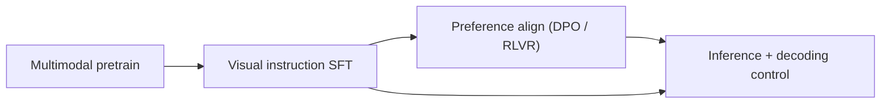
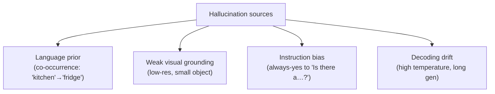

# Instruction Tuning & Decoding

<div class="tag-row"><span class="tag">visual instruction tuning</span><span class="tag">data recipes</span><span class="tag">guided decoding</span><span class="tag">JSON / tool schemas</span><span class="tag">hallucination</span><span class="tag">POPE</span></div>

> [!TIP] 두 문제로 잡으세요
> **Post-training**은 VLM이 *visual instruction을 따르게* 만듭니다(visual SFT → preference alignment). **Decoding**은 추론에서 나오는 것의 *형태와 신뢰성*을 제어합니다(sampling, constrained/guided decoding, hallucination 완화). 프로덕션 VLM은 정확하면서 *동시에* 파싱 가능한 답이 필요하기 때문에 면접관은 둘 다 테스트합니다.

## The pipeline



| Stage | Data | Loss target | Output |
| --- | --- | --- | --- |
| Pretrain | interleaved image-text web | 대부분 token | base VLM |
| Visual SFT | (image, instruction, response) | **assistant token만** | instruct VLM |
| Preference | chosen vs rejected (종종 hallucination용) | DPO / verifier | aligned VLM |
| Inference | user prompt + image | — | 생성된 답변 |

## 1 · Visual instruction tuning

Text SFT를 가져와 (question, answer) 쌍에 image를 더합니다. LLaVA의 기여는 아키텍처보다 **data recipe**였습니다: 강한 text LLM에게 ground-truth caption + box를 주고 프롬프팅하여 bootstrap 대화, 상세 묘사, reasoning을 만드는 것(모델은 image를 결코 보지 않음; *annotation*이 image를 대신함).

### Data recipe: the mix matters more than the size

| Data type | 가르치는 것 | 주의할 점 |
| --- | --- | --- |
| Detailed captioning | 언어를 내용에 grounding | verbosity bias, hallucinated detail |
| Conversational VQA | multi-turn instruction following | 보지 않고 지름길로 답하기 |
| Region / grounding | referring, coordinate | coordinate 형식 일관성 |
| OCR / document / chart | 밀집 text 읽기 | high-res tile / native-res 필요 |
| Reasoning / CoT | multi-step visual reasoning | teacher 오류 전파 |
| Multi-image / interleaved | 비교, in-context | 순서, 어느-image 혼동 |
| **Text-only replay** | 언어 능력 보존 | 빼면 → forgetting |

> [!NOTE] Quality > quantity, and negatives matter
> 2025-2026 반복 발견: 더 작은 *curated, deduplicated, balanced* 배합이 더 큰 노이즈 배합을 이기고, **"no / not present" 답변 포함**은 가장 저렴한 hallucination 해결책입니다 — "X가 있다"만 학습한 모델은 항상 yes라고 말하는 것을 배웁니다. 여러분의 data-curation 직관(curated ~1M-image 파이프라인)이 여기 그대로 전이됩니다.

7B급 VLM SFT를 위한 hyperparameter 출발점: LR 1e-5–2e-5 (full LLM) / LoRA는 최대 1e-4; effective batch 64–256 (grad-accum 사용); 1–3 epoch (overfit 주의); 3% warmup; AdamW β=(0.9,0.95); bf16 + grad-checkpointing.

## 2 · Preference alignment for VLMs

SFT 후, DPO/RLVR 스타일 alignment이 **특히 hallucination을 줄이기 위해** 점점 사용됩니다: *chosen* 답변은 grounded이고 *rejected* 답변은 객체/속성을 hallucinate하는 쌍을 만듭니다. InternVL3의 "Mixed Preference Optimization"은 preference optimization을 native-multimodal 레시피에 접는 [VERIFIED] 사례입니다. 메커니즘은 text와 동일합니다 — [Post-Training & Alignment](#/llm/alignment) 참고 — 반전은 *reward/preference 신호가 visual faithfulness에 관한 것*이라는 점입니다.

## 3 · Decoding: sampling strategies

```python
@torch.no_grad()
def step(model, ids, past=None):
    out = model(input_ids=ids, past_key_values=past, use_cache=True)
    logits = out.logits[:, -1, :]          # last position
    return sample(logits), out.past_key_values
```

| Method | Rule | Use |
| --- | --- | --- |
| Greedy | `argmax` | deterministic; factual VQA |
| Temperature | `softmax(logits/T)` | T↑ 다양, T→0 greedy |
| Top-k | keep top k | k=50 일반적 |
| Top-p (nucleus) | keep cumulative prob ≤ p | adaptive; p=0.9–0.95 |
| Min-p | drop below max_prob·p | 높은 T에서 품질 보존 |
| Beam search | keep B sequences | 짧은 구조적 출력; 낮은 다양성 |

| Task | temperature | top_p | note |
| --- | --- | --- | --- |
| Factual VQA / OCR | 0–0.2 | 0.9 | near-greedy, drift 최소화 |
| Creative caption | 0.7–1.0 | 0.95 | 다양성 원함 |
| JSON / tool call | 0 | — | + grammar constraint |
| Long reasoning | 0.6 | 0.95 | + 가벼운 repetition penalty |

## 4 · Guided / constrained decoding

**Goal:** 출력이 grammar/schema(JSON, coordinate 형식, enum)를 만족하도록 강제. 매 step마다 검증 automaton이 허용하는 token으로만 logit을 mask합니다.

```python
# conceptual: a grammar/FSM yields the legal next-token set per step
allowed = grammar.next_tokens(prefix)        # set of token ids
mask = torch.full_like(logits, float("-inf"))
mask[..., list(allowed)] = logits[..., list(allowed)]
next_id = sample(mask)                        # always schema-valid
```

| Approach | What it enforces | Tools |
| --- | --- | --- |
| Regex / CFG | arbitrary grammar | Outlines, guidance, lm-format-enforcer |
| JSON-schema | typed object structure | vLLM/TGI structured output, XGrammar |
| Enum / choice | one of a fixed set | trivial logit mask |
| Constrained beam | grammar + search | FST-guided beam |

> [!QUESTION] Guided decoding vs. "just prompt for JSON"?
> **Prompting은 요청하고, constraining은 보장합니다.** Prompt("JSON으로 답하라")는 몇 퍼센트 확률로 실패합니다 — trailing comma, 산문 서두, hallucinate된 필드 — 그리고 그 실패가 downstream parser를 크래시시킵니다. Constrained decoding은 *오직* schema-valid token만 sampling되도록 logit을 mask하여 100% 파싱 가능한 출력을 줍니다. VLM의 출력이 `json.loads`에 feed되는 agent/tool 파이프라인에서, 그 보장이 견고한 시스템과 삐끗대는 시스템의 차이입니다. 비용: 약간의 throughput과 줄어든 자유 형식 표현력.

### VLM-specific: coordinates & regions as constrained output

Grounding 출력(box, point)은 자연스러운 constrained-decoding 대상입니다:

- **Coordinates as text:** `{"bbox": [0.12, 0.34, 0.56, 0.78]}` (normalized 0–1) — `[num, num, num, num]`로 제약.
- **Special box tokens:** `<box>…</box>`, `<ref>…</ref>` (Kosmos-2, Shikra 계보).
- **semantic-spatial gap** — text coordinate token은 language 공간에 살며 visual feature와 약하게 연결됨 — 은 알려진 실패 양상입니다; [Grounding & Region Reasoning](#/vlm/grounding) 참고.

## 5 · Hallucination: mechanisms and mitigation

VLM hallucination = image가 **뒷받침하지 않는** 객체/속성/관계를 자신 있게 묘사하는 것. 이것이 *바로 그* 프로덕션 신뢰 문제입니다.



| Mitigation | Where | Idea |
| --- | --- | --- |
| Balanced SFT data | training | negative / "not present" 답변 포함 |
| Preference align (DPO) | training | hallucinate보다 grounded 선호 |
| Higher-res / better encoder | architecture | 모델에 필요한 픽셀 제공 |
| Grounded decoding | training + inference | 주장에 box/mask 증거 요구 |
| Low temperature / greedy | inference | factual query에서 sampling drift 감소 |
| Contrastive decoding (VCD-style) | inference | language-only / blurred-image prior 차감 |
| Tool / retrieval verification | agent | detector/OCR 전문가로 주장 확인 |

> [!EXAMPLE] Evaluate hallucination, don't eyeball it
> **POPE**는 균형 잡힌 yes/no 존재 질문(random / popular / adversarial negative)으로 객체 hallucination을 탐침합니다 — 항상 "yes"라고 답하는 모델은 adversarial split에서 우연 수준 점수입니다. POPE를 CHAIR(caption 객체 precision), grounded metric과 함께 보고하세요, VQA 정확도만이 아니라. Benchmark 스위트 맥락: MMMU, MMBench, TextVQA, spatial set(BLINK) — 측정하는 *capability gap*으로 bench를 고르세요.

## Q&A

<details class="qa"><summary>Why do you only compute loss on assistant tokens in visual SFT?</summary>
<div class="qa-body">

**Short:** 여러분은 $P(\text{response}\mid \text{image}, \text{prompt})$를 학습합니다. image와 user prompt는 조건이지 target이 아닙니다. 거기에 loss를 걸면 모델이 답변 대신 질문/placeholder를 생성하도록 배웁니다.

**Deep:** Image-placeholder token은 vocabulary에 없으므로 거기 loss는 무의미합니다; system/user token은 vocab에 *있으므로* 거기 loss는 능동적으로 해롭습니다 — 모델이 user의 분포를 배우게 됩니다. 그것들을 `-100`으로 mask하세요. 일부 팀은 (persona를 새기려고) 의도적으로 system prompt에 학습하지만, user turn과 image token은 항상 mask됩니다. Masking 코드는 [VLM Implementation Details](#/vlm/practical) 참고.
</div></details>

<details class="qa"><summary>A VLM keeps describing a "person" in images with no people. Diagnose and fix.</summary>
<div class="qa-body">

**Short:** yes-bias 데이터로 증폭된 전형적 language-prior hallucination. 세 방면에서 고치세요: 데이터(negative + grounded 답변을 선호하는 DPO 쌍 추가), 아키텍처(작은 단서를 놓치지 않도록 resolution/encoder), 추론(낮은 temperature, contrastive decoding, 또는 detector 교차 확인).

**Deep:** 먼저 진단 — POPE adversarial을 돌려 체계적 yes-bias인지 확인하고, temperature를 ablate하여 decoding drift와 training prior를 분리. 그다음: 명시적 "no person is present" 예시로 SFT 재균형; DPO 쌍 구성(chosen = grounded, rejected = hallucinated); prior를 억제하기 위해 text-only 또는 blurred-image logit 분포를 차감하는 contrastive decoding 고려; 제품에서는 고위험 주장을 전문 detector 뒤에 gate. 이것이 정확히 grounded VLM이 중요한 이유입니다 — [Grounding & Region Reasoning](#/vlm/grounding).
</div></details>

<details class="qa"><summary>Design the decoding for a VLM that outputs bounding boxes as JSON for a downstream service.</summary>
<div class="qa-body">

**Short:** Greedy(temperature 0) + **JSON-schema-constrained decoding**으로 출력이 항상 `{"objects":[{"label":str,"bbox":[num,num,num,num]}]}`가 되게. prompt만 의존하지 마세요.

**Deep:** Schema(typed, normalized 0–1 coord)를 정의하고, grammar/FSM으로 컴파일하고, 매 step 합법 token으로 logit을 mask하여 `json.loads`가 결코 실패하지 않게 합니다. Temperature 0은 서비스가 견딜 수 없는 sampling variance를 제거합니다. stop token과 max-length guard를 추가하세요. Coordinate 품질이 약하면, 해결책은 upstream(region feature / grounded training)이지 decoding이 아닙니다 — constrained decoding은 *형식*을 보장하지 *정확성*은 아닙니다.
</div></details>

**Follow-ups**

- "temperature와 top_p는 합쳐지나?" (예: temperature-scale, 그다음 nucleus-filter, 그다음 sample.)
- "언제 constrained decoding이 *해로운가*?" (지나치게 제한적인 grammar가 저확률 token을 강제 → 내용 저하; 그리고 틀린 *값*은 고치지 못하고 형태만.)
- "human label 없이 hallucination용 DPO 쌍을 어떻게 만드나?" (여러 답변 생성, detector/OCR verifier나 강한 VLM judge로 grounded 여부 라벨링.)
- "VLM에서 visual SFT와 RLVR의 차이?" (SFT는 target 답변을 모방; RLVR은 verifier reward를 최적화 — 답이 확인 가능할 때 실현 가능, 예: counting, OCR match, coordinate IoU.)

## Cheat-sheet

| Concept | One-liner |
| --- | --- |
| Visual SFT | (image, instruction, response); assistant token만 loss |
| Data recipe | curated + balanced + negative + text replay가 더 크지만 노이즈보다 우세 |
| DPO for VLMs | hallucinate보다 grounded 답변 선호; 객체 hallucination 감소 |
| Sampling defaults | factual: T≈0, top_p 0.9; creative: T 0.7–1.0 |
| Guided decoding | logit을 grammar/schema로 mask → 100% 파싱 가능한 JSON/coord |
| Prompt vs constrain | prompting은 요청, constraining은 출력 형태 보장 |
| Hallucination sources | language prior, weak grounding, yes-bias, decoding drift |
| Eval | POPE (객체 hallucination), CHAIR, grounded metric — VQA acc만이 아님 |

**Related:** [VLM Implementation Details](#/vlm/practical) · [Vision-Language Pretraining](#/vlm/pretraining) · [Grounding & Region Reasoning](#/vlm/grounding) · [Post-Training & Alignment](#/llm/alignment) · [Agentic AI & Tool Use](#/llm/agents)
