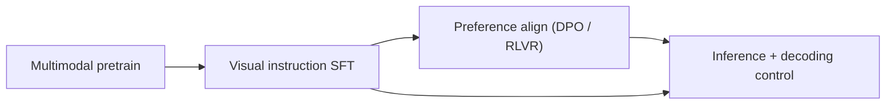
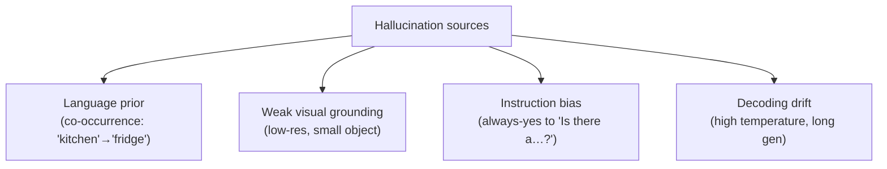

# Instruction Tuning & Decoding

<div class="tag-row"><span class="tag">visual instruction tuning</span><span class="tag">data recipes</span><span class="tag">guided decoding</span><span class="tag">JSON / tool schemas</span><span class="tag">hallucination</span><span class="tag">POPE</span></div>

> [!TIP] Frame it as two problems
> **Post-training** makes a VLM *follow visual instructions* (visual SFT → preference alignment). **Decoding** controls the *shape and reliability* of what comes out at inference (sampling, constrained/guided decoding, hallucination mitigation). Interviewers test both because a production VLM needs answers that are correct *and* parseable.

## The pipeline



| Stage | Data | Loss target | Output |
| --- | --- | --- | --- |
| Pretrain | interleaved image-text web | most tokens | base VLM |
| Visual SFT | (image, instruction, response) | **assistant tokens only** | instruct VLM |
| Preference | chosen vs rejected (often for hallucination) | DPO / verifier | aligned VLM |
| Inference | user prompt + image | — | generated answer |

## 1 · Visual instruction tuning

Take text SFT and add an image to the (question, answer) pair. LLaVA's contribution was less the architecture than the **data recipe**: bootstrap conversations, detailed descriptions, and reasoning by prompting a strong text LLM with ground-truth captions + boxes (the model never sees the image; the *annotations* stand in for it).

### Data recipe: the mix matters more than the size

| Data type | Teaches | Watch for |
| --- | --- | --- |
| Detailed captioning | grounding language to content | verbosity bias, hallucinated detail |
| Conversational VQA | multi-turn instruction following | shortcut answering without looking |
| Region / grounding | referring, coordinates | coordinate format consistency |
| OCR / document / chart | dense text reading | needs high-res tiles / native-res |
| Reasoning / CoT | multi-step visual reasoning | teacher errors propagate |
| Multi-image / interleaved | comparison, in-context | ordering, which-image confusion |
| **Text-only replay** | preserves language ability | omit it → forgetting |

> [!NOTE] Quality > quantity, and negatives matter
> A recurring 2025-2026 finding: a smaller *curated, deduplicated, balanced* mix beats a larger noisy one, and **including "no / not present" answers** is the cheapest hallucination fix — a model trained only on "yes there is an X" learns to always say yes. Your data-curation instinct (curated ~1M-image pipelines) transfers directly here.

Hyperparameter starting points for a 7B-class VLM SFT: LR 1e-5–2e-5 (full LLM) / up to 1e-4 (LoRA); effective batch 64–256 via grad-accum; 1–3 epochs (watch overfit); 3% warmup; AdamW β=(0.9,0.95); bf16 + grad-checkpointing.

## 2 · Preference alignment for VLMs

After SFT, DPO/RLVR-style alignment is increasingly used **specifically to cut hallucination**: build pairs where the *chosen* answer is grounded and the *rejected* one hallucinates an object/attribute. InternVL3's "Mixed Preference Optimization" is a [VERIFIED] example of folding preference optimization into a native-multimodal recipe. The mechanics are the same as text — see [Post-Training & Alignment](#/llm/alignment) — the twist is that the *reward/preference signal is about visual faithfulness*.

## 3 · Decoding: sampling strategies

```python
@torch.no_grad()
def step(model, ids, past=None):
    out = model(input_ids=ids, past_key_values=past, use_cache=True)
    logits = out.logits[:, -1, :]          # last position
    return sample(logits), out.past_key_values
```

| Method | Rule | Use |
| --- | --- | --- |
| Greedy | `argmax` | deterministic; factual VQA |
| Temperature | `softmax(logits/T)` | T↑ diverse, T→0 greedy |
| Top-k | keep top k | k=50 typical |
| Top-p (nucleus) | keep cumulative prob ≤ p | adaptive; p=0.9–0.95 |
| Min-p | drop below max_prob·p | quality-preserving at higher T |
| Beam search | keep B sequences | short structured outputs; low diversity |

| Task | temperature | top_p | note |
| --- | --- | --- | --- |
| Factual VQA / OCR | 0–0.2 | 0.9 | near-greedy, minimize drift |
| Creative caption | 0.7–1.0 | 0.95 | diversity wanted |
| JSON / tool call | 0 | — | + grammar constraint |
| Long reasoning | 0.6 | 0.95 | + light repetition penalty |

## 4 · Guided / constrained decoding

**Goal:** force the output to satisfy a grammar/schema (JSON, a coordinate format, an enum). At each step, mask logits to only the tokens a validating automaton allows.

```python
# conceptual: a grammar/FSM yields the legal next-token set per step
allowed = grammar.next_tokens(prefix)        # set of token ids
mask = torch.full_like(logits, float("-inf"))
mask[..., list(allowed)] = logits[..., list(allowed)]
next_id = sample(mask)                        # always schema-valid
```

| Approach | What it enforces | Tools |
| --- | --- | --- |
| Regex / CFG | arbitrary grammar | Outlines, guidance, lm-format-enforcer |
| JSON-schema | typed object structure | vLLM/TGI structured output, XGrammar |
| Enum / choice | one of a fixed set | trivial logit mask |
| Constrained beam | grammar + search | FST-guided beam |

> [!QUESTION] Guided decoding vs. "just prompt for JSON"?
> **Prompting asks; constraining guarantees.** A prompt ("reply in JSON") fails a few percent of the time — a trailing comma, prose preamble, a hallucinated field — and those failures crash a downstream parser. Constrained decoding masks logits so *only* schema-valid tokens are ever sampled, giving a 100%-parseable output. In an agent/tool pipeline where the VLM's output feeds `json.loads`, that guarantee is the difference between a robust system and one that flakes. Cost: a little throughput and reduced free-form expressivity.

### VLM-specific: coordinates & regions as constrained output

Grounding outputs (boxes, points) are a natural constrained-decoding target:

- **Coordinates as text:** `{"bbox": [0.12, 0.34, 0.56, 0.78]}` (normalized 0–1) — constrain to `[num, num, num, num]`.
- **Special box tokens:** `<box>…</box>`, `<ref>…</ref>` (Kosmos-2, Shikra lineage).
- The **semantic-spatial gap** — text coordinate tokens live in language space, weakly linked to visual features — is a known failure mode; see [Grounding & Region Reasoning](#/vlm/grounding).

## 5 · Hallucination: mechanisms and mitigation

VLM hallucination = confidently describing objects/attributes/relations **not supported by the image**. It is *the* production trust problem.



| Mitigation | Where | Idea |
| --- | --- | --- |
| Balanced SFT data | training | include negatives / "not present" answers |
| Preference align (DPO) | training | prefer grounded over hallucinated answers |
| Higher-res / better encoder | architecture | give the model the pixels it needs |
| Grounded decoding | training + inference | require box/mask evidence for claims |
| Low temperature / greedy | inference | reduce sampling drift on factual queries |
| Contrastive decoding (VCD-style) | inference | subtract the language-only / blurred-image prior |
| Tool / retrieval verification | agent | check claims with a detector/OCR specialist |

> [!EXAMPLE] Evaluate hallucination, don't eyeball it
> **POPE** probes object hallucination with balanced yes/no existence questions (random / popular / adversarial negatives) — a model that always says "yes" scores at chance on the adversarial split. Report POPE alongside CHAIR (caption object precision) and grounded metrics, not just VQA accuracy. Benchmark suite context: MMMU, MMBench, TextVQA, and spatial sets (BLINK) — pick benches by the *capability gap* you're measuring.

## Q&A

<details class="qa"><summary>Why do you only compute loss on assistant tokens in visual SFT?</summary>
<div class="qa-body">

**Short:** You're training $P(\text{response}\mid \text{image}, \text{prompt})$. The image and user prompt are conditioning, not targets. Putting loss on them teaches the model to generate questions/placeholders instead of answers.

**Deep:** Image-placeholder tokens aren't in the vocabulary, so a loss there is meaningless; system/user tokens *are* in the vocab, so a loss there is actively harmful — the model would learn the user's distribution. Mask them to `-100`. Some teams do train on the system prompt deliberately (to bake in a persona), but user turns and image tokens are always masked. See the masking code in [VLM Implementation Details](#/vlm/practical).
</div></details>

<details class="qa"><summary>A VLM keeps describing a "person" in images with no people. Diagnose and fix.</summary>
<div class="qa-body">

**Short:** Classic language-prior hallucination amplified by yes-biased data. Fix on three fronts: data (add negatives + DPO pairs preferring grounded answers), architecture (resolution/encoder so small cues aren't missed), and inference (lower temperature, contrastive decoding, or a detector cross-check).

**Deep:** Diagnose first — run POPE adversarial to confirm it's systematic yes-bias, and ablate temperature to separate decoding drift from a training prior. Then: rebalance SFT with explicit "no person is present" examples; construct DPO pairs (chosen = grounded, rejected = hallucinated); consider contrastive decoding that subtracts a text-only or blurred-image logit distribution to suppress the prior; for a product, gate high-stakes claims behind a specialist detector. This is exactly why grounded VLMs matter — [Grounding & Region Reasoning](#/vlm/grounding).
</div></details>

<details class="qa"><summary>Design the decoding for a VLM that outputs bounding boxes as JSON for a downstream service.</summary>
<div class="qa-body">

**Short:** Greedy (temperature 0) + **JSON-schema-constrained decoding** so output is always `{"objects":[{"label":str,"bbox":[num,num,num,num]}]}`. Never rely on a prompt alone.

**Deep:** Define the schema (typed, normalized 0–1 coords), compile it to a grammar/FSM, and mask logits each step to legal tokens so `json.loads` never fails. Temperature 0 removes sampling variance a service can't tolerate. Add stop tokens and a max-length guard. If coordinate quality is weak, the fix is upstream (region features / grounded training), not decoding — constrained decoding guarantees *format*, not *correctness*.
</div></details>

**Follow-ups**

- "Do temperature and top_p compose?" (Yes: temperature-scale, then nucleus-filter, then sample.)
- "When does constrained decoding *hurt*?" (Over-restrictive grammar can force low-probability tokens → degraded content; and it doesn't fix a wrong *value*, only the shape.)
- "How would you build DPO pairs for hallucination without human labels?" (Generate multiple answers, use a detector/OCR verifier or a strong VLM judge to label grounded vs. not.)
- "Difference between visual SFT and RLVR for a VLM?" (SFT imitates a target answer; RLVR optimizes a verifier reward — feasible when the answer is checkable, e.g., counting, OCR match, coordinate IoU.)

## Cheat-sheet

| Concept | One-liner |
| --- | --- |
| Visual SFT | (image, instruction, response); loss on assistant tokens only |
| Data recipe | curated + balanced + negatives + text replay beats bigger-but-noisier |
| DPO for VLMs | prefer grounded over hallucinated answers; cuts object hallucination |
| Sampling defaults | factual: T≈0, top_p 0.9; creative: T 0.7–1.0 |
| Guided decoding | mask logits to grammar/schema → 100% parseable JSON/coords |
| Prompt vs constrain | prompting asks; constraining guarantees the output shape |
| Hallucination sources | language prior, weak grounding, yes-bias, decoding drift |
| Eval | POPE (object hallucination), CHAIR, grounded metrics — not just VQA acc |

**Related:** [VLM Implementation Details](#/vlm/practical) · [Vision-Language Pretraining](#/vlm/pretraining) · [Grounding & Region Reasoning](#/vlm/grounding) · [Post-Training & Alignment](#/llm/alignment) · [Agentic AI & Tool Use](#/llm/agents)
