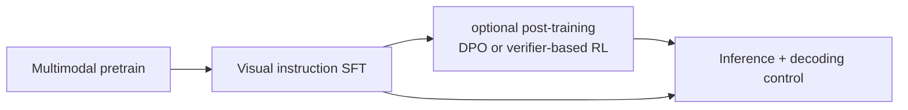
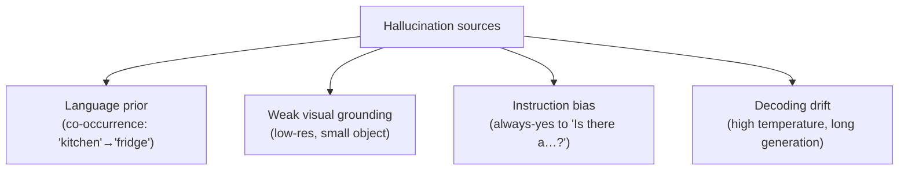

# Instruction Tuning & Decoding

<div class="tag-row"><span class="tag">visual instruction tuning</span><span class="tag">data recipes</span><span class="tag">preference alignment</span><span class="tag">guided decoding</span><span class="tag">hallucination</span><span class="tag">POPE</span></div>

> [!NOTE] Goal of this chapter
> [VLM Pretraining](#/vlm/pretraining) produced a **base VLM** that can relate images and text, but it is not yet an instruction-following assistant. Given a photo and “describe this,” it may continue an unrelated web sentence. This chapter covers the two steps that make it useful: **① teach it to follow instructions (instruction tuning)** and **② control the format and reliability of its output (decoding + hallucination mitigation)**.

## What and why

We do two things:

1. **Teach instruction following.** Train on many `(image, question, answer)` examples so the model learns to answer from the image. This is **visual instruction tuning**.
2. **Control decoding**, the rule that chooses each next token. Enforce the *format*—for example, schema-valid JSON on normal completion—and tune sampling behavior. Content reliability still requires data, the model, and verifiers together.

A production VLM needs both **correctness** and a **parseable contract**. If a service passes object locations downstream as JSON, a correct answer in malformed JSON breaks the pipeline. A perfectly formatted answer that invents an object absent from the image is equally unacceptable. This chapter therefore treats instruction tuning (“what to say”) and decoding control (“how to emit it”) together.

> [!TIP] Interview one-liner
> “Instruction tuning makes a VLM *follow instructions* (visual SFT → preference alignment); decoding control governs the *form and reliability* of the output.” A production VLM must be both accurate and parseable.

### Terms first, one line each

| Term | One-line meaning |
| --- | --- |
| **Visual instruction tuning** | fine-tune on image/instruction/answer triples to teach instruction following |
| **SFT (Supervised Fine-Tuning)** | learn to imitate target answers directly |
| **Data recipe / mix** | decide which training-data types to combine and in what proportions |
| **Preference alignment** | refine the model using signals that one answer is better than another |
| **Decoding** | choose the actual next token from a probability distribution |
| **Guided / constrained decoding** | restrict allowed tokens to enforce grammar; termination and value semantics still need validation |
| **Hallucination** | confidently state something unsupported by the image |

## Pipeline at a glance



| Stage | Data | Loss target | Output |
| --- | --- | --- | --- |
| Pretrain | interleaved image-text web | most tokens | base VLM |
| Visual SFT | (image, instruction, response) | **assistant tokens only** | instruct VLM |
| Preference / RL | chosen-rejected pairs or verifier-scored samples | DPO or an RL objective | reinforce target preferences/behavior (not guaranteed) |
| Inference | user prompt + image | — | generated answer |

## 1 · Visual instruction tuning

Take text SFT and add an image to the (question, answer) pair. LLaVA's contribution was less the architecture than the **data recipe**: bootstrap conversations, detailed descriptions, and reasoning by prompting a strong text LLM with ground-truth captions + boxes (the model never sees the image; the *annotations* stand in for it).

### Data recipe: the mix matters more than the size

| Data type | Teaches | Watch for |
| --- | --- | --- |
| Detailed captioning | grounding language to content | verbosity bias, hallucinated detail |
| Conversational VQA | multi-turn instruction following | shortcut answering without looking |
| Region / grounding | referring, coordinates | coordinate format consistency |
| OCR / document / chart | dense text reading | needs high-res tiles / native-res |
| Reasoning / CoT | multi-step visual reasoning | teacher errors propagate |
| Multi-image / interleaved | comparison, in-context | ordering, which-image confusion |
| **Text-only replay** | preserves language ability | omit it → forgetting |

> [!NOTE] Quality > quantity, and negatives matter
> A recurring 2025–2026 finding is that a smaller *curated, deduplicated, balanced* mix can beat a larger noisy one. Including **“no / not present” answers** is one of the cheapest hallucination mitigations: a model trained only on “yes, there is an X” learns a yes bias.

As an exploratory starting point, full fine-tuning of a 7B-class model may begin near a learning rate of $10^{-5}$, while LoRA can explore larger rates. Batch, epochs, warmup, and optimizer settings depend on data size, trainable parameters, vision-token count, and precision. Sweep effective token batch and monitor validation loss, text-only regressions, and task-specific slices rather than memorizing a fixed recipe.

## 2 · Preference alignment for VLMs

If SFT says “imitate this answer,” preference alignment says “this answer is better than that one.” After SFT, **DPO** optimizes chosen/rejected pairs, while **RLVR** uses programmatically checkable rewards such as counting, OCR matching, or coordinate IoU. They are different data and optimization choices. Grounded chosen answers and hallucinated rejected answers can target hallucination, but preference bias, reward hacking, and regressions in other abilities must be evaluated separately.

The mechanics are the same as for text; see [Post-Training & Alignment](#/llm/alignment) and the [RL Primer](#/llm/rl-primer). The VLM-specific difference is that the reward or preference concerns **visual faithfulness**. InternVL3's “Mixed Preference Optimization” is one example of incorporating this into a native multimodal recipe.

## 3 · Decoding: sampling strategies

The basics of next-token selection are covered in [Decoding & Sampling](#/llm/decoding-sampling). Here we focus on VLM output contracts. A lower positive temperature concentrates probability on the top token but still samples; APIs usually treat `temperature=0` as a separate greedy case.

<figure>
<svg viewBox="0 0 640 220" xmlns="http://www.w3.org/2000/svg" font-family="Inter, sans-serif" font-size="12">
  <text x="110" y="20" text-anchor="middle" font-weight="700" fill="#0ea5e9">Low T (sharp)</text>
  <g fill="#0ea5e9">
    <rect x="55" y="46" width="20" height="110"/><rect x="82" y="128" width="20" height="28"/><rect x="109" y="142" width="20" height="14"/><rect x="136" y="149" width="20" height="7"/><rect x="163" y="152" width="20" height="4"/>
  </g>
  <line x1="50" y1="156" x2="190" y2="156" stroke="#98a3b2" stroke-width="1"/>
  <text x="120" y="176" text-anchor="middle" fill="#98a3b2" font-size="11">mass concentrates on rank 1</text>
  <text x="120" y="192" text-anchor="middle" fill="#98a3b2" font-size="11">→ factual VQA · OCR</text>

  <text x="330" y="20" text-anchor="middle" font-weight="700" fill="#e0533f">High T (flat)</text>
  <g fill="#e0533f">
    <rect x="270" y="80" width="20" height="76"/><rect x="297" y="92" width="20" height="64"/><rect x="324" y="100" width="20" height="56"/><rect x="351" y="106" width="20" height="50"/><rect x="378" y="110" width="20" height="46"/>
  </g>
  <line x1="265" y1="156" x2="405" y2="156" stroke="#98a3b2" stroke-width="1"/>
  <text x="335" y="176" text-anchor="middle" fill="#98a3b2" font-size="11">mass spreads out</text>
  <text x="335" y="192" text-anchor="middle" fill="#98a3b2" font-size="11">→ creative captions</text>

  <text x="550" y="20" text-anchor="middle" font-weight="700" fill="#12a150">top-p (cumulative cutoff)</text>
  <g fill="#12a150"><rect x="490" y="60" width="20" height="96"/><rect x="517" y="104" width="20" height="52"/><rect x="544" y="128" width="20" height="28"/></g>
  <g fill="#98a3b2" opacity="0.4"><rect x="571" y="142" width="20" height="14"/><rect x="598" y="149" width="20" height="7"/></g>
  <line x1="567" y1="46" x2="567" y2="160" stroke="#6366f1" stroke-width="2" stroke-dasharray="5 4"/>
  <line x1="485" y1="156" x2="625" y2="156" stroke="#98a3b2" stroke-width="1"/>
  <text x="550" y="176" text-anchor="middle" fill="#98a3b2" font-size="11">keep candidates through mass 0.9</text>
  <text x="550" y="192" text-anchor="middle" fill="#98a3b2" font-size="11">gray = truncated tail</text>
</svg>
<figcaption>Temperature controls distribution sharpness; top-p controls retained probability mass. Low diversity is a reasonable starting point for factual queries, but the optimum depends on the model, API, and verification strategy. These are not fixed recommended values.</figcaption>
</figure>

```python
@torch.no_grad()
def step(model, ids, past=None):
    out = model(input_ids=ids, past_key_values=past, use_cache=True)
    logits = out.logits[:, -1, :]          # last position
    return sample(logits), out.past_key_values
```

| Task | temperature | top_p | note |
| --- | --- | --- | --- |
| Factual VQA / OCR | start with low diversity | provider default or tune | choose by exact match and calibration |
| Creative caption | explore broader sampling | model-specific | evaluate diversity and faithfulness together |
| JSON / tool call | greedy is possible | — | grammar/schema constraint + value validation |
| Long reasoning | multiple-candidate sampling is possible | model-specific | consider best-of-N when a verifier exists |

These are directions, not fixed values. Temperature does not solve the root cause of hallucination, and reasoning models may have provider-specific recommendations and hidden reasoning policies.

## 4 · Guided / constrained decoding

**Goal:** constrain allowed tokens so a normally terminated output satisfies a grammar such as JSON, coordinates, or an enum. At every step, an automaton leaves only valid next tokens and masks the rest to $-\infty$. This assumes the grammar/tokenizer integration is correct; truncation, an empty allowed set, and semantic validation require separate handling.

```python
# conceptual: a grammar/FSM yields the legal next-token set per step
allowed = grammar.next_tokens(prefix)        # set of token ids
mask = torch.full_like(logits, float("-inf"))
mask[..., list(allowed)] = logits[..., list(allowed)]
next_id = sample(mask)                        # grammar-allowed token at this step
```

| Approach | What it enforces | Tools |
| --- | --- | --- |
| Regex / CFG | arbitrary grammar | Outlines, guidance, lm-format-enforcer |
| JSON-schema | typed object structure | vLLM/TGI structured output, XGrammar |
| Enum / choice | one of a fixed set | trivial logit mask |
| Constrained beam | grammar + search | FST-guided beam |

> [!QUESTION] Guided decoding vs. "just prompt for JSON"?
> **A prompt is a request; constraining is a grammar-level guarantee.** If the grammar engine is applied through normal generation termination, with no max-token truncation or transport failure, it can produce schema-valid output. It does not guarantee that values are true, required fields are semantically valid, coordinates are in range, or business rules hold. Add a semantic validator after parsing, plus timeout/max-length, retry, and explicit failure paths.

### Build it yourself — constrained decoding with logit masking

Implement the core operation: set logits of tokens outside `allowed` to $-\infty$, then apply softmax. Forbidden tokens receive probability 0 and allowed tokens are renormalized. Return the probability list. See [Decoding & Sampling](#/llm/decoding-sampling) for the sampling basics.

<div class="widget" data-widget="code">
<script type="application/json" class="code-config">
{"func":"constrained_probs","packages":["numpy"],"approx":true,"starter":"def constrained_probs(logits, allowed):\n    # Set logits outside allowed indices to -inf, then apply softmax.\n    # Forbidden tokens get probability 0; allowed tokens are renormalized.\n    # For numerical stability, subtract the maximum among allowed values before exp.\n    # Return a probability list with len(logits) entries.\n    pass","tests":[{"args":[[2.0,1.0,0.0],[0,1]],"expect":[0.7310586,0.2689414,0.0],"tol":1e-4},{"args":[[1.0,1.0,1.0,1.0],[0,2]],"expect":[0.5,0.0,0.5,0.0],"tol":1e-4},{"args":[[3.0,1.0,2.0],[0,2]],"expect":[0.7310586,0.0,0.2689414],"tol":1e-4}],"solution":"import numpy as np\n\ndef constrained_probs(logits, allowed):\n    z = np.asarray(logits, dtype=float)\n    mask = np.full_like(z, -np.inf)\n    idx = list(allowed)\n    mask[idx] = z[idx]                 # Keep original logits only for allowed tokens\n    mask = mask - np.max(mask[idx])    # Numerical stability over allowed values\n    e = np.exp(mask)                   # exp(-inf)=0 for forbidden tokens\n    return (e / e.sum()).tolist()"}
</script>
</div>

In the first test, forbidding index 2 makes its probability exactly zero and renormalizes the remaining values to 0.731 and 0.269. A grammar or schema repeatedly updates `allowed` and applies this mask at every step.

### VLM-specific: coordinates & regions as constrained output

Grounding outputs (boxes, points) are a natural constrained-decoding target:

- **Coordinates as text:** `{"bbox": [0.12, 0.34, 0.56, 0.78]}` (normalized 0–1)—constraining the `[num, num, num, num]` grammar greatly reduces parse failures on normally terminated output. Truncation, transport errors, and an empty allowed set still need explicit failure paths.
- **Special box tokens:** `<box>…</box>`, `<ref>…</ref>` (Kosmos-2, Shikra lineage).
- The **semantic-spatial gap**—text coordinate tokens live in language space and may be weakly linked to visual features—is a known failure mode; see [Grounding & Region Reasoning](#/vlm/grounding). Constraining guarantees the coordinate *form*, not localization *accuracy*.

## 5 · Hallucination: mechanisms and mitigation

VLM hallucination means confidently describing an object, attribute, or relation **not supported by the image**. The diagram shows the typical case: the image contains a table, but the caption invents a cat.

<figure>
<svg viewBox="0 0 640 210" xmlns="http://www.w3.org/2000/svg" font-family="Inter, sans-serif" font-size="12">
  <!-- image: a room with a table, no cat -->
  <text x="120" y="22" text-anchor="middle" fill="#98a3b2">Image (actual)</text>
  <rect x="30" y="32" width="180" height="120" rx="6" fill="none" stroke="#0ea5e9" stroke-width="1.6"/>
  <line x1="30" y1="120" x2="210" y2="120" stroke="#0ea5e9" stroke-width="1"/>
  <rect x="70" y="86" width="70" height="34" rx="3" fill="#0ea5e9" opacity="0.35"/>
  <text x="105" y="107" text-anchor="middle" fill="currentColor">table</text>
  <text x="120" y="145" text-anchor="middle" fill="#98a3b2" font-size="11">(no cat)</text>
  <!-- VLM caption -->
  <text x="430" y="22" text-anchor="middle" fill="#98a3b2">VLM-generated caption</text>
  <rect x="270" y="40" width="330" height="46" rx="8" fill="none" stroke="#12a150" stroke-width="1.6"/>
  <text x="285" y="60" fill="currentColor" font-size="11">"There is a table in the room,</text>
  <text x="285" y="76" fill="#12a150" font-size="11">with a plate on top." ✓ supported</text>
  <rect x="270" y="98" width="330" height="46" rx="8" fill="none" stroke="#e0533f" stroke-width="1.8"/>
  <text x="285" y="118" fill="currentColor" font-size="11">"…with a </text>
  <text x="345" y="118" fill="#e0533f" font-weight="700" font-size="11">cat</text>
  <text x="385" y="118" fill="currentColor" font-size="11"> sitting on it."</text>
  <text x="285" y="134" fill="#e0533f" font-size="11">✗ hallucination—object absent from image</text>
  <text x="435" y="172" text-anchor="middle" fill="#98a3b2" font-size="11">language prior (room → cat co-occurrence) beats pixel evidence</text>
</svg>
<figcaption>A typical hallucination: the language model's plausibility overwhelms visual evidence, so it confidently invents an object absent from the image.</figcaption>
</figure>



| Mitigation | Where | Idea |
| --- | --- | --- |
| Balanced SFT data | training | include negatives / "not present" answers |
| Preference align (DPO) | training | prefer grounded over hallucinated answers |
| Higher-res / better encoder | architecture | give the model the pixels it needs |
| Grounded decoding | training + inference | require box/mask evidence for claims |
| Low temperature / greedy | inference | reduce sampling drift on factual queries |
| Contrastive decoding (VCD-style) | inference | subtract the language-only / blurred-image prior |
| Tool / retrieval verification | agent | check claims with a detector/OCR specialist |

> [!EXAMPLE] Evaluate hallucination, don't eyeball it
> **POPE** measures object hallucination and yes bias through yes/no existence questions with random, popular, and adversarial negatives. **CHAIR-i** is the fraction of mentioned object instances that are hallucinated; **CHAIR-s** is the fraction of captions containing at least one hallucinated object, and lower is better for both. These are not one generic “fraction of real objects.” Report POPE, CHAIR, grounding metrics, and task accuracy together, and check data leakage and judge bias.

## Q&A

<details class="qa"><summary>Why do you only compute loss on assistant tokens in visual SFT?</summary>
<div class="qa-body">

**Short:** You're training $P(\text{response}\mid \text{image}, \text{prompt})$. The image and user prompt are conditioning, not targets. Putting loss on them teaches the model to generate questions/placeholders instead of answers.

**Deep:** a placeholder ID may be a special vocabulary token, but its position is replaced with visual embeddings and is not an ordinary text target. Assistant-only masking is common in chat SFT, although a recipe that assigns LM loss to some prompt tokens is not always harmful. Inspect the intended conditional objective and chat-template boundaries explicitly. See [VLM Implementation Details](#/vlm/practical).
</div></details>

<details class="qa"><summary>A VLM keeps describing a "person" in images with no people. Diagnose and fix.</summary>
<div class="qa-body">

**Short:** Classic language-prior hallucination amplified by yes-biased data. Fix on three fronts: data (add negatives + DPO pairs preferring grounded answers), architecture (resolution/encoder so small cues aren't missed), and inference (lower temperature, contrastive decoding, or a detector cross-check).

**Deep:** Diagnose first — run POPE adversarial to confirm it's systematic yes-bias, and ablate temperature to separate decoding drift from a training prior. Then: rebalance SFT with explicit "no person is present" examples; construct DPO pairs (chosen = grounded, rejected = hallucinated); consider contrastive decoding that subtracts a text-only or blurred-image logit distribution to suppress the prior; for a product, gate high-stakes claims behind a specialist detector. This is exactly why grounded VLMs matter — [Grounding & Region Reasoning](#/vlm/grounding).
</div></details>

<details class="qa"><summary>Design the decoding for a VLM that outputs bounding boxes as JSON for a downstream service.</summary>
<div class="qa-body">

**Short:** when deterministic output is needed, use greedy decoding with a **JSON-schema constraint** so normally terminated output follows `{"objects":[{"label":str,"bbox":[num,num,num,num]}]}`. Do not rely on prompting alone, and handle truncation and validation failures explicitly.

**Deep:** define the schema with typed, normalized 0–1 coordinates; compile it to a grammar/FSM; and keep only legal tokens at every step. After normal termination, run `json.loads` and a semantic validator. Give truncation, timeout, and empty-allowed-set cases explicit retry/failure paths. Greedy decoding removes sampling randomness but does not guarantee bitwise reproducibility across kernels and distributed implementations. Weak coordinate quality must be fixed upstream with region features, grounded training, and task verification—constraining helps *format*, not *correctness*.
</div></details>

**Follow-ups**

- "Do temperature and top_p compose?" (For example: temperature-scale, then nucleus-filter, then sample.) → [Decoding & Sampling](#/llm/decoding-sampling)
- "When does constrained decoding *hurt*?" (Over-restrictive grammar can force low-probability tokens → degraded content; and it doesn't fix a wrong *value*, only the shape.)
- "How would you build DPO pairs for hallucination without human labels?" (Generate multiple answers, use a detector/OCR verifier or a strong VLM judge to label grounded vs. not.)
- "Difference between visual SFT and RLVR for a VLM?" (SFT imitates a target answer; RLVR optimizes a verifier reward — feasible when the answer is checkable, e.g., counting, OCR match, coordinate IoU.)

## Cheat-sheet

| Concept | One-liner |
| --- | --- |
| Visual SFT | (image, instruction, response); loss on assistant tokens only |
| Data recipe | curated + balanced + negatives + text replay beats bigger-but-noisier |
| DPO / RLVR | optimize preference pairs vs verifier-reward RL; verify hallucination gains and regressions empirically |
| Sampling | start factual tasks with low diversity and explore broader settings for creative tasks; tune per model/API |
| Guided decoding | mask allowed tokens to enforce grammar; handle truncation, value correctness, and business rules separately |
| Prompt vs constrain | prompting asks; constraining guarantees the output shape |
| Hallucination sources | language prior, weak grounding, yes-bias, decoding drift |
| Eval | POPE, CHAIR-i/CHAIR-s, grounding metrics, task accuracy, and calibration |

**Next:** [Grounding & Region Reasoning](#/vlm/grounding) · [Video-Language Models](#/vlm/video) · [Decoding & Sampling](#/llm/decoding-sampling) · [VLM Implementation Details](#/vlm/practical) · [Post-Training & Alignment](#/llm/alignment)
