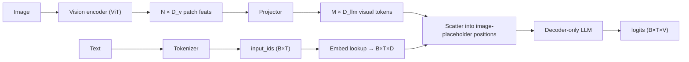
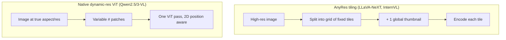

# VLM 구현 디테일 (Implementation Details)

<div class="tag-row"><span class="tag">image tokens</span><span class="tag">chat templates</span><span class="tag">AnyRes tiling</span><span class="tag">dynamic resolution</span><span class="tag">token budget</span><span class="tag">SFT masking</span><span class="tag">debugging</span></div>

> [!NOTE] 이 챕터의 목표
> [VLM 101](#/vlm/vlm-101)에서 "이미지가 어떻게 토큰이 되는가"의 그림을 잡았다면, 이 챕터는 그걸 <strong>실제로 돌릴 때 만지는 배관(plumbing)</strong>입니다: 하나의 `<image>` 자리표시자가 어떻게 여러 개의 visual embedding이 되어 텍스트 토큰 사이에 끼워지는지, chat template·해상도·토큰 예산·loss 마스킹은 무엇인지. 개념보다 "실무에서 터지는 지점"에 집중합니다.

## 무엇을 · 왜

"LLaVA는 CLIP을 LLM에 붙인 것"이라는 한 줄은 쉽습니다. 하지만 **실제로 학습·추론을 돌리면** 그 사이에 수많은 배관이 있습니다. 이미지는 텍스트가 아니므로, 모델이 삼킬 수 있는 **visual token(시각 토큰)** 으로 바꿔서, 텍스트 토큰 열(sequence) 중간에 **정확한 개수로** 끼워 넣어야 합니다. 이 개수가 하나만 어긋나도 학습이 즉시 크래시납니다.

핵심 그림 하나만 머릿속에 넣으세요 — **시각 토큰은 텍스트 토큰 열 안에 그냥 섞여 들어간다.** LLM 입장에서 이미지는 하나의 토큰 스트림의 일부일 뿐입니다.

<figure>
<svg viewBox="0 0 660 190" xmlns="http://www.w3.org/2000/svg" font-family="Inter, sans-serif" font-size="12">
  <!-- image -->
  <text x="52" y="26" text-anchor="middle" fill="#98a3b2">이미지</text>
  <g stroke="#0ea5e9" stroke-width="1.2" fill="none">
    <rect x="24" y="34" width="56" height="56" rx="4"/>
    <line x1="43" y1="34" x2="43" y2="90"/><line x1="61" y1="34" x2="61" y2="90"/>
    <line x1="24" y1="52" x2="80" y2="52"/><line x1="24" y1="72" x2="80" y2="72"/>
  </g>
  <text x="52" y="106" text-anchor="middle" fill="#98a3b2" font-size="10">→ 패치</text>
  <path d="M84 62 H120" stroke="#98a3b2" stroke-width="1.4" marker-end="url(#a)"/>
  <rect x="122" y="46" width="70" height="32" rx="7" fill="#6366f1"/>
  <text x="157" y="66" text-anchor="middle" fill="#fff" font-size="10">인코더+투영</text>
  <path d="M192 62 H224" stroke="#98a3b2" stroke-width="1.4" marker-end="url(#a)"/>
  <!-- token stream -->
  <text x="440" y="26" text-anchor="middle" fill="#98a3b2">LLM에 들어가는 토큰 열</text>
  <g font-size="10" text-anchor="middle">
    <rect x="230" y="46" width="40" height="30" rx="4" fill="none" stroke="#98a3b2"/><text x="250" y="65" fill="currentColor">이</text>
    <rect x="272" y="46" width="40" height="30" rx="4" fill="none" stroke="#98a3b2"/><text x="292" y="65" fill="currentColor">사진</text>
    <rect x="316" y="46" width="30" height="30" rx="4" fill="#e0533f"/><text x="331" y="65" fill="#fff">🖼</text>
    <rect x="348" y="46" width="30" height="30" rx="4" fill="#e0533f"/><text x="363" y="65" fill="#fff">🖼</text>
    <rect x="380" y="46" width="30" height="30" rx="4" fill="#e0533f"/><text x="395" y="65" fill="#fff">🖼</text>
    <rect x="412" y="46" width="30" height="30" rx="4" fill="#e0533f"/><text x="427" y="65" fill="#fff">🖼</text>
    <rect x="444" y="46" width="44" height="30" rx="4" fill="none" stroke="#98a3b2"/><text x="466" y="65" fill="currentColor">뭐야?</text>
  </g>
  <text x="360" y="100" text-anchor="middle" fill="#e0533f" font-size="10">빨강 = M개의 visual token (하나의 &lt;image&gt; 가 M칸으로 확장)</text>
  <path d="M224 62 C 260 62, 280 62, 316 62" stroke="#0ea5e9" stroke-width="1.4" fill="none" marker-end="url(#b)"/>
  <text x="330" y="150" text-anchor="middle" fill="#98a3b2">텍스트 토큰(회색) 사이에 시각 토큰(빨강)이 삽입됨 → 하나의 열로 LLM에 입력 (early/projector fusion)</text>
  <defs>
    <marker id="a" markerWidth="8" markerHeight="8" refX="6" refY="3" orient="auto"><path d="M0 0 L6 3 L0 6" fill="#98a3b2"/></marker>
    <marker id="b" markerWidth="8" markerHeight="8" refX="6" refY="3" orient="auto"><path d="M0 0 L6 3 L0 6" fill="#0ea5e9"/></marker>
  </defs>
</svg>
<figcaption>이미지 → 패치 → 인코더/투영기(projector) → M개의 시각 토큰. 이 M칸이 텍스트의 <code>&lt;image&gt;</code> 자리표시자 위치에 정확히 끼워집니다. "정확히 M개"가 이 챕터의 핵심 강박입니다.</figcaption>
</figure>

> [!TIP] 면접 한 줄
> "LLaVA는 CLIP을 LLM에 붙인 것"은 누구나 말합니다. *실제로 VLM을 학습해봤다*는 신호는 배관 유창함입니다: 하나의 `<image>` token이 어떻게 N개 visual embedding이 되는가, AnyRes tiling이 token count를 어떻게 바꾸는가, 어떤 token에 loss가 걸리는가, 어떤 버그가 어떤 증상을 만드는가. 이 챕터가 바로 그 배관입니다.

## VLM forward pass가 실제로 하는 일



위 그림의 글자판입니다. **인코더(encoder)** 가 이미지를 패치 특징으로, **투영기(projector, 작은 MLP)** 가 그걸 LLM이 이해하는 차원으로 바꾸고, 그 결과 M개의 시각 토큰이 텍스트 임베딩 열의 자리표시자 위치에 **scatter(흩뿌려 삽입)** 됩니다.

## 1 · Special token & image placeholder(자리표시자)

| 종류 | 예시 | 역할 |
| --- | --- | --- |
| 일반 subword | `▁hello`, `ing` | 본문 text |
| Control(제어) | `<s>`, `</s>`, `<pad>`, `<unk>` | bos/eos/pad |
| Chat(대화) | `<\|im_start\|>`, `<\|im_end\|>`, `[INST]` | 대화 형식 (모델별) |
| **Vision(시각)** | `<image>`, `<\|image_pad\|>`, `<\|vision_start\|>` | "여기에 visual embedding 삽입" |
| Reserved(예약) | `<\|reserved_special_token_0\|>` | 향후 확장 |

> [!WARNING] 두 곳 규칙 (the two-places rule)
> 모델이 실제 `input_ids`로 special token을 받는 구조라면 tokenizer와 embedding/LM head 크기를 함께 맞추고 `resize_token_embeddings` 후 weight tying·checkpoint 저장을 확인합니다. 반면 processor가 placeholder를 LM 입력 전에 제거·확장하는 구현은 별도 virtual token을 쓸 수 있습니다. 새 행의 평균 초기화는 한 선택지이지 보편 최적은 아니며, encode→decode와 ID 범위 테스트가 더 중요합니다.

### 하나의 `<image>`, 여러 개의 embedding

하나의 image는 $N$개 ViT patch → projector 이후 $M$개 visual token이 됩니다. 그래서 text sequence는 하나가 아니라 $M$개의 *슬롯(칸)* 이 필요합니다. 두 가지 구현 스타일:

- **Pre-expand(미리 확장):** processor가 tokenize 전에 하나의 `<image>`를 $M$개의 `<|image_pad|>` id 복사본으로 대체하여 슬롯 개수가 `input_ids`에 명시됩니다.
- **Scatter(주입):** 단일 placeholder id를 유지하고 model의 `forward` 안 그 위치에 $M$개의 hidden state를 주입합니다.

```python
def merge_embeddings(input_ids, text_embeds, vision_embeds, image_token_id):
    # text_embeds: (B,T,D) with placeholder rows to be overwritten
    # vision_embeds: (total_visual_tokens, D)
    mask = (input_ids == image_token_id)          # (B,T) bool
    assert mask.sum() == vision_embeds.shape[0]    # slots == visual tokens
    text_embeds[mask] = vision_embeds.to(text_embeds.dtype)
    return text_embeds                             # → LLM
```

> [!DANGER] VLM 크래시 1위
> `mask.sum() != vision_embeds.shape[0]`. text 안의 image placeholder 개수는 그 image에 대해 encoder+projector가 만든 visual token 개수와 정확히 같아야 합니다 — 그리고 **dynamic resolution(동적 해상도)** 에서는 그 개수가 image마다 바뀝니다. 여기서 off-by-one이 가장 흔한 학습/추론 크래시입니다.

## 2 · Chat template

string→token 계약은 `tokenizer.apply_chat_template`가 실행하는 Jinja2 template입니다. role, image placeholder 위치, generation prompt를 인코딩합니다.

```python
messages = [
  {"role": "user", "content": [
     {"type": "image", "image": "cat.jpg"},
     {"type": "text",  "text": "What animal is this?"}]},
]
prompt = processor.apply_chat_template(messages, tokenize=False,
                                       add_generation_prompt=True)
```

> [!DANGER] Template 불일치 = 조용한 품질 붕괴
> 학습과 추론에서 role·special token·image 위치·generation prompt가 만드는 **token sequence와 의미 계약**이 같아야 합니다. 원문 byte가 달라도 같은 token이 될 수 있고, whitespace 하나가 다른 token을 만들 수도 있으므로 byte 동일성보다 processor/tokenizer 버전 고정과 token-ID round-trip 테스트가 정확한 기준입니다.

## 3 · 동적 해상도 & AnyRes tiling

고정 224×224 square crop(정사각형 잘라내기)은 text와 얇은 구조를 파괴합니다. 지배적인 두 해법, 그리고 둘 사이의 trade-off는 2026년 단골 질문입니다.



<div class="proscons"><div><div class="pros-t">AnyRes tiling (타일 분할)</div>

- 어떤 *fixed-resolution* pretrained encoder(CLIP/SigLIP)와도 작동.
- Global thumbnail(전체 축소본)이 레이아웃 보존; tile이 디테일 보존.
- Token count = tile 수 × tile당 token — grid로 제어 가능.
- Tile seam(이음새)이 객체/text를 쪼갤 수 있음; thumbnail이 정보 중복.
</div><div><div class="cons-t">Native dynamic-resolution ViT (원본 해상도)</div>

- 실제 aspect ratio(가로세로비)를 처리 → crop 왜곡 없음, OCR/document에 최적.
- 가변 token count에는 2D 위치를 보존하는 positional mechanism이 필요하며 mRoPE는 그중 한 구현.
- Native resolution용으로 *학습된* encoder 필요 (SigLIP 2, Qwen ViT).
- 거대한 image에서 token count 폭발 가능 → 예산 상한 필요.
</div></div>

**구체 사례:** [Qwen2.5-VL](https://arxiv.org/abs/2502.13923)은 dynamic resolution, window attention, multimodal RoPE와 absolute-time alignment를 사용합니다. LLaVA-NeXT/InternVL 계열은 tiling을 활용합니다. `native`가 반드시 전체 모델을 무작위 초기화부터 학습했다는 뜻은 아니며, OCR/document 우열도 해상도 예산·encoder·학습 데이터가 같은 조건에서 비교해야 합니다.

## 3½ · 극단적 입력: 작은 객체, 긴 종횡비, 초대형 이미지

예를 들어 12000×800은 **15:1**이고, 1:100 파노라마는 더 극단적인 별도 사례입니다. 고정 224² resize는 작은 객체를 수 pixel로 줄이고 종횡비를 왜곡할 수 있습니다. 폭 4000px를 224로 줄이면 40px 객체가 약 2.24px가 됩니다. patch보다 작아도 patch embedding에 신호가 일부 남을 수 있으므로 "정보이론적으로 완전히 사라진다"고 단정할 수는 없지만, resampling aliasing과 배경 혼합 때문에 검출·OCR이 매우 어려워집니다.

**실제로 통하는 것들(단계적 toolkit):**
- **Native / dynamic resolution** (Qwen2.5/3-VL): 실제 aspect ratio를 그대로 넣고 patch count가 변하도록 둡니다 — 뭉갬 없음. 가장 먼저 손이 가야 할 것.
- **Tiling / AnyRes** (LLaVA-NeXT, InternVL): 큰 image를 fixed tile로 쪼갭니다(+ global thumbnail 하나); 각 tile이 full detail로 encode됩니다. Encoder는 한정하지만 token을 배로 늘립니다.
- **Coarse-to-fine (retrieve-then-zoom, 훑고 확대):** 다운샘플된 image에 값싼 pass를 돌려 region of interest를 *localize*한 뒤, 그 region을 **high/native resolution**으로 다시 crop해 재실행합니다. 사람이 눈을 가늘게 뜨고 보다가 가까이 다가가는 것과 같고 — visual agent가 `crop`/`zoom` tool을 쓰는 방식입니다([Visual Reasoning Agents](#/vlm/visual-agents) 참고).
- **Aspect-ratio bucketing:** image를 몇 개의 AR bucket으로 묶고 square로 강제하는 대신 bucket 안에서 pad합니다 — geometry를 보존하면서 batch를 규칙적으로 유지합니다.
- **Sliding-window / patch inference**는 1:100 파노라마나 gigapixel image용: 겹치는 window들 위로 실행하고 이어붙입니다(medical / satellite / document strip에서 고전적).
- **Token-budget control:** 위의 모든 것이 token을 부풀리므로, pixel-shuffle merging / max-pixel cap과 함께 쓰세요(§4).

> [!QUESTION] MLSD framing — "How would you handle huge / extreme-aspect / small-object images?"
> 이 순서로 답하세요: **(1) 왜 fixed resize가 실패하는지 짚기**(작은 객체 → sub-patch → 사라짐; 극단적 AR → 왜곡). **(2) 요구사항 명시** — 가장 작은 객체(px)와 가장 큰 image, 그리고 latency 예산 → 이것이 **반드시 보존해야 할 최소 resolution**을 정합니다. **(3) 메커니즘 선택**: encoder가 지원하면 native-res, 아니면 AnyRes tiling; 객체가 작고 드물면 **coarse-to-fine**을 추가(어디서나 full-res를 지불하지 말 것). **(4) token budget 제어**(tile cap, pixel-shuffle, ROI만 high-res). **(5) hard slice에서 평가** — small-object / extreme-AR 세트를 **size-stratified** metric으로, 평균 정확도는 바로 이런 실패를 숨기기 때문입니다. 시니어 신호는 resolution 결정을 *잃어서는 안 되는 가장 작은 feature*에 묶는 것이지, "그냥 더 큰 encoder를 써라"가 아닙니다.

## 4 · 시각 토큰 예산 (visual token budget)

Visual token이 sequence와 compute/memory 비용을 지배합니다. patch-14 ViT에 대한 대략적 산수:

$$N_{\text{patches}} = \frac{H}{14}\cdot\frac{W}{14}, \qquad T_{\text{seq}} = \underbrace{\sum_{\text{images}} M_i}_{\text{visual}} + \; T_{\text{text}}$$

1024×1024 image는 patch-14에서 압축 전에 *image당* ~5.3k patch입니다. High-res + multi-image + video가 OOM(메모리 초과) 나는 방식입니다. 당길 레버:

| Lever(레버) | 효과 |
| --- | --- |
| Pixel-shuffle / patch-merge (÷4) | 4배 적은 token, 작은 품질 비용 |
| Q-Former / resampler → fixed M | resolution과 무관한 hard cap |
| Tile-count cap (AnyRes `max_tiles`) | 최악 token count 한정 |
| Token pruning / merging | 중복 배경 token 제거 |
| Lower FPS / frame cap (video) | [Video-Language Models](#/vlm/video) 참고 |

## 5 · SFT loss masking(손실 마스킹)

chat SFT에서는 흔히 **assistant 응답 token만** loss를 주고 system/user/image placeholder/pad는 `-100`으로 mask합니다. 모든 pretraining/SFT가 이 규칙을 쓰는 것은 아니므로 데이터 목적을 먼저 정합니다.

```python
labels = input_ids.clone()
labels[attention_mask == 0]         = -100   # padding
labels[input_ids == image_token_id] = -100   # visual slots (pre-expand 방식)
labels[~assistant_mask]             = -100   # (B,T), sample/turn별 template 경계
# multi-turn·가변 길이 batch에서 scalar assistant_start를 전체에 쓰지 않는다.
```

**왜:** 여러분은 $P(\text{response}\mid\text{prompt}, \text{image})$를 모델링합니다. prompt와 image는 *조건*이지 예측 대상이 아닙니다. image token에 대한 loss는 무의미하고(vocabulary에 없음), user turn에 대한 loss는 모델에게 답하는 대신 질문하도록 가르칩니다.

## 6 · Freezing schedule(동결 일정)

| 단계 | Vision encoder | Projector | LLM | 목적 |
| --- | --- | --- | --- | --- |
| 1 · Align(정렬) | frozen(동결) | **train** | frozen | projector에게 LLM 말하기 가르침 |
| 2 · Instruction SFT | frozen / late-unfreeze | train | **train (full or LoRA)** | visual instruction 따르기 |
| 3 · (optional) unfreeze ViT | partial | train | train | 상한 쥐어짜기 |

**layer-wise learning rate**를 쓰세요: projector > LoRA/LLM > vision encoder. Encoder는 늦게 그리고 부드럽게 unfreeze하거나 아예 안 하세요 — 초기 full unfreeze는 불안정하고 잊습니다(catastrophic forgetting, 파국적 망각). Freezing 논의는 [Pretraining](#/vlm/pretraining)을 참고하세요.

```python
from peft import LoraConfig, get_peft_model
cfg = LoraConfig(r=64, lora_alpha=128, lora_dropout=0.05, task_type="CAUSAL_LM",
                 target_modules=["q_proj","k_proj","v_proj","o_proj",
                                 "gate_proj","up_proj","down_proj"])
model = get_peft_model(model, cfg)   # QLoRA: load base in 4-bit (bitsandbytes)
```

## 7 · 흔한 학습 버그

| 증상 | 유력한 원인 |
| --- | --- |
| merge에서 `shape mismatch` | image placeholder 수 ≠ visual token 수 (dynamic-res!) |
| Loss가 안 떨어짐 | loss가 user/image token으로 새어나감; 엉뚱한 모듈 freeze; LR 너무 낮음 |
| 유창하지만 틀린 출력 | chat template mismatch 학습↔추론 |
| special token 누락/중복 | `resize_token_embeddings` 잊음; tokenizer/model 불일치 |
| OOM | visual token 예산: resolution, tile, frame, batch, grad-checkpointing 없음 |
| 학습은 좋은데 데모는 나쁨 | `model.eval()` / `use_cache` / template / image 전처리(resize+normalize) 불일치 |
| 언어 능력 퇴행 | text-data mixing 없이 full-FT LLM (catastrophic forgetting) |
| 비영어 품질/비용 악화 | `[UNK]` 발생 여부, byte fallback, 과도한 subword fragmentation·정규화 확인 |

### Shape trace (외워두세요)

```
pixel_values:    (B, 3, H, W)          # or packed patches for native-res
vision hidden:   (B, N, D_v)           # N = f(H, W, patch)
after projector: (B, M, D_llm)         # 또는 packed (sum_i M_i, D); M은 image별 가변 가능
input_ids:       (B, T)                # pre-expand면 M slots; virtual/scatter 구현은 단일 marker일 수 있음
merged embeds:   (B, T, D_llm)
logits:          (B, T, V)
```

## Q&A

<details class="qa"><summary>grounding용 `<region>` special token을 추가한다. 건드려야 할 모든 곳을 짚어라.</summary>
<div class="qa-body">

**짧게:** tokenizer(token 추가 + config 갱신), model embedding matrix(`resize_token_embeddings`, 새 행을 평균으로 init), chat template(올바른 위치에 emit), data pipeline(target에 생성), loss mask(target 여부 결정).

**깊게:** (1) `tokenizer.add_special_tokens({...})`로 안정적 id에 매핑; (2) `model.resize_token_embeddings(len(tokenizer))`와 그에 맞춘 LM head tie/untie; (3) 새 embedding + LM-head 행 init(기존 행 평균이 loss 급증 방지); (4) token이 고정 위치를 가지면 Jinja template 갱신; (5) 모델이 생성해야 하면 collator가 그것을 `-100`이 아니라 *target*으로 표시하게 함; (6) `skip_special_tokens=False`로 decode round-trip 확인. 하나라도 빠지면 조용히 학습이 망가집니다. 이것이 정확히 coordinate/region token의 메커니즘입니다 — [Grounding & Region Reasoning](#/vlm/grounding) 참고.
</div></details>

<details class="qa"><summary>Native dynamic-resolution ViT vs AnyRes tiling — document-OCR VLM엔 뭘?</summary>
<div class="qa-body">

**짧게:** Native dynamic resolution — 그것을 위해 학습된 encoder를 감당할 수 있다면. Document는 실제 aspect ratio에 미세한 text가 있습니다; tiling은 줄을 쪼개는 seam을 만들고 token을 낭비하는 thumbnail을 만듭니다.

**깊게:** Tiling은 fixed-res encoder를 재사용하지만 seam·중복 thumbnail·tile ordering 문제가 있습니다. Dynamic-res ViT는 종횡비를 유지할 수 있고 mRoPE 같은 2D 위치 방법을 쓸 수 있지만, 레이아웃 보존이 자동 보장되지는 않습니다. token cap 아래에서 OCR 정확도, 작은 글자/긴 문서 slice, latency를 비교해 고르세요.
</div></details>

**Follow-ups**

- "왜 loss에서 image token을 mask하나?" (vocab에 없음; 예측할 게 없음.)
- "image resolution을 두 배로 하면 token count가 어떻게 변하나?" (고정 patch size에서 ~4배 patch — linear resolution에 대해 quadratic.)
- "학습이 `use_cache=False`를 쓴다 — 왜, 그리고 추론에서 무엇이 바뀌나?" (학습은 전체 sequence를 병렬 처리하고 cache가 불필요하며 gradient checkpointing과 충돌할 수 있음. 추론 cache는 과거 hidden/KV 재계산을 피하지만 새 token attention은 과거 길이에 선형이고 cache memory가 듦.)
- "Fine-tune이 VQA는 훌륭한데 이제 평문 text를 못 한다 — 진단하라." (Catastrophic forgetting; text-only 데이터 추가, LR 낮춤, LoRA 사용.)

## Cheat-sheet

| Item | Must-know |
| --- | --- |
| Image → tokens | pre-expand는 M slots와 M visual token 일치; virtual/prefix/packed 구현은 계약이 다름 |
| resize_token_embeddings | special token 추가 후 필수; 새 행을 평균으로 init |
| Chat template | 학습·추론의 token/role/image 계약과 processor 버전 일치 |
| AnyRes vs dynamic-res | tiling은 encoder 재사용; dynamic은 종횡비 보존 가능, 위치 방식·token cap·task 평가 필요 |
| Token budget | patch ≈ (H/p)(W/p); high-res/video OOM; 압축하거나 상한 |
| SFT mask | assistant token만 loss; system/user/image/pad = -100 |
| Freeze schedule | align (projector) → SFT (LLM/LoRA) → late ViT unfreeze; layer-wise LR |
| Debug first | shape mismatch → dynamic-res count; garbage → template; OOM → token budget |

**다음:** [VLM 101](#/vlm/vlm-101) · [Vision-Language Pretraining](#/vlm/pretraining) · [Instruction Tuning & Decoding](#/vlm/instruction-tuning) · [Grounding & Region Reasoning](#/vlm/grounding) · [Video-Language Models](#/vlm/video)
