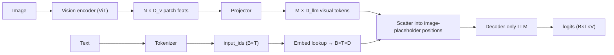
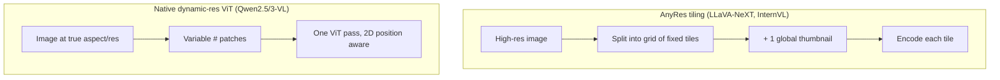

# VLM Implementation Details

<div class="tag-row"><span class="tag">image tokens</span><span class="tag">chat templates</span><span class="tag">AnyRes tiling</span><span class="tag">dynamic resolution</span><span class="tag">token budget</span><span class="tag">SFT masking</span><span class="tag">debugging</span></div>

> [!TIP] 이 장이 면접에서 이기는 이유
> "LLaVA는 CLIP을 LLM에 붙인 것"은 누구나 말할 수 있습니다. *실제로 VLM을 학습해봤다*는 신호는 배관 작업에 대한 유창함입니다: 하나의 `<image>` token이 어떻게 N개의 visual embedding이 되는가, AnyRes tiling이 token count를 어떻게 바꾸는가, 어떤 token에 loss가 걸리는가, 어떤 버그가 어떤 증상을 만드는가. 이 장이 바로 그 배관입니다.

## What a VLM forward pass actually does



**핵심 아이디어:** visual token 블록이 image-placeholder 위치에서 text token sequence *중간에* 이어붙여집니다. LLM 입장에서 image는 그저 하나의 token stream의 일부입니다(early / projector fusion).

## 1 · Special tokens & the image placeholder

| Kind | Examples | Role |
| --- | --- | --- |
| Normal subword | `▁hello`, `ing` | 본문 text |
| Control | `<s>`, `</s>`, `<pad>`, `<unk>` | bos/eos/pad |
| Chat | `<\|im_start\|>`, `<\|im_end\|>`, `[INST]` | 대화 형식 (모델별) |
| **Vision** | `<image>`, `<\|image_pad\|>`, `<\|vision_start\|>` | "여기에 visual embedding 삽입" |
| Reserved | `<\|reserved_special_token_0\|>` | 향후 확장 |

> [!WARNING] The two-places rule
> Special token은 tokenizer config **와** model embedding matrix **둘 다에** 존재해야 합니다. 하나를 추가하면 `resize_token_embeddings(len(tokenizer))`를 호출하세요. 안 그러면 매 forward pass가 쓰레기를 index합니다. 새 행은 보통 loss 급증을 피하려고 random이 아니라 *평균* embedding으로 init합니다.

### One `<image>`, many embeddings

하나의 image는 $N$개 ViT patch → projector 이후 $M$개 visual token이 됩니다. 그래서 text sequence는 하나가 아니라 $M$개의 *슬롯*이 필요합니다. 두 가지 구현 스타일:

- **Pre-expand:** processor가 tokenize 전에 하나의 `<image>`를 $M$개의 `<|image_pad|>` id 복사본으로 대체하여 슬롯 개수가 `input_ids`에 명시됩니다.
- **Scatter:** 단일 placeholder id를 유지하고 model의 `forward` 안 그 위치에 $M$개의 hidden state를 주입합니다.

```python
def merge_embeddings(input_ids, text_embeds, vision_embeds, image_token_id):
    # text_embeds: (B,T,D) with placeholder rows to be overwritten
    # vision_embeds: (total_visual_tokens, D)
    mask = (input_ids == image_token_id)          # (B,T) bool
    assert mask.sum() == vision_embeds.shape[0]    # slots == visual tokens
    text_embeds[mask] = vision_embeds.to(text_embeds.dtype)
    return text_embeds                             # → LLM
```

> [!DANGER] The #1 VLM crash
> `mask.sum() != vision_embeds.shape[0]`. text 안의 image placeholder 개수는 그 image에 대해 encoder+projector가 만든 visual token 개수와 정확히 같아야 합니다 — 그리고 **dynamic resolution**에서는 그 개수가 image마다 바뀝니다. 여기서 off-by-one이 가장 흔한 학습/추론 크래시입니다.

## 2 · Chat templates

string→token 계약은 `tokenizer.apply_chat_template`가 실행하는 Jinja2 template입니다. role, image placeholder 위치, generation prompt를 인코딩합니다.

```python
messages = [
  {"role": "user", "content": [
     {"type": "image", "image": "cat.jpg"},
     {"type": "text",  "text": "What animal is this?"}]},
]
prompt = processor.apply_chat_template(messages, tokenize=False,
                                       add_generation_prompt=True)
```

> [!DANGER] Template mismatch = silent quality collapse
> Llama의 `[INST]…[/INST]`로 학습했는데 ChatML `<|im_start|>`로 추론하면, 모델은 유창한 쓰레기를 만듭니다 — 에러 없이 그냥 틀립니다. **학습 시점과 추론 시점의 template은 byte 단위로 동일해야 합니다.** Fine-tune이 "학습에서는 되는데 데모에서는 나쁠" 때 가장 먼저 확인할 것입니다.

## 3 · Dynamic resolution & AnyRes tiling

고정 224×224 square crop은 text와 얇은 구조를 파괴합니다. 지배적인 두 해법, 그리고 둘 사이의 trade-off는 2026년 단골 질문입니다.



<div class="proscons"><div><div class="pros-t">AnyRes tiling</div>

- 어떤 *fixed-resolution* pretrained encoder(CLIP/SigLIP)와도 작동.
- Global thumbnail이 레이아웃 보존; tile이 디테일 보존.
- Token count = tile 수 × tile당 token — grid로 제어 가능.
- Tile seam이 객체/text를 쪼갤 수 있음; thumbnail이 정보 중복.
</div><div><div class="cons-t">Native dynamic-resolution ViT</div>

- 실제 aspect ratio를 처리 → crop 왜곡 없음, OCR/document에 최적.
- 가변 token count는 2D-aware position encoding(mRoPE) 필요.
- Native resolution용으로 *학습된* encoder 필요 (SigLIP 2, Qwen ViT).
- 거대한 image에서 token count 폭발 가능 → 예산 상한 필요.
</div></div>

**[VERIFIED] anchor:** *Qwen2.5-VL*(arXiv 2502.13923)는 window attention으로 native dynamic-resolution ViT를 처음부터 학습하고 absolute-time mRoPE를 사용합니다; *LLaVA-NeXT / InternVL*은 fixed encoder 위에 AnyRes tiling을 사용합니다. 밀집 OCR/document에는 native-resolution이 대체로 이기고; tiling은 기성 encoder를 재사용할 때의 실용적 경로입니다.

## 4 · The visual token budget

Visual token이 sequence와 compute/memory 비용을 지배합니다. patch-14 ViT에 대한 대략적 산수:

$$N_{\text{patches}} = \frac{H}{14}\cdot\frac{W}{14}, \qquad T_{\text{seq}} = \underbrace{\sum_{\text{images}} M_i}_{\text{visual}} + \; T_{\text{text}}$$

1024×1024 image는 patch-14에서 압축 전에 *image당* ~5.3k patch입니다. High-res + multi-image + video가 OOM 나는 방식입니다. 당길 레버:

| Lever | Effect |
| --- | --- |
| Pixel-shuffle / patch-merge (÷4) | 4배 적은 token, 작은 품질 비용 |
| Q-Former / resampler → fixed M | resolution과 무관한 hard cap |
| Tile-count cap (AnyRes `max_tiles`) | 최악 token count 한정 |
| Token pruning / merging | 중복 배경 token 제거 |
| Lower FPS / frame cap (video) | [Video-Language Models](#/vlm/video) 참고 |

## 5 · SFT loss masking

**assistant** token만 loss를 받습니다. 나머지 전부 — system, user, image placeholder, pad — 는 `-100`(cross-entropy가 무시)입니다.

```python
labels = input_ids.clone()
labels[input_ids == pad_token_id]   = -100   # padding
labels[input_ids == image_token_id] = -100   # visual slots (no text target)
labels[:, :assistant_start]         = -100   # system + user turn
# loss only on the assistant response tokens
```

**왜:** 여러분은 $P(\text{response}\mid\text{prompt}, \text{image})$를 모델링합니다. prompt와 image는 *조건*이지 예측 대상이 아닙니다. image token에 대한 loss는 무의미하고(vocabulary에 없음), user turn에 대한 loss는 모델에게 답하는 대신 질문하도록 가르칩니다.

## 6 · Freezing schedules

| Stage | Vision encoder | Projector | LLM | Purpose |
| --- | --- | --- | --- | --- |
| 1 · Align | frozen | **train** | frozen | projector에게 LLM 말하기 가르침 |
| 2 · Instruction SFT | frozen / late-unfreeze | train | **train (full or LoRA)** | visual instruction 따르기 |
| 3 · (optional) unfreeze ViT | partial | train | train | 상한 쥐어짜기 |

**layer-wise learning rate**를 쓰세요: projector > LoRA/LLM > vision encoder. Encoder는 늦게 그리고 부드럽게 unfreeze하거나 아예 안 하세요 — 초기 full unfreeze는 불안정하고 잊습니다. Freezing 논의는 [Pretraining](#/vlm/pretraining)을 참고하세요.

```python
from peft import LoraConfig, get_peft_model
cfg = LoraConfig(r=64, lora_alpha=128, lora_dropout=0.05, task_type="CAUSAL_LM",
                 target_modules=["q_proj","k_proj","v_proj","o_proj",
                                 "gate_proj","up_proj","down_proj"])
model = get_peft_model(model, cfg)   # QLoRA: load base in 4-bit (bitsandbytes)
```

## 7 · Common training bugs

| Symptom | Likely cause |
| --- | --- |
| merge에서 `shape mismatch` | image placeholder 수 ≠ visual token 수 (dynamic-res!) |
| Loss가 안 떨어짐 | loss가 user/image token으로 새어나감; 엉뚱한 모듈 freeze; LR 너무 낮음 |
| 유창하지만 틀린 출력 | chat template mismatch 학습↔추론 |
| special token 누락/중복 | `resize_token_embeddings` 잊음; tokenizer/model 불일치 |
| OOM | visual token 예산: resolution, tile, frame, batch, grad-checkpointing 없음 |
| 학습은 좋은데 데모는 나쁨 | `model.eval()` / `use_cache` / template / image 전처리(resize+normalize) 불일치 |
| 언어 능력 퇴행 | text-data mixing 없이 full-FT LLM (catastrophic forgetting) |
| 비영어 text 깨짐 | tokenizer가 그 문자를 커버 못함; subword split 확인 |

### Shape trace (memorize this)

```
pixel_values:    (B, 3, H, W)          # or packed patches for native-res
vision hidden:   (B, N, D_v)           # N = f(H, W, patch)
after projector: (M, D_llm)            # M ≤ N (compression)
input_ids:       (B, T)                # T includes M image-placeholder slots
merged embeds:   (B, T, D_llm)
logits:          (B, T, V)
```

## Q&A

<details class="qa"><summary>You add a `<region>` special token for grounding. Walk me through every place you must touch.</summary>
<div class="qa-body">

**Short:** tokenizer(token 추가 + config 갱신), model embedding matrix(`resize_token_embeddings`, 새 행을 평균으로 init), chat template(올바른 위치에 emit), data pipeline(target에 생성), loss mask(target 여부 결정).

**Deep:** (1) `tokenizer.add_special_tokens({...})`로 안정적 id에 매핑; (2) `model.resize_token_embeddings(len(tokenizer))`와 그에 맞춘 LM head tie/untie; (3) 새 embedding + LM-head 행 init(기존 행 평균이 loss 급증 방지); (4) token이 고정 위치를 가지면 Jinja template 갱신; (5) 모델이 생성해야 하면 collator가 그것을 `-100`이 아니라 *target*으로 표시하게 함; (6) `skip_special_tokens=False`로 decode round-trip 확인. 하나라도 빠지면 조용히 학습이 망가집니다. 이것이 정확히 coordinate/region token의 메커니즘입니다 — [Grounding & Region Reasoning](#/vlm/grounding) 참고.
</div></details>

<details class="qa"><summary>Native dynamic-resolution ViT vs AnyRes tiling — which for a document-OCR VLM?</summary>
<div class="qa-body">

**Short:** Native dynamic resolution — 그것을 위해 학습된 encoder를 감당할 수 있다면. Document는 실제 aspect ratio에 미세한 text가 있습니다; tiling은 줄을 쪼개는 seam을 만들고 token을 낭비하는 thumbnail을 만듭니다.

**Deep:** Tiling은 fixed-res encoder를 재사용(실용적, encoder-agnostic)하지만 tile별 feature를 조화시키고 seam을 가로지르는 객체/text를 처리해야 합니다; 또한 중복 global thumbnail 비용도 지불합니다. Native-res ViT(Qwen2.5/3-VL)는 전체 페이지를 실제 aspect ratio로 보므로 얇은 획과 작은 폰트가 살아남고, 2D-aware mRoPE가 레이아웃을 유지합니다. 비용은 맞춤 encoder와 가변적이고 잠재적으로 큰 token count입니다 — 그래서 pixel-shuffle merging이나 max-pixel 예산으로 상한을 둡니다. OCR/chart/document에는 native 경로가 2026년 기본입니다.
</div></details>

**Follow-ups**

- "왜 loss에서 image token을 mask하나?" (vocab에 없음; 예측할 게 없음.)
- "image resolution을 두 배로 하면 token count가 어떻게 변하나?" (고정 patch size에서 ~4배 patch — linear resolution에 대해 quadratic.)
- "학습이 `use_cache=False`를 쓴다 — 왜, 그리고 추론에서 무엇이 바뀌나?" (학습에서 memory 절약/grad-checkpointing 허용을 위해 KV cache off; 추론에서는 O(T) decoding을 위해 on.)
- "Fine-tune이 VQA는 훌륭한데 이제 평문 text를 못 한다 — 진단하라." (Catastrophic forgetting; text-only 데이터 추가, LR 낮춤, LoRA 사용.)

## Cheat-sheet

| Item | Must-know |
| --- | --- |
| Image → tokens | 1개 `<image>`가 M개 visual token으로 확장; M은 placeholder 수와 같아야 함 |
| resize_token_embeddings | special token 추가 후 필수; 새 행을 평균으로 init |
| Chat template | 학습 == 추론, byte 동일, 아니면 silent quality collapse |
| AnyRes vs native-res | tiling = fixed encoder 재사용; native = true aspect, OCR 최적, mRoPE 필요 |
| Token budget | patch ≈ (H/p)(W/p); high-res/video OOM; 압축하거나 상한 |
| SFT mask | assistant token만 loss; system/user/image/pad = -100 |
| Freeze schedule | align (projector) → SFT (LLM/LoRA) → late ViT unfreeze; layer-wise LR |
| Debug first | shape mismatch → dynamic-res count; garbage → template; OOM → token budget |

**Related:** [Vision-Language Pretraining](#/vlm/pretraining) · [Instruction Tuning & Decoding](#/vlm/instruction-tuning) · [Grounding & Region Reasoning](#/vlm/grounding) · [Video-Language Models](#/vlm/video) · [Attention From Scratch](#/ml-coding/attention)
