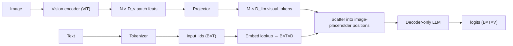
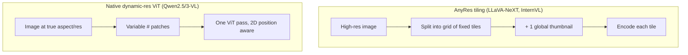

# VLM Implementation Details

<div class="tag-row"><span class="tag">image tokens</span><span class="tag">chat templates</span><span class="tag">AnyRes tiling</span><span class="tag">dynamic resolution</span><span class="tag">token budget</span><span class="tag">SFT masking</span><span class="tag">debugging</span></div>

> [!NOTE] Goal of this chapter
> If [VLM 101](#/vlm/vlm-101) supplied the picture of how an image becomes tokens, this chapter covers the <strong>plumbing you touch when actually running it</strong>: how one `<image>` placeholder expands into multiple visual embeddings inserted among text tokens, and how chat templates, resolution, token budgets, and loss masks work. The emphasis is on where implementations break, not on another conceptual overview.

## What & why

"LLaVA glues CLIP to an LLM" is easy to say. But **actually training or running inference** requires a substantial layer of plumbing in between. An image is not text: it must become **visual tokens** the model can consume, inserted in the text sequence with the **exact slot count**. A mismatch of even one slot can crash training immediately.

Keep one picture in mind: **visual tokens are simply mixed into the text-token sequence.** To the LLM, an image is part of one token stream.

<figure>
<svg viewBox="0 0 660 190" xmlns="http://www.w3.org/2000/svg" font-family="Inter, sans-serif" font-size="12">
  <!-- image -->
  <text x="52" y="26" text-anchor="middle" fill="#98a3b2">Image</text>
  <g stroke="#0ea5e9" stroke-width="1.2" fill="none">
    <rect x="24" y="34" width="56" height="56" rx="4"/>
    <line x1="43" y1="34" x2="43" y2="90"/><line x1="61" y1="34" x2="61" y2="90"/>
    <line x1="24" y1="52" x2="80" y2="52"/><line x1="24" y1="72" x2="80" y2="72"/>
  </g>
  <text x="52" y="106" text-anchor="middle" fill="#98a3b2" font-size="10">→ patches</text>
  <path d="M84 62 H120" stroke="#98a3b2" stroke-width="1.4" marker-end="url(#a)"/>
  <rect x="122" y="46" width="70" height="32" rx="7" fill="#6366f1"/>
  <text x="157" y="66" text-anchor="middle" fill="#fff" font-size="10">Encoder+proj.</text>
  <path d="M192 62 H224" stroke="#98a3b2" stroke-width="1.4" marker-end="url(#a)"/>
  <!-- token stream -->
  <text x="440" y="26" text-anchor="middle" fill="#98a3b2">Token sequence entering the LLM</text>
  <g font-size="10" text-anchor="middle">
    <rect x="230" y="46" width="40" height="30" rx="4" fill="none" stroke="#98a3b2"/><text x="250" y="65" fill="currentColor">This</text>
    <rect x="272" y="46" width="40" height="30" rx="4" fill="none" stroke="#98a3b2"/><text x="292" y="65" fill="currentColor">photo</text>
    <rect x="316" y="46" width="30" height="30" rx="4" fill="#e0533f"/><text x="331" y="65" fill="#fff">🖼</text>
    <rect x="348" y="46" width="30" height="30" rx="4" fill="#e0533f"/><text x="363" y="65" fill="#fff">🖼</text>
    <rect x="380" y="46" width="30" height="30" rx="4" fill="#e0533f"/><text x="395" y="65" fill="#fff">🖼</text>
    <rect x="412" y="46" width="30" height="30" rx="4" fill="#e0533f"/><text x="427" y="65" fill="#fff">🖼</text>
    <rect x="444" y="46" width="44" height="30" rx="4" fill="none" stroke="#98a3b2"/><text x="466" y="65" fill="currentColor">what?</text>
  </g>
  <text x="360" y="100" text-anchor="middle" fill="#e0533f" font-size="10">Red = M visual tokens (one &lt;image&gt; expands to M slots)</text>
  <path d="M224 62 C 260 62, 280 62, 316 62" stroke="#0ea5e9" stroke-width="1.4" fill="none" marker-end="url(#b)"/>
  <text x="330" y="150" text-anchor="middle" fill="#98a3b2">Text (gray) + visual tokens (red) → one LLM input sequence (projector fusion)</text>
  <defs>
    <marker id="a" markerWidth="8" markerHeight="8" refX="6" refY="3" orient="auto"><path d="M0 0 L6 3 L0 6" fill="#98a3b2"/></marker>
    <marker id="b" markerWidth="8" markerHeight="8" refX="6" refY="3" orient="auto"><path d="M0 0 L6 3 L0 6" fill="#0ea5e9"/></marker>
  </defs>
</svg>
<figcaption>Image → patches → encoder/projector → M visual tokens. Those M slots are inserted exactly at the text's <code>&lt;image&gt;</code> placeholder. "Exactly M" is this chapter's central obsession.</figcaption>
</figure>

> [!TIP] One interview line
> Anyone can say "LLaVA glues CLIP to an LLM." The signal that you have *actually trained a VLM* is fluency in the plumbing: how one `<image>` token becomes N visual embeddings, how AnyRes tiling changes the token count, which tokens get a loss, and which bug produces which symptom. This chapter is that plumbing.

## What a VLM forward pass actually does



This is the textual version of the figure above. The **encoder** turns the image into patch features, the **projector**—usually a small MLP—maps them into the LLM's dimension, and the resulting M visual tokens are **scattered** into placeholder positions in the text-embedding sequence.

## 1 · Special tokens & the image placeholder

| Kind | Examples | Role |
| --- | --- | --- |
| Normal subword | `▁hello`, `ing` | body text |
| Control | `<s>`, `</s>`, `<pad>`, `<unk>` | bos/eos/pad |
| Chat | `<\|im_start\|>`, `<\|im_end\|>`, `[INST]` | conversation format (model-specific) |
| **Vision** | `<image>`, `<\|image_pad\|>`, `<\|vision_start\|>` | "insert visual embeddings here" |
| Reserved | `<\|reserved_special_token_0\|>` | future expansion |

> [!WARNING] The two-places rule
> If the architecture receives a special token as an actual `input_id`, keep the tokenizer and embedding/LM-head sizes aligned; after `resize_token_embeddings`, verify weight tying and checkpoint saving. By contrast, an implementation whose processor removes or expands the placeholder before LM input may use a separate virtual token. Mean initialization for a new row is one option, not a universal optimum; encode→decode and ID-range tests matter more.

### One `<image>`, many embeddings

A single image becomes $N$ ViT patches → $M$ visual tokens after the projector. So the text sequence needs $M$ *slots*, not one. Two implementation styles:

- **Pre-expand:** the processor replaces one `<image>` with $M$ copies of an `<|image_pad|>` id before tokenizing, so slot count is explicit in `input_ids`.
- **Scatter:** keep a single placeholder id and inject the $M$ hidden states at that position inside the model's `forward`.

```python
def merge_embeddings(input_ids, text_embeds, vision_embeds, image_token_id):
    # text_embeds: (B,T,D) with placeholder rows to be overwritten
    # vision_embeds: (total_visual_tokens, D)
    mask = (input_ids == image_token_id)          # (B,T) bool
    assert mask.sum() == vision_embeds.shape[0]    # slots == visual tokens
    text_embeds[mask] = vision_embeds.to(text_embeds.dtype)
    return text_embeds                             # → LLM
```

> [!DANGER] The #1 VLM crash
> `mask.sum() != vision_embeds.shape[0]`. The number of image placeholders in the text must exactly equal the number of visual tokens the encoder+projector produced for that image — and with **dynamic resolution** that count changes per image. Off-by-one here is the most common training/inference crash.

## 2 · Chat templates

The string→token contract is a Jinja2 template run by `tokenizer.apply_chat_template`. It encodes roles, where the image placeholder goes, and the generation prompt.

```python
messages = [
  {"role": "user", "content": [
     {"type": "image", "image": "cat.jpg"},
     {"type": "text",  "text": "What animal is this?"}]},
]
prompt = processor.apply_chat_template(messages, tokenize=False,
                                       add_generation_prompt=True)
```

> [!DANGER] Template mismatch = silent quality collapse
> Training and inference must share the **token sequence and semantic contract** created by roles, special tokens, image position, and generation prompt. Different source bytes may tokenize identically, while one whitespace character can change the tokens; the right standard is pinned processor/tokenizer versions and a token-ID round-trip test, not byte identity alone.

## 3 · Dynamic resolution & AnyRes tiling

Fixed 224×224 square crops destroy text and thin structure. Two dominant fixes, and the trade-off between them is a favorite 2026 question.



<div class="proscons"><div><div class="pros-t">AnyRes tiling</div>

- Works with any *fixed-resolution* pretrained encoder (CLIP/SigLIP).
- Global thumbnail preserves layout; tiles preserve detail.
- Token count = tiles × tokens/tile — controllable via grid.
- Tile seams can split objects/text; thumbnail duplicates info.
</div><div><div class="cons-t">Native dynamic-resolution ViT</div>

- Processes the true aspect ratio → no crop distortion, best for OCR/docs.
- Variable token count needs 2D-aware position encoding (mRoPE).
- Requires an encoder *trained* for native resolution (SigLIP 2, Qwen ViT).
- Token count can explode on huge images → needs a budget cap.
</div></div>

**Concrete example:** [Qwen2.5-VL](https://arxiv.org/abs/2502.13923) uses dynamic resolution, window attention, multimodal RoPE, and absolute-time alignment. The LLaVA-NeXT and InternVL families use tiling. `Native` does not necessarily mean the entire model was trained from random initialization, and OCR/document superiority should be compared at matched resolution budgets, encoders, and training data.

## 3½ · Extreme inputs: tiny objects, 1:100 aspect ratios, giant images

For example, 12000×800 is **15:1**; a 1:100 panorama is a separate, still more extreme case. A fixed 224² resize can shrink small objects to a few pixels and distort the aspect ratio. Resizing a 4000-pixel width to 224 turns a 40-pixel object into about 2.24 pixels. A sub-patch signal may still contribute to the patch embedding, so it is too strong to call it "information-theoretically gone," but resampling aliasing and background mixing make detection or OCR extremely difficult.

**What actually works (escalating toolkit):**
- **Native / dynamic resolution** (Qwen2.5/3-VL): feed the true aspect ratio, let patch count vary — no squashing. First thing to reach for.
- **Tiling / AnyRes** (LLaVA-NeXT, InternVL): split the big image into fixed tiles (+ a global thumbnail); each tile encodes at full detail. Bounds the encoder but multiplies tokens.
- **Coarse-to-fine (retrieve-then-zoom):** a cheap pass on the downsampled image to *localize* the region of interest, then re-crop that region at **high/native resolution** and re-run. Like a person squinting then leaning in — and how visual agents use a `crop`/`zoom` tool (see [Visual Reasoning Agents](#/vlm/visual-agents)).
- **Aspect-ratio bucketing:** group images into a few AR buckets and pad within a bucket instead of forcing a square — preserves geometry while keeping batches regular.
- **Sliding-window / patch inference** for the 1:100 panorama or gigapixel image: run over overlapping windows and stitch (classic in medical / satellite / document strips).
- **Token-budget control:** all of the above inflate tokens, so pair with pixel-shuffle merging / a max-pixel cap (§4).

> [!QUESTION] MLSD framing — "How would you handle huge / extreme-aspect / small-object images?"
> Answer in this order: **(1) name why fixed resize fails** (small object → sub-patch → gone; extreme AR → distortion). **(2) State the requirement** — smallest object (in px) and largest image, plus latency budget → that sets the **minimum resolution you must preserve**. **(3) Pick the mechanism**: native-res if the encoder supports it, else AnyRes tiling; add **coarse-to-fine** when objects are tiny and sparse (don't pay full-res everywhere). **(4) Control the token budget** (tile cap, pixel-shuffle, ROI-only high-res). **(5) Evaluate on a hard slice** — a small-object / extreme-AR set with **size-stratified** metrics, because average accuracy hides exactly these failures. The senior signal is tying the resolution decision to the *smallest feature you must not lose*, not "just use a bigger encoder."

## 4 · The visual token budget

Visual tokens dominate the sequence and the compute/memory bill. Rough arithmetic for a patch-14 ViT:

$$N_{\text{patches}} = \frac{H}{14}\cdot\frac{W}{14}, \qquad T_{\text{seq}} = \underbrace{\sum_{\text{images}} M_i}_{\text{visual}} + \; T_{\text{text}}$$

A 1024×1024 image at patch-14 is ~5.3k patches *per image* before any compression. High-res + multi-image + video is how you OOM. Levers to pull:

| Lever | Effect |
| --- | --- |
| Pixel-shuffle / patch-merge (÷4) | 4× fewer tokens, small quality cost |
| Q-Former / resampler → fixed M | hard cap regardless of resolution |
| Tile-count cap (AnyRes `max_tiles`) | bounds worst-case token count |
| Token pruning / merging | drop redundant background tokens |
| Lower FPS / frame cap (video) | see [Video-Language Models](#/vlm/video) |

## 5 · SFT loss masking

In chat SFT, it is common to apply loss only to **assistant-response** tokens and mask system, user, image-placeholder, and padding tokens with `-100`. Not every pretraining or SFT objective follows this rule, so determine the data objective first.

```python
labels = input_ids.clone()
labels[attention_mask == 0]         = -100   # padding
labels[input_ids == image_token_id] = -100   # visual slots (pre-expanded style)
labels[~assistant_mask]             = -100   # (B,T), template boundary per sample/turn
# Do not use one scalar assistant_start for a multi-turn, variable-length batch.
```

**Why:** you are modeling $P(\text{response}\mid\text{prompt}, \text{image})$. The prompt and image are *conditioning*, not prediction targets. Loss on the image tokens is meaningless (they aren't in the vocabulary), and loss on the user turn teaches the model to ask questions instead of answer them.

## 6 · Freezing schedules

| Stage | Vision encoder | Projector | LLM | Purpose |
| --- | --- | --- | --- | --- |
| 1 · Align | frozen | **train** | frozen | teach projector to speak LLM |
| 2 · Instruction SFT | frozen / late-unfreeze | train | **train (full or LoRA)** | follow visual instructions |
| 3 · (optional) unfreeze ViT | partial | train | train | squeeze the ceiling |

Use **layer-wise learning rates**: projector > LoRA/LLM > vision encoder. Unfreeze the encoder late and gently, if at all — early full unfreeze is unstable and forgets. See the freezing discussion in [Pretraining](#/vlm/pretraining).

```python
from peft import LoraConfig, get_peft_model
cfg = LoraConfig(r=64, lora_alpha=128, lora_dropout=0.05, task_type="CAUSAL_LM",
                 target_modules=["q_proj","k_proj","v_proj","o_proj",
                                 "gate_proj","up_proj","down_proj"])
model = get_peft_model(model, cfg)   # QLoRA: load base in 4-bit (bitsandbytes)
```

## 7 · Common training bugs

| Symptom | Likely cause |
| --- | --- |
| `shape mismatch` on merge | # image placeholders ≠ # visual tokens (dynamic-res!) |
| Loss won't drop | loss leaking onto user/image tokens; frozen the wrong module; LR too low |
| Fluent but wrong output | chat template mismatch train↔infer |
| Missing/duplicated special token | forgot `resize_token_embeddings`; tokenizer/model out of sync |
| OOM | visual token budget: resolution, tiles, frames, batch, no grad-checkpointing |
| Good in train, bad in demo | `model.eval()` / `use_cache` / template / image preprocessing (resize+normalize) drift |
| Language ability regressed | full-FT LLM without text-data mixing (catastrophic forgetting) |
| Non-English quality/cost degrades | check `[UNK]`, byte fallback, excessive subword fragmentation, and normalization |

### Shape trace (memorize this)

```
pixel_values:    (B, 3, H, W)          # or packed patches for native-res
vision hidden:   (B, N, D_v)           # N = f(H, W, patch)
after projector: (B, M, D_llm)         # or packed (sum_i M_i, D); M may vary by image
input_ids:       (B, T)                # pre-expand has M slots; virtual/scatter may keep one marker
merged embeds:   (B, T, D_llm)
logits:          (B, T, V)
```

## Q&A

<details class="qa"><summary>You add a `<region>` special token for grounding. Walk me through every place you must touch.</summary>
<div class="qa-body">

**Short:** tokenizer (add token + update config), model embedding matrix (`resize_token_embeddings`, init new row to the mean), chat template (emit it in the right place), data pipeline (produce it in targets), and loss mask (decide if it's a target).

**Deep:** (1) `tokenizer.add_special_tokens({...})` so it maps to a stable id; (2) `model.resize_token_embeddings(len(tokenizer))` and tie/untie the LM head accordingly; (3) init the new embedding + LM-head row (mean of existing rows avoids a loss spike); (4) update the Jinja template if the token has a fixed position; (5) ensure the collator marks it as a *target* (not `-100`) if the model must generate it; (6) verify decode round-trips it with `skip_special_tokens=False`. Missing any one silently corrupts training. This is exactly the mechanism behind coordinate/region tokens — see [Grounding & Region Reasoning](#/vlm/grounding).
</div></details>

<details class="qa"><summary>Native dynamic-resolution ViT vs AnyRes tiling — which for a document-OCR VLM?</summary>
<div class="qa-body">

**Short:** Native dynamic resolution, if you can afford an encoder trained for it. Documents have fine text at true aspect ratios; tiling introduces seams that split lines and a thumbnail that wastes tokens.

**Deep:** Tiling reuses a fixed-resolution encoder but introduces seams, a redundant thumbnail, and tile-ordering issues. A dynamic-resolution ViT can preserve aspect ratio and use a 2D positional method such as mRoPE, but layout preservation is not automatic. Compare OCR accuracy, small-text and long-document slices, and latency under the same token cap.
</div></details>

**Follow-ups**

- "Why mask image tokens in the loss?" (Not in the vocab; nothing to predict.)
- "How does the token count change if I double image resolution?" (~4× patches at fixed patch size — quadratic in linear resolution.)
- "Training uses `use_cache=False` — why, and what changes at inference?" (Training processes the full sequence in parallel and does not need the cache; it can conflict with gradient checkpointing. At inference, caching avoids recomputing past hidden/KV states, but each new token still attends linearly over the past and the cache consumes memory.)
- "Your fine-tune got great VQA but the model can't do plain text anymore — diagnose." (Catastrophic forgetting; add text-only data, reduce LR, use LoRA.)

## Cheat-sheet

| Item | Must-know |
| --- | --- |
| Image → tokens | pre-expand requires M slots to match M visual tokens; virtual/prefix/packed implementations have different contracts |
| resize_token_embeddings | required after adding any special token; init new row to mean |
| Chat template | match the train/inference token, role, and image contract and processor version |
| AnyRes vs dynamic-res | tiling reuses an encoder; dynamic can preserve aspect ratio and needs a positional method, token cap, and task evaluation |
| Token budget | patches ≈ (H/p)(W/p); high-res/video OOMs; compress or cap |
| SFT mask | loss on assistant tokens only; system/user/image/pad = -100 |
| Freeze schedule | align (projector) → SFT (LLM/LoRA) → late ViT unfreeze; layer-wise LR |
| Debug first | shape mismatch → dynamic-res count; garbage → template; OOM → token budget |

**Next:** [VLM 101](#/vlm/vlm-101) · [Vision-Language Pretraining](#/vlm/pretraining) · [Instruction Tuning & Decoding](#/vlm/instruction-tuning) · [Grounding & Region Reasoning](#/vlm/grounding) · [Video-Language Models](#/vlm/video)
