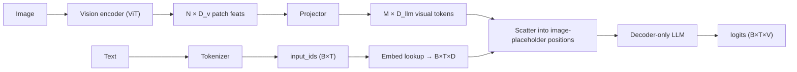
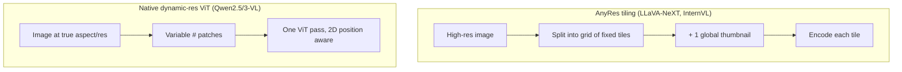

# VLM Implementation Details

<div class="tag-row"><span class="tag">image tokens</span><span class="tag">chat templates</span><span class="tag">AnyRes tiling</span><span class="tag">dynamic resolution</span><span class="tag">token budget</span><span class="tag">SFT masking</span><span class="tag">debugging</span></div>

> [!TIP] Why this chapter wins interviews
> Anyone can say "LLaVA glues CLIP to an LLM." The signal that you have *actually trained a VLM* is fluency in the plumbing: how one `<image>` token becomes N visual embeddings, how AnyRes tiling changes the token count, which tokens get a loss, and which bug produces which symptom. This chapter is that plumbing.

## What a VLM forward pass actually does



**The core idea:** a block of visual tokens is spliced *into the middle* of the text token sequence at the image-placeholder positions. To the LLM, the image is just part of one token stream (early / projector fusion).

## 1 · Special tokens & the image placeholder

| Kind | Examples | Role |
| --- | --- | --- |
| Normal subword | `▁hello`, `ing` | body text |
| Control | `<s>`, `</s>`, `<pad>`, `<unk>` | bos/eos/pad |
| Chat | `<\|im_start\|>`, `<\|im_end\|>`, `[INST]` | conversation format (model-specific) |
| **Vision** | `<image>`, `<\|image_pad\|>`, `<\|vision_start\|>` | "insert visual embeddings here" |
| Reserved | `<\|reserved_special_token_0\|>` | future expansion |

> [!WARNING] The two-places rule
> A special token must exist in **both** the tokenizer config **and** the model embedding matrix. If you add one, call `resize_token_embeddings(len(tokenizer))` or every forward pass indexes garbage. New rows are typically init'd to the *mean* embedding, not random, to avoid a loss spike.

### One `<image>`, many embeddings

A single image becomes $N$ ViT patches → $M$ visual tokens after the projector. So the text sequence needs $M$ *slots*, not one. Two implementation styles:

- **Pre-expand:** the processor replaces one `<image>` with $M$ copies of an `<|image_pad|>` id before tokenizing, so slot count is explicit in `input_ids`.
- **Scatter:** keep a single placeholder id and inject the $M$ hidden states at that position inside the model's `forward`.

```python
def merge_embeddings(input_ids, text_embeds, vision_embeds, image_token_id):
    # text_embeds: (B,T,D) with placeholder rows to be overwritten
    # vision_embeds: (total_visual_tokens, D)
    mask = (input_ids == image_token_id)          # (B,T) bool
    assert mask.sum() == vision_embeds.shape[0]    # slots == visual tokens
    text_embeds[mask] = vision_embeds.to(text_embeds.dtype)
    return text_embeds                             # → LLM
```

> [!DANGER] The #1 VLM crash
> `mask.sum() != vision_embeds.shape[0]`. The number of image placeholders in the text must exactly equal the number of visual tokens the encoder+projector produced for that image — and with **dynamic resolution** that count changes per image. Off-by-one here is the most common training/inference crash.

## 2 · Chat templates

The string→token contract is a Jinja2 template run by `tokenizer.apply_chat_template`. It encodes roles, where the image placeholder goes, and the generation prompt.

```python
messages = [
  {"role": "user", "content": [
     {"type": "image", "image": "cat.jpg"},
     {"type": "text",  "text": "What animal is this?"}]},
]
prompt = processor.apply_chat_template(messages, tokenize=False,
                                       add_generation_prompt=True)
```

> [!DANGER] Template mismatch = silent quality collapse
> If you train with Llama's `[INST]…[/INST]` but infer with ChatML `<|im_start|>`, the model produces fluent garbage — no error, just wrong. **Train-time and inference-time templates must be byte-identical.** This is the first thing to check when a fine-tune "works in training but is bad in the demo."

## 3 · Dynamic resolution & AnyRes tiling

Fixed 224×224 square crops destroy text and thin structure. Two dominant fixes, and the trade-off between them is a favorite 2026 question.



<div class="proscons"><div><div class="pros-t">AnyRes tiling</div>

- Works with any *fixed-resolution* pretrained encoder (CLIP/SigLIP).
- Global thumbnail preserves layout; tiles preserve detail.
- Token count = tiles × tokens/tile — controllable via grid.
- Tile seams can split objects/text; thumbnail duplicates info.
</div><div><div class="cons-t">Native dynamic-resolution ViT</div>

- Processes the true aspect ratio → no crop distortion, best for OCR/docs.
- Variable token count needs 2D-aware position encoding (mRoPE).
- Requires an encoder *trained* for native resolution (SigLIP 2, Qwen ViT).
- Token count can explode on huge images → needs a budget cap.
</div></div>

**[VERIFIED] anchor:** *Qwen2.5-VL* (arXiv 2502.13923) trains a native dynamic-resolution ViT from scratch with window attention and uses absolute-time mRoPE; *LLaVA-NeXT / InternVL* use AnyRes tiling on a fixed encoder. For dense OCR/documents, native-resolution generally wins; tiling is the pragmatic path when reusing an off-the-shelf encoder.

## 4 · The visual token budget

Visual tokens dominate the sequence and the compute/memory bill. Rough arithmetic for a patch-14 ViT:

$$N_{\text{patches}} = \frac{H}{14}\cdot\frac{W}{14}, \qquad T_{\text{seq}} = \underbrace{\sum_{\text{images}} M_i}_{\text{visual}} + \; T_{\text{text}}$$

A 1024×1024 image at patch-14 is ~5.3k patches *per image* before any compression. High-res + multi-image + video is how you OOM. Levers to pull:

| Lever | Effect |
| --- | --- |
| Pixel-shuffle / patch-merge (÷4) | 4× fewer tokens, small quality cost |
| Q-Former / resampler → fixed M | hard cap regardless of resolution |
| Tile-count cap (AnyRes `max_tiles`) | bounds worst-case token count |
| Token pruning / merging | drop redundant background tokens |
| Lower FPS / frame cap (video) | see [Video-Language Models](#/vlm/video) |

## 5 · SFT loss masking

Only **assistant** tokens get a loss. Everything else — system, user, image placeholders, pad — is `-100` (ignored by cross-entropy).

```python
labels = input_ids.clone()
labels[input_ids == pad_token_id]   = -100   # padding
labels[input_ids == image_token_id] = -100   # visual slots (no text target)
labels[:, :assistant_start]         = -100   # system + user turn
# loss only on the assistant response tokens
```

**Why:** you are modeling $P(\text{response}\mid\text{prompt}, \text{image})$. The prompt and image are *conditioning*, not prediction targets. Loss on the image tokens is meaningless (they aren't in the vocabulary), and loss on the user turn teaches the model to ask questions instead of answer them.

## 6 · Freezing schedules

| Stage | Vision encoder | Projector | LLM | Purpose |
| --- | --- | --- | --- | --- |
| 1 · Align | frozen | **train** | frozen | teach projector to speak LLM |
| 2 · Instruction SFT | frozen / late-unfreeze | train | **train (full or LoRA)** | follow visual instructions |
| 3 · (optional) unfreeze ViT | partial | train | train | squeeze the ceiling |

Use **layer-wise learning rates**: projector > LoRA/LLM > vision encoder. Unfreeze the encoder late and gently, if at all — early full unfreeze is unstable and forgets. See the freezing discussion in [Pretraining](#/vlm/pretraining).

```python
from peft import LoraConfig, get_peft_model
cfg = LoraConfig(r=64, lora_alpha=128, lora_dropout=0.05, task_type="CAUSAL_LM",
                 target_modules=["q_proj","k_proj","v_proj","o_proj",
                                 "gate_proj","up_proj","down_proj"])
model = get_peft_model(model, cfg)   # QLoRA: load base in 4-bit (bitsandbytes)
```

## 7 · Common training bugs

| Symptom | Likely cause |
| --- | --- |
| `shape mismatch` on merge | # image placeholders ≠ # visual tokens (dynamic-res!) |
| Loss won't drop | loss leaking onto user/image tokens; frozen the wrong module; LR too low |
| Fluent but wrong output | chat template mismatch train↔infer |
| Missing/duplicated special token | forgot `resize_token_embeddings`; tokenizer/model out of sync |
| OOM | visual token budget: resolution, tiles, frames, batch, no grad-checkpointing |
| Good in train, bad in demo | `model.eval()` / `use_cache` / template / image preprocessing (resize+normalize) drift |
| Language ability regressed | full-FT LLM without text-data mixing (catastrophic forgetting) |
| Non-English text mangled | tokenizer doesn't cover the script; check subword splits |

### Shape trace (memorize this)

```
pixel_values:    (B, 3, H, W)          # or packed patches for native-res
vision hidden:   (B, N, D_v)           # N = f(H, W, patch)
after projector: (M, D_llm)            # M ≤ N (compression)
input_ids:       (B, T)                # T includes M image-placeholder slots
merged embeds:   (B, T, D_llm)
logits:          (B, T, V)
```

## Q&A

<details class="qa"><summary>You add a `<region>` special token for grounding. Walk me through every place you must touch.</summary>
<div class="qa-body">

**Short:** tokenizer (add token + update config), model embedding matrix (`resize_token_embeddings`, init new row to the mean), chat template (emit it in the right place), data pipeline (produce it in targets), and loss mask (decide if it's a target).

**Deep:** (1) `tokenizer.add_special_tokens({...})` so it maps to a stable id; (2) `model.resize_token_embeddings(len(tokenizer))` and tie/untie the LM head accordingly; (3) init the new embedding + LM-head row (mean of existing rows avoids a loss spike); (4) update the Jinja template if the token has a fixed position; (5) ensure the collator marks it as a *target* (not `-100`) if the model must generate it; (6) verify decode round-trips it with `skip_special_tokens=False`. Missing any one silently corrupts training. This is exactly the mechanism behind coordinate/region tokens — see [Grounding & Region Reasoning](#/vlm/grounding).
</div></details>

<details class="qa"><summary>Native dynamic-resolution ViT vs AnyRes tiling — which for a document-OCR VLM?</summary>
<div class="qa-body">

**Short:** Native dynamic resolution, if you can afford an encoder trained for it. Documents have fine text at true aspect ratios; tiling introduces seams that split lines and a thumbnail that wastes tokens.

**Deep:** Tiling reuses a fixed-res encoder (pragmatic, encoder-agnostic) but must reconcile per-tile features and handle objects/text straddling seams; you also pay for a redundant global thumbnail. Native-res ViT (Qwen2.5/3-VL) sees the whole page at its real aspect ratio, so thin strokes and small fonts survive, and 2D-aware mRoPE keeps layout. The cost is a bespoke encoder and a variable, potentially large token count — so you cap it with pixel-shuffle merging or a max-pixel budget. For OCR/charts/documents the native path is the 2026 default.
</div></details>

**Follow-ups**

- "Why mask image tokens in the loss?" (Not in the vocab; nothing to predict.)
- "How does the token count change if I double image resolution?" (~4× patches at fixed patch size — quadratic in linear resolution.)
- "Training uses `use_cache=False` — why, and what flips at inference?" (KV cache off in training to save memory/allow grad-checkpointing; on at inference for O(T) decoding.)
- "Your fine-tune got great VQA but the model can't do plain text anymore — diagnose." (Catastrophic forgetting; add text-only data, reduce LR, use LoRA.)

## Cheat-sheet

| Item | Must-know |
| --- | --- |
| Image → tokens | 1 `<image>` expands to M visual tokens; M must equal # placeholders |
| resize_token_embeddings | required after adding any special token; init new row to mean |
| Chat template | train == infer, byte-identical, or silent quality collapse |
| AnyRes vs native-res | tiling = reuse fixed encoder; native = true aspect, best OCR, needs mRoPE |
| Token budget | patches ≈ (H/p)(W/p); high-res/video OOMs; compress or cap |
| SFT mask | loss on assistant tokens only; system/user/image/pad = -100 |
| Freeze schedule | align (projector) → SFT (LLM/LoRA) → late ViT unfreeze; layer-wise LR |
| Debug first | shape mismatch → dynamic-res count; garbage → template; OOM → token budget |

**Related:** [Vision-Language Pretraining](#/vlm/pretraining) · [Instruction Tuning & Decoding](#/vlm/instruction-tuning) · [Grounding & Region Reasoning](#/vlm/grounding) · [Video-Language Models](#/vlm/video) · [Attention From Scratch](#/ml-coding/attention)
